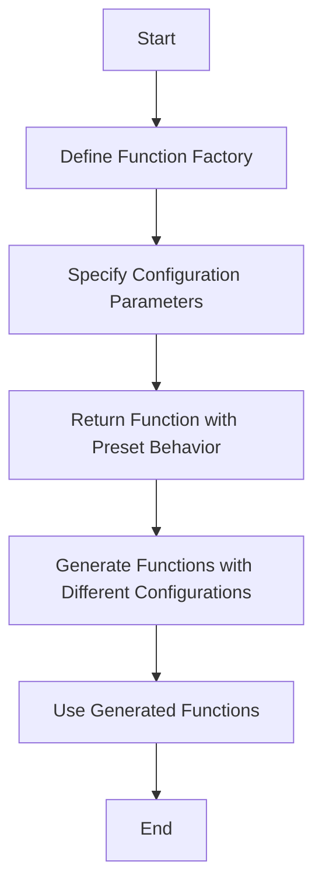

## 32.2 Practical Use Cases of Function Factories in JavaScript

In the world of programming, especially in JavaScript, we often encounter scenarios where we need to create multiple functions that share similar behavior but differ slightly based on specific configurations. This is where function factories come into play. Function factories allow us to generate functions dynamically, with preset configurations or behaviors, making our code more organized and flexible.

### Understanding Function Factories

Before diving into practical use cases, let's briefly revisit what a function factory is. A function factory is a function that returns other functions. It allows us to encapsulate the logic for creating functions with specific configurations, enabling us to generate customized functions on the fly.

### Why Use Function Factories?

Function factories offer several advantages:

- **Code Reusability**: By encapsulating common logic within a factory function, we can reuse it to generate multiple functions with different configurations.
- **Flexibility**: Function factories allow us to create functions with varying behaviors without duplicating code.
- **Maintainability**: Centralizing the logic for function creation in a factory makes it easier to manage and update.

### Real-World Examples of Function Factories

Let's explore some real-world scenarios where function factories are particularly useful.

#### 1. API Clients

When working with APIs, we often need to make HTTP requests to different endpoints with varying parameters. A function factory can help us create API client functions with preset configurations, such as base URLs, headers, or authentication tokens.

```javascript
// Function factory for creating API client functions
function createApiClient(baseURL) {
  return function(endpoint, options = {}) {
    const url = `${baseURL}${endpoint}`;
    return fetch(url, options)
      .then(response => response.json())
      .catch(error => console.error('API Error:', error));
  };
}

// Create API client functions for different services
const githubApiClient = createApiClient('https://api.github.com');
const weatherApiClient = createApiClient('https://api.weather.com');

// Use the API client functions
githubApiClient('/users/octocat')
  .then(data => console.log('GitHub User:', data));

weatherApiClient('/v3/weather/forecast')
  .then(data => console.log('Weather Forecast:', data));
```

In this example, the `createApiClient` function acts as a factory, generating API client functions with a specified base URL. This approach simplifies making requests to different APIs by reusing the same logic.

#### 2. Event Handlers

In web development, event handling is a common task. Function factories can help us create event handler functions with specific behaviors, such as logging events or modifying DOM elements.

```javascript
// Function factory for creating event handlers
function createEventHandler(logMessage) {
  return function(event) {
    console.log(logMessage, event.type);
    // Additional event handling logic
  };
}

// Create event handler functions with different log messages
const clickHandler = createEventHandler('Button clicked:');
const hoverHandler = createEventHandler('Element hovered:');

// Attach event handlers to DOM elements
document.querySelector('#myButton').addEventListener('click', clickHandler);
document.querySelector('#myElement').addEventListener('mouseover', hoverHandler);
```

Here, the `createEventHandler` function generates event handler functions that log specific messages when events occur. This approach allows us to easily create and manage event handlers with consistent behavior.

#### 3. Mathematical Functions

Function factories can also be used to create mathematical functions with preset configurations, such as scaling factors or offsets.

```javascript
// Function factory for creating scaling functions
function createScaler(factor) {
  return function(value) {
    return value * factor;
  };
}

// Create scaling functions with different factors
const double = createScaler(2);
const triple = createScaler(3);

// Use the scaling functions
console.log(double(5)); // Output: 10
console.log(triple(5)); // Output: 15
```

In this example, the `createScaler` function generates scaling functions that multiply input values by a specified factor. This approach provides a flexible way to create mathematical functions with different behaviors.

### Building and Utilizing Function Factories

Now that we've explored some practical use cases, let's dive deeper into building and utilizing function factories.

#### Step-by-Step Example: Creating a Configuration-Based Function Factory

Let's create a function factory that generates functions for formatting dates based on a specified locale and date format.

```javascript
// Function factory for creating date formatting functions
function createDateFormatter(locale, options) {
  return function(date) {
    return new Intl.DateTimeFormat(locale, options).format(date);
  };
}

// Create date formatting functions for different locales and formats
const usDateFormatter = createDateFormatter('en-US', { year: 'numeric', month: 'long', day: 'numeric' });
const ukDateFormatter = createDateFormatter('en-GB', { day: 'numeric', month: 'long', year: 'numeric' });

// Use the date formatting functions
const date = new Date();
console.log(usDateFormatter(date)); // Output: "October 25, 2024"
console.log(ukDateFormatter(date)); // Output: "25 October 2024"
```

In this example, the `createDateFormatter` function acts as a factory, generating date formatting functions with specified locales and formats. This approach allows us to easily format dates in different styles without duplicating code.

#### Advantages of Using Function Factories

Function factories offer several advantages in terms of code organization and flexibility:

- **Centralized Logic**: By encapsulating the logic for creating functions in a factory, we centralize the code, making it easier to manage and update.
- **Reduced Code Duplication**: Function factories eliminate the need to duplicate code for creating similar functions with different configurations.
- **Enhanced Flexibility**: Function factories allow us to generate functions with varying behaviors, providing flexibility in how we use them.

### Visualizing Function Factories

To better understand how function factories work, let's visualize the process using a flowchart.



**Figure 1: Flowchart of the Function Factory Process**

This flowchart illustrates the process of creating and using function factories. We start by defining a function factory, specifying configuration parameters, and returning a function with preset behavior. We then generate functions with different configurations and use them in our code.

### Try It Yourself

Now that we've covered the basics of function factories, it's time to experiment on your own. Try modifying the code examples to create your own function factories. Here are some ideas to get you started:

- Create a function factory for generating functions that calculate discounts based on different percentages.
- Build a function factory for creating logging functions with different log levels (e.g., info, warning, error).
- Develop a function factory for generating functions that validate user input based on different criteria.

### References and Links

For further reading on function factories and related topics, check out these resources:

- [MDN Web Docs: Functions](https://developer.mozilla.org/en-US/docs/Web/JavaScript/Guide/Functions)
- [JavaScript.info: Function Expressions and Arrows](https://javascript.info/function-expressions-arrows)
- [W3Schools: JavaScript Functions](https://www.w3schools.com/js/js_functions.asp)

### Knowledge Check

To reinforce your understanding of function factories, consider the following questions:

- What are the advantages of using function factories in JavaScript?
- How can function factories improve code organization and flexibility?
- In what scenarios might you use a function factory in your projects?

### Embrace the Journey

Remember, this is just the beginning. As you progress, you'll discover more ways to use function factories to enhance your code. Keep experimenting, stay curious, and enjoy the journey!

## Quiz Time!



### What is a function factory?

- [x] A function that returns other functions with specific configurations.
- [ ] A function that executes immediately after being defined.
- [ ] A function that modifies global variables.
- [ ] A function that only works with arrays.

> **Explanation:** A function factory is a function that returns other functions, allowing for the creation of functions with specific configurations or behaviors.

### Which of the following is NOT an advantage of using function factories?

- [ ] Code reusability
- [ ] Flexibility
- [x] Increased code duplication
- [ ] Maintainability

> **Explanation:** Function factories reduce code duplication by encapsulating common logic, making it easier to reuse and maintain.

### How can function factories be used in API clients?

- [x] By creating functions with preset configurations like base URLs.
- [ ] By directly modifying the API endpoints.
- [ ] By storing API responses in global variables.
- [ ] By removing error handling from API requests.

> **Explanation:** Function factories can create API client functions with preset configurations, such as base URLs, headers, or authentication tokens.

### What is the purpose of the `createScaler` function in the example?

- [x] To generate scaling functions with different factors.
- [ ] To directly multiply numbers by 2.
- [ ] To log mathematical operations.
- [ ] To create event handlers for DOM elements.

> **Explanation:** The `createScaler` function is a factory that generates scaling functions, allowing for multiplication by specified factors.

### In the date formatting example, what does the `createDateFormatter` function do?

- [x] It generates functions that format dates based on specified locales and formats.
- [ ] It directly outputs formatted dates to the console.
- [ ] It modifies the global date object.
- [ ] It creates event handlers for date inputs.

> **Explanation:** The `createDateFormatter` function is a factory that generates date formatting functions with specified locales and formats.

### What is a key benefit of centralizing logic in a function factory?

- [x] Easier management and updates.
- [ ] Increased complexity.
- [ ] Reduced code flexibility.
- [ ] More global variables.

> **Explanation:** Centralizing logic in a function factory makes it easier to manage and update, as the logic is encapsulated in one place.

### Which of the following is a practical use case for function factories?

- [x] Creating event handler functions with specific behaviors.
- [ ] Directly modifying the DOM without event listeners.
- [ ] Storing all data in global variables.
- [ ] Removing error handling from functions.

> **Explanation:** Function factories can create event handler functions with specific behaviors, making it easier to manage events.

### What does the flowchart in the article represent?

- [x] The process of creating and using function factories.
- [ ] The execution flow of a recursive function.
- [ ] The structure of a JavaScript object.
- [ ] The lifecycle of a DOM element.

> **Explanation:** The flowchart illustrates the process of creating and using function factories, from defining the factory to using generated functions.

### True or False: Function factories can only be used for mathematical functions.

- [ ] True
- [x] False

> **Explanation:** Function factories can be used in various scenarios, including API clients, event handlers, and more, not just mathematical functions.

### What should you do after learning about function factories?

- [x] Experiment with creating your own function factories.
- [ ] Stop using functions altogether.
- [ ] Only use global variables.
- [ ] Avoid using any configurations.

> **Explanation:** After learning about function factories, it's beneficial to experiment with creating your own to enhance understanding and flexibility.


