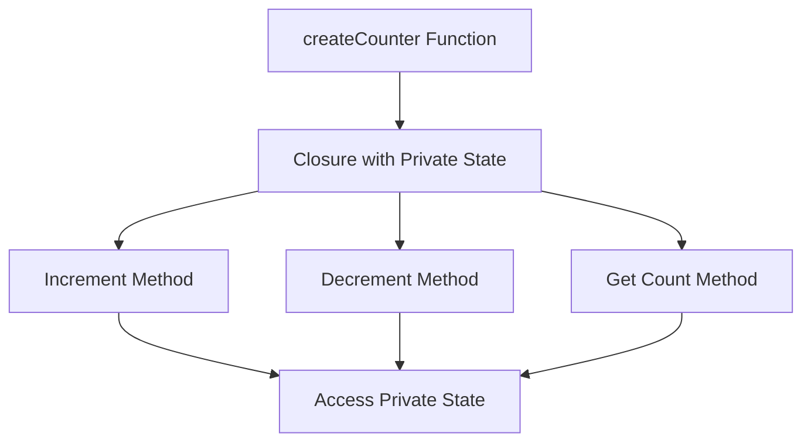

## 32.3 Managing State with Closures

In the world of JavaScript, closures are a powerful feature that allows functions to retain access to their lexical scope even after the outer function has finished executing. This capability is particularly useful for managing state within functions, especially when creating function factories. In this section, we will explore how closures enable functions to maintain state, the implications for data encapsulation and privacy, and potential pitfalls to avoid.

### Understanding Closures

Before diving into state management, let's first understand what closures are. A closure is a function that captures variables from its surrounding lexical environment. This means that a closure can access variables from an outer function even after that function has completed execution.

#### Example of a Closure

```javascript
function outerFunction(outerVariable) {
    return function innerFunction(innerVariable) {
        console.log('Outer Variable:', outerVariable);
        console.log('Inner Variable:', innerVariable);
    };
}

const closureExample = outerFunction('outside');
closureExample('inside');
```

In this example, `innerFunction` is a closure that retains access to `outerVariable`, even after `outerFunction` has finished executing. When `closureExample` is called, it logs both the `outerVariable` and the `innerVariable`.

### Closures and State Management

Closures are particularly useful for managing state in JavaScript. By leveraging closures, we can create functions that maintain private state, which is not directly accessible from the outside. This is especially beneficial when creating factory functions that generate multiple instances of a function, each with its own state.

#### Creating Function Factories with Closures

A function factory is a function that returns other functions. By using closures, we can create factory functions that produce functions with private state.

##### Example: Counter Factory

```javascript
function createCounter() {
    let count = 0; // Private state

    return {
        increment: function() {
            count++;
            return count;
        },
        decrement: function() {
            count--;
            return count;
        },
        getCount: function() {
            return count;
        }
    };
}

const counter1 = createCounter();
console.log(counter1.increment()); // 1
console.log(counter1.increment()); // 2
console.log(counter1.decrement()); // 1

const counter2 = createCounter();
console.log(counter2.getCount()); // 0
```

In this example, `createCounter` is a factory function that returns an object with three methods: `increment`, `decrement`, and `getCount`. Each method is a closure that retains access to the `count` variable, allowing it to maintain and manipulate its own private state.

### Private State and Data Encapsulation

One of the key benefits of using closures for state management is data encapsulation. By keeping state private, we can prevent external code from directly accessing or modifying it. This enhances the security and integrity of our code.

#### Example: Bank Account

```javascript
function createBankAccount(initialBalance) {
    let balance = initialBalance; // Private state

    return {
        deposit: function(amount) {
            if (amount > 0) {
                balance += amount;
                console.log(`Deposited: $${amount}`);
            }
            return balance;
        },
        withdraw: function(amount) {
            if (amount > 0 && amount <= balance) {
                balance -= amount;
                console.log(`Withdrew: $${amount}`);
            }
            return balance;
        },
        getBalance: function() {
            return balance;
        }
    };
}

const account = createBankAccount(100);
account.deposit(50); // Deposited: $50
account.withdraw(30); // Withdrew: $30
console.log(account.getBalance()); // 120
```

In this example, `createBankAccount` is a factory function that returns an object with methods to deposit, withdraw, and check the balance. The `balance` variable is private and can only be accessed or modified through these methods.

### Shared State with Closures

While closures are excellent for maintaining private state, they can also be used to share state between multiple functions. This can be useful when you want multiple functions to operate on the same data.

#### Example: Shared State

```javascript
function createSharedCounter() {
    let count = 0; // Shared state

    return {
        increment: function() {
            count++;
            return count;
        },
        decrement: function() {
            count--;
            return count;
        }
    };
}

const sharedCounter = createSharedCounter();
console.log(sharedCounter.increment()); // 1
console.log(sharedCounter.increment()); // 2

const anotherReference = sharedCounter;
console.log(anotherReference.decrement()); // 1
```

In this example, `createSharedCounter` returns an object with methods that share the same `count` variable. Both `sharedCounter` and `anotherReference` operate on the same shared state.

### Implications for Data Encapsulation and Privacy

Using closures for state management has significant implications for data encapsulation and privacy. By keeping state private, we can:

- **Prevent Unauthorized Access**: External code cannot directly access or modify private state.
- **Enhance Security**: Sensitive data is protected from accidental or malicious changes.
- **Maintain Integrity**: State changes are controlled through well-defined interfaces.

### Potential Pitfalls with State Management

While closures provide powerful tools for managing state, there are potential pitfalls to be aware of:

#### Memory Leaks

Closures can lead to memory leaks if they retain references to large objects or data structures that are no longer needed. To avoid this, ensure that closures do not capture unnecessary variables or objects.

#### Overcomplicating Code

Using closures for state management can sometimes lead to overly complex code. It's important to balance the benefits of closures with the need for simplicity and readability.

#### Debugging Challenges

Debugging code that uses closures can be challenging, especially when dealing with complex state management. Use debugging tools and techniques to trace the flow of data and identify issues.

### Avoiding Pitfalls

To avoid potential pitfalls with closures and state management, consider the following best practices:

- **Keep Closures Simple**: Avoid capturing unnecessary variables or objects in closures.
- **Use Descriptive Names**: Use clear and descriptive names for variables and functions to enhance readability.
- **Document Code**: Document the purpose and behavior of closures to aid understanding and maintenance.
- **Test Thoroughly**: Write tests to ensure that closures behave as expected and maintain state correctly.

### Visualizing Closures and State Management

To better understand how closures manage state, let's visualize the concept using a diagram.



**Diagram Description**: This diagram illustrates how the `createCounter` function creates a closure with private state. The closure provides methods (`Increment`, `Decrement`, `Get Count`) that access and manipulate the private state.

### Try It Yourself

Now that we've explored closures and state management, try modifying the examples to experiment with different scenarios:

- **Create a Timer**: Modify the counter example to create a timer that counts down from a specified value.
- **Shared State**: Experiment with sharing state between multiple functions and observe the effects.
- **Private Methods**: Add private methods to the bank account example that can only be accessed internally.

### References and Further Reading

For more information on closures and state management in JavaScript, check out the following resources:

- [MDN Web Docs: Closures](https://developer.mozilla.org/en-US/docs/Web/JavaScript/Closures)
- [W3Schools: JavaScript Closures](https://www.w3schools.com/js/js_function_closures.asp)
- [JavaScript.info: Closures](https://javascript.info/closure)

### Knowledge Check

Let's reinforce what we've learned with a few questions and exercises:

- **Question**: What is a closure, and how does it relate to state management?
- **Exercise**: Create a closure that maintains a list of items and provides methods to add, remove, and list items.

### Embrace the Journey

Remember, mastering closures and state management is a journey. As you continue to explore JavaScript, you'll discover new ways to leverage closures for more complex and interactive applications. Keep experimenting, stay curious, and enjoy the journey!

## Quiz Time!



### What is a closure in JavaScript?

- [x] A function that retains access to its lexical scope even after the outer function has completed execution.
- [ ] A method for optimizing JavaScript code.
- [ ] A way to encapsulate data within an object.
- [ ] A technique for managing asynchronous code.

> **Explanation:** A closure is a function that retains access to its lexical scope, allowing it to access variables from an outer function even after that function has finished executing.

### How do closures help with state management?

- [x] They allow functions to maintain private state that is not directly accessible from the outside.
- [ ] They enable functions to execute faster.
- [ ] They simplify the syntax of JavaScript code.
- [ ] They provide a way to handle errors in functions.

> **Explanation:** Closures allow functions to maintain private state by capturing variables from their lexical environment, providing a way to encapsulate and manage state.

### What is a potential pitfall of using closures for state management?

- [x] They can lead to memory leaks if not managed properly.
- [ ] They make JavaScript code run slower.
- [ ] They prevent functions from accessing global variables.
- [ ] They require the use of the `this` keyword.

> **Explanation:** Closures can lead to memory leaks if they retain references to large objects or data structures that are no longer needed.

### In the counter example, what is the role of the `count` variable?

- [x] It acts as private state that is accessed and modified by the closure's methods.
- [ ] It is a global variable that can be accessed from anywhere in the code.
- [ ] It is a constant value that cannot be changed.
- [ ] It is used to store the result of a calculation.

> **Explanation:** The `count` variable acts as private state that is accessed and modified by the closure's methods, allowing the counter to maintain its state.

### How can closures enhance data encapsulation?

- [x] By keeping state private and preventing external code from directly accessing or modifying it.
- [ ] By making all variables global.
- [ ] By using the `this` keyword to access state.
- [ ] By allowing functions to execute asynchronously.

> **Explanation:** Closures enhance data encapsulation by keeping state private, preventing external code from directly accessing or modifying it.

### What is a function factory?

- [x] A function that returns other functions, often with private state maintained through closures.
- [ ] A method for creating objects in JavaScript.
- [ ] A way to optimize JavaScript code for performance.
- [ ] A technique for handling errors in functions.

> **Explanation:** A function factory is a function that returns other functions, often with private state maintained through closures.

### How can you avoid memory leaks when using closures?

- [x] Ensure that closures do not capture unnecessary variables or objects.
- [ ] Use the `this` keyword to manage state.
- [ ] Avoid using closures altogether.
- [ ] Make all variables global.

> **Explanation:** To avoid memory leaks, ensure that closures do not capture unnecessary variables or objects, which can lead to retained references.

### What is the benefit of using descriptive names in closures?

- [x] It enhances readability and understanding of the code.
- [ ] It makes the code execute faster.
- [ ] It allows the use of global variables.
- [ ] It simplifies the syntax of JavaScript code.

> **Explanation:** Using descriptive names in closures enhances readability and understanding of the code, making it easier to maintain and debug.

### Can closures be used to share state between multiple functions?

- [x] True
- [ ] False

> **Explanation:** Closures can be used to share state between multiple functions by capturing and retaining access to shared variables.

### What is a key takeaway from learning about closures and state management?

- [x] Closures provide a powerful way to manage state and enhance data encapsulation in JavaScript.
- [ ] Closures are only useful for optimizing code performance.
- [ ] Closures are primarily used for handling asynchronous code.
- [ ] Closures are a technique for creating global variables.

> **Explanation:** Closures provide a powerful way to manage state and enhance data encapsulation in JavaScript, making them a valuable tool for developers.


