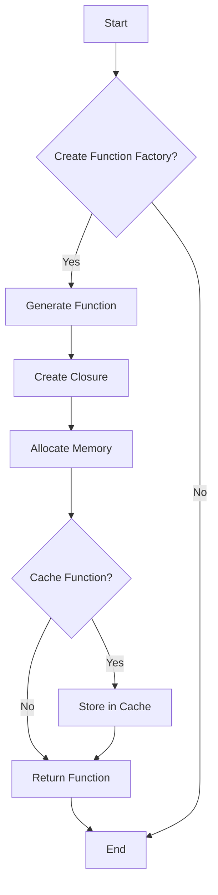

## 32.4 Performance Considerations

In this section, we'll delve into the performance considerations of using function factories in JavaScript. Function factories are a powerful tool, allowing us to generate functions dynamically based on input parameters. However, this flexibility comes with potential performance implications, especially when dealing with memory usage and execution speed. Let's explore these aspects in detail and provide strategies for optimizing function factories.

### Understanding Function Factories

Before we dive into performance considerations, let's briefly recap what function factories are. A function factory is a function that returns other functions. This pattern is useful for creating customized functions with specific behaviors, often leveraging closures to maintain state.

Here's a simple example of a function factory:

```javascript
function createMultiplier(multiplier) {
    return function(number) {
        return number * multiplier;
    };
}

const double = createMultiplier(2);
const triple = createMultiplier(3);

console.log(double(5)); // Output: 10
console.log(triple(5)); // Output: 15
```

In this example, `createMultiplier` is a function factory that generates functions to multiply a number by a specified multiplier. Each generated function retains access to its own `multiplier` value through closures.

### Performance Impact of Generating Functions at Runtime

Generating functions at runtime can introduce performance overhead, particularly in scenarios involving frequent function creation. Each time a function is generated, it consumes memory and processing power. While modern JavaScript engines are optimized for such tasks, excessive dynamic function creation can still lead to performance bottlenecks.

#### Memory Usage with Closures

Closures are a key feature of function factories, allowing functions to "remember" the environment in which they were created. However, closures can also increase memory usage, as they retain references to variables in their lexical scope. This can lead to memory leaks if not managed carefully.

Consider the following example:

```javascript
function createCounter() {
    let count = 0;
    return function() {
        count++;
        return count;
    };
}

const counter1 = createCounter();
const counter2 = createCounter();

console.log(counter1()); // Output: 1
console.log(counter1()); // Output: 2
console.log(counter2()); // Output: 1
```

In this case, each call to `createCounter` generates a new closure, maintaining its own `count` variable. While this is beneficial for encapsulation, it also means that memory is allocated for each closure, which can accumulate over time if not properly managed.

### Strategies for Optimizing Function Factories

To mitigate the performance impact of function factories, consider the following optimization strategies:

#### 1. Caching Results

Caching is a technique used to store the results of expensive function calls and reuse them when the same inputs occur again. This can significantly reduce the number of function creations and improve performance.

Here's an example of caching in a function factory:

```javascript
function createCachedMultiplier() {
    const cache = {};
    return function(multiplier) {
        if (!cache[multiplier]) {
            cache[multiplier] = function(number) {
                return number * multiplier;
            };
        }
        return cache[multiplier];
    };
}

const getMultiplier = createCachedMultiplier();
const double = getMultiplier(2);
const triple = getMultiplier(3);

console.log(double(5)); // Output: 10
console.log(triple(5)); // Output: 15
```

In this example, the `createCachedMultiplier` function caches the generated multiplier functions, ensuring that each unique multiplier is created only once.

#### 2. Limiting Scope of Closures

To reduce memory usage, limit the scope of closures to only the necessary variables. Avoid capturing unnecessary variables in closures, as this can lead to increased memory consumption.

#### 3. Reusing Functions

Whenever possible, reuse existing functions instead of generating new ones. This can be achieved by designing function factories to return the same function instance for identical inputs.

#### 4. Profiling and Benchmarking

Use profiling tools to identify performance bottlenecks in your code. JavaScript engines like Chrome's V8 provide built-in profiling tools that can help you analyze memory usage and execution time.

### Trade-offs Between Flexibility and Performance

Function factories offer great flexibility, allowing you to create highly customizable functions. However, this flexibility often comes at the cost of performance. It's important to balance the need for dynamic function creation with the potential performance implications.

#### Considerations for Trade-offs

- **Use Cases**: Evaluate whether the flexibility provided by function factories is necessary for your use case. If static functions suffice, they may offer better performance.
- **Frequency of Use**: Consider how often functions are generated at runtime. For infrequent operations, the performance impact may be negligible.
- **Complexity**: Assess the complexity of the generated functions. Simpler functions are generally more efficient and easier to optimize.

### Best Practices for Writing Efficient Function Factories

To ensure your function factories are both flexible and performant, follow these best practices:

1. **Minimize Closure Scope**: Capture only the necessary variables in closures to reduce memory usage.

2. **Implement Caching**: Use caching techniques to avoid redundant function creation and improve performance.

3. **Profile and Optimize**: Regularly profile your code to identify and address performance bottlenecks.

4. **Reuse Functions**: Design function factories to return existing function instances when possible.

5. **Balance Flexibility and Performance**: Carefully evaluate the trade-offs between flexibility and performance to make informed design decisions.

### Visualizing Function Factory Performance

To better understand the performance implications of function factories, let's visualize the process of function creation and memory usage using a flowchart.



**Diagram Description**: This flowchart illustrates the process of generating a function using a function factory. It highlights the steps of creating a closure, allocating memory, and caching the function for future use.

### Try It Yourself

Experiment with the following code example to see how caching can improve performance in function factories. Try modifying the `createCachedMultiplier` function to handle more complex scenarios, such as caching functions with multiple parameters.

```javascript
function createAdvancedCachedMultiplier() {
    const cache = {};
    return function(multiplier, factor) {
        const key = `${multiplier}-${factor}`;
        if (!cache[key]) {
            cache[key] = function(number) {
                return number * multiplier * factor;
            };
        }
        return cache[key];
    };
}

const getAdvancedMultiplier = createAdvancedCachedMultiplier();
const doubleAndTriple = getAdvancedMultiplier(2, 3);

console.log(doubleAndTriple(5)); // Output: 30
```

### References and Links

- [MDN Web Docs: Closures](https://developer.mozilla.org/en-US/docs/Web/JavaScript/Closures)
- [MDN Web Docs: Memory Management](https://developer.mozilla.org/en-US/docs/Web/JavaScript/Memory_Management)
- [JavaScript.info: Function Expressions and Closures](https://javascript.info/closure)

### Knowledge Check

- What is a function factory, and how does it work?
- How can closures impact memory usage in function factories?
- What are some strategies for optimizing function factories?
- What are the trade-offs between flexibility and performance in function factories?

### Embrace the Journey

Remember, mastering function factories and performance optimization is a journey. As you continue to explore JavaScript, you'll gain a deeper understanding of how to balance flexibility and efficiency in your code. Keep experimenting, stay curious, and enjoy the process of learning and growing as a developer!

## Quiz Time!



### What is a function factory in JavaScript?

- [x] A function that returns other functions
- [ ] A function that creates objects
- [ ] A function that manipulates arrays
- [ ] A function that performs mathematical operations

> **Explanation:** A function factory is a function that generates and returns other functions, often based on input parameters.

### How can closures affect memory usage in function factories?

- [x] They can increase memory usage by retaining references to variables
- [ ] They decrease memory usage by optimizing variable storage
- [ ] They have no impact on memory usage
- [ ] They always lead to memory leaks

> **Explanation:** Closures retain references to variables in their lexical scope, which can increase memory usage if not managed properly.

### What is one strategy for optimizing function factories?

- [x] Implementing caching to store results of function calls
- [ ] Increasing the number of closures
- [ ] Avoiding the use of closures
- [ ] Using global variables

> **Explanation:** Caching results of function calls can reduce redundant function creation and improve performance.

### What is a trade-off of using function factories?

- [x] Flexibility vs. performance
- [ ] Simplicity vs. complexity
- [ ] Readability vs. maintainability
- [ ] Security vs. accessibility

> **Explanation:** Function factories offer flexibility but can impact performance, requiring a balance between the two.

### Which of the following is a best practice for writing efficient function factories?

- [x] Minimize closure scope
- [ ] Maximize closure scope
- [ ] Use global variables
- [ ] Avoid using functions

> **Explanation:** Minimizing closure scope reduces memory usage and improves performance.

### What does caching in function factories help with?

- [x] Reducing redundant function creation
- [ ] Increasing memory usage
- [ ] Decreasing code readability
- [ ] Slowing down execution

> **Explanation:** Caching helps avoid creating the same function multiple times, improving performance.

### How can you profile your JavaScript code?

- [x] Using built-in profiling tools in JavaScript engines
- [ ] By manually counting execution time
- [ ] By adding console logs
- [ ] By using global variables

> **Explanation:** JavaScript engines like Chrome's V8 provide profiling tools to analyze memory usage and execution time.

### What should you consider when deciding to use function factories?

- [x] Use cases and frequency of use
- [ ] Only the complexity of the code
- [ ] The number of variables used
- [ ] The size of the codebase

> **Explanation:** Consider whether the flexibility of function factories is necessary for your use case and how often they are used.

### What is the purpose of the `createCachedMultiplier` function in the example?

- [x] To cache multiplier functions and avoid redundant creation
- [ ] To multiply numbers by a fixed value
- [ ] To divide numbers by a fixed value
- [ ] To add numbers together

> **Explanation:** The `createCachedMultiplier` function caches generated multiplier functions to improve performance.

### True or False: Function factories always lead to performance issues.

- [ ] True
- [x] False

> **Explanation:** Function factories can lead to performance issues if not managed properly, but with optimization strategies, they can be efficient.


