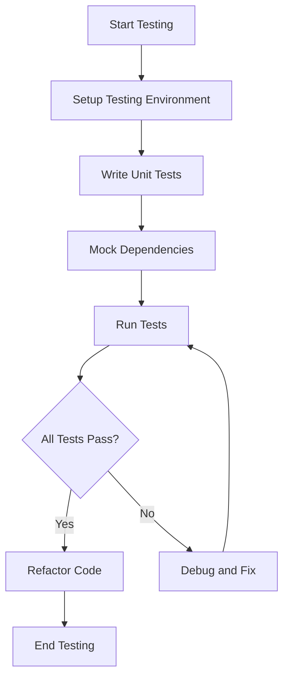

## 32.5 Testing Function Factories

In the world of JavaScript, function factories are a powerful tool that allow us to create functions dynamically based on parameters or configuration. This flexibility is invaluable in many scenarios, such as creating customized functions for different users or contexts. However, with this power comes the responsibility to ensure that these dynamically generated functions work as intended. Testing function factories is crucial to maintaining the reliability and robustness of your codebase.

### Why Test Function Factories?

Function factories can introduce complexity into your code, as they often involve higher-order functions, closures, and dynamic behavior. Testing these factories ensures that:

- **Correct Functionality**: The generated functions behave as expected for various inputs and configurations.
- **Reliability**: Changes to the factory logic do not inadvertently break existing functionality.
- **Maintainability**: Clear tests provide documentation and understanding of the intended behavior of the factory and its outputs.
- **Debugging**: Tests help identify the source of issues when something goes wrong.

### Strategies for Testing Function Factories

Testing function factories involves several strategies to ensure comprehensive coverage:

1. **Unit Testing**: Focus on testing the smallest parts of the factory logic independently.
2. **Integration Testing**: Test how the generated functions interact with other parts of the system.
3. **Mocking and Stubbing**: Use mocks and stubs to isolate the function factory from external dependencies.
4. **State Isolation**: Ensure that tests do not interfere with each other by isolating state.
5. **Edge Case Testing**: Consider unusual or extreme inputs to ensure robustness.

### Setting Up a Testing Environment

Before diving into testing, it's essential to set up a proper testing environment. Popular JavaScript testing frameworks include [Jest](https://jestjs.io/), [Mocha](https://mochajs.org/), and [Jasmine](https://jasmine.github.io/). These frameworks provide tools for writing, running, and organizing tests.

#### Example Setup with Jest

To get started with Jest, you can install it via npm:

```bash
npm install --save-dev jest
```

Then, add a test script to your `package.json`:

```json
{
  "scripts": {
    "test": "jest"
  }
}
```

### Writing Tests for Function Factories

Let's explore how to write tests for a simple function factory. Consider a factory that creates greeting functions based on a language parameter:

```javascript
function createGreetingFunction(language) {
  return function(name) {
    switch(language) {
      case 'en':
        return `Hello, ${name}!`;
      case 'es':
        return `¡Hola, ${name}!`;
      case 'fr':
        return `Bonjour, ${name}!`;
      default:
        return `Hello, ${name}!`;
    }
  };
}
```

#### Testing the Factory

To test this factory, we need to verify that it produces functions with the correct behavior for different languages:

```javascript
test('creates a greeting function for English', () => {
  const greetInEnglish = createGreetingFunction('en');
  expect(greetInEnglish('Alice')).toBe('Hello, Alice!');
});

test('creates a greeting function for Spanish', () => {
  const greetInSpanish = createGreetingFunction('es');
  expect(greetInSpanish('Alice')).toBe('¡Hola, Alice!');
});

test('creates a greeting function for French', () => {
  const greetInFrench = createGreetingFunction('fr');
  expect(greetInFrench('Alice')).toBe('Bonjour, Alice!');
});

test('defaults to English if language is unknown', () => {
  const greetInUnknown = createGreetingFunction('unknown');
  expect(greetInUnknown('Alice')).toBe('Hello, Alice!');
});
```

### Addressing Challenges in Testing

#### Mocking and Stubbing

When function factories interact with external systems or dependencies, such as APIs or databases, use mocking to simulate these interactions. This ensures that tests remain focused on the factory logic without being influenced by external factors.

For example, if our greeting function needed to fetch translations from an API, we could mock the API call:

```javascript
jest.mock('./translationService', () => ({
  getTranslation: jest.fn().mockImplementation((language, text) => {
    if (language === 'es') return `¡Hola, ${text}!`;
    return `Hello, ${text}!`;
  })
}));
```

#### State Isolation

Ensure that each test runs in isolation by resetting any shared state between tests. Jest provides hooks like `beforeEach` and `afterEach` to manage setup and teardown:

```javascript
let greetFunction;

beforeEach(() => {
  greetFunction = createGreetingFunction('en');
});

afterEach(() => {
  greetFunction = null;
});
```

### Encouraging Thorough Testing

Thorough testing involves not only covering expected use cases but also exploring edge cases and potential failure points. Consider testing:

- **Empty or Null Inputs**: What happens if the input is `null` or an empty string?
- **Invalid Parameters**: How does the factory handle unexpected parameter types?
- **Performance**: Does the factory maintain performance under heavy load or with large inputs?

### Try It Yourself

Experiment with the greeting function factory by adding new languages or modifying the switch statement. Write additional tests to cover these changes and observe how the tests help ensure that your modifications do not introduce errors.

### Visualizing the Testing Process

Let's visualize the process of testing function factories using a flowchart:



This flowchart illustrates the iterative process of setting up, writing, and running tests, followed by debugging and refactoring as necessary.

### References and Further Reading

- [MDN Web Docs on Testing](https://developer.mozilla.org/en-US/docs/Learn/Tools_and_testing/Testing)
- [Jest Documentation](https://jestjs.io/docs/getting-started)
- [Mocha Documentation](https://mochajs.org/#getting-started)

### Knowledge Check

To reinforce your understanding, consider these questions:

- What are the benefits of testing function factories?
- How can mocking help isolate function factories from external dependencies?
- Why is state isolation important in testing?

### Embrace the Journey

Remember, testing is an integral part of software development that ensures the reliability and quality of your code. As you continue to explore JavaScript and function factories, keep experimenting with different testing strategies and frameworks. Stay curious and enjoy the journey of mastering JavaScript functions!

## Quiz Time!



### What is the primary purpose of testing function factories?

- [x] To ensure the generated functions behave as expected
- [ ] To make the code run faster
- [ ] To reduce the number of functions in the codebase
- [ ] To increase the complexity of the code

> **Explanation:** Testing function factories ensures that the dynamically generated functions behave as expected for various inputs and configurations.

### Which testing framework is mentioned for setting up a testing environment?

- [x] Jest
- [ ] Angular
- [ ] React
- [ ] Vue

> **Explanation:** Jest is a popular JavaScript testing framework mentioned for setting up a testing environment.

### What is a common strategy for testing function factories?

- [x] Unit Testing
- [ ] Ignoring edge cases
- [ ] Writing code without tests
- [ ] Using only manual testing

> **Explanation:** Unit testing is a common strategy for testing function factories, focusing on testing the smallest parts of the factory logic independently.

### How can mocking help in testing function factories?

- [x] By simulating interactions with external systems
- [ ] By making the code more complex
- [ ] By removing the need for tests
- [ ] By increasing the number of functions

> **Explanation:** Mocking helps simulate interactions with external systems, ensuring tests remain focused on the factory logic without external influences.

### What does state isolation ensure in testing?

- [x] Tests do not interfere with each other
- [ ] Tests run faster
- [ ] Tests are more complex
- [ ] Tests are ignored

> **Explanation:** State isolation ensures that tests do not interfere with each other, maintaining test independence and reliability.

### Why is it important to test edge cases in function factories?

- [x] To ensure robustness
- [ ] To make the code more complex
- [ ] To ignore potential issues
- [ ] To reduce the number of tests

> **Explanation:** Testing edge cases ensures robustness by considering unusual or extreme inputs that might affect the function's behavior.

### What is the role of `beforeEach` and `afterEach` in Jest?

- [x] To manage setup and teardown for tests
- [ ] To increase test complexity
- [ ] To remove the need for tests
- [ ] To make tests run slower

> **Explanation:** `beforeEach` and `afterEach` in Jest manage setup and teardown for tests, ensuring a clean state for each test.

### What should you consider when testing function factories?

- [x] Empty or null inputs
- [ ] Ignoring invalid parameters
- [ ] Only testing with valid inputs
- [ ] Avoiding performance tests

> **Explanation:** Consider testing empty or null inputs to ensure the function factory handles unexpected or edge cases gracefully.

### What is a benefit of thorough testing?

- [x] It provides documentation and understanding of intended behavior
- [ ] It makes the code more complex
- [ ] It reduces the number of functions
- [ ] It increases the chance of errors

> **Explanation:** Thorough testing provides documentation and understanding of the intended behavior of the factory and its outputs.

### True or False: Testing is an integral part of software development.

- [x] True
- [ ] False

> **Explanation:** Testing is an integral part of software development, ensuring the reliability and quality of the code.


