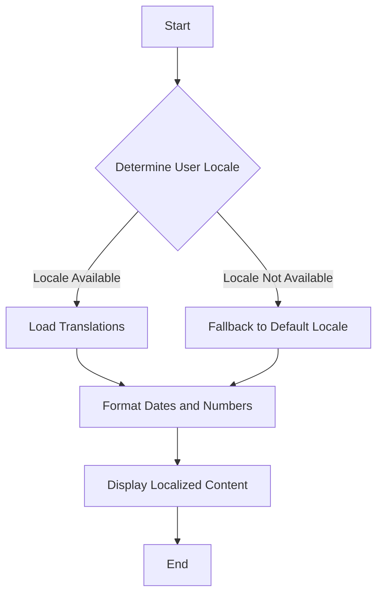

## 33.1 Localization Functions

In today's interconnected world, software applications often reach a global audience. To ensure that your application is accessible and user-friendly for people from different regions, it's crucial to implement internationalization (i18n) and localization (l10n). This section will guide you through the process of creating JavaScript functions that adapt to different locales, making your application more inclusive and culturally aware.

### Understanding Internationalization and Localization

**Internationalization (i18n)** is the process of designing and preparing your application to support multiple languages and regions without requiring engineering changes. It involves creating a flexible architecture that can easily adapt to various locales.

**Localization (l10n)**, on the other hand, is the process of adapting your application to a specific locale. This includes translating text, formatting dates and numbers, and considering cultural nuances.

By combining i18n and l10n, you can create applications that provide a seamless experience for users worldwide.

### Designing Locale-Aware Functions

To support multiple locales, functions in JavaScript can be designed to handle various aspects of localization, such as text translation, date and time formatting, and currency conversion. Let's explore how to create locale-aware functions.

#### Text Translation

One of the most common localization tasks is translating text. You can create functions that dynamically load translations based on the user's locale.

```javascript
// Example of a simple localization function for text translation
const translations = {
  en: {
    greeting: "Hello",
    farewell: "Goodbye"
  },
  es: {
    greeting: "Hola",
    farewell: "Adiós"
  }
};

function translate(key, locale = 'en') {
  return translations[locale][key] || translations['en'][key];
}

// Usage
console.log(translate('greeting', 'es')); // Output: Hola
console.log(translate('farewell')); // Output: Goodbye
```

In this example, we define a `translations` object containing text translations for English and Spanish. The `translate` function retrieves the appropriate translation based on the provided key and locale.

#### Date and Time Formatting

Dates and times are often formatted differently across cultures. JavaScript's `Intl` object provides powerful tools for formatting dates and times according to locale-specific conventions.

```javascript
// Example of a locale-aware date formatting function
function formatDate(date, locale = 'en-US') {
  return new Intl.DateTimeFormat(locale, {
    year: 'numeric',
    month: 'long',
    day: 'numeric'
  }).format(date);
}

// Usage
const date = new Date();
console.log(formatDate(date, 'en-US')); // Output: October 25, 2024
console.log(formatDate(date, 'fr-FR')); // Output: 25 octobre 2024
```

Here, the `formatDate` function uses `Intl.DateTimeFormat` to format a date object according to the specified locale. This ensures that dates are displayed in a familiar format for users from different regions.

#### Number and Currency Formatting

Similar to dates, numbers and currencies are also formatted differently across locales. The `Intl.NumberFormat` object can be used to format numbers and currencies appropriately.

```javascript
// Example of a locale-aware currency formatting function
function formatCurrency(amount, locale = 'en-US', currency = 'USD') {
  return new Intl.NumberFormat(locale, {
    style: 'currency',
    currency: currency
  }).format(amount);
}

// Usage
console.log(formatCurrency(1234.56, 'en-US', 'USD')); // Output: $1,234.56
console.log(formatCurrency(1234.56, 'de-DE', 'EUR')); // Output: 1.234,56 €
```

The `formatCurrency` function formats a numeric amount as a currency string, taking into account the specified locale and currency type.

### Using Libraries and Frameworks for Internationalization

While it's possible to implement localization functions manually, using libraries and frameworks can simplify the process and provide additional features. Some popular libraries for internationalization in JavaScript include:

- **i18next**: A powerful internationalization framework that supports translation, interpolation, and pluralization.
- **Globalize**: A library that provides comprehensive support for formatting and parsing dates, numbers, and currencies.
- **React Intl**: A library specifically designed for internationalizing React applications.

These libraries offer robust solutions for managing translations, formatting data, and handling locale-specific logic.

#### Example with i18next

Let's see how to use i18next to manage translations in a JavaScript application.

```javascript
// Import i18next library
import i18next from 'i18next';

// Initialize i18next with translations
i18next.init({
  lng: 'en',
  resources: {
    en: {
      translation: {
        welcome: "Welcome",
        farewell: "Goodbye"
      }
    },
    es: {
      translation: {
        welcome: "Bienvenido",
        farewell: "Adiós"
      }
    }
  }
});

// Function to get translated text
function getTranslation(key) {
  return i18next.t(key);
}

// Usage
console.log(getTranslation('welcome')); // Output: Welcome
i18next.changeLanguage('es');
console.log(getTranslation('welcome')); // Output: Bienvenido
```

In this example, we initialize i18next with translations for English and Spanish. The `getTranslation` function retrieves the translated text based on the current language setting.

### Cultural Considerations in Function Design

When designing localization functions, it's essential to consider cultural nuances that may affect user experience. Here are some key points to keep in mind:

- **Date and Time Conventions**: Different cultures have varying preferences for date and time formats. Ensure your application respects these conventions.
- **Numerical Formats**: Be aware of differences in decimal separators and grouping symbols.
- **Text Direction**: Some languages, such as Arabic and Hebrew, are read from right to left. Ensure your application supports bidirectional text.
- **Cultural Sensitivities**: Be mindful of cultural symbols, colors, and imagery that may have different meanings in different regions.

By considering these cultural factors, you can create a more inclusive and user-friendly application.

### Try It Yourself

To deepen your understanding, try modifying the code examples provided in this section. Here are some suggestions:

- Add additional languages to the `translations` object and test the `translate` function with different locales.
- Experiment with different date and currency formats using the `Intl` object.
- Explore the i18next documentation and implement additional features, such as pluralization and interpolation.

### Visualizing Localization in JavaScript

To better understand how localization functions interact with different parts of a JavaScript application, let's visualize the process using a flowchart.



**Figure 1: Localization Process Flowchart**  
This flowchart illustrates the steps involved in localizing content in a JavaScript application. It starts with determining the user's locale, loading the appropriate translations, formatting data, and finally displaying the localized content.

### References and Further Reading

For more information on internationalization and localization in JavaScript, consider exploring the following resources:

- [MDN Web Docs: Internationalization API](https://developer.mozilla.org/en-US/docs/Web/JavaScript/Reference/Global_Objects/Intl)
- [i18next Documentation](https://www.i18next.com/)
- [Globalize.js Documentation](https://github.com/globalizejs/globalize)
- [React Intl Documentation](https://formatjs.io/docs/react-intl)

### Knowledge Check

To reinforce your understanding of localization functions, try answering the following questions:

1. What is the difference between internationalization and localization?
2. How can the `Intl` object be used to format dates and numbers?
3. What are some cultural considerations to keep in mind when designing localization functions?
4. How does i18next help manage translations in a JavaScript application?

### Embrace the Journey

Remember, localization is an ongoing process that requires continuous learning and adaptation. As you gain experience, you'll become more adept at creating applications that resonate with users from diverse backgrounds. Keep experimenting, stay curious, and enjoy the journey of making your applications truly global!

## Quiz Time!



### What is the primary purpose of localization functions in JavaScript?

- [x] To adapt applications for different languages and regions
- [ ] To improve application performance
- [ ] To enhance security features
- [ ] To simplify code structure

> **Explanation:** Localization functions are designed to adapt applications for different languages and regions, ensuring a user-friendly experience for a global audience.

### Which JavaScript object is commonly used for formatting dates and numbers according to locale-specific conventions?

- [x] `Intl`
- [ ] `Math`
- [ ] `Date`
- [ ] `Number`

> **Explanation:** The `Intl` object provides tools for formatting dates and numbers according to locale-specific conventions.

### What is the difference between internationalization (i18n) and localization (l10n)?

- [x] Internationalization is preparing an application for multiple locales; localization is adapting it to a specific locale.
- [ ] Internationalization is translating text; localization is formatting numbers.
- [ ] Internationalization is a subset of localization.
- [ ] Localization is the process of writing code; internationalization is designing user interfaces.

> **Explanation:** Internationalization involves preparing an application to support multiple locales, while localization is the process of adapting it to a specific locale.

### Which library is specifically designed for internationalizing React applications?

- [x] React Intl
- [ ] Globalize
- [ ] i18next
- [ ] Lodash

> **Explanation:** React Intl is a library specifically designed for internationalizing React applications.

### What should be considered when designing localization functions?

- [x] Cultural sensitivities
- [x] Date and time conventions
- [ ] Application performance
- [x] Text direction

> **Explanation:** When designing localization functions, it's important to consider cultural sensitivities, date and time conventions, and text direction to ensure a user-friendly experience.

### How can you change the language setting in i18next?

- [x] Using the `changeLanguage` method
- [ ] By modifying the `Intl` object
- [ ] Through the `setLocale` function
- [ ] By updating the `translations` object

> **Explanation:** The `changeLanguage` method in i18next is used to change the current language setting.

### What is a common use case for the `Intl.NumberFormat` object?

- [x] Formatting currency values
- [ ] Parsing JSON data
- [ ] Validating user input
- [ ] Encrypting sensitive information

> **Explanation:** The `Intl.NumberFormat` object is commonly used for formatting currency values according to locale-specific conventions.

### Which of the following is a cultural consideration in localization?

- [x] Text direction
- [ ] Code readability
- [ ] Application scalability
- [ ] Network security

> **Explanation:** Text direction is a cultural consideration in localization, as some languages are read from right to left.

### What is the role of the `translate` function in the provided code example?

- [x] To retrieve the appropriate translation based on the provided key and locale
- [ ] To format dates according to locale-specific conventions
- [ ] To validate user input
- [ ] To encrypt sensitive information

> **Explanation:** The `translate` function retrieves the appropriate translation based on the provided key and locale.

### True or False: Localization functions only deal with text translation.

- [ ] True
- [x] False

> **Explanation:** Localization functions deal with various aspects, including text translation, date and time formatting, and currency conversion, to adapt applications for different locales.


