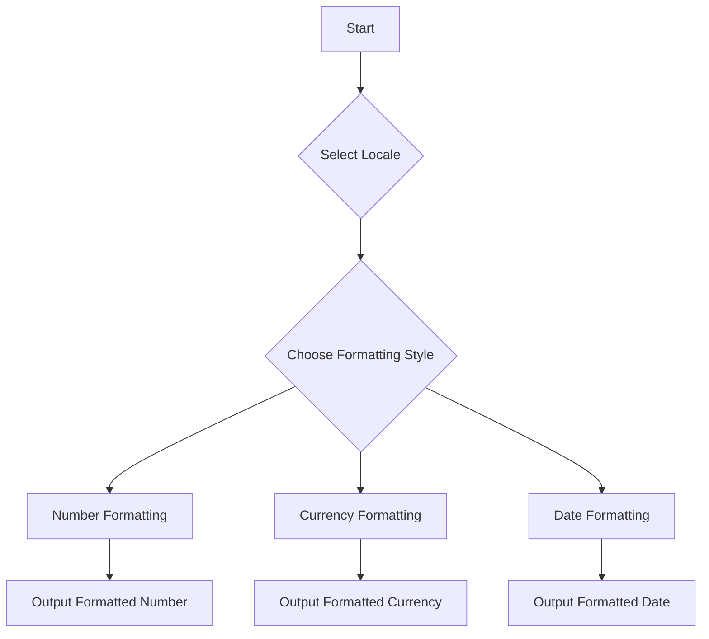

## 33.2 Formatting Numbers and Dates

In today's globalized world, creating applications that cater to users from different regions is essential. One of the key aspects of this is formatting numbers, currencies, and dates according to local conventions. JavaScript provides a powerful tool for this through its Internationalization API, specifically the `Intl` object. In this section, we'll explore how to use this API to format numbers and dates effectively.

### Understanding the Intl Object

The `Intl` object is a part of JavaScript's Internationalization API, which provides language-sensitive string comparison, number formatting, and date and time formatting. It's a powerful tool that helps developers create applications that are more accessible and user-friendly across different locales.

#### Key Features of the Intl Object

- **Locale-sensitive formatting**: Format numbers, currencies, and dates according to the conventions of a specific locale.
- **Support for multiple locales**: Handle multiple languages and regions seamlessly.
- **Customizable options**: Tailor the formatting to meet specific requirements, such as currency style or date format.

### Formatting Numbers with Intl.NumberFormat

The `Intl.NumberFormat` object is used to format numbers according to the conventions of a specific locale. This includes formatting numbers as currency, percentages, or plain numbers with thousands separators.

#### Basic Usage of Intl.NumberFormat

Let's start with a simple example of formatting a number:

```javascript
// Create a number formatter for the US locale
const numberFormatter = new Intl.NumberFormat('en-US');

// Format a number
const formattedNumber = numberFormatter.format(1234567.89);
console.log(formattedNumber); // Output: "1,234,567.89"
```

In this example, we create a number formatter for the US locale using `Intl.NumberFormat`. The `format` method is then used to format the number `1234567.89` according to US conventions, which includes using a comma as a thousands separator and a period as a decimal separator.

#### Formatting Currencies

Formatting currencies is a common requirement in international applications. The `Intl.NumberFormat` object makes this easy with its `style` option:

```javascript
// Create a currency formatter for the Euro
const currencyFormatter = new Intl.NumberFormat('de-DE', {
  style: 'currency',
  currency: 'EUR'
});

// Format a currency value
const formattedCurrency = currencyFormatter.format(1234567.89);
console.log(formattedCurrency); // Output: "1.234.567,89 €"
```

In this example, we format a number as a Euro currency value for the German locale. Notice how the thousands and decimal separators differ from the US format.

#### Formatting Percentages

You can also format numbers as percentages using the `style` option:

```javascript
// Create a percentage formatter
const percentageFormatter = new Intl.NumberFormat('en-US', {
  style: 'percent'
});

// Format a percentage value
const formattedPercentage = percentageFormatter.format(0.1234);
console.log(formattedPercentage); // Output: "12%"
```

Here, we format a number as a percentage. The `Intl.NumberFormat` automatically multiplies the number by 100 and appends a percent sign.

### Formatting Dates with Intl.DateTimeFormat

The `Intl.DateTimeFormat` object is used to format dates and times according to the conventions of a specific locale. This includes formatting dates in various styles, such as long, short, or medium.

#### Basic Usage of Intl.DateTimeFormat

Let's format a date using the `Intl.DateTimeFormat` object:

```javascript
// Create a date formatter for the US locale
const dateFormatter = new Intl.DateTimeFormat('en-US');

// Format a date
const formattedDate = dateFormatter.format(new Date());
console.log(formattedDate); // Output: "10/25/2024" (or similar, depending on the current date)
```

In this example, we create a date formatter for the US locale and format the current date. The output format follows the US convention of month/day/year.

#### Customizing Date Formats

You can customize the date format using options like `year`, `month`, `day`, `weekday`, `hour`, `minute`, and `second`:

```javascript
// Create a custom date formatter
const customDateFormatter = new Intl.DateTimeFormat('en-GB', {
  year: 'numeric',
  month: 'long',
  day: '2-digit',
  weekday: 'long'
});

// Format a date
const customFormattedDate = customDateFormatter.format(new Date());
console.log(customFormattedDate); // Output: "Friday, 25 October 2024"
```

In this example, we format the date to include the full weekday name, a two-digit day, the full month name, and the year.

### Handling Time Zones and Daylight Saving Time

When working with dates and times, it's important to consider time zones and daylight saving time. The `Intl.DateTimeFormat` object allows you to specify a time zone using the `timeZone` option:

```javascript
// Create a date formatter with a specific time zone
const timeZoneFormatter = new Intl.DateTimeFormat('en-US', {
  timeZone: 'America/New_York',
  hour: '2-digit',
  minute: '2-digit',
  second: '2-digit',
  timeZoneName: 'short'
});

// Format a date with a time zone
const formattedTimeZoneDate = timeZoneFormatter.format(new Date());
console.log(formattedTimeZoneDate); // Output: "10:30:15 AM EDT" (or similar, depending on the current time)
```

In this example, we format the current time for the New York time zone, including the time zone abbreviation.

### Best Practices for Accurate and User-Friendly Formatting

When formatting numbers and dates, it's important to follow best practices to ensure accuracy and user-friendliness:

- **Use the correct locale**: Always specify the correct locale to ensure the formatting matches the user's expectations.
- **Consider user preferences**: Allow users to select their preferred locale and format settings.
- **Test with different locales**: Test your application with various locales to ensure it handles different formatting conventions correctly.
- **Handle edge cases**: Consider edge cases, such as leap years or daylight saving time changes, when working with dates.

### Try It Yourself

To get a better understanding of how the `Intl` object works, try modifying the code examples above. Experiment with different locales, currencies, and date formats. See how the output changes based on your modifications.

### Visualizing the Intl Object's Workflow

To better understand how the `Intl` object processes formatting, let's visualize the workflow:



This diagram illustrates the decision-making process when using the `Intl` object to format numbers and dates. You start by selecting a locale, choose a formatting style, and then output the formatted result.

### References and Links

For more information on JavaScript's Internationalization API, check out these resources:

- [MDN Web Docs: Intl.NumberFormat](https://developer.mozilla.org/en-US/docs/Web/JavaScript/Reference/Global_Objects/Intl/NumberFormat)
- [MDN Web Docs: Intl.DateTimeFormat](https://developer.mozilla.org/en-US/docs/Web/JavaScript/Reference/Global_Objects/Intl/DateTimeFormat)
- [W3Schools: JavaScript Intl](https://www.w3schools.com/js/js_intl.asp)

### Knowledge Check

Let's test your understanding of formatting numbers and dates with the `Intl` object. Try answering the following questions:

1. What is the purpose of the `Intl` object in JavaScript?
2. How do you format a number as a currency using `Intl.NumberFormat`?
3. What options can you use to customize date formatting with `Intl.DateTimeFormat`?
4. How can you handle time zones when formatting dates and times?
5. Why is it important to specify the correct locale when formatting numbers and dates?

### Embrace the Journey

Remember, mastering internationalization is a journey. As you continue to explore and experiment with the `Intl` object, you'll gain a deeper understanding of how to create applications that cater to users from diverse regions. Keep practicing, stay curious, and enjoy the process!

## Quiz Time!



### What is the primary purpose of the `Intl` object in JavaScript?

- [x] To provide language-sensitive string comparison, number formatting, and date and time formatting.
- [ ] To perform mathematical calculations.
- [ ] To handle network requests.
- [ ] To manage user authentication.

> **Explanation:** The `Intl` object is part of JavaScript's Internationalization API, designed to handle language-sensitive operations like string comparison, number formatting, and date and time formatting.

### How do you format a number as a currency using `Intl.NumberFormat`?

- [x] By specifying the `style` option as `'currency'` and providing a `currency` code.
- [ ] By using the `toCurrencyString` method.
- [ ] By appending a currency symbol to the number.
- [ ] By using the `formatCurrency` function.

> **Explanation:** To format a number as a currency, use `Intl.NumberFormat` with the `style` option set to `'currency'` and provide a valid `currency` code.

### Which option is used to specify a time zone in `Intl.DateTimeFormat`?

- [x] `timeZone`
- [ ] `locale`
- [ ] `format`
- [ ] `region`

> **Explanation:** The `timeZone` option in `Intl.DateTimeFormat` is used to specify the time zone for date and time formatting.

### What is the output of `Intl.NumberFormat('en-US').format(1234567.89)`?

- [x] "1,234,567.89"
- [ ] "1.234.567,89"
- [ ] "1234567.89"
- [ ] "1 234 567,89"

> **Explanation:** In the US locale, numbers are formatted with a comma as the thousands separator and a period as the decimal separator.

### Why is it important to specify the correct locale when formatting numbers and dates?

- [x] To ensure the formatting matches the user's expectations and regional conventions.
- [ ] To improve the performance of the application.
- [ ] To reduce the size of the codebase.
- [ ] To enhance security.

> **Explanation:** Specifying the correct locale ensures that numbers and dates are formatted according to the user's regional conventions, providing a more intuitive and user-friendly experience.

### What does `Intl.DateTimeFormat('en-GB', { year: 'numeric', month: 'long', day: '2-digit' }).format(new Date())` output?

- [x] "25 October 2024"
- [ ] "October 25, 2024"
- [ ] "10/25/2024"
- [ ] "2024-10-25"

> **Explanation:** The `en-GB` locale formats dates in the day-month-year order, with the month spelled out in full.

### How can you format a percentage using `Intl.NumberFormat`?

- [x] By setting the `style` option to `'percent'`.
- [ ] By multiplying the number by 100 and appending a percent sign.
- [ ] By using the `toPercentString` method.
- [ ] By dividing the number by 100.

> **Explanation:** To format a number as a percentage, use `Intl.NumberFormat` with the `style` option set to `'percent'`.

### What is the role of the `Intl.DateTimeFormat` object?

- [x] To format dates and times according to the conventions of a specific locale.
- [ ] To perform date arithmetic.
- [ ] To convert dates to strings.
- [ ] To parse date strings.

> **Explanation:** The `Intl.DateTimeFormat` object is used to format dates and times in a locale-sensitive manner.

### How does `Intl.NumberFormat` handle large numbers?

- [x] By using locale-specific thousands separators.
- [ ] By rounding them to the nearest integer.
- [ ] By converting them to scientific notation.
- [ ] By truncating them.

> **Explanation:** `Intl.NumberFormat` formats large numbers using locale-specific thousands separators to enhance readability.

### True or False: The `Intl` object can only format numbers and dates for English-speaking regions.

- [ ] True
- [x] False

> **Explanation:** The `Intl` object supports multiple locales, allowing it to format numbers and dates for various regions and languages.


