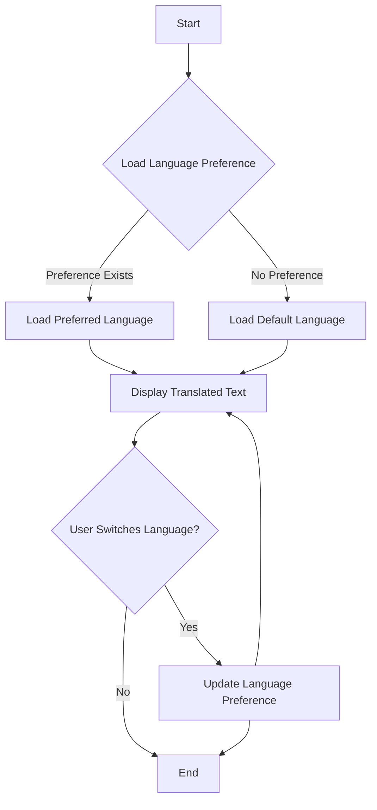

## 33.3 Handling Multiple Languages

In today's globalized world, creating applications that cater to a diverse audience is more important than ever. This often involves supporting multiple languages, a process known as internationalization (i18n). In this section, we'll explore how to handle multilingual content in JavaScript using functions, translation objects, and libraries like i18next. We'll also discuss strategies for dynamic language switching and managing user preferences.

### Introduction to Multilingual Content Management

Handling multiple languages in a web application involves several key components:

1. **Translation Resources**: These are files or objects containing translations for different languages.
2. **Language Detection and Switching**: The ability to detect the user's preferred language and switch languages dynamically.
3. **Displaying Translated Text**: Using functions to retrieve and display the appropriate translations based on the user's language preference.

By the end of this section, you'll be equipped with the knowledge to implement a robust multilingual system in your JavaScript applications.

### Strategies for Managing Multilingual Content

Managing multilingual content requires a structured approach to ensure that translations are accurate and easily maintainable. Here are some strategies to consider:

#### 1. Use Translation Resource Files

Translation resource files are typically JSON files that store key-value pairs, where the key is a unique identifier for a piece of text, and the value is the translated text. For example:

```json
// en.json
{
  "greeting": "Hello",
  "farewell": "Goodbye"
}

// es.json
{
  "greeting": "Hola",
  "farewell": "Adiós"
}
```

These files are loaded based on the user's language preference, allowing your application to display the correct translations.

#### 2. Implement Translation Objects

Translation objects are JavaScript objects that serve a similar purpose to resource files but are defined directly in your code. This approach is useful for smaller applications or when you want to avoid additional file loading.

```javascript
const translations = {
  en: {
    greeting: "Hello",
    farewell: "Goodbye"
  },
  es: {
    greeting: "Hola",
    farewell: "Adiós"
  }
};
```

#### 3. Dynamic Language Switching

Allow users to switch languages dynamically within the application. This can be achieved by updating the UI with the new language's translations without reloading the page.

### Functions for Retrieving and Displaying Translated Text

To effectively manage translations, we need functions that can retrieve the correct text based on the user's language preference. Let's explore how to create such functions.

#### Creating a Translation Function

We'll create a function called `translate` that takes a key and a language code as arguments and returns the corresponding translation.

```javascript
function translate(key, lang) {
  const translations = {
    en: {
      greeting: "Hello",
      farewell: "Goodbye"
    },
    es: {
      greeting: "Hola",
      farewell: "Adiós"
    }
  };

  return translations[lang][key] || key;
}

// Usage
console.log(translate('greeting', 'en')); // Output: Hello
console.log(translate('greeting', 'es')); // Output: Hola
```

In this example, the `translate` function looks up the translation for the given key and language. If the translation is not found, it returns the key itself as a fallback.

#### Dynamic Language Switching

To enable dynamic language switching, we can maintain a state variable for the current language and update it based on user actions, such as selecting a language from a dropdown menu.

```javascript
let currentLanguage = 'en';

function setLanguage(lang) {
  currentLanguage = lang;
  updateUI();
}

function updateUI() {
  document.getElementById('greeting').textContent = translate('greeting', currentLanguage);
  document.getElementById('farewell').textContent = translate('farewell', currentLanguage);
}

// Example of language switch
setLanguage('es');
```

In this setup, `setLanguage` updates the `currentLanguage` variable and calls `updateUI` to refresh the displayed text with the new language's translations.

### Introducing i18next for Managing Translations

For larger applications, managing translations manually can become cumbersome. This is where libraries like i18next come in handy. i18next is a powerful internationalization framework for JavaScript that simplifies the process of managing translations.

#### Setting Up i18next

To use i18next, you'll first need to install it via npm or include it in your project. Here's how to set it up:

```bash
npm install i18next
```

Once installed, you can initialize i18next and load your translation resources.

```javascript
import i18next from 'i18next';

i18next.init({
  resources: {
    en: {
      translation: {
        greeting: "Hello",
        farewell: "Goodbye"
      }
    },
    es: {
      translation: {
        greeting: "Hola",
        farewell: "Adiós"
      }
    }
  },
  lng: "en", // default language
  fallbackLng: "en"
});

// Usage
console.log(i18next.t('greeting')); // Output: Hello
```

The `i18next.init` function initializes the library with your translations and sets the default language. The `i18next.t` function is used to retrieve translations.

#### Dynamic Language Switching with i18next

i18next makes it easy to switch languages dynamically. You can change the language using the `changeLanguage` method.

```javascript
function switchLanguage(lang) {
  i18next.changeLanguage(lang, () => {
    document.getElementById('greeting').textContent = i18next.t('greeting');
    document.getElementById('farewell').textContent = i18next.t('farewell');
  });
}

// Example of language switch
switchLanguage('es');
```

This function updates the language and refreshes the UI with the new translations.

### Handling User Preferences

To enhance the user experience, it's important to remember the user's language preference. This can be achieved by storing the preference in local storage or cookies.

#### Storing Language Preference

Here's how you can store and retrieve the user's language preference using local storage:

```javascript
function setLanguagePreference(lang) {
  localStorage.setItem('preferredLanguage', lang);
}

function getLanguagePreference() {
  return localStorage.getItem('preferredLanguage') || 'en';
}

// Set and retrieve language preference
setLanguagePreference('es');
console.log(getLanguagePreference()); // Output: es
```

By storing the language preference, you can automatically load the preferred language when the user returns to your application.

### Try It Yourself

Now that we've covered the basics, let's put it all together. Try implementing a simple web page with language switching functionality using the concepts we've discussed. Here's a starting point:

```html
<!DOCTYPE html>
<html lang="en">
<head>
  <meta charset="UTF-8">
  <title>Multilingual Example</title>
  <script src="https://unpkg.com/i18next@latest"></script>
</head>
<body>
  <h1 id="greeting"></h1>
  <p id="farewell"></p>
  <button onclick="switchLanguage('en')">English</button>
  <button onclick="switchLanguage('es')">Español</button>

  <script>
    // Initialize i18next
    i18next.init({
      resources: {
        en: {
          translation: {
            greeting: "Hello",
            farewell: "Goodbye"
          }
        },
        es: {
          translation: {
            greeting: "Hola",
            farewell: "Adiós"
          }
        }
      },
      lng: getLanguagePreference(),
      fallbackLng: "en"
    }, () => {
      updateUI();
    });

    function updateUI() {
      document.getElementById('greeting').textContent = i18next.t('greeting');
      document.getElementById('farewell').textContent = i18next.t('farewell');
    }

    function switchLanguage(lang) {
      i18next.changeLanguage(lang, () => {
        setLanguagePreference(lang);
        updateUI();
      });
    }

    function setLanguagePreference(lang) {
      localStorage.setItem('preferredLanguage', lang);
    }

    function getLanguagePreference() {
      return localStorage.getItem('preferredLanguage') || 'en';
    }
  </script>
</body>
</html>
```

### Visualizing the Translation Process

To better understand how translations are managed, let's visualize the process using a flowchart.



**Figure 1**: This flowchart illustrates the process of loading and displaying translations based on user preferences and handling dynamic language switching.

### Further Reading and Resources

- [MDN Web Docs: Internationalization](https://developer.mozilla.org/en-US/docs/Web/JavaScript/Guide/Internationalization)
- [i18next Documentation](https://www.i18next.com/)
- [W3Schools: JavaScript Internationalization](https://www.w3schools.com/js/js_internationalization.asp)

### Knowledge Check

Before we wrap up, let's reinforce what we've learned with some questions and exercises.

1. **What is the purpose of translation resource files?**
   - Explain how they help manage multilingual content.

2. **How does the `translate` function work?**
   - Describe its role in retrieving translated text.

3. **What are the benefits of using a library like i18next?**
   - Discuss how it simplifies translation management.

4. **How can you store and retrieve a user's language preference?**
   - Provide an example using local storage.

5. **Try modifying the example code to add a new language.**

### Embrace the Journey

Remember, this is just the beginning. As you progress, you'll build more complex and interactive web pages that cater to a global audience. Keep experimenting, stay curious, and enjoy the journey!

## Quiz Time!



### What is the primary purpose of translation resource files in a multilingual application?

- [x] To store translations for different languages in a structured format
- [ ] To compile JavaScript code
- [ ] To manage user authentication
- [ ] To handle database connections

> **Explanation:** Translation resource files store translations for different languages, allowing the application to display the correct text based on the user's language preference.

### Which function is used in i18next to retrieve a translation for a given key?

- [ ] i18next.init
- [x] i18next.t
- [ ] i18next.changeLanguage
- [ ] i18next.loadResources

> **Explanation:** The `i18next.t` function is used to retrieve translations for a given key in the current language.

### What is the role of the `setLanguagePreference` function in the example code?

- [x] To store the user's language preference in local storage
- [ ] To initialize i18next
- [ ] To load translation resources
- [ ] To update the UI with translations

> **Explanation:** The `setLanguagePreference` function stores the user's language preference in local storage, allowing the application to remember the preference for future visits.

### How can you dynamically switch languages using i18next?

- [ ] By reloading the page
- [ ] By modifying the HTML directly
- [x] By using the `i18next.changeLanguage` method
- [ ] By editing the JSON files

> **Explanation:** The `i18next.changeLanguage` method is used to dynamically switch languages in an application using i18next.

### What is the fallback language in i18next, and why is it important?

- [x] It is the default language used when a translation is missing
- [ ] It is the language used for error messages
- [ ] It is the language used for debugging
- [ ] It is the language used for logging

> **Explanation:** The fallback language is used when a translation is missing for the current language, ensuring that the application can still display text.

### Which of the following is a benefit of using translation objects directly in code?

- [x] Simplicity for small applications
- [ ] Improved security
- [ ] Faster network requests
- [ ] Automatic updates

> **Explanation:** Translation objects are simple to use for small applications, as they avoid the need for additional file loading.

### What is the purpose of the `updateUI` function in the example code?

- [ ] To initialize i18next
- [x] To refresh the displayed text with the current language's translations
- [ ] To store language preferences
- [ ] To load translation resources

> **Explanation:** The `updateUI` function refreshes the displayed text with the current language's translations, ensuring the UI reflects the selected language.

### How can you ensure that your application remembers a user's language preference?

- [ ] By using cookies
- [ ] By using session storage
- [x] By using local storage
- [ ] By using global variables

> **Explanation:** Local storage is a persistent storage option that allows the application to remember a user's language preference across sessions.

### What is a potential drawback of managing translations manually without a library?

- [x] Increased complexity and maintenance effort
- [ ] Faster performance
- [ ] Enhanced security
- [ ] Automatic language detection

> **Explanation:** Managing translations manually can become complex and require significant maintenance effort, especially for larger applications.

### True or False: i18next can only be used with JSON translation files.

- [ ] True
- [x] False

> **Explanation:** i18next is flexible and can work with various formats for translation resources, not just JSON files.


