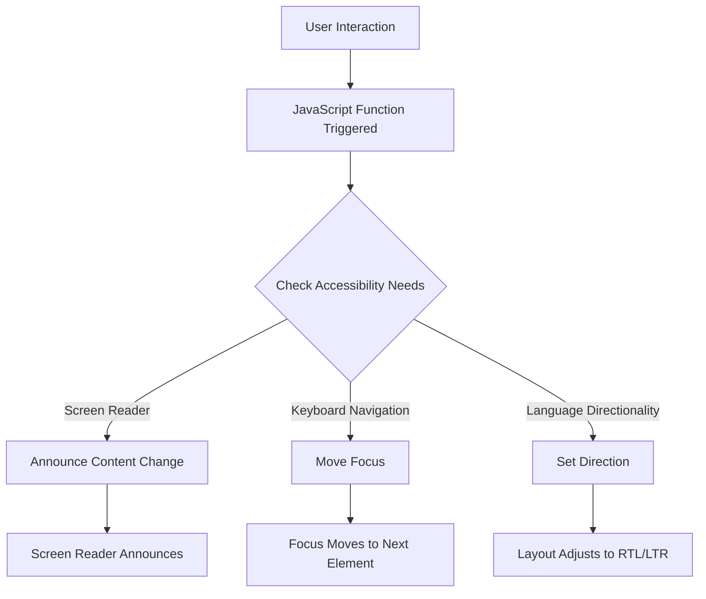

## 33.4 Accessibility Considerations

In today's digital age, ensuring that web applications are accessible to all users, including those with disabilities, is not just a best practice—it's a necessity. Accessibility in software applications means creating interfaces that can be used by everyone, regardless of their abilities or disabilities. JavaScript functions play a crucial role in enhancing the accessibility of web applications. In this section, we'll explore how functions can assist in creating accessible interfaces, provide examples of functions that adjust content for screen readers or assistive technologies, discuss handling directionality in functions, and encourage adherence to standards like the Web Content Accessibility Guidelines (WCAG).

### The Importance of Accessibility in Software Applications

Accessibility is about inclusivity. It ensures that everyone, including individuals with disabilities, can access and use web applications effectively. According to the World Health Organization, over a billion people, about 15% of the world's population, experience some form of disability. This statistic highlights the importance of designing accessible software.

Accessible web applications not only benefit users with disabilities but also improve the overall user experience for everyone. For instance, providing text alternatives for images can help users with slow internet connections. Moreover, accessibility is often a legal requirement, with regulations like the Americans with Disabilities Act (ADA) and the European Accessibility Act mandating accessible digital content.

### How Functions Can Assist in Creating Accessible Interfaces

JavaScript functions can significantly enhance the accessibility of web applications by automating accessibility features and ensuring that content is adaptable to various user needs. Here are some ways functions can assist in creating accessible interfaces:

1. **Dynamic Content Updates**: Functions can update content dynamically without requiring a page reload, which is essential for screen readers to announce changes to users.

2. **Keyboard Navigation**: Functions can enable keyboard navigation, allowing users who cannot use a mouse to navigate the application using the keyboard.

3. **ARIA Attributes**: Functions can dynamically add or update ARIA (Accessible Rich Internet Applications) attributes, which provide additional information to assistive technologies.

4. **Responsive Design**: Functions can adjust the layout and content based on the user's device and preferences, ensuring a seamless experience across different platforms.

### Examples of Functions for Screen Readers and Assistive Technologies

Let's explore some practical examples of how JavaScript functions can be used to enhance accessibility for screen readers and assistive technologies.

#### Example 1: Announcing Dynamic Content Changes

Screen readers need to be informed of content changes that occur dynamically. We can create a function that uses ARIA live regions to announce these changes.

```javascript
function announceUpdate(message) {
  const liveRegion = document.getElementById('live-region');
  liveRegion.textContent = ''; // Clear previous message
  setTimeout(() => {
    liveRegion.textContent = message;
  }, 100); // Delay to ensure screen reader picks up the change
}

// Usage
announceUpdate('New content has been loaded.');
```

In this example, we use a `div` with an `aria-live` attribute set to `polite` or `assertive`. The function updates the content of this `div`, prompting screen readers to announce the change.

#### Example 2: Enabling Keyboard Navigation

Keyboard navigation is crucial for users who rely on keyboards instead of a mouse. We can create a function to handle keyboard events and navigate through interactive elements.

```javascript
function handleKeyboardNavigation(event) {
  const focusableElements = document.querySelectorAll('button, [href], input, select, textarea, [tabindex]:not([tabindex="-1"])');
  const currentIndex = Array.prototype.indexOf.call(focusableElements, document.activeElement);

  if (event.key === 'ArrowDown') {
    const nextElement = focusableElements[currentIndex + 1] || focusableElements[0];
    nextElement.focus();
  } else if (event.key === 'ArrowUp') {
    const previousElement = focusableElements[currentIndex - 1] || focusableElements[focusableElements.length - 1];
    previousElement.focus();
  }
}

// Attach event listener
document.addEventListener('keydown', handleKeyboardNavigation);
```

This function listens for `keydown` events and moves the focus to the next or previous focusable element based on the arrow keys pressed.

### Handling Directionality (LTR vs. RTL Languages) in Functions

Web applications often need to support multiple languages, including those that are read from right to left (RTL), such as Arabic or Hebrew. JavaScript functions can help manage directionality by adjusting the layout and content based on the language.

```javascript
function setDirectionality(language) {
  const direction = (language === 'ar' || language === 'he') ? 'rtl' : 'ltr';
  document.documentElement.setAttribute('dir', direction);
}

// Usage
setDirectionality('ar'); // Sets the direction to RTL for Arabic
```

In this example, the `setDirectionality` function checks the language code and sets the `dir` attribute of the `html` element accordingly. This ensures that the layout adjusts to the appropriate reading direction.

### Adhering to Standards Like WCAG

The Web Content Accessibility Guidelines (WCAG) provide a comprehensive set of recommendations for making web content more accessible. Adhering to these guidelines is crucial for ensuring that your web applications are accessible to all users. Here are some key principles from WCAG that can be implemented using JavaScript functions:

1. **Perceivable**: Ensure that information and user interface components are presentable to users in ways they can perceive. Functions can help by providing text alternatives for non-text content and ensuring that content is adaptable.

2. **Operable**: Make user interface components and navigation operable. Functions can enable keyboard navigation and provide sufficient time for users to read and use content.

3. **Understandable**: Make information and the operation of the user interface understandable. Functions can assist by providing clear instructions and feedback.

4. **Robust**: Content must be robust enough to be interpreted by a wide variety of user agents, including assistive technologies. Functions can ensure compatibility with different devices and assistive technologies.

For more information on WCAG, you can visit the [W3C Web Accessibility Initiative](https://www.w3.org/WAI/standards-guidelines/wcag/).

### Try It Yourself

To better understand how functions can enhance accessibility, try modifying the examples provided. For instance, you can:

- Add more ARIA attributes to the dynamic content announcement function.
- Extend the keyboard navigation function to handle more keys or focusable elements.
- Experiment with different language codes in the directionality function.

### Visualizing Accessibility in JavaScript Functions

To further illustrate how JavaScript functions interact with web pages to enhance accessibility, let's visualize the process using a flowchart.



**Figure 1: Visualizing JavaScript's Interaction with Accessibility Features**

This flowchart demonstrates how user interactions can trigger JavaScript functions that check for accessibility needs and adjust the web page accordingly.

### References and Links

To deepen your understanding of accessibility in web development, consider exploring the following resources:

- [MDN Web Docs: Accessibility](https://developer.mozilla.org/en-US/docs/Web/Accessibility)
- [W3Schools: Web Accessibility](https://www.w3schools.com/accessibility/)
- [WebAIM: Web Accessibility In Mind](https://webaim.org/)

### Knowledge Check

To reinforce your understanding of accessibility considerations in JavaScript functions, consider the following questions:

1. Why is accessibility important in web development?
2. How can JavaScript functions assist in creating accessible interfaces?
3. What are ARIA attributes, and how can they be used in functions?
4. How can functions enable keyboard navigation for users?
5. What is the significance of handling directionality in web applications?

### Embrace the Journey

Remember, accessibility is a journey, not a destination. As you continue to develop your skills in JavaScript and web development, keep accessibility at the forefront of your mind. By doing so, you'll create more inclusive and user-friendly applications that can be enjoyed by everyone. Keep experimenting, stay curious, and enjoy the journey!

### Formatting and Structure

Organize your code and content with clear headings and subheadings. Use bullet points to break down complex information and highlight important terms or concepts using bold or italic text sparingly.

### Writing Style

Use first-person plural (we, let's) to create a collaborative feel. Avoid gender-specific pronouns; use they/them or rewrite sentences to be inclusive. Define acronyms and abbreviations upon first use.

## Quiz Time!



### Why is accessibility important in web development?

- [x] It ensures inclusivity for all users, including those with disabilities.
- [ ] It only benefits users with disabilities.
- [ ] It is only a legal requirement.
- [ ] It is optional and not necessary.

> **Explanation:** Accessibility ensures that web applications are usable by everyone, including individuals with disabilities, and often fulfills legal requirements.

### How can JavaScript functions assist in creating accessible interfaces?

- [x] By automating accessibility features and adapting content.
- [ ] By making websites load faster.
- [ ] By improving SEO rankings.
- [ ] By reducing server load.

> **Explanation:** JavaScript functions can automate accessibility features and adapt content to meet various user needs, enhancing the overall accessibility of web applications.

### What are ARIA attributes used for?

- [x] Providing additional information to assistive technologies.
- [ ] Styling web pages.
- [ ] Improving search engine optimization.
- [ ] Reducing page load times.

> **Explanation:** ARIA attributes provide additional semantic information to assistive technologies, helping them interpret and present content to users with disabilities.

### How can functions enable keyboard navigation for users?

- [x] By handling keyboard events and moving focus.
- [ ] By changing the page layout.
- [ ] By increasing font size.
- [ ] By reducing image sizes.

> **Explanation:** Functions can handle keyboard events to move focus between elements, enabling users who rely on keyboards to navigate the application.

### What is the significance of handling directionality in web applications?

- [x] It ensures proper layout for languages read from right to left.
- [ ] It improves page load speed.
- [ ] It enhances color contrast.
- [ ] It increases font size.

> **Explanation:** Handling directionality ensures that web applications display content correctly for languages that are read from right to left, such as Arabic and Hebrew.

### Which guideline provides recommendations for web accessibility?

- [x] WCAG (Web Content Accessibility Guidelines)
- [ ] HTML5
- [ ] CSS3
- [ ] HTTP

> **Explanation:** WCAG provides comprehensive recommendations for making web content more accessible to users with disabilities.

### What is a live region in the context of web accessibility?

- [x] An area of a web page that updates dynamically and is announced by screen readers.
- [ ] A section of a website that loads faster.
- [ ] A part of a website that is always visible.
- [ ] A region of a website with high traffic.

> **Explanation:** A live region is a part of a web page that updates dynamically, and screen readers announce these updates to users.

### How can functions adjust content for screen readers?

- [x] By updating ARIA live regions with new content.
- [ ] By changing the background color.
- [ ] By increasing the font size.
- [ ] By reducing the number of images.

> **Explanation:** Functions can update ARIA live regions to ensure that screen readers announce changes to the content, keeping users informed.

### What is the role of the `dir` attribute in HTML?

- [x] It sets the text direction for the content.
- [ ] It changes the font size.
- [ ] It improves page load speed.
- [ ] It enhances image quality.

> **Explanation:** The `dir` attribute in HTML sets the text direction for the content, which is crucial for languages with different reading directions.

### True or False: Accessibility only benefits users with disabilities.

- [ ] True
- [x] False

> **Explanation:** Accessibility benefits all users by improving the overall user experience, not just those with disabilities.


