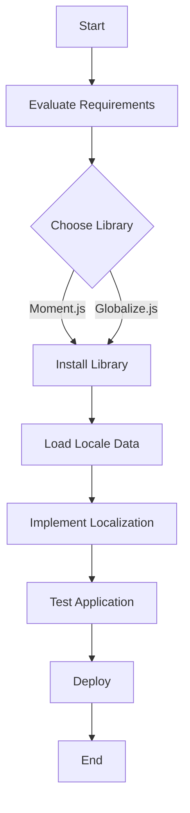

## 33.5 Libraries and Tools

In today's globalized world, creating applications that can cater to a diverse audience is more important than ever. Internationalization (often abbreviated as i18n) is the process of designing software applications so that they can be adapted to various languages and regions without engineering changes. Localization (l10n), on the other hand, is the process of adapting internationalized software for a specific region or language by adding locale-specific components and translating text.

### Introduction to Internationalization Libraries

Internationalization can be a complex task, involving the translation of text, formatting of dates and numbers, and adapting to different cultural conventions. Fortunately, there are several libraries and tools available that simplify these tasks. In this section, we'll explore some of the most popular internationalization libraries for JavaScript, including Moment.js and Globalize.js, and discuss how they can be integrated into applications to streamline localization efforts.

### Popular Internationalization Libraries

#### Moment.js

**Moment.js** is a widely-used library for parsing, validating, manipulating, and displaying dates and times in JavaScript. It simplifies the process of working with dates and times, which can be particularly challenging when dealing with different time zones and formats.

**Key Features of Moment.js:**

- **Date Parsing and Formatting:** Moment.js provides a simple API for parsing and formatting dates in various formats.
- **Time Zone Support:** With the help of the Moment Timezone extension, it can handle time zones effortlessly.
- **Localization:** Moment.js supports localization, allowing you to display dates and times in the format appropriate for different locales.

**Example Usage:**

```javascript
// Import Moment.js
const moment = require('moment');

// Set locale to French
moment.locale('fr');

// Format a date
let formattedDate = moment().format('LLLL');
console.log(formattedDate); // Displays the current date and time in French format
```

**Benefits of Using Moment.js:**

- **Ease of Use:** Moment.js provides a straightforward API that makes date manipulation easy.
- **Comprehensive Features:** It covers a wide range of date and time functionalities, including parsing, formatting, and time zone conversions.

**Drawbacks:**

- **Size:** Moment.js can be quite large, which may not be ideal for performance-sensitive applications.
- **Deprecated:** Moment.js is considered a legacy project, and the developers recommend using alternatives like Luxon or date-fns for new projects.

#### Globalize.js

**Globalize.js** is a JavaScript library for internationalization and localization that provides a comprehensive set of features for formatting and parsing dates, numbers, and currencies, as well as message translations.

**Key Features of Globalize.js:**

- **CLDR Data:** Globalize.js uses Unicode CLDR (Common Locale Data Repository) data, which provides a rich set of locale data.
- **Modular Design:** It allows you to include only the functionalities you need, reducing the overall size of your application.
- **Extensive Locale Support:** Globalize.js supports a wide range of locales and languages.

**Example Usage:**

```javascript
// Import Globalize.js
const Globalize = require('globalize');

// Load CLDR data
Globalize.load(require('cldr-data').entireSupplemental());
Globalize.load(require('cldr-data').entireMainFor('en', 'fr'));

// Set locale to French
let globalize = new Globalize('fr');

// Format a number
let formattedNumber = globalize.numberFormatter()(1234567.89);
console.log(formattedNumber); // Outputs: "1 234 567,89"
```

**Benefits of Using Globalize.js:**

- **Flexibility:** Globalize.js allows you to load only the data you need, making it efficient for applications with specific localization requirements.
- **Comprehensive Locale Data:** It leverages CLDR data, ensuring accurate and up-to-date locale information.

**Drawbacks:**

- **Complexity:** Setting up Globalize.js can be more complex compared to other libraries, especially when dealing with CLDR data.

### Integrating Libraries into Applications

Integrating internationalization libraries into your JavaScript applications can significantly simplify the localization process. Here are some steps and considerations for integrating these libraries:

1. **Evaluate Requirements:** Before choosing a library, evaluate your project's internationalization requirements. Consider factors such as the number of languages, regions, and the complexity of date and number formatting.

2. **Choose the Right Library:** Based on your requirements, choose a library that best fits your needs. For instance, if you need comprehensive date manipulation features, Moment.js might be suitable. If you require extensive locale data, Globalize.js could be a better choice.

3. **Install the Library:** Use a package manager like npm or yarn to install the library in your project.

4. **Load Locale Data:** For libraries like Globalize.js, ensure you load the necessary locale data. This may involve including CLDR data files in your project.

5. **Implement Localization:** Use the library's API to implement localization features, such as formatting dates, numbers, and translating messages.

6. **Test Thoroughly:** Test your application in different locales to ensure that all internationalization features work as expected.

### Benefits and Drawbacks of Using Third-Party Tools

Using third-party internationalization libraries offers several benefits but also comes with potential drawbacks:

**Benefits:**

- **Time-Saving:** Libraries provide ready-to-use solutions, saving you the time and effort of implementing internationalization from scratch.
- **Consistency:** They ensure consistent formatting and translation across your application.
- **Community Support:** Popular libraries have active communities that provide support and updates.

**Drawbacks:**

- **Dependency Management:** Relying on third-party libraries means you need to manage dependencies and ensure they are updated.
- **Performance Overhead:** Some libraries can add significant size to your application, impacting performance.
- **Learning Curve:** Understanding and integrating a new library can have a learning curve, especially for beginners.

### Evaluating Libraries Based on Project Requirements

When choosing an internationalization library, consider the following factors:

- **Project Size and Scope:** For small projects, a lightweight library like date-fns might be sufficient. Larger projects may benefit from the comprehensive features of Globalize.js.
- **Locale Support:** Ensure the library supports all the locales and languages you need.
- **Performance:** Consider the library's impact on your application's performance, especially if you're working on a web application.
- **Community and Maintenance:** Choose libraries that are actively maintained and have a strong community for support.

### Try It Yourself

To get hands-on experience with internationalization libraries, try integrating Moment.js or Globalize.js into a simple JavaScript application. Experiment with formatting dates and numbers in different locales, and explore how these libraries handle various internationalization tasks.

### Visualizing Library Integration

To better understand how internationalization libraries fit into your application, let's visualize the process using a flowchart:



**Diagram Description:** This flowchart illustrates the process of integrating an internationalization library into a JavaScript application, from evaluating requirements to deploying the application.

### References and Links

For further reading and resources on internationalization and localization in JavaScript, consider the following links:

- [Moment.js Documentation](https://momentjs.com/docs/)
- [Globalize.js Documentation](https://github.com/globalizejs/globalize)
- [MDN Web Docs on Internationalization](https://developer.mozilla.org/en-US/docs/Web/JavaScript/Reference/Global_Objects/Intl)

### Knowledge Check

To reinforce your understanding of internationalization libraries and tools, consider the following questions and exercises:

- What are the key differences between Moment.js and Globalize.js?
- How does Globalize.js use CLDR data to provide locale support?
- Try integrating both Moment.js and Globalize.js into a sample project. Compare their APIs and ease of use.

### Embrace the Journey

Remember, mastering internationalization is a journey. As you progress, you'll gain a deeper understanding of how to create applications that cater to a global audience. Keep experimenting, stay curious, and enjoy the journey!

## Quiz Time!



### Which library is known for its date and time manipulation capabilities?

- [x] Moment.js
- [ ] Globalize.js
- [ ] Lodash
- [ ] Axios

> **Explanation:** Moment.js is widely recognized for its comprehensive date and time manipulation features.

### What data does Globalize.js use to provide locale support?

- [x] CLDR data
- [ ] JSON data
- [ ] XML data
- [ ] CSV data

> **Explanation:** Globalize.js leverages Unicode CLDR data to provide extensive locale support.

### Which library is recommended for new projects instead of Moment.js?

- [x] Luxon
- [ ] Lodash
- [ ] Axios
- [ ] jQuery

> **Explanation:** Luxon is recommended as a modern alternative to Moment.js for new projects.

### What is a potential drawback of using third-party internationalization libraries?

- [x] Performance overhead
- [ ] Increased security
- [ ] Simplified code
- [ ] Enhanced performance

> **Explanation:** Third-party libraries can add significant size to your application, impacting performance.

### How can you install an internationalization library in your project?

- [x] Using a package manager like npm
- [ ] Manually downloading files
- [ ] Using a text editor
- [ ] Through a web browser

> **Explanation:** Package managers like npm are commonly used to install libraries in JavaScript projects.

### What is the main purpose of internationalization in software development?

- [x] To adapt applications for various languages and regions
- [ ] To improve application security
- [ ] To enhance application performance
- [ ] To reduce application size

> **Explanation:** Internationalization is about designing software to be adaptable for different languages and regions.

### Which library allows you to load only the functionalities you need?

- [x] Globalize.js
- [ ] Moment.js
- [ ] Axios
- [ ] jQuery

> **Explanation:** Globalize.js has a modular design, allowing you to include only the functionalities you need.

### What is the first step in integrating an internationalization library into your application?

- [x] Evaluate project requirements
- [ ] Install the library
- [ ] Load locale data
- [ ] Implement localization

> **Explanation:** Evaluating project requirements is the first step to determine the best library for your needs.

### True or False: Moment.js is considered a legacy project.

- [x] True
- [ ] False

> **Explanation:** Moment.js is considered a legacy project, and alternatives like Luxon are recommended for new projects.

### What should you do after implementing localization in your application?

- [x] Test the application in different locales
- [ ] Deploy the application immediately
- [ ] Remove the library
- [ ] Ignore testing

> **Explanation:** Testing the application in different locales ensures that all internationalization features work as expected.


