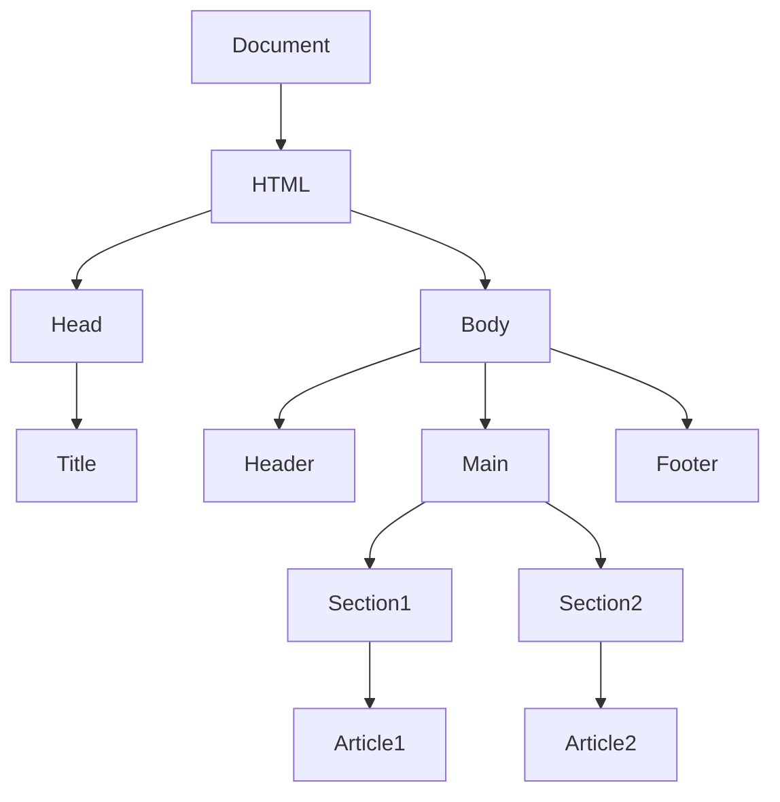
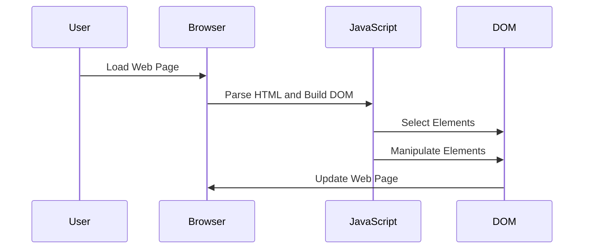

## 34.1 Selecting Elements

Welcome to the exciting world of Document Object Model (DOM) manipulation! In this section, we will explore how to use JavaScript functions to select and manipulate DOM elements effectively. By the end of this chapter, you will be well-equipped to write functions that abstract DOM selection logic, making your code more readable and maintainable.

### Understanding the DOM

Before diving into selecting elements, let's briefly understand what the DOM is. The DOM is a programming interface for web documents. It represents the page so that programs can change the document structure, style, and content. The DOM represents the document as a tree of nodes, where each node is an object representing a part of the document.

#### Visualizing the DOM Tree

Here's a simple diagram to visualize the DOM tree structure:



**Caption:** The DOM tree structure represents the hierarchy of elements in an HTML document.

### Selecting Elements with JavaScript

Selecting elements is a fundamental task in DOM manipulation. JavaScript provides several methods to select elements, with `document.querySelector` and `document.querySelectorAll` being the most versatile and widely used.

#### Using `document.querySelector`

`document.querySelector` allows you to select the first element that matches a specified CSS selector. This method is powerful because it uses the same syntax as CSS selectors, making it intuitive for those familiar with CSS.

**Example: Selecting a Single Element**

```javascript
// Select the first element with the class 'button'
const button = document.querySelector('.button');
console.log(button);
```

**Explanation:** This code selects the first element with the class `button` and logs it to the console.

#### Using `document.querySelectorAll`

`document.querySelectorAll` selects all elements that match a specified CSS selector and returns a NodeList, which is similar to an array.

**Example: Selecting Multiple Elements**

```javascript
// Select all elements with the class 'button'
const buttons = document.querySelectorAll('.button');
buttons.forEach(button => {
    console.log(button);
});
```

**Explanation:** This code selects all elements with the class `button` and iterates over them, logging each one to the console.

### Best Practices for Efficient DOM Selection

Efficient DOM selection is crucial for performance, especially in large documents. Here are some best practices to keep in mind:

1. **Limit the Scope of Selection:** Use the most specific selector possible to reduce the number of elements the browser needs to search through.
   
2. **Cache Selections:** If you need to use the same element multiple times, store it in a variable to avoid selecting it repeatedly.

3. **Use ID Selectors for Unique Elements:** If an element has a unique ID, use `document.getElementById` for faster selection.

4. **Avoid Overly Complex Selectors:** Complex selectors can be slow. Keep them simple and straightforward.

5. **Use Classes for Reusable Styles:** Use class selectors for elements that share the same style or behavior.

### Creating Utility Functions for DOM Selection

To enhance code readability and maintainability, consider creating utility functions for common selection patterns. This approach abstracts the selection logic and makes your code more modular.

**Example: Utility Function for Selecting Elements**

```javascript
// Utility function to select a single element
function selectElement(selector) {
    return document.querySelector(selector);
}

// Utility function to select multiple elements
function selectElements(selector) {
    return document.querySelectorAll(selector);
}

// Usage
const header = selectElement('header');
const paragraphs = selectElements('p');
```

**Explanation:** These utility functions simplify the process of selecting elements, making your code cleaner and easier to read.

### Emphasizing Readability and Maintainability

When writing functions for DOM selection, prioritize readability and maintainability. Here are some tips:

- **Use Descriptive Names:** Name your functions and variables descriptively to convey their purpose.
- **Keep Functions Small:** Write small, focused functions that do one thing well.
- **Document Your Code:** Use comments to explain complex logic or decisions.
- **Refactor When Necessary:** Regularly review and refactor your code to improve clarity and efficiency.

### Try It Yourself

Now that we've covered the basics, it's time to experiment! Try modifying the code examples to select different elements or use different selectors. For instance, try selecting elements by tag name or attribute.

### Visualizing JavaScript's Interaction with Web Pages

To further understand how JavaScript interacts with web pages, let's visualize the process of selecting and manipulating DOM elements:



**Caption:** This diagram illustrates the interaction between the user, browser, JavaScript, and the DOM during web page loading and manipulation.

### References and Further Reading

For more information on DOM manipulation and selection, check out these resources:

- [MDN Web Docs: Document Object Model (DOM)](https://developer.mozilla.org/en-US/docs/Web/API/Document_Object_Model)
- [W3Schools: JavaScript HTML DOM](https://www.w3schools.com/js/js_htmldom.asp)

### Knowledge Check

Let's reinforce what we've learned with a few questions:

- What is the DOM, and why is it important for web development?
- How does `document.querySelector` differ from `document.querySelectorAll`?
- What are some best practices for efficient DOM selection?
- How can utility functions improve code readability and maintainability?

### Embrace the Journey

Remember, this is just the beginning. As you progress, you'll build more complex and interactive web pages. Keep experimenting, stay curious, and enjoy the journey!

## Quiz Time!



### What is the primary purpose of the DOM in web development?

- [x] To represent the document as a tree of nodes
- [ ] To style web pages
- [ ] To store user data
- [ ] To manage server requests

> **Explanation:** The DOM represents the document as a tree of nodes, allowing programs to change the document structure, style, and content.

### Which method would you use to select all elements with a specific class?

- [ ] document.querySelector
- [x] document.querySelectorAll
- [ ] document.getElementById
- [ ] document.getElementsByTagName

> **Explanation:** `document.querySelectorAll` selects all elements that match a specified CSS selector, such as a class.

### What does `document.querySelector` return?

- [x] The first element that matches the specified selector
- [ ] An array of all matching elements
- [ ] A NodeList of all matching elements
- [ ] A boolean indicating if an element was found

> **Explanation:** `document.querySelector` returns the first element that matches the specified selector.

### Why is it important to cache DOM selections?

- [x] To improve performance by avoiding repeated selections
- [ ] To increase the number of selected elements
- [ ] To make the code more complex
- [ ] To ensure elements are always selected

> **Explanation:** Caching DOM selections improves performance by avoiding repeated selections, which can be costly.

### Which of the following is a best practice for DOM selection?

- [x] Use the most specific selector possible
- [ ] Use complex selectors for all elements
- [ ] Avoid using IDs for selection
- [ ] Select elements only by tag name

> **Explanation:** Using the most specific selector possible reduces the number of elements the browser needs to search through.

### What is the advantage of using utility functions for DOM selection?

- [x] They improve code readability and maintainability
- [ ] They make the code run faster
- [ ] They increase the number of selected elements
- [ ] They eliminate the need for CSS

> **Explanation:** Utility functions abstract selection logic, making code more readable and maintainable.

### What does `document.querySelectorAll` return?

- [ ] A single element
- [ ] An array of elements
- [x] A NodeList of elements
- [ ] A boolean value

> **Explanation:** `document.querySelectorAll` returns a NodeList, which is similar to an array, of all elements that match the specified selector.

### How can you select an element by its ID?

- [ ] document.querySelector
- [ ] document.querySelectorAll
- [x] document.getElementById
- [ ] document.getElementsByClassName

> **Explanation:** `document.getElementById` is used to select an element by its unique ID.

### What is a NodeList?

- [x] A collection of nodes returned by methods like `document.querySelectorAll`
- [ ] An array of elements
- [ ] A single HTML element
- [ ] A JavaScript object

> **Explanation:** A NodeList is a collection of nodes returned by methods like `document.querySelectorAll`.

### True or False: `document.querySelector` can select elements by attribute.

- [x] True
- [ ] False

> **Explanation:** `document.querySelector` can select elements using any valid CSS selector, including attributes.




