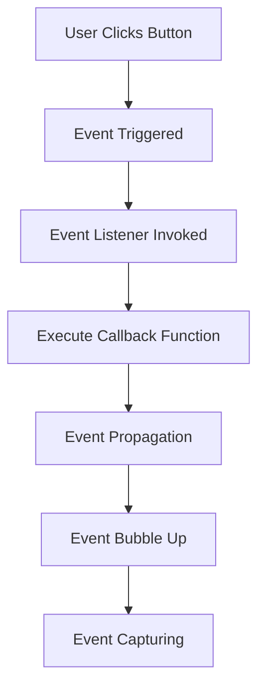

## 34.2 Event Listeners

In the world of web development, understanding how to interact with the Document Object Model (DOM) is crucial. One of the most powerful ways to make your web pages interactive is through event listeners. In this section, we'll explore how to use JavaScript functions as event handlers, attach event listeners to DOM elements, and manage events effectively. By the end of this guide, you'll have a solid understanding of how to harness the power of event listeners to create dynamic and responsive web applications.

### What are Event Listeners?

Event listeners are a fundamental concept in JavaScript that allow you to execute code in response to user interactions or other events that occur within the browser. These interactions can include clicking a button, hovering over an element, typing in a text field, or even loading a page. By attaching event listeners to DOM elements, you can specify functions that should be executed when these events occur.

### Attaching Event Listeners to DOM Elements

To attach an event listener to a DOM element, we use the `addEventListener` method. This method takes two primary arguments: the event type (such as 'click', 'mouseover', 'keydown', etc.) and the function that should be executed when the event occurs. Let's look at a simple example:

```javascript
// Select the button element
const button = document.querySelector('button');

// Define the event handler function
function handleClick() {
  alert('Button was clicked!');
}

// Attach the event listener to the button
button.addEventListener('click', handleClick);
```

In this example, we select a button element from the DOM and attach a 'click' event listener to it. When the button is clicked, the `handleClick` function is executed, displaying an alert message.

### Using Function Callbacks with `addEventListener`

The function passed to `addEventListener` is known as a callback function. This function is called whenever the specified event occurs. You can define the callback function separately, as shown in the previous example, or inline directly within the `addEventListener` call:

```javascript
button.addEventListener('click', function() {
  alert('Button clicked with inline function!');
});
```

Using inline functions can be convenient for simple event handlers, but defining functions separately is often more readable and reusable, especially for more complex logic.

### Passing Parameters to Event Handler Functions

Sometimes, you may need to pass additional parameters to your event handler functions. One common approach is to use an anonymous function or an arrow function to wrap the actual handler function, allowing you to pass parameters:

```javascript
function handleButtonClick(message) {
  alert(message);
}

button.addEventListener('click', function() {
  handleButtonClick('Button clicked with parameter!');
});
```

In this example, the anonymous function acts as a wrapper, allowing us to pass the `message` parameter to the `handleButtonClick` function.

### The Role of the `event` Object

When an event occurs, the browser creates an `event` object that contains information about the event. This object is automatically passed to the event handler function as the first argument. The `event` object provides valuable properties and methods that can be used to gain insights into the event and control its behavior.

Here's an example of using the `event` object:

```javascript
button.addEventListener('click', function(event) {
  console.log('Event type:', event.type);
  console.log('Clicked element:', event.target);
});
```

In this example, we log the event type and the element that triggered the event using the `event.type` and `event.target` properties, respectively.

#### Common Properties of the `event` Object

- **`type`**: The type of the event (e.g., 'click', 'mouseover').
- **`target`**: The element that triggered the event.
- **`currentTarget`**: The element to which the event listener is attached.
- **`preventDefault()`**: A method to cancel the default action of the event.
- **`stopPropagation()`**: A method to stop the event from bubbling up the DOM tree.

### Best Practices for Adding and Removing Event Listeners

To ensure your web applications remain efficient and maintainable, it's important to follow best practices when working with event listeners:

1. **Avoid Memory Leaks**: Always remove event listeners when they are no longer needed. This is particularly important for single-page applications where elements may be dynamically added and removed. Use the `removeEventListener` method to detach listeners:

   ```javascript
   button.removeEventListener('click', handleClick);
   ```

2. **Use Named Functions**: Whenever possible, use named functions instead of anonymous functions for event handlers. This makes it easier to remove listeners and improves code readability.

3. **Delegate Events**: For elements that are dynamically added to the DOM, consider using event delegation. Attach a single event listener to a parent element and use the `event.target` property to determine which child element triggered the event. This reduces the number of event listeners and improves performance.

4. **Limit Event Listeners**: Avoid attaching too many event listeners to the same element, as this can lead to performance issues. Instead, consolidate related logic into a single event handler.

5. **Use Passive Event Listeners**: For events like 'scroll' and 'touchmove', consider using passive event listeners to improve performance. Passive listeners indicate that the event handler will not call `preventDefault()`, allowing the browser to optimize scrolling performance.

   ```javascript
   window.addEventListener('scroll', handleScroll, { passive: true });
   ```

### Try It Yourself

Experimenting with event listeners is a great way to solidify your understanding. Try modifying the code examples above to create your own interactive elements. For instance, you can:

- Change the event type from 'click' to 'mouseover' and see how the behavior changes.
- Use the `event` object to log different properties and explore their values.
- Create a button that changes its text when clicked, using an event listener.

### Visualizing the Event Flow

To better understand how events flow through the DOM, let's visualize the process using a Mermaid.js diagram:



**Diagram Explanation**: This flowchart illustrates the sequence of events when a user clicks a button. The event is triggered, invoking the event listener and executing the callback function. The event then propagates through the DOM, first bubbling up and then capturing down.

### Further Reading and Resources

To deepen your understanding of event listeners and DOM manipulation, consider exploring the following resources:

- [MDN Web Docs: EventTarget.addEventListener()](https://developer.mozilla.org/en-US/docs/Web/API/EventTarget/addEventListener)
- [W3Schools: JavaScript Events](https://www.w3schools.com/js/js_events.asp)

### Knowledge Check

Before we wrap up, let's review some key concepts:

- What is the purpose of the `event` object in event handlers?
- How can you pass parameters to an event handler function?
- Why is it important to remove event listeners when they are no longer needed?

### Embrace the Journey

Remember, mastering event listeners is just one step in your journey to becoming a proficient JavaScript developer. As you progress, you'll discover more advanced techniques and patterns for handling events and creating interactive web applications. Keep experimenting, stay curious, and enjoy the journey!

## Quiz Time!



### What is the primary purpose of an event listener in JavaScript?

- [x] To execute code in response to user interactions or other events
- [ ] To modify the DOM structure
- [ ] To style HTML elements
- [ ] To store data in local storage

> **Explanation:** Event listeners are used to execute code in response to user interactions or other events that occur within the browser.

### How do you attach an event listener to a DOM element?

- [x] Using the `addEventListener` method
- [ ] Using the `attachEvent` method
- [ ] Using the `bindEvent` method
- [ ] Using the `setEventListener` method

> **Explanation:** The `addEventListener` method is used to attach an event listener to a DOM element.

### What is the role of the `event` object in an event handler function?

- [x] It provides information about the event and allows control over its behavior
- [ ] It stores the element that triggered the event
- [ ] It contains the CSS styles of the element
- [ ] It holds the HTML content of the element

> **Explanation:** The `event` object provides information about the event and allows control over its behavior, such as stopping propagation or preventing default actions.

### Which method is used to remove an event listener from a DOM element?

- [x] `removeEventListener`
- [ ] `detachEvent`
- [ ] `unbindEvent`
- [ ] `clearEventListener`

> **Explanation:** The `removeEventListener` method is used to remove an event listener from a DOM element.

### What is a common use case for event delegation?

- [x] To handle events for dynamically added elements
- [ ] To change the styles of an element
- [ ] To store data in cookies
- [ ] To load external scripts

> **Explanation:** Event delegation is commonly used to handle events for dynamically added elements by attaching a single event listener to a parent element.

### Why should you use named functions for event handlers?

- [x] To improve code readability and reusability
- [ ] To increase the speed of event handling
- [ ] To reduce the size of the JavaScript file
- [ ] To prevent memory leaks

> **Explanation:** Using named functions for event handlers improves code readability and reusability, making it easier to manage and remove listeners.

### How can you pass parameters to an event handler function?

- [x] By using an anonymous function or arrow function to wrap the handler
- [ ] By using the `bind` method
- [ ] By using the `apply` method
- [ ] By using the `call` method

> **Explanation:** Parameters can be passed to an event handler function by using an anonymous function or arrow function to wrap the handler and pass the parameters.

### What does the `preventDefault()` method do?

- [x] It cancels the default action of the event
- [ ] It stops the event from bubbling up the DOM tree
- [ ] It logs the event details to the console
- [ ] It changes the event type

> **Explanation:** The `preventDefault()` method cancels the default action of the event, such as preventing a form submission or link navigation.

### What is the benefit of using passive event listeners?

- [x] They improve scrolling performance by indicating that the event handler will not call `preventDefault()`
- [ ] They automatically remove themselves after execution
- [ ] They increase the security of the application
- [ ] They allow multiple events to be handled simultaneously

> **Explanation:** Passive event listeners improve scrolling performance by indicating that the event handler will not call `preventDefault()`, allowing the browser to optimize scrolling.

### True or False: Event listeners can only be attached to elements that are already present in the DOM.

- [ ] True
- [x] False

> **Explanation:** Event listeners can be attached to elements that are dynamically added to the DOM, often using event delegation to handle such cases.




