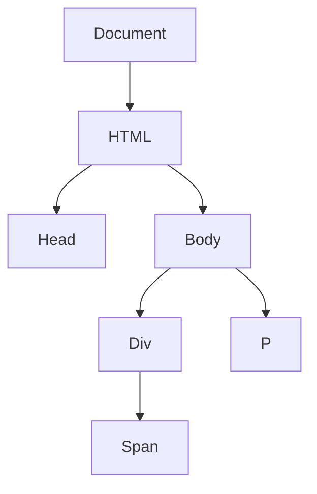
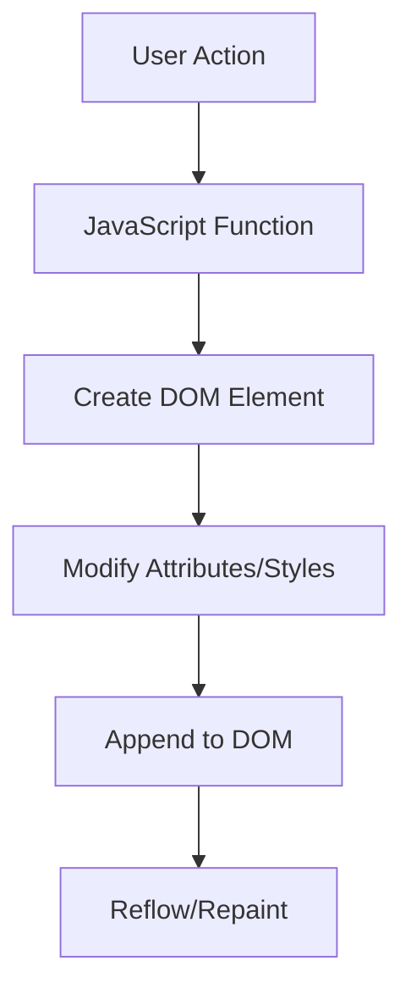

## 34.3 Dynamic Content Creation

In the world of web development, creating dynamic content is a fundamental skill that allows us to build interactive and engaging web pages. JavaScript, with its ability to manipulate the Document Object Model (DOM), provides us with the tools to add, remove, or modify content on the fly. In this section, we'll explore how to use functions to achieve dynamic content creation, discuss best practices, and highlight potential pitfalls to avoid.

### Understanding the DOM

Before diving into dynamic content creation, it's essential to understand the DOM. The DOM is a programming interface for web documents. It represents the page so that programs can change the document structure, style, and content. The DOM represents the document as a tree of nodes, where each node is an object representing a part of the document.



*Diagram: The Document Object Model (DOM) Tree Structure*

### Creating and Appending New DOM Elements

One of the most common tasks in dynamic content creation is adding new elements to the DOM. We can achieve this using JavaScript functions that create elements and append them to existing nodes.

#### Example: Adding a New Paragraph

Let's start with a simple example where we add a new paragraph to a webpage.

```html
<!DOCTYPE html>
<html lang="en">
<head>
    <meta charset="UTF-8">
    <title>Dynamic Content Example</title>
</head>
<body>
    <div id="content">
        <h1>Welcome to Dynamic Content Creation</h1>
    </div>
    <script>
        function addParagraph() {
            // Create a new paragraph element
            const newParagraph = document.createElement('p');
            // Set the text content of the paragraph
            newParagraph.textContent = 'This is a dynamically added paragraph.';
            // Append the paragraph to the content div
            document.getElementById('content').appendChild(newParagraph);
        }

        // Call the function to add the paragraph
        addParagraph();
    </script>
</body>
</html>
```

In this example, we define a function `addParagraph` that creates a new `<p>` element, sets its text content, and appends it to the `<div>` with the ID `content`.

### Manipulating Element Attributes and Styles

JavaScript functions can also modify element attributes and styles, allowing us to change the appearance and behavior of elements dynamically.

#### Example: Changing Styles Dynamically

Let's modify the style of an element using JavaScript.

```html
<!DOCTYPE html>
<html lang="en">
<head>
    <meta charset="UTF-8">
    <title>Dynamic Style Example</title>
    <style>
        #dynamicText {
            color: blue;
            font-size: 16px;
        }
    </style>
</head>
<body>
    <p id="dynamicText">This text will change style dynamically.</p>
    <button onclick="changeStyle()">Change Style</button>
    <script>
        function changeStyle() {
            const textElement = document.getElementById('dynamicText');
            // Change the color and font size of the text
            textElement.style.color = 'red';
            textElement.style.fontSize = '24px';
        }
    </script>
</body>
</html>
```

In this example, we use a function `changeStyle` that modifies the style of the paragraph with the ID `dynamicText`. When the button is clicked, the text color changes to red, and the font size increases.

### Responding to User Actions and Data Changes

Dynamic content creation often involves updating the DOM in response to user actions or changes in data. This can be achieved through event listeners and functions that react to these events.

#### Example: Updating Content on Button Click

Let's create a simple example where clicking a button updates the content of a paragraph.

```html
<!DOCTYPE html>
<html lang="en">
<head>
    <meta charset="UTF-8">
    <title>Update Content Example</title>
</head>
<body>
    <p id="info">Click the button to update this text.</p>
    <button id="updateButton">Update Text</button>
    <script>
        document.getElementById('updateButton').addEventListener('click', function() {
            const infoParagraph = document.getElementById('info');
            // Update the text content of the paragraph
            infoParagraph.textContent = 'The text has been updated!';
        });
    </script>
</body>
</html>
```

Here, we add an event listener to the button that updates the text content of the paragraph when clicked.

### Avoiding Common Pitfalls

When creating dynamic content, it's crucial to be aware of potential pitfalls such as memory leaks and performance issues like reflow.

#### Memory Leaks

Memory leaks occur when we create elements or event listeners that are not properly removed, leading to increased memory usage over time. To avoid memory leaks, ensure that you remove event listeners and DOM elements when they are no longer needed.

#### Reflow Performance Issues

Reflow is the process by which the browser recalculates the positions and dimensions of elements on the page. Frequent reflows can lead to performance issues, especially in complex pages. To minimize reflows, batch DOM updates together and use `document fragments` for efficient updates.

### Using Document Fragments for Efficient Updates

Document fragments are lightweight containers that allow us to make changes to the DOM without triggering reflows until the fragment is appended to the document.

#### Example: Using Document Fragments

```html
<!DOCTYPE html>
<html lang="en">
<head>
    <meta charset="UTF-8">
    <title>Document Fragment Example</title>
</head>
<body>
    <ul id="itemList"></ul>
    <script>
        function addItems() {
            const fragment = document.createDocumentFragment();
            for (let i = 1; i <= 5; i++) {
                const listItem = document.createElement('li');
                listItem.textContent = `Item ${i}`;
                fragment.appendChild(listItem);
            }
            document.getElementById('itemList').appendChild(fragment);
        }

        // Call the function to add items
        addItems();
    </script>
</body>
</html>
```

In this example, we create a `document fragment` and append multiple list items to it. Once all items are added, we append the fragment to the DOM, minimizing reflows.

### Encouraging Experimentation

Dynamic content creation is a powerful tool in web development. To master it, experiment with the examples provided and try modifying them to suit different scenarios. Here are some ideas to get you started:

- **Try It Yourself**: Modify the `addParagraph` function to add multiple paragraphs with different text content.
- **Experiment**: Create a function that changes the background color of the page when a button is clicked.
- **Challenge**: Build a simple to-do list application where users can add and remove tasks dynamically.

### Visualizing JavaScript's Interaction with Web Browsers and Web Pages

To further understand how JavaScript interacts with web pages, let's visualize the process of dynamic content creation using a flowchart.



*Diagram: Flowchart of Dynamic Content Creation Process*

### References and Further Reading

For more information on DOM manipulation and dynamic content creation, consider exploring the following resources:

- [MDN Web Docs: Introduction to the DOM](https://developer.mozilla.org/en-US/docs/Web/API/Document_Object_Model/Introduction)
- [W3Schools: JavaScript HTML DOM](https://www.w3schools.com/js/js_htmldom.asp)

### Knowledge Check

Let's summarize the key takeaways from this section:

- **Functions**: Use functions to create, append, and modify DOM elements.
- **Attributes and Styles**: Dynamically change element attributes and styles using JavaScript.
- **User Actions**: Update content in response to user actions with event listeners.
- **Performance**: Avoid memory leaks and reflow issues by using best practices like document fragments.

Remember, this is just the beginning. As you progress, you'll build more complex and interactive web pages. Keep experimenting, stay curious, and enjoy the journey!

---

## Quiz Time!



### What is the DOM in web development?

- [x] A programming interface for web documents
- [ ] A database for storing web content
- [ ] A tool for debugging JavaScript code
- [ ] A style sheet language for web pages

> **Explanation:** The DOM (Document Object Model) is a programming interface for web documents, representing the structure of a document as a tree of objects.

### Which method is used to create a new DOM element in JavaScript?

- [x] `document.createElement()`
- [ ] `document.appendChild()`
- [ ] `document.getElementById()`
- [ ] `document.querySelector()`

> **Explanation:** The `document.createElement()` method is used to create a new DOM element in JavaScript.

### How can you change the text content of a DOM element?

- [x] By using the `textContent` property
- [ ] By using the `innerHTML` property
- [ ] By using the `value` property
- [ ] By using the `style` property

> **Explanation:** The `textContent` property is used to change the text content of a DOM element.

### What is a common pitfall when dynamically creating content in JavaScript?

- [x] Memory leaks
- [ ] Syntax errors
- [ ] Slow network requests
- [ ] Incorrect file paths

> **Explanation:** Memory leaks can occur when dynamically creating content if event listeners or DOM elements are not properly removed.

### What is the purpose of a document fragment in JavaScript?

- [x] To make efficient updates to the DOM
- [ ] To store data temporarily
- [ ] To create animations
- [ ] To handle user input

> **Explanation:** Document fragments are used to make efficient updates to the DOM by minimizing reflows and repaints.

### Which event listener method is used to respond to user actions?

- [x] `addEventListener()`
- [ ] `removeEventListener()`
- [ ] `setTimeout()`
- [ ] `setInterval()`

> **Explanation:** The `addEventListener()` method is used to attach an event handler to an element to respond to user actions.

### How can you avoid reflow performance issues in JavaScript?

- [x] By batching DOM updates together
- [ ] By using inline styles
- [ ] By increasing the font size
- [ ] By using external scripts

> **Explanation:** Batching DOM updates together helps avoid reflow performance issues by reducing the number of times the browser recalculates the layout.

### What is a memory leak in the context of web development?

- [x] Unused memory that is not released
- [ ] A slow network connection
- [ ] A missing file reference
- [ ] An incorrect CSS rule

> **Explanation:** A memory leak occurs when unused memory is not released, leading to increased memory usage over time.

### What is the role of the `appendChild()` method in JavaScript?

- [x] To add a new child element to a parent element
- [ ] To remove an element from the DOM
- [ ] To change the style of an element
- [ ] To create a new element

> **Explanation:** The `appendChild()` method is used to add a new child element to a parent element in the DOM.

### True or False: JavaScript can only modify the text content of a webpage, not its structure.

- [ ] True
- [x] False

> **Explanation:** False. JavaScript can modify both the text content and the structure of a webpage by manipulating the DOM.




