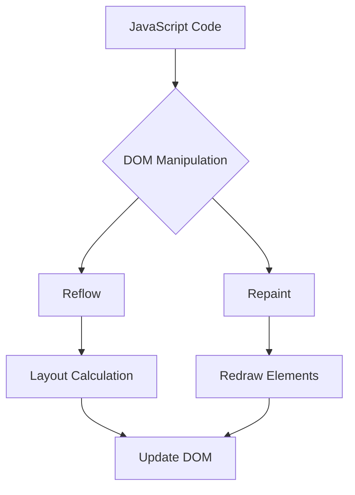

## 34.4 Performance Optimization in the DOM

In the world of web development, the Document Object Model (DOM) is the backbone of any web page. It represents the structure of a web document and allows us to interact with it using JavaScript. However, manipulating the DOM can be a double-edged sword. While it enables dynamic and interactive web experiences, it can also lead to performance bottlenecks if not handled efficiently. In this section, we'll explore techniques to optimize DOM manipulation, ensuring your applications run smoothly and efficiently.

### Understanding the Impact of DOM Manipulation

Before diving into optimization techniques, it's crucial to understand why DOM manipulation can impact performance. The DOM is a tree-like structure that represents the elements of a web page. When you manipulate the DOM, such as adding or removing elements, changing styles, or updating content, the browser may need to recalculate the layout and repaint the page. These processes, known as reflows and repaints, can be resource-intensive and slow down your application.

#### Reflows and Repaints

- **Reflow**: This occurs when the browser recalculates the positions and sizes of elements in the DOM. Reflows can be triggered by changes in the DOM structure, element styles, or window size.
- **Repaint**: This happens when the browser redraws elements on the screen, typically due to changes in styles that don't affect layout, such as color or visibility.

Both reflows and repaints can be costly in terms of performance, especially if they occur frequently. Therefore, minimizing these operations is key to optimizing DOM performance.

### Strategies for Minimizing Reflows and Repaints

Let's explore some strategies to reduce the frequency and impact of reflows and repaints:

#### 1. Batch DOM Updates

One effective way to minimize reflows and repaints is to batch DOM updates. Instead of making multiple changes to the DOM individually, group them together to reduce the number of times the browser needs to recalculate and repaint.

**Example:**

```javascript
// Inefficient: Multiple individual updates
const element = document.getElementById('myElement');
element.style.width = '100px';
element.style.height = '100px';
element.style.backgroundColor = 'blue';

// Efficient: Batch updates
const element = document.getElementById('myElement');
element.style.cssText = 'width: 100px; height: 100px; background-color: blue;';
```

By using `style.cssText`, we apply all style changes at once, reducing the number of reflows and repaints.

#### 2. Use Document Fragments

When adding multiple elements to the DOM, use a `DocumentFragment` to batch the additions. This way, the elements are added to the fragment first and then appended to the DOM in one operation.

**Example:**

```javascript
// Create a document fragment
const fragment = document.createDocumentFragment();

for (let i = 0; i < 100; i++) {
  const newElement = document.createElement('div');
  newElement.textContent = `Item ${i}`;
  fragment.appendChild(newElement);
}

// Append the fragment to the DOM
document.body.appendChild(fragment);
```

Using a `DocumentFragment` minimizes reflows by reducing the number of times the DOM is updated.

#### 3. Avoid Layout Thrashing

Layout thrashing occurs when you read and write to the DOM in a way that causes multiple reflows. To avoid this, separate read and write operations.

**Example:**

```javascript
// Inefficient: Causes layout thrashing
const element = document.getElementById('myElement');
const height = element.offsetHeight;
element.style.height = `${height + 10}px`;

// Efficient: Separate read and write
const element = document.getElementById('myElement');
const height = element.offsetHeight;
requestAnimationFrame(() => {
  element.style.height = `${height + 10}px`;
});
```

By using `requestAnimationFrame`, we ensure that the read and write operations are separated, preventing layout thrashing.

### Debouncing and Throttling Event Handlers

Event handlers, such as those for scroll or resize events, can trigger frequent DOM updates, leading to performance issues. Debouncing and throttling are techniques to control the rate at which these handlers are executed.

#### Debouncing

Debouncing ensures that a function is only called after a specified period of inactivity. This is useful for events like `resize` or `input`.

**Example:**

```javascript
function debounce(func, delay) {
  let timeout;
  return function(...args) {
    clearTimeout(timeout);
    timeout = setTimeout(() => func.apply(this, args), delay);
  };
}

window.addEventListener('resize', debounce(() => {
  console.log('Window resized');
}, 300));
```

In this example, the `resize` event handler is debounced, so it only executes after 300 milliseconds of inactivity.

#### Throttling

Throttling limits the number of times a function can be called over time. This is useful for events like `scroll`.

**Example:**

```javascript
function throttle(func, limit) {
  let lastFunc;
  let lastRan;
  return function(...args) {
    if (!lastRan) {
      func.apply(this, args);
      lastRan = Date.now();
    } else {
      clearTimeout(lastFunc);
      lastFunc = setTimeout(() => {
        if ((Date.now() - lastRan) >= limit) {
          func.apply(this, args);
          lastRan = Date.now();
        }
      }, limit - (Date.now() - lastRan));
    }
  };
}

window.addEventListener('scroll', throttle(() => {
  console.log('Scrolled');
}, 200));
```

Here, the `scroll` event handler is throttled to execute at most once every 200 milliseconds.

### Best Practices for Optimizing Rendering Performance

In addition to the techniques mentioned above, here are some best practices to further optimize rendering performance:

#### 1. Minimize DOM Access

Accessing the DOM is relatively slow. Minimize DOM access by storing references to elements and properties when possible.

**Example:**

```javascript
// Inefficient: Multiple DOM accesses
for (let i = 0; i < 100; i++) {
  document.getElementById('myElement').style.width = `${i}px`;
}

// Efficient: Store reference
const element = document.getElementById('myElement');
for (let i = 0; i < 100; i++) {
  element.style.width = `${i}px`;
}
```

#### 2. Use CSS for Animations

Whenever possible, use CSS for animations instead of JavaScript. CSS animations are often more efficient as they can be optimized by the browser.

**Example:**

```css
/* CSS animation */
@keyframes slide {
  from { transform: translateX(0); }
  to { transform: translateX(100px); }
}

.element {
  animation: slide 2s infinite;
}
```

#### 3. Leverage Hardware Acceleration

Use CSS properties like `transform` and `opacity` to leverage hardware acceleration, which can improve performance.

**Example:**

```css
/* Use transform for hardware acceleration */
.element {
  transform: translateZ(0);
}
```

#### 4. Optimize Image Loading

Optimize images by using appropriate formats and sizes. Consider lazy loading images to improve initial load times.

**Example:**

```html
<!-- Lazy loading image -->

```

#### 5. Use Virtual DOM Libraries

Consider using libraries like React or Vue.js that implement a virtual DOM. These libraries optimize updates by minimizing direct DOM manipulations.

### Visualizing JavaScript's Interaction with the DOM

To better understand how JavaScript interacts with the DOM and the impact of reflows and repaints, let's visualize the process using a flowchart.



**Diagram Description**: This flowchart illustrates how JavaScript code interacts with the DOM, leading to potential reflows and repaints. The process involves layout calculations and redrawing elements, which can impact performance.

### Try It Yourself

Now that we've covered various optimization techniques, it's time to experiment. Try modifying the code examples provided to see how different approaches affect performance. For instance, test the impact of debouncing and throttling on event handlers by adjusting the delay and limit values. Observe how batching DOM updates can reduce reflows and repaints.

### Knowledge Check

Let's reinforce what we've learned with a few questions:

1. What is the difference between a reflow and a repaint?
2. How can you minimize layout thrashing in your code?
3. What are the benefits of using `DocumentFragment` for DOM updates?
4. How do debouncing and throttling differ in event handling?
5. Why is it recommended to use CSS for animations instead of JavaScript?

### Embrace the Journey

Optimizing DOM performance is an ongoing process. As you continue to build web applications, keep these techniques in mind to ensure your pages are fast and responsive. Remember, this is just the beginning. As you progress, you'll build more complex and interactive web pages. Keep experimenting, stay curious, and enjoy the journey!

## Quiz Time!



### What is the primary purpose of batching DOM updates?

- [x] To reduce the number of reflows and repaints
- [ ] To increase the number of DOM elements
- [ ] To make the code more complex
- [ ] To slow down the browser

> **Explanation:** Batching DOM updates reduces the number of reflows and repaints, improving performance.

### How does debouncing improve performance in event handling?

- [x] By ensuring a function is called only after a period of inactivity
- [ ] By calling a function multiple times rapidly
- [ ] By preventing a function from being called
- [ ] By increasing the frequency of function calls

> **Explanation:** Debouncing ensures a function is called only after a specified period of inactivity, reducing unnecessary executions.

### What is layout thrashing?

- [x] Frequent reflows caused by inefficient read/write operations
- [ ] A method to optimize DOM performance
- [ ] A technique to increase DOM access speed
- [ ] A way to batch DOM updates

> **Explanation:** Layout thrashing occurs when frequent reflows are triggered by inefficient read and write operations in the DOM.

### Which CSS property can leverage hardware acceleration?

- [x] transform
- [ ] color
- [ ] font-size
- [ ] display

> **Explanation:** The `transform` property can leverage hardware acceleration, improving performance.

### What is the benefit of using a `DocumentFragment`?

- [x] It allows batch updates to the DOM, minimizing reflows
- [ ] It increases the number of DOM elements
- [ ] It makes the code more complex
- [ ] It slows down the browser

> **Explanation:** Using a `DocumentFragment` allows batch updates to the DOM, minimizing reflows and improving performance.

### What is the difference between reflow and repaint?

- [x] Reflow recalculates layout, repaint redraws elements
- [ ] Reflow redraws elements, repaint recalculates layout
- [ ] Both are the same
- [ ] Neither affects performance

> **Explanation:** Reflow recalculates the layout of the page, while repaint redraws the elements on the screen.

### How can you minimize DOM access?

- [x] By storing references to elements
- [ ] By accessing elements multiple times
- [ ] By increasing the number of DOM elements
- [ ] By using JavaScript animations

> **Explanation:** Minimizing DOM access involves storing references to elements to reduce the number of times the DOM is accessed.

### Why is it recommended to use CSS for animations?

- [x] CSS animations are often more efficient and can be optimized by the browser
- [ ] JavaScript animations are faster
- [ ] CSS animations are more complex
- [ ] JavaScript cannot create animations

> **Explanation:** CSS animations are often more efficient as they can be optimized by the browser, leading to better performance.

### What is the purpose of throttling in event handling?

- [x] To limit the number of times a function can be called over time
- [ ] To increase the frequency of function calls
- [ ] To prevent a function from being called
- [ ] To call a function multiple times rapidly

> **Explanation:** Throttling limits the number of times a function can be called over a specified period, improving performance.

### True or False: Using `requestAnimationFrame` can help prevent layout thrashing.

- [x] True
- [ ] False

> **Explanation:** True. Using `requestAnimationFrame` helps separate read and write operations, preventing layout thrashing.


