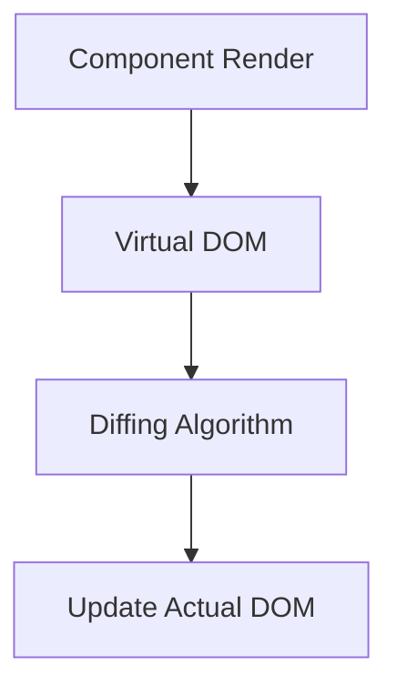

## 34.5 Frameworks and Libraries

In the world of web development, JavaScript frameworks and libraries have revolutionized how we build and interact with web applications. They provide powerful tools and abstractions that simplify complex tasks, making it easier to create dynamic and responsive user interfaces. In this section, we'll explore how functions are utilized in popular frameworks like React and Vue, focusing on their approach to DOM manipulation, component architecture, and state management.

### Introduction to Modern JavaScript Frameworks

Modern JavaScript frameworks like React and Vue have become essential tools for web developers. They offer a structured way to build applications by providing components, state management, and efficient DOM updates. Let's dive into how these frameworks leverage JavaScript functions to enhance development.

#### React: A JavaScript Library for Building User Interfaces

React, developed by Facebook, is a popular JavaScript library for building user interfaces. It emphasizes the creation of reusable UI components, which are essentially JavaScript functions or classes. React's component-based architecture allows developers to break down complex UIs into smaller, manageable pieces.

#### Vue: The Progressive JavaScript Framework

Vue is another powerful framework that provides a flexible and approachable way to build interactive web applications. It combines the best features of other frameworks, offering a progressive approach that can be incrementally adopted. Vue's simplicity and ease of integration make it a favorite among developers.

### Functions in React and Vue

Functions are at the heart of both React and Vue. They play a crucial role in defining components, managing state, and handling events. Let's explore how functions are utilized in these frameworks.

#### Functional Components in React

In React, components can be defined as functions or classes. Functional components are simpler and more concise, making them a popular choice for developers. They are essentially JavaScript functions that return a React element, representing a part of the UI.

Here's a basic example of a functional component in React:

```javascript
// A simple functional component in React
function Greeting(props) {
  return <h1>Hello, {props.name}!</h1>;
}

// Usage of the Greeting component
<Greeting name="World" />
```

In this example, the `Greeting` component is a function that takes `props` as an argument and returns a JSX element. JSX is a syntax extension for JavaScript that resembles HTML, making it easier to write and understand UI components.

#### State Management with Hooks

React introduced Hooks in version 16.8, allowing developers to use state and other React features in functional components. The `useState` hook is a function that lets you add state to functional components.

Here's an example of using the `useState` hook:

```javascript
import React, { useState } from 'react';

function Counter() {
  // Declare a state variable 'count' with an initial value of 0
  const [count, setCount] = useState(0);

  return (
    <div>
      <p>You clicked {count} times</p>
      <button onClick={() => setCount(count + 1)}>Click me</button>
    </div>
  );
}
```

In this example, `useState` is used to declare a state variable `count` and a function `setCount` to update it. The component re-renders whenever the state changes, ensuring the UI stays in sync with the data.

#### Vue's Composition API

Vue 3 introduced the Composition API, which allows developers to use functions to encapsulate logic and state. This approach provides better code organization and reusability.

Here's an example of a Vue component using the Composition API:

```javascript
<template>
  <div>
    <p>You clicked {{ count }} times</p>
    <button @click="increment">Click me</button>
  </div>
</template>

<script>
import { ref } from 'vue';

export default {
  setup() {
    // Declare a reactive state variable 'count'
    const count = ref(0);

    // Function to increment the count
    function increment() {
      count.value++;
    }

    return { count, increment };
  }
};
</script>
```

In this example, the `ref` function is used to create a reactive state variable `count`. The `increment` function updates the state, and the component automatically re-renders when the state changes.

### The Virtual DOM

Both React and Vue use a concept called the Virtual DOM to optimize DOM updates. The Virtual DOM is a lightweight representation of the actual DOM, allowing frameworks to efficiently determine the minimal set of changes needed to update the UI.

#### Benefits of the Virtual DOM

1. **Performance**: By minimizing direct DOM manipulations, the Virtual DOM improves performance, especially in complex applications with frequent updates.

2. **Abstraction**: Developers can focus on building components and managing state without worrying about low-level DOM operations.

3. **Predictability**: The Virtual DOM ensures that UI updates are predictable and consistent, reducing the likelihood of bugs.

Here's a simplified diagram illustrating how the Virtual DOM works:



*Diagram: The process of updating the UI using the Virtual DOM.*

### Understanding Underlying Principles

To effectively use frameworks like React and Vue, it's essential to understand the underlying principles that guide their design. This knowledge will help you make informed decisions and write more efficient code.

#### Component-Based Architecture

Both React and Vue are built around the concept of components. Components are self-contained units of code that encapsulate logic, state, and UI. This modular approach promotes reusability and maintainability.

#### Declarative Programming

React and Vue encourage a declarative programming style, where you describe what the UI should look like based on the current state. The framework takes care of updating the DOM to match the desired state.

#### Unidirectional Data Flow

React enforces a unidirectional data flow, where data flows from parent components to child components. This approach makes it easier to track data changes and debug applications. Vue also supports unidirectional data flow, but it offers more flexibility with two-way data binding.

### Try It Yourself

To deepen your understanding of how functions are used in frameworks like React and Vue, try modifying the examples provided. Experiment with adding new state variables, creating additional components, or implementing event handlers.

### Further Reading and Resources

- [React Documentation](https://reactjs.org/docs/getting-started.html)
- [Vue Documentation](https://vuejs.org/v2/guide/)
- [MDN Web Docs on JavaScript](https://developer.mozilla.org/en-US/docs/Web/JavaScript)

### Knowledge Check

1. What is a functional component in React?
2. How does the `useState` hook work in React?
3. What is the purpose of the Virtual DOM?
4. How does Vue's Composition API differ from the Options API?
5. What are the benefits of a component-based architecture?

### Embrace the Journey

Remember, learning frameworks like React and Vue is an ongoing journey. As you gain more experience, you'll discover new patterns and techniques that enhance your development skills. Keep experimenting, stay curious, and enjoy the process of building amazing web applications!

## Quiz Time!



### What is a functional component in React?

- [x] A JavaScript function that returns a React element
- [ ] A class-based component with lifecycle methods
- [ ] A component that manages its own state
- [ ] A component that uses the `this` keyword

> **Explanation:** A functional component in React is a JavaScript function that returns a React element, representing a part of the UI.

### How does the `useState` hook work in React?

- [x] It adds state to functional components
- [ ] It is used to define class-based components
- [ ] It manages global state across the application
- [ ] It is used for styling components

> **Explanation:** The `useState` hook is a function that allows you to add state to functional components in React.

### What is the purpose of the Virtual DOM?

- [x] To optimize DOM updates and improve performance
- [ ] To provide a visual representation of the UI
- [ ] To manage global state in the application
- [ ] To handle user interactions

> **Explanation:** The Virtual DOM is a lightweight representation of the actual DOM, used to optimize updates and improve performance.

### How does Vue's Composition API differ from the Options API?

- [x] It uses functions to encapsulate logic and state
- [ ] It is only available in Vue 2
- [ ] It does not support reactive data
- [ ] It requires class-based components

> **Explanation:** Vue's Composition API allows developers to use functions to encapsulate logic and state, providing better code organization and reusability.

### What are the benefits of a component-based architecture?

- [x] Reusability and maintainability
- [ ] Increased complexity
- [ ] Limited scalability
- [ ] Reduced performance

> **Explanation:** A component-based architecture promotes reusability and maintainability by breaking down complex UIs into smaller, manageable pieces.

### What is JSX in React?

- [x] A syntax extension for JavaScript that resembles HTML
- [ ] A library for managing state
- [ ] A tool for optimizing performance
- [ ] A framework for building mobile apps

> **Explanation:** JSX is a syntax extension for JavaScript that resembles HTML, making it easier to write and understand UI components in React.

### How does the `ref` function work in Vue's Composition API?

- [x] It creates a reactive state variable
- [ ] It is used to define class-based components
- [ ] It manages global state across the application
- [ ] It is used for styling components

> **Explanation:** The `ref` function in Vue's Composition API is used to create a reactive state variable, allowing the component to automatically re-render when the state changes.

### What is unidirectional data flow in React?

- [x] Data flows from parent components to child components
- [ ] Data flows in both directions between components
- [ ] Data is managed globally across the application
- [ ] Data is stored in the Virtual DOM

> **Explanation:** Unidirectional data flow in React means that data flows from parent components to child components, making it easier to track changes and debug applications.

### What is the primary goal of declarative programming in frameworks like React and Vue?

- [x] To describe what the UI should look like based on the current state
- [ ] To provide a visual representation of the UI
- [ ] To manage global state in the application
- [ ] To handle user interactions

> **Explanation:** Declarative programming in frameworks like React and Vue involves describing what the UI should look like based on the current state, allowing the framework to handle DOM updates.

### True or False: The Virtual DOM is a direct representation of the actual DOM.

- [ ] True
- [x] False

> **Explanation:** False. The Virtual DOM is a lightweight representation of the actual DOM, used to optimize updates and improve performance.


