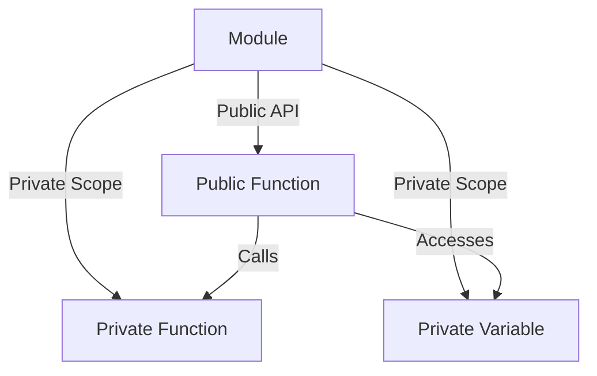

## 35.1 The Module Pattern

In the world of JavaScript, organizing code efficiently is crucial, especially as applications grow in complexity. The module pattern is a powerful design pattern that helps developers encapsulate code, manage namespaces, and promote code reusability. In this section, we'll explore the module pattern, its implementation using Immediately Invoked Function Expressions (IIFEs) and ES6 modules, and best practices for designing effective modules.

### Understanding the Module Pattern

The module pattern is a design pattern used to create self-contained units of code, known as modules. These modules encapsulate functionality, allowing developers to define public and private members. By doing so, the module pattern helps manage namespaces, preventing global scope pollution and potential conflicts between different parts of an application.

#### Purpose of the Module Pattern

- **Encapsulation**: Encapsulate code within a module to hide implementation details and expose only the necessary parts.
- **Namespace Management**: Avoid global scope pollution by creating isolated namespaces for different modules.
- **Code Reusability**: Promote reusability by creating modular, self-contained units of code that can be easily reused across different parts of an application.
- **Maintainability**: Improve code maintainability by organizing code into logical modules, making it easier to understand and modify.

### Creating Modules with IIFEs

One of the classic ways to implement the module pattern in JavaScript is by using Immediately Invoked Function Expressions (IIFEs). An IIFE is a function that is executed immediately after it is defined. This technique allows us to create a private scope for our module, encapsulating variables and functions.

#### Example: Creating a Simple Module with IIFE

```javascript
// Define a module using an IIFE
const myModule = (function() {
  // Private variables and functions
  let privateVar = "I am private";
  
  function privateFunction() {
    console.log(privateVar);
  }
  
  // Public variables and functions
  return {
    publicVar: "I am public",
    
    publicFunction: function() {
      console.log("Accessing public function");
      privateFunction(); // Accessing private function
    }
  };
})();

// Accessing the module's public members
console.log(myModule.publicVar); // Output: I am public
myModule.publicFunction(); // Output: Accessing public function, I am private
```

In this example, we define a module `myModule` using an IIFE. Inside the IIFE, we declare private variables and functions that are not accessible from outside the module. We then return an object containing public variables and functions, which can be accessed from outside the module.

### Benefits of Using IIFEs for Modules

- **Isolation**: IIFEs create a private scope, isolating variables and functions from the global scope.
- **Encapsulation**: By returning an object with public members, we can control what is exposed to the outside world.
- **Immediate Execution**: IIFEs execute immediately, making them ideal for initializing modules.

### Creating Modules with ES6 Modules

With the introduction of ES6 (ECMAScript 2015), JavaScript gained native support for modules. ES6 modules provide a more structured and standardized way to define and use modules, offering several advantages over traditional IIFE-based modules.

#### Example: Creating a Module with ES6 Modules

```javascript
// myModule.js
// Private variables and functions
let privateVar = "I am private";

function privateFunction() {
  console.log(privateVar);
}

// Public variables and functions
export const publicVar = "I am public";

export function publicFunction() {
  console.log("Accessing public function");
  privateFunction(); // Accessing private function
}
```

```javascript
// main.js
import { publicVar, publicFunction } from './myModule.js';

console.log(publicVar); // Output: I am public
publicFunction(); // Output: Accessing public function, I am private
```

In this example, we define a module `myModule.js` using ES6 module syntax. We use the `export` keyword to define public variables and functions. In `main.js`, we use the `import` keyword to import and use the public members of the module.

### Benefits of Using ES6 Modules

- **Standardization**: ES6 modules provide a standardized syntax for defining and using modules.
- **Static Analysis**: ES6 modules enable static analysis, allowing tools to analyze dependencies and optimize code.
- **Improved Performance**: ES6 modules can be loaded asynchronously, improving application performance.

### Defining Public and Private Members

One of the key features of the module pattern is the ability to define public and private members. Public members are accessible from outside the module, while private members are encapsulated within the module.

#### Example: Public and Private Members in an IIFE Module

```javascript
const counterModule = (function() {
  // Private variable
  let counter = 0;
  
  // Private function
  function increment() {
    counter++;
  }
  
  // Public function
  return {
    getCounter: function() {
      return counter;
    },
    
    increaseCounter: function() {
      increment();
    }
  };
})();

console.log(counterModule.getCounter()); // Output: 0
counterModule.increaseCounter();
console.log(counterModule.getCounter()); // Output: 1
```

In this example, the `counter` variable and `increment` function are private members, while the `getCounter` and `increaseCounter` functions are public members.

### Best Practices for Module Design

- **Single Responsibility**: Ensure each module has a single responsibility, focusing on a specific functionality or feature.
- **Minimal Public API**: Expose only the necessary public members, keeping the module's API minimal and focused.
- **Consistent Naming**: Use consistent naming conventions for modules and their members to improve readability and maintainability.
- **Avoid Global Variables**: Minimize the use of global variables by encapsulating code within modules.
- **Use ES6 Modules**: Prefer ES6 modules for new projects, as they provide a standardized and efficient way to manage modules.

### Visualizing the Module Pattern

To better understand the module pattern, let's visualize the interaction between public and private members within a module using a Mermaid.js diagram.



**Diagram Description**: This diagram illustrates the relationship between the module, its public API, and private scope. The public function accesses the private function and variable within the module's private scope.

### Try It Yourself

To deepen your understanding of the module pattern, try modifying the code examples provided. Here are some suggestions:

- **Add New Public Members**: Extend the module by adding new public functions or variables.
- **Modify Private Members**: Experiment with changing the behavior of private functions or variables.
- **Create a New Module**: Design a new module for a specific functionality, such as a calculator or a to-do list manager.

### References and Further Reading

For more information on the module pattern and JavaScript modules, check out the following resources:

- [MDN Web Docs: IIFE](https://developer.mozilla.org/en-US/docs/Glossary/IIFE)
- [MDN Web Docs: ES6 Modules](https://developer.mozilla.org/en-US/docs/Web/JavaScript/Guide/Modules)
- [W3Schools: JavaScript Modules](https://www.w3schools.com/js/js_modules.asp)

### Knowledge Check

To reinforce your understanding of the module pattern, consider the following questions:

- What are the main benefits of using the module pattern in JavaScript?
- How do IIFEs help in creating private scopes for modules?
- What are the advantages of using ES6 modules over traditional IIFE-based modules?

### Embrace the Journey

Remember, mastering the module pattern is just the beginning of your journey in JavaScript. As you progress, you'll encounter more advanced design patterns and techniques that will further enhance your ability to write clean, maintainable code. Keep experimenting, stay curious, and enjoy the journey!

---

## Quiz Time!



### What is the main purpose of the module pattern in JavaScript?

- [x] To encapsulate code and manage namespaces
- [ ] To increase the execution speed of JavaScript
- [ ] To create global variables
- [ ] To simplify HTML structure

> **Explanation:** The module pattern is primarily used to encapsulate code and manage namespaces, preventing global scope pollution and promoting code reusability.

### How does an IIFE help in creating a module?

- [x] By creating a private scope for the module
- [ ] By increasing the module's execution speed
- [ ] By making the module globally accessible
- [ ] By simplifying the module's syntax

> **Explanation:** An IIFE creates a private scope for the module, encapsulating variables and functions and preventing them from polluting the global scope.

### What is a key advantage of using ES6 modules over IIFE-based modules?

- [x] Standardized syntax and static analysis
- [ ] Faster execution speed
- [ ] Simplified HTML structure
- [ ] Increased global variable usage

> **Explanation:** ES6 modules provide a standardized syntax and enable static analysis, allowing for better optimization and dependency management.

### Which of the following is a best practice for module design?

- [x] Ensure each module has a single responsibility
- [ ] Use as many global variables as possible
- [ ] Expose all internal functions as public
- [ ] Avoid using consistent naming conventions

> **Explanation:** A best practice for module design is to ensure each module has a single responsibility, focusing on a specific functionality or feature.

### What does the `export` keyword do in an ES6 module?

- [x] It defines public members of the module
- [ ] It creates a private scope for the module
- [ ] It increases the module's execution speed
- [ ] It simplifies the module's syntax

> **Explanation:** The `export` keyword is used to define public members of an ES6 module, making them accessible to other modules.

### In the context of modules, what is encapsulation?

- [x] Hiding implementation details and exposing only necessary parts
- [ ] Increasing the execution speed of JavaScript
- [ ] Creating global variables
- [ ] Simplifying HTML structure

> **Explanation:** Encapsulation involves hiding implementation details within a module and exposing only the necessary parts, promoting maintainability and reusability.

### How can you access a private function within an IIFE module?

- [x] By calling it from a public function within the module
- [ ] By using the `export` keyword
- [ ] By declaring it as a global function
- [ ] By using the `import` keyword

> **Explanation:** A private function within an IIFE module can be accessed by calling it from a public function within the module.

### What is a benefit of using the module pattern for namespace management?

- [x] It prevents global scope pollution
- [ ] It increases the execution speed of JavaScript
- [ ] It creates global variables
- [ ] It simplifies HTML structure

> **Explanation:** The module pattern helps manage namespaces by preventing global scope pollution, reducing the risk of conflicts between different parts of an application.

### Which of the following is a feature of ES6 modules?

- [x] They can be loaded asynchronously
- [ ] They create global variables
- [ ] They increase the execution speed of JavaScript
- [ ] They simplify HTML structure

> **Explanation:** ES6 modules can be loaded asynchronously, improving application performance by allowing for more efficient resource management.

### True or False: The module pattern can only be implemented using IIFEs.

- [ ] True
- [x] False

> **Explanation:** The module pattern can be implemented using both IIFEs and ES6 modules, with ES6 modules providing a more standardized and efficient approach.


