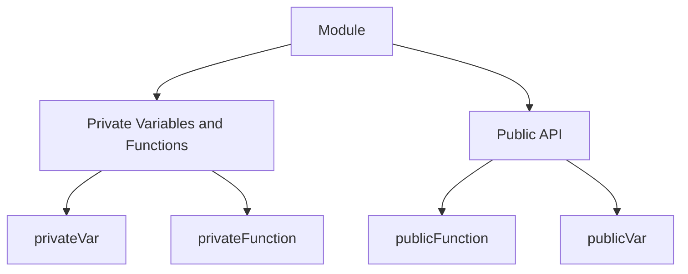

## 35.2 The Revealing Module Pattern

In the world of JavaScript, organizing code into manageable, reusable, and maintainable units is crucial. One of the design patterns that help achieve this is the **Revealing Module Pattern**. This pattern builds upon the traditional module pattern, providing a more intuitive and clear way to manage the visibility of functions and variables within a module. Let's dive deep into understanding how this pattern works, its benefits, and how it can be implemented effectively in your JavaScript projects.

### Understanding the Module Pattern

Before we delve into the revealing module pattern, it's important to understand the traditional module pattern. The module pattern is a design pattern used to encapsulate code within a function scope, allowing for private and public access to variables and methods. This is achieved by returning an object that exposes only the parts of the module you want to be public.

#### Basic Module Pattern Example

```javascript
var myModule = (function() {
    var privateVar = "I am private";

    function privateFunction() {
        console.log(privateVar);
    }

    return {
        publicMethod: function() {
            privateFunction();
        }
    };
})();

myModule.publicMethod(); // Outputs: I am private
```

In this example, `privateVar` and `privateFunction` are not accessible from outside the module, ensuring encapsulation. Only `publicMethod` is exposed, which internally calls `privateFunction`.

### Introducing the Revealing Module Pattern

The **Revealing Module Pattern** is an extension of the module pattern. It aims to improve the readability and structure of your code by clearly defining which variables and methods are public and which are private. This is achieved by returning an object that maps public names to private functions and variables.

#### Revealing Module Pattern Example

```javascript
var myRevealingModule = (function() {
    var privateVar = "I am private";
    var publicVar = "I am public";

    function privateFunction() {
        console.log(privateVar);
    }

    function publicFunction() {
        privateFunction();
    }

    return {
        publicFunction: publicFunction,
        publicVar: publicVar
    };
})();

myRevealingModule.publicFunction(); // Outputs: I am private
console.log(myRevealingModule.publicVar); // Outputs: I am public
```

In this example, `publicFunction` and `publicVar` are exposed, while `privateVar` and `privateFunction` remain private. The revealing module pattern makes it clear which parts of the module are intended for public use.

### Structuring Modules for Clear API Exposure

The key to the revealing module pattern is its ability to clearly define the public API of a module. By using this pattern, you can ensure that your code is easy to read and maintain, as the public and private parts of the module are clearly separated.

#### Step-by-Step Guide to Implementing the Revealing Module Pattern

1. **Define Private Variables and Functions**: Start by defining all the variables and functions that should remain private within the module.

2. **Define Public Variables and Functions**: Create variables and functions that should be accessible from outside the module.

3. **Return an Object Mapping Public Names to Private Members**: Use an object literal to map public names to their corresponding private members.

4. **Ensure Consistency**: Make sure that the naming of public and private members is consistent and intuitive.

#### Example: A Revealing Module for a Counter

```javascript
var counterModule = (function() {
    var count = 0;

    function increment() {
        count++;
    }

    function decrement() {
        count--;
    }

    function getCount() {
        return count;
    }

    return {
        increment: increment,
        decrement: decrement,
        getCount: getCount
    };
})();

counterModule.increment();
counterModule.increment();
console.log(counterModule.getCount()); // Outputs: 2
counterModule.decrement();
console.log(counterModule.getCount()); // Outputs: 1
```

In this example, the `counterModule` exposes `increment`, `decrement`, and `getCount` methods, while the `count` variable remains private.

### Advantages of the Revealing Module Pattern

The revealing module pattern offers several advantages that make it a preferred choice for many developers:

1. **Clarity and Readability**: By explicitly defining which parts of the module are public, the code becomes more readable and easier to understand.

2. **Ease of Maintenance**: With a clear separation between public and private members, maintaining and updating the code becomes simpler.

3. **Encapsulation**: The pattern ensures that private data is not accessible from outside the module, protecting it from unintended modifications.

4. **Consistent API**: The pattern encourages a consistent and intuitive API, making it easier for other developers to use the module.

5. **Improved Debugging**: By keeping the public API clear, debugging becomes easier as you know exactly which parts of the module can be accessed externally.

### Contrasting the Module Pattern with the Revealing Module Pattern

While both the module pattern and the revealing module pattern aim to encapsulate code and manage visibility, there are some key differences:

- **Explicitness**: The revealing module pattern is more explicit in defining the public API, making it easier to understand which parts of the module are intended for external use.

- **Consistency**: The revealing module pattern encourages a consistent naming convention for public and private members, improving code readability.

- **Ease of Refactoring**: With a clear separation between public and private members, refactoring becomes easier, as you can confidently make changes to private members without affecting the public API.

#### Example: Comparing the Two Patterns

**Module Pattern**

```javascript
var myModule = (function() {
    var privateVar = "I am private";

    function privateFunction() {
        console.log(privateVar);
    }

    return {
        publicMethod: function() {
            privateFunction();
        }
    };
})();
```

**Revealing Module Pattern**

```javascript
var myRevealingModule = (function() {
    var privateVar = "I am private";

    function privateFunction() {
        console.log(privateVar);
    }

    function publicMethod() {
        privateFunction();
    }

    return {
        publicMethod: publicMethod
    };
})();
```

In the revealing module pattern, the public API is clearly defined by returning an object that maps public names to private members, improving readability and maintainability.

### Encouraging Consistent Use of Patterns for Team Collaboration

When working in a team, consistency in code structure and design patterns is crucial for collaboration and code quality. The revealing module pattern provides a clear and consistent way to define modules, making it easier for team members to understand and work with the code.

#### Best Practices for Using the Revealing Module Pattern in Teams

1. **Establish Naming Conventions**: Agree on a consistent naming convention for public and private members to ensure clarity and consistency across the codebase.

2. **Document Public APIs**: Clearly document the public API of each module, including the purpose and usage of each public member.

3. **Review Code Regularly**: Conduct regular code reviews to ensure that the revealing module pattern is being used consistently and correctly.

4. **Encourage Refactoring**: Encourage team members to refactor code to use the revealing module pattern where appropriate, improving code quality and maintainability.

5. **Provide Training and Resources**: Offer training and resources to help team members understand and implement the revealing module pattern effectively.

### Visualizing the Revealing Module Pattern

To better understand how the revealing module pattern works, let's visualize the structure of a module using a diagram.



**Diagram Description**: This diagram illustrates the structure of a module using the revealing module pattern. The module contains private variables and functions (`privateVar` and `privateFunction`) and a public API that exposes `publicFunction` and `publicVar`.

### Try It Yourself

Now that we've explored the revealing module pattern, it's time to try it yourself. Use the following code as a starting point and experiment with creating your own modules.

```javascript
var myCustomModule = (function() {
    var secret = "This is a secret";
    var exposed = "This is exposed";

    function secretFunction() {
        console.log(secret);
    }

    function exposedFunction() {
        secretFunction();
    }

    return {
        exposedFunction: exposedFunction,
        exposed: exposed
    };
})();

myCustomModule.exposedFunction(); // Outputs: This is a secret
console.log(myCustomModule.exposed); // Outputs: This is exposed
```

**Suggested Modifications**:
- Add more private and public members to the module.
- Create a module that manages a list of items, with methods to add, remove, and display items.
- Experiment with different naming conventions for public and private members.

### References and Further Reading

- [MDN Web Docs: JavaScript Modules](https://developer.mozilla.org/en-US/docs/Web/JavaScript/Guide/Modules)
- [W3Schools: JavaScript Modules](https://www.w3schools.com/js/js_modules.asp)
- [JavaScript Design Patterns](https://addyosmani.com/resources/essentialjsdesignpatterns/book/)

### Knowledge Check

Let's reinforce what we've learned with some questions and exercises.

1. **What is the main advantage of using the revealing module pattern over the traditional module pattern?**

2. **Create a module using the revealing module pattern that manages a simple to-do list.**

3. **Explain how the revealing module pattern improves code readability and maintainability.**

4. **What are some best practices for using the revealing module pattern in a team environment?**

5. **Visualize the structure of a module using the revealing module pattern.**

### Embrace the Journey

Remember, mastering design patterns like the revealing module pattern is a journey. As you continue to learn and experiment, you'll become more confident in your ability to write clean, maintainable, and efficient code. Keep exploring, stay curious, and enjoy the process of becoming a JavaScript expert!

## Quiz Time!



### What is the primary purpose of the revealing module pattern?

- [x] To clearly define which parts of a module are public and which are private.
- [ ] To make all variables and functions within a module public.
- [ ] To hide all functionality within a module.
- [ ] To automatically generate module documentation.

> **Explanation:** The revealing module pattern is designed to clearly define the public and private parts of a module, improving code readability and maintainability.

### Which of the following is a key advantage of the revealing module pattern?

- [x] Improved code readability and maintainability.
- [ ] Automatic error handling.
- [ ] Faster execution speed.
- [ ] Built-in security features.

> **Explanation:** The revealing module pattern improves code readability and maintainability by clearly defining the public API of a module.

### In the revealing module pattern, how are public members defined?

- [x] By returning an object that maps public names to private members.
- [ ] By declaring them at the top of the module.
- [ ] By using a special keyword.
- [ ] By listing them in a separate file.

> **Explanation:** Public members are defined by returning an object that maps public names to their corresponding private members.

### What is the main difference between the module pattern and the revealing module pattern?

- [x] The revealing module pattern explicitly defines the public API, while the module pattern does not.
- [ ] The module pattern is only used in Node.js.
- [ ] The revealing module pattern is faster.
- [ ] The module pattern requires more code.

> **Explanation:** The revealing module pattern explicitly defines the public API, making it clearer which parts of the module are intended for external use.

### How does the revealing module pattern help in team collaboration?

- [x] By providing a consistent and clear structure for modules.
- [ ] By automatically merging code changes.
- [ ] By generating team reports.
- [ ] By enforcing coding standards.

> **Explanation:** The revealing module pattern provides a consistent and clear structure for modules, making it easier for team members to understand and work with the code.

### What should be included in the return statement of a revealing module pattern?

- [x] An object mapping public names to private members.
- [ ] A list of all variables in the module.
- [ ] A function that initializes the module.
- [ ] A string describing the module.

> **Explanation:** The return statement should include an object mapping public names to their corresponding private members.

### Which of the following is a best practice when using the revealing module pattern?

- [x] Establishing consistent naming conventions for public and private members.
- [ ] Making all variables public by default.
- [ ] Avoiding the use of private functions.
- [ ] Using global variables for module data.

> **Explanation:** Establishing consistent naming conventions for public and private members is a best practice to ensure clarity and consistency.

### What is a common use case for the revealing module pattern?

- [x] Encapsulating functionality and exposing a clear API.
- [ ] Creating global variables.
- [ ] Automatically generating user interfaces.
- [ ] Performing complex mathematical calculations.

> **Explanation:** The revealing module pattern is commonly used to encapsulate functionality and expose a clear API.

### True or False: The revealing module pattern can help prevent unintended modifications to private data.

- [x] True
- [ ] False

> **Explanation:** True. The revealing module pattern helps prevent unintended modifications to private data by keeping it inaccessible from outside the module.

### What is a potential challenge when using the revealing module pattern?

- [x] Ensuring that all team members understand and consistently apply the pattern.
- [ ] Generating documentation automatically.
- [ ] Improving execution speed.
- [ ] Creating global variables.

> **Explanation:** A potential challenge is ensuring that all team members understand and consistently apply the pattern, as consistency is key to its effectiveness.


