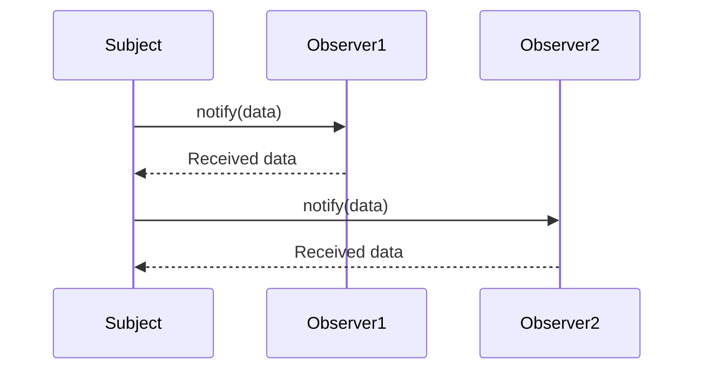

## 35.3 The Observer Pattern

Welcome to the exciting world of the Observer Pattern in JavaScript! In this section, we will explore how this powerful design pattern can help you create responsive, event-driven applications. By the end of this chapter, you'll have a solid understanding of how to implement the Observer Pattern using JavaScript functions, and you'll be ready to apply it to real-world scenarios.

### Introduction to the Observer Pattern

The Observer Pattern is a fundamental design pattern in software development, particularly useful in event-driven programming. It allows an object, known as the "subject," to maintain a list of dependents, called "observers," and notify them automatically of any state changes, usually by calling one of their methods. This pattern is widely used in scenarios where a change in one part of an application needs to be reflected in another part.

#### Key Concepts

- **Subject**: The object that holds the state and notifies observers of changes.
- **Observer**: The object that wants to be informed about changes in the subject.
- **Decoupling**: The Observer Pattern promotes loose coupling between the subject and observers, allowing them to operate independently.

### Why Use the Observer Pattern?

The Observer Pattern is particularly useful in scenarios where:

- **UI Updates**: When a data model changes, the UI needs to update to reflect the new state.
- **Notification Systems**: Observers can be notified of events such as new messages or alerts.
- **Data Binding**: Automatically update data views when the underlying data changes.

By using the Observer Pattern, you can create applications that are more modular, easier to maintain, and responsive to changes.

### Implementing the Observer Pattern in JavaScript

Let's dive into how we can implement the Observer Pattern in JavaScript. We'll start with a simple example to illustrate the core concepts.

#### Step 1: Define the Subject

The subject is responsible for maintaining a list of observers and notifying them of any changes. Here's how you can define a simple subject in JavaScript:

```javascript
class Subject {
  constructor() {
    this.observers = []; // Array to hold observer functions
  }

  // Method to add an observer
  addObserver(observer) {
    this.observers.push(observer);
  }

  // Method to remove an observer
  removeObserver(observer) {
    this.observers = this.observers.filter(obs => obs !== observer);
  }

  // Method to notify all observers
  notifyObservers(data) {
    this.observers.forEach(observer => observer(data));
  }
}
```

In this implementation, the `Subject` class maintains an array of observers and provides methods to add, remove, and notify observers.

#### Step 2: Define the Observer

Observers are functions that will be called when the subject's state changes. Here's how you can define a simple observer:

```javascript
function observer1(data) {
  console.log(`Observer 1: Received data - ${data}`);
}

function observer2(data) {
  console.log(`Observer 2: Received data - ${data}`);
}
```

These observer functions simply log the received data to the console.

#### Step 3: Using the Observer Pattern

Now that we have defined our subject and observers, let's see how they work together:

```javascript
// Create a new subject
const subject = new Subject();

// Add observers to the subject
subject.addObserver(observer1);
subject.addObserver(observer2);

// Notify observers with some data
subject.notifyObservers('Hello, Observers!');

// Remove an observer
subject.removeObserver(observer1);

// Notify observers again
subject.notifyObservers('Observer 1 has been removed.');
```

In this example, we create a `Subject` instance, add two observers, and notify them with some data. We then remove one observer and notify the remaining observers again.

### Visualizing the Observer Pattern

To better understand how the Observer Pattern works, let's visualize the interaction between the subject and observers using a sequence diagram.



**Diagram Description**: This sequence diagram illustrates the process of notifying observers. The `Subject` calls the `notify` method on each observer, and the observers receive the data.

### Use Cases for the Observer Pattern

The Observer Pattern is versatile and can be applied to various scenarios. Let's explore some common use cases:

#### UI Updates

In modern web applications, the UI often needs to update in response to changes in the underlying data model. The Observer Pattern can facilitate this by allowing UI components to observe changes in the data model and update themselves accordingly.

**Example**: A shopping cart application where the total price updates automatically when items are added or removed.

#### Notification Systems

Notification systems, such as email alerts or push notifications, can benefit from the Observer Pattern. Observers can be notified of new messages or alerts, allowing them to take appropriate action.

**Example**: A chat application where users receive notifications when new messages arrive.

#### Data Binding

In data-driven applications, data binding is a common requirement. The Observer Pattern can be used to automatically update data views when the underlying data changes.

**Example**: A dashboard application where charts update in real-time as new data is received.

### Importance of Decoupling

One of the key benefits of the Observer Pattern is decoupling. By separating the subject and observers, you can change one without affecting the other. This makes your code more flexible and easier to maintain.

#### Benefits of Decoupling

- **Modularity**: Components can be developed and tested independently.
- **Reusability**: Observers can be reused across different subjects.
- **Scalability**: New observers can be added without modifying the subject.

### Advanced Observer Pattern Concepts

Now that we have covered the basics, let's explore some advanced concepts related to the Observer Pattern.

#### Handling Multiple Events

In real-world applications, a subject may need to notify observers of different types of events. You can extend the Observer Pattern to handle multiple events by categorizing observers based on the events they are interested in.

**Example**: A weather application where observers are interested in different weather conditions such as temperature, humidity, and wind speed.

```javascript
class AdvancedSubject {
  constructor() {
    this.observers = {};
  }

  addObserver(eventType, observer) {
    if (!this.observers[eventType]) {
      this.observers[eventType] = [];
    }
    this.observers[eventType].push(observer);
  }

  removeObserver(eventType, observer) {
    if (this.observers[eventType]) {
      this.observers[eventType] = this.observers[eventType].filter(obs => obs !== observer);
    }
  }

  notifyObservers(eventType, data) {
    if (this.observers[eventType]) {
      this.observers[eventType].forEach(observer => observer(data));
    }
  }
}
```

In this implementation, the `AdvancedSubject` class maintains a dictionary of observers categorized by event type.

#### Asynchronous Notifications

In some cases, you may want to notify observers asynchronously, especially if the notification involves time-consuming operations. You can achieve this by using JavaScript's asynchronous features such as promises or async/await.

**Example**: A stock market application where observers are notified of price changes asynchronously.

```javascript
class AsyncSubject {
  constructor() {
    this.observers = [];
  }

  addObserver(observer) {
    this.observers.push(observer);
  }

  async notifyObservers(data) {
    for (const observer of this.observers) {
      await observer(data);
    }
  }
}

async function asyncObserver(data) {
  console.log(`Async Observer: Processing data - ${data}`);
  // Simulate a time-consuming operation
  return new Promise(resolve => setTimeout(resolve, 1000));
}

const asyncSubject = new AsyncSubject();
asyncSubject.addObserver(asyncObserver);
asyncSubject.notifyObservers('Async Data');
```

In this example, the `AsyncSubject` class notifies observers asynchronously using the `await` keyword.

### Try It Yourself

Now that you've learned about the Observer Pattern, it's time to experiment! Here are some suggestions to modify the code examples and see how they work:

- **Add More Observers**: Create additional observer functions and add them to the subject.
- **Handle Multiple Events**: Extend the `AdvancedSubject` class to handle different event types.
- **Implement Asynchronous Notifications**: Modify the `AsyncSubject` class to notify observers asynchronously.

### References and Further Reading

To deepen your understanding of the Observer Pattern and event-driven programming, consider exploring the following resources:

- [MDN Web Docs: Observer Pattern](https://developer.mozilla.org/en-US/docs/Web/JavaScript/Guide/Design_Patterns#observer_pattern)
- [W3Schools: JavaScript Events](https://www.w3schools.com/js/js_events.asp)
- [Refactoring Guru: Observer Pattern](https://refactoring.guru/design-patterns/observer)

### Knowledge Check

Let's reinforce what you've learned with some questions and exercises:

1. **What is the main purpose of the Observer Pattern?**
2. **How does the Observer Pattern promote decoupling?**
3. **Implement a simple observer pattern for a chat application.**
4. **What are some real-world use cases for the Observer Pattern?**
5. **How can you handle multiple events in the Observer Pattern?**

### Embrace the Journey

Remember, this is just the beginning of your journey with the Observer Pattern and event-driven programming. As you progress, you'll build more complex and interactive applications. Keep experimenting, stay curious, and enjoy the journey!

## Quiz Time!



### What is the primary role of the Observer Pattern in software design?

- [x] To allow objects to observe and react to changes in other objects
- [ ] To enforce strict coupling between components
- [ ] To simplify data storage
- [ ] To manage memory allocation

> **Explanation:** The Observer Pattern enables objects to observe and react to changes in other objects, promoting loose coupling.

### Which of the following best describes the concept of "decoupling" in the Observer Pattern?

- [x] Separating the subject and observers to allow independent changes
- [ ] Combining the subject and observers into a single unit
- [ ] Ensuring observers are tightly linked to the subject
- [ ] Using a single observer for multiple subjects

> **Explanation:** Decoupling involves separating the subject and observers, allowing them to change independently.

### In the Observer Pattern, what is the role of the "subject"?

- [x] To maintain a list of observers and notify them of changes
- [ ] To perform calculations and return results
- [ ] To store data persistently
- [ ] To handle user input directly

> **Explanation:** The subject maintains a list of observers and notifies them of any changes.

### How can you implement asynchronous notifications in the Observer Pattern using JavaScript?

- [x] By using async/await or promises in the notification process
- [ ] By using synchronous loops
- [ ] By storing notifications in a database
- [ ] By using global variables

> **Explanation:** Asynchronous notifications can be implemented using async/await or promises to handle time-consuming operations.

### Which of the following is a common use case for the Observer Pattern?

- [x] UI updates in response to data changes
- [ ] Direct database manipulation
- [ ] Static web page rendering
- [ ] File system operations

> **Explanation:** The Observer Pattern is commonly used for UI updates in response to data changes.

### What is a key benefit of using the Observer Pattern in software design?

- [x] It promotes modularity and reusability of components
- [ ] It increases the complexity of the codebase
- [ ] It limits the number of components in an application
- [ ] It enforces a single-threaded execution model

> **Explanation:** The Observer Pattern promotes modularity and reusability by decoupling components.

### How can you handle multiple events in the Observer Pattern?

- [x] By categorizing observers based on the events they are interested in
- [ ] By using a single observer for all events
- [ ] By storing events in a global variable
- [ ] By using synchronous loops

> **Explanation:** Handling multiple events can be achieved by categorizing observers based on their interests.

### What is the main advantage of decoupling in the Observer Pattern?

- [x] It allows components to be developed and tested independently
- [ ] It reduces the number of components in an application
- [ ] It enforces a single-threaded execution model
- [ ] It increases the complexity of the codebase

> **Explanation:** Decoupling allows components to be developed and tested independently, enhancing flexibility.

### Which JavaScript feature can be used to implement asynchronous notifications in the Observer Pattern?

- [x] Promises and async/await
- [ ] Global variables
- [ ] Synchronous loops
- [ ] Direct database manipulation

> **Explanation:** Promises and async/await are used to implement asynchronous notifications in JavaScript.

### True or False: The Observer Pattern is only useful for UI-related applications.

- [ ] True
- [x] False

> **Explanation:** The Observer Pattern is versatile and can be applied to various scenarios beyond UI-related applications.




