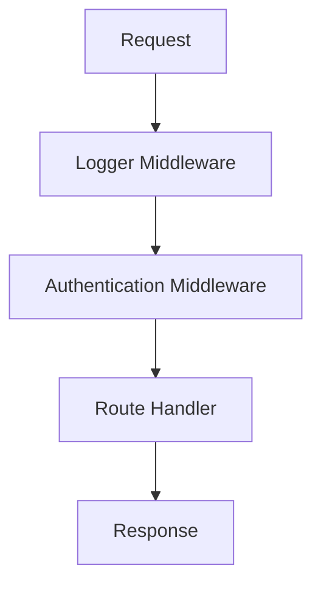

## 35.4 The Middleware Pattern

In the world of software development, particularly in web applications, the middleware pattern is a powerful design concept that allows developers to process inputs in a pipeline. This pattern is widely used in server frameworks like Express.js and state management libraries such as Redux. In this section, we will explore the middleware pattern, understand how functions can be chained to handle requests or data processing, and discuss the benefits of modular and reusable code segments. We will also emphasize error handling and flow control within middleware functions.

### Understanding the Middleware Pattern

The middleware pattern is essentially a series of functions that are executed in sequence. Each function, or middleware, has the opportunity to process the input, modify it, and pass it along to the next function in the chain. This pattern is particularly useful for handling HTTP requests in web servers, where each middleware function can perform a specific task such as logging, authentication, or data validation.

#### Key Concepts

- **Pipeline**: A sequence of functions that process data step-by-step.
- **Chaining**: The process of linking functions together so that the output of one function becomes the input of the next.
- **Modularity**: Breaking down functionality into smaller, reusable pieces.
- **Reusability**: The ability to use the same middleware function in different parts of an application.
- **Flow Control**: Managing the sequence and conditions under which middleware functions are executed.

### Middleware in Express.js

Express.js, a popular web application framework for Node.js, heavily relies on the middleware pattern. In Express, middleware functions can perform a variety of tasks such as executing code, making changes to the request and response objects, ending the request-response cycle, and calling the next middleware function in the stack.

#### Basic Middleware Example in Express.js

Let's start with a simple example of middleware in an Express.js application:

```javascript
const express = require('express');
const app = express();

// A simple logging middleware
function logger(req, res, next) {
  console.log(`${req.method} ${req.url}`);
  next(); // Pass control to the next middleware
}

// Use the logger middleware
app.use(logger);

app.get('/', (req, res) => {
  res.send('Hello, World!');
});

app.listen(3000, () => {
  console.log('Server is running on port 3000');
});
```

**Explanation:**

- **Logger Middleware**: This middleware logs the HTTP method and URL of each incoming request.
- **`next()` Function**: This function is crucial in middleware. It passes control to the next middleware function in the stack. If `next()` is not called, the request will hang and not proceed to the next middleware or route handler.

#### Chaining Multiple Middleware Functions

Middleware functions can be chained to perform multiple tasks. Here’s an example of chaining middleware functions in Express.js:

```javascript
const express = require('express');
const app = express();

// Middleware for logging
function logger(req, res, next) {
  console.log(`${req.method} ${req.url}`);
  next();
}

// Middleware for authentication
function authenticate(req, res, next) {
  if (req.headers.authorization) {
    console.log('Authenticated');
    next();
  } else {
    res.status(401).send('Unauthorized');
  }
}

// Use the middleware
app.use(logger);
app.use(authenticate);

app.get('/', (req, res) => {
  res.send('Hello, Authenticated User!');
});

app.listen(3000, () => {
  console.log('Server is running on port 3000');
});
```

**Explanation:**

- **Authentication Middleware**: This middleware checks for an `authorization` header. If present, it logs "Authenticated" and calls `next()`. Otherwise, it sends a 401 Unauthorized response.
- **Order Matters**: The order in which middleware functions are declared is important. The logger middleware runs first, followed by the authentication middleware.

### Middleware in Redux

Redux, a state management library for JavaScript applications, also utilizes the middleware pattern. In Redux, middleware provides a third-party extension point between dispatching an action and the moment it reaches the reducer.

#### Basic Middleware Example in Redux

Let's look at a simple example of middleware in a Redux application:

```javascript
const { createStore, applyMiddleware } = require('redux');

// A simple reducer
function reducer(state = {}, action) {
  switch (action.type) {
    case 'INCREMENT':
      return { count: state.count + 1 };
    default:
      return state;
  }
}

// A logging middleware
const logger = store => next => action => {
  console.log('Dispatching:', action);
  let result = next(action);
  console.log('Next State:', store.getState());
  return result;
};

// Create a Redux store with the logger middleware
const store = createStore(reducer, applyMiddleware(logger));

// Dispatch an action
store.dispatch({ type: 'INCREMENT' });
```

**Explanation:**

- **Logger Middleware**: This middleware logs the action being dispatched and the next state after the action is processed.
- **Middleware Signature**: In Redux, middleware is a function that returns a function that returns a function. This allows middleware to intercept actions and perform tasks before passing them to the reducer.

### Benefits of Middleware

The middleware pattern offers several benefits:

- **Modularity**: Middleware functions encapsulate specific functionality, making it easier to manage and maintain code.
- **Reusability**: Middleware can be reused across different parts of an application, reducing code duplication.
- **Separation of Concerns**: Each middleware function handles a specific task, promoting clean and organized code.
- **Flexibility**: Middleware can be easily added, removed, or reordered to change the behavior of an application.
- **Error Handling**: Middleware can be used to catch and handle errors, ensuring that the application remains robust and reliable.

### Error Handling in Middleware

Error handling is a crucial aspect of middleware. In Express.js, error-handling middleware functions have a special signature with four arguments: `err`, `req`, `res`, and `next`. This allows them to catch and handle errors that occur in the application.

#### Error Handling Middleware Example

Here's an example of error-handling middleware in Express.js:

```javascript
const express = require('express');
const app = express();

// Middleware that throws an error
function errorProneMiddleware(req, res, next) {
  const error = new Error('Something went wrong!');
  next(error); // Pass the error to the next middleware
}

// Error-handling middleware
function errorHandler(err, req, res, next) {
  console.error(err.message);
  res.status(500).send('Internal Server Error');
}

// Use the middleware
app.use(errorProneMiddleware);
app.use(errorHandler);

app.listen(3000, () => {
  console.log('Server is running on port 3000');
});
```

**Explanation:**

- **Error-Prone Middleware**: This middleware simulates an error by creating an `Error` object and passing it to `next()`.
- **Error Handler**: This middleware catches the error, logs the error message, and sends a 500 Internal Server Error response.

### Flow Control in Middleware

Flow control is an important aspect of middleware. Middleware functions can decide whether to pass control to the next function or terminate the request-response cycle.

#### Flow Control Example

Here's an example of flow control in middleware:

```javascript
const express = require('express');
const app = express();

// Middleware for checking query parameters
function checkQuery(req, res, next) {
  if (req.query.token) {
    next(); // Pass control to the next middleware
  } else {
    res.status(400).send('Bad Request: Missing token');
  }
}

// Use the middleware
app.use(checkQuery);

app.get('/', (req, res) => {
  res.send('Token is present');
});

app.listen(3000, () => {
  console.log('Server is running on port 3000');
});
```

**Explanation:**

- **Check Query Middleware**: This middleware checks for the presence of a `token` query parameter. If present, it calls `next()` to pass control to the next middleware. Otherwise, it sends a 400 Bad Request response.

### Try It Yourself

To get hands-on experience with the middleware pattern, try modifying the code examples above:

- **Add a new middleware function** that logs the time of each request.
- **Create a middleware function** that checks for a specific header and sends a custom response if it's missing.
- **Experiment with the order** of middleware functions to see how it affects the application's behavior.

### Visualizing Middleware Flow

To better understand how middleware functions are executed in sequence, let's visualize the flow using a Mermaid.js diagram:



**Diagram Explanation:**

- **Request**: The incoming HTTP request.
- **Logger Middleware**: The first middleware function that logs the request details.
- **Authentication Middleware**: The second middleware function that checks for authentication.
- **Route Handler**: The final function that handles the request and sends a response.
- **Response**: The outgoing HTTP response.

### References and Links

For further reading on the middleware pattern and its applications, check out the following resources:

- [Express.js Middleware](https://expressjs.com/en/guide/using-middleware.html) - Official Express.js documentation on middleware.
- [Redux Middleware](https://redux.js.org/advanced/middleware) - Official Redux documentation on middleware.
- [MDN Web Docs: Middleware](https://developer.mozilla.org/en-US/docs/Glossary/Middleware) - General overview of middleware.

### Knowledge Check

To reinforce your understanding of the middleware pattern, consider the following questions:

- What is the purpose of the `next()` function in middleware?
- How does the order of middleware functions affect the behavior of an application?
- What are some common tasks that middleware functions can perform?
- How can middleware be used to handle errors in an application?

### Embrace the Journey

Remember, mastering the middleware pattern is just one step in your journey to becoming a proficient JavaScript developer. As you continue to learn and experiment, you'll discover new ways to leverage this powerful pattern in your applications. Keep exploring, stay curious, and enjoy the process!

## Quiz Time!



### What is the primary purpose of middleware in a web application?

- [x] To process requests in a pipeline
- [ ] To handle database operations
- [ ] To render HTML pages
- [ ] To manage user sessions

> **Explanation:** Middleware processes requests in a pipeline, allowing for tasks like logging, authentication, and data validation.

### In Express.js, what does the `next()` function do in a middleware function?

- [x] Passes control to the next middleware function
- [ ] Terminates the request-response cycle
- [ ] Sends a response to the client
- [ ] Modifies the request object

> **Explanation:** The `next()` function passes control to the next middleware function in the stack.

### How can middleware functions be reused across different parts of an application?

- [x] By defining them as separate functions and using them in multiple routes
- [ ] By copying and pasting them into each route
- [ ] By writing them inline within each route
- [ ] By using global variables

> **Explanation:** Middleware functions can be defined separately and reused across different routes for modularity and reusability.

### What is a common use case for middleware in Redux?

- [x] To intercept actions before they reach the reducer
- [ ] To manage state updates directly
- [ ] To render components
- [ ] To handle HTTP requests

> **Explanation:** In Redux, middleware intercepts actions before they reach the reducer, allowing for tasks like logging and asynchronous operations.

### Which of the following is a benefit of using middleware?

- [x] Modularity
- [x] Reusability
- [ ] Increased complexity
- [ ] Slower performance

> **Explanation:** Middleware offers benefits like modularity and reusability, making code easier to manage and maintain.

### What is the role of error-handling middleware in Express.js?

- [x] To catch and handle errors that occur in the application
- [ ] To log all incoming requests
- [ ] To authenticate users
- [ ] To render HTML pages

> **Explanation:** Error-handling middleware catches and handles errors, ensuring the application remains robust.

### How does the order of middleware functions affect an Express.js application?

- [x] It determines the sequence in which middleware functions are executed
- [ ] It has no effect on the application's behavior
- [ ] It only affects error-handling middleware
- [ ] It changes the server's port number

> **Explanation:** The order of middleware functions determines the sequence in which they are executed, affecting the application's behavior.

### What is a key feature of middleware in Redux?

- [x] It is a function that returns a function that returns a function
- [ ] It directly updates the state
- [ ] It renders components
- [ ] It handles HTTP requests

> **Explanation:** Middleware in Redux is a function that returns a function that returns a function, allowing it to intercept actions.

### True or False: Middleware can be used to terminate the request-response cycle in Express.js.

- [x] True
- [ ] False

> **Explanation:** Middleware can terminate the request-response cycle by sending a response to the client without calling `next()`.

### What is the purpose of flow control in middleware?

- [x] To manage the sequence and conditions under which middleware functions are executed
- [ ] To handle database operations
- [ ] To render HTML pages
- [ ] To manage user sessions

> **Explanation:** Flow control manages the sequence and conditions under which middleware functions are executed, ensuring the correct processing of requests.


