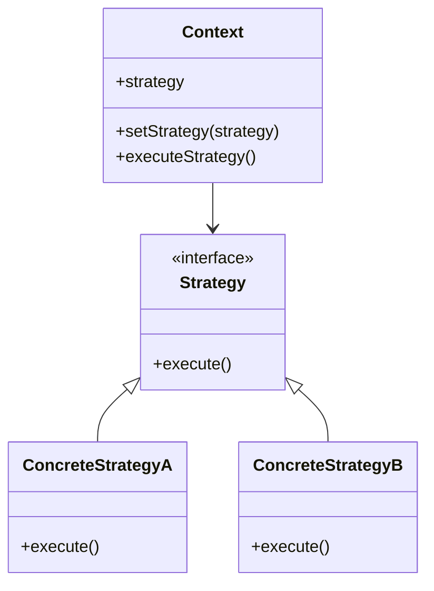

## 35.5 The Strategy Pattern

In the world of software development, flexibility and adaptability are key to building robust and scalable applications. One design pattern that embodies these principles is the Strategy Pattern. In this section, we will explore the Strategy Pattern in JavaScript, learn how it allows us to swap algorithms at runtime, and understand its benefits in terms of maintainability and scalability.

### What is the Strategy Pattern?

The Strategy Pattern is a behavioral design pattern that enables selecting an algorithm's behavior at runtime. Instead of implementing a single algorithm directly, code receives runtime instructions on which in a family of algorithms to use. This pattern is particularly useful when you have multiple ways to perform a task and want to choose the most appropriate one based on certain conditions.

#### Key Concepts

- **Strategy**: The family of algorithms that can be swapped at runtime.
- **Context**: The object that uses a Strategy to perform its behavior.
- **Encapsulation**: Each algorithm is encapsulated in its own class or function, promoting separation of concerns.

### Why Use the Strategy Pattern?

The Strategy Pattern promotes flexibility by allowing the behavior of a system to be changed at runtime. This is particularly useful in scenarios where different algorithms are needed based on varying conditions. Here are some advantages:

- **Maintainability**: By encapsulating algorithms, changes to one algorithm do not affect others.
- **Scalability**: New algorithms can be added with minimal changes to existing code.
- **Reusability**: Algorithms can be reused across different parts of an application or even in different projects.

### Implementing the Strategy Pattern in JavaScript

JavaScript's first-class functions make it an excellent language for implementing the Strategy Pattern. Let's explore how we can use functions to encapsulate different algorithms and swap them dynamically.

#### Step-by-Step Implementation

1. **Define the Strategy Interface**: Create a common interface for all algorithms. In JavaScript, this can be achieved using functions.

2. **Implement Concrete Strategies**: Define each algorithm as a separate function.

3. **Create the Context**: This is the part of your code that will use the strategy to perform its task.

4. **Switch Strategies at Runtime**: Use conditions to select and execute the appropriate strategy.

#### Example: Payment Processing System

Imagine a payment processing system that supports multiple payment methods such as credit cards, PayPal, and cryptocurrencies. The Strategy Pattern allows us to encapsulate each payment method's algorithm and select the appropriate one based on user choice.

```javascript
// Step 1: Define the Strategy Interface
function creditCardPayment(amount) {
    console.log(`Processing credit card payment of $${amount}`);
}

function paypalPayment(amount) {
    console.log(`Processing PayPal payment of $${amount}`);
}

function cryptoPayment(amount) {
    console.log(`Processing cryptocurrency payment of $${amount}`);
}

// Step 2: Implement Concrete Strategies
const paymentStrategies = {
    creditCard: creditCardPayment,
    paypal: paypalPayment,
    crypto: cryptoPayment
};

// Step 3: Create the Context
function processPayment(amount, strategy) {
    strategy(amount);
}

// Step 4: Switch Strategies at Runtime
const selectedStrategy = paymentStrategies['paypal'];
processPayment(100, selectedStrategy);
```

### Real-World Applications

The Strategy Pattern is widely used in various real-world applications. Let's explore a few scenarios where this pattern can be particularly beneficial.

#### Sorting Algorithms

Sorting is a common task in programming, and different algorithms are suitable for different scenarios. For example, quicksort is efficient for large datasets, while insertion sort is better for small or nearly sorted datasets. By implementing the Strategy Pattern, we can dynamically choose the most efficient sorting algorithm based on the dataset characteristics.

```javascript
// Sorting Strategies
function quickSort(array) {
    console.log('Using quicksort');
    // Implementation of quicksort
}

function insertionSort(array) {
    console.log('Using insertion sort');
    // Implementation of insertion sort
}

// Strategy Selection
const sortingStrategies = {
    quick: quickSort,
    insertion: insertionSort
};

function sortArray(array, strategy) {
    strategy(array);
}

const array = [5, 3, 8, 4, 2];
const selectedSortingStrategy = sortingStrategies['quick'];
sortArray(array, selectedSortingStrategy);
```

#### Game Development

In game development, the Strategy Pattern can be used to implement different behaviors for game characters. For example, a character might have different attack strategies based on its current state or the player's actions.

```javascript
// Attack Strategies
function aggressiveAttack() {
    console.log('Performing aggressive attack');
}

function defensiveAttack() {
    console.log('Performing defensive attack');
}

// Strategy Selection
const attackStrategies = {
    aggressive: aggressiveAttack,
    defensive: defensiveAttack
};

function performAttack(strategy) {
    strategy();
}

const currentStrategy = attackStrategies['aggressive'];
performAttack(currentStrategy);
```

### Advantages of the Strategy Pattern

The Strategy Pattern offers several advantages that make it a valuable tool in software development:

- **Flexibility**: Easily switch between different algorithms without altering the context.
- **Separation of Concerns**: Each algorithm is encapsulated in its own function, promoting clean and organized code.
- **Ease of Testing**: Individual strategies can be tested independently, simplifying the testing process.
- **Extensibility**: New strategies can be added without modifying existing code, making the system scalable.

### Visualizing the Strategy Pattern

To better understand how the Strategy Pattern works, let's visualize the interaction between the context and the strategies.



**Diagram Description**: The diagram illustrates the relationship between the context and the strategies. The context holds a reference to a strategy and can switch between different concrete strategies at runtime.

### Try It Yourself

Now that we've explored the Strategy Pattern, it's time to experiment with it. Try modifying the code examples to implement your own strategies. For instance, create a new payment method or a different sorting algorithm and integrate it into the existing system. This hands-on practice will deepen your understanding and help you apply the pattern in real-world scenarios.

### Knowledge Check

Let's reinforce what we've learned with a few questions:

- What is the main purpose of the Strategy Pattern?
- How does the Strategy Pattern promote flexibility in software design?
- Can you think of a scenario where the Strategy Pattern might not be the best choice?

### Conclusion

The Strategy Pattern is a powerful tool for building flexible and scalable applications. By encapsulating algorithms in separate functions and selecting them at runtime, we can create systems that are easy to maintain and extend. As you continue your journey in JavaScript, consider how the Strategy Pattern can be applied to solve complex problems and enhance your code's flexibility.

Remember, this is just the beginning. As you progress, you'll build more complex and interactive applications. Keep experimenting, stay curious, and enjoy the journey!

## Quiz Time!



### What is the primary purpose of the Strategy Pattern?

- [x] To allow swapping algorithms at runtime
- [ ] To encapsulate data
- [ ] To improve code readability
- [ ] To reduce memory usage

> **Explanation:** The Strategy Pattern is designed to allow the swapping of algorithms at runtime, providing flexibility in choosing the appropriate algorithm for a given situation.

### How does the Strategy Pattern promote maintainability?

- [x] By encapsulating algorithms in separate functions
- [ ] By reducing the number of classes
- [ ] By using fewer variables
- [ ] By simplifying the user interface

> **Explanation:** The Strategy Pattern encapsulates algorithms in separate functions, allowing changes to one algorithm without affecting others, thus promoting maintainability.

### Which of the following is a real-world application of the Strategy Pattern?

- [x] Payment processing systems
- [ ] File compression
- [ ] Image rendering
- [ ] Network communication

> **Explanation:** Payment processing systems often use the Strategy Pattern to handle different payment methods dynamically.

### What is a key advantage of using the Strategy Pattern?

- [x] Flexibility in algorithm selection
- [ ] Reduced code size
- [ ] Faster execution speed
- [ ] Improved graphics rendering

> **Explanation:** The Strategy Pattern provides flexibility by allowing different algorithms to be selected and used at runtime.

### In the Strategy Pattern, what role does the context play?

- [x] It uses a strategy to perform its behavior
- [ ] It defines the algorithms
- [ ] It selects the user interface
- [ ] It manages memory allocation

> **Explanation:** The context is the part of the code that uses a strategy to perform its behavior, allowing for dynamic algorithm selection.

### What is encapsulated in the Strategy Pattern?

- [x] Algorithms
- [ ] Data structures
- [ ] User inputs
- [ ] Network protocols

> **Explanation:** In the Strategy Pattern, algorithms are encapsulated in separate functions or classes, promoting separation of concerns.

### Which of the following is NOT a benefit of the Strategy Pattern?

- [ ] Flexibility
- [ ] Maintainability
- [x] Reduced execution time
- [ ] Reusability

> **Explanation:** While the Strategy Pattern offers flexibility, maintainability, and reusability, it does not inherently reduce execution time.

### How can new strategies be added in the Strategy Pattern?

- [x] By defining new functions or classes
- [ ] By modifying existing algorithms
- [ ] By changing the user interface
- [ ] By updating the database

> **Explanation:** New strategies can be added by defining new functions or classes that implement the desired algorithm.

### True or False: The Strategy Pattern is only applicable to sorting algorithms.

- [ ] True
- [x] False

> **Explanation:** False. The Strategy Pattern is applicable to a wide range of scenarios beyond sorting algorithms, such as payment processing, game development, and more.

### Which of the following best describes the Strategy Pattern?

- [x] A design pattern that allows selecting an algorithm's behavior at runtime
- [ ] A pattern for optimizing memory usage
- [ ] A method for improving user interface design
- [ ] A technique for encrypting data

> **Explanation:** The Strategy Pattern is a design pattern that allows selecting an algorithm's behavior at runtime, providing flexibility in how tasks are performed.


