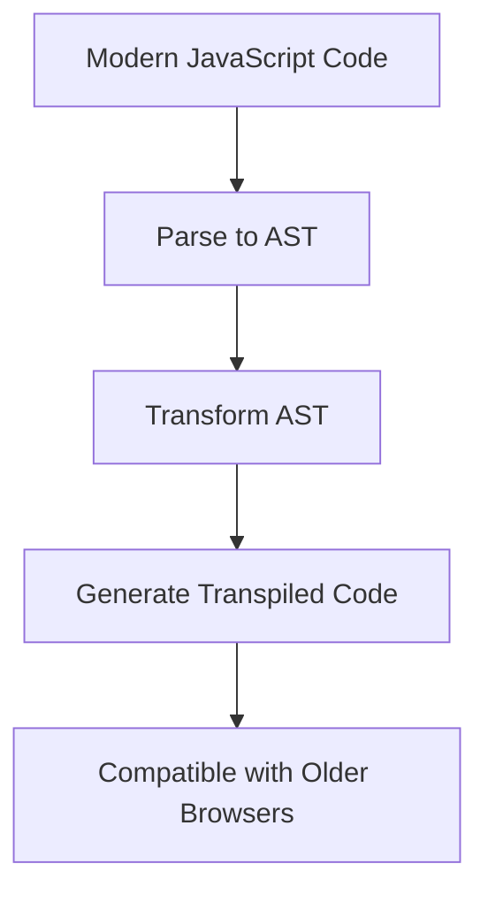

## 36.1 Transpilers and Function Syntax

In the ever-evolving world of web development, staying current with the latest JavaScript features is crucial. However, not all browsers support the latest ECMAScript (ES) standards, which can pose challenges for developers who want to use modern syntax and features. This is where transpilers come into play. In this section, we will explore the concept of transpilation, how tools like Babel convert modern function syntax for compatibility, and the implications of using ES6+ features in your projects.

### What is a Transpiler?

A **transpiler** is a tool that takes source code written in one version of a programming language and transforms it into another version of the same language. In the context of JavaScript, transpilers are used to convert code written in newer ECMAScript standards (like ES6, ES7, etc.) into older versions (such as ES5) that are more widely supported by browsers.

### Why Use a Transpiler?

The primary reason to use a transpiler is to ensure that your JavaScript code runs smoothly across all browsers, including those that do not support the latest ECMAScript features. This allows developers to take advantage of modern syntax and features without worrying about compatibility issues.

### Key Benefits of Using Transpilers

- **Browser Compatibility**: Transpilers ensure that your code runs on older browsers that do not support the latest JavaScript features.
- **Future-Proofing**: By using modern syntax, your codebase remains up-to-date with the latest language standards.
- **Improved Developer Experience**: Modern syntax often leads to cleaner, more readable, and maintainable code.

### Introducing Babel

**Babel** is one of the most popular JavaScript transpilers. It allows developers to write code using the latest ECMAScript features and transpile it into a version that is compatible with older browsers. Babel is highly configurable and supports a wide range of plugins and presets to tailor the transpilation process to your needs.

### How Babel Works

Babel works by parsing your JavaScript code into an Abstract Syntax Tree (AST), transforming the AST to apply the necessary changes, and then generating the transformed code. This process allows Babel to handle complex transformations and ensure that the output code is functionally equivalent to the input code.

### Configuring Babel for Function Syntax Transformation

To use Babel in your project, you need to set it up and configure it to transform modern function syntax. Let's walk through the steps to configure Babel for a typical JavaScript project.

#### Step 1: Install Babel

First, you need to install Babel and its core packages. You can do this using npm (Node Package Manager):

```bash
npm install --save-dev @babel/core @babel/cli @babel/preset-env
```

- `@babel/core`: The core Babel library.
- `@babel/cli`: The command-line interface for Babel.
- `@babel/preset-env`: A preset that allows you to use the latest JavaScript features.

#### Step 2: Create a Babel Configuration File

Create a file named `.babelrc` in the root of your project directory. This file will contain the configuration for Babel.

```json
{
  "presets": ["@babel/preset-env"]
}
```

The `@babel/preset-env` preset automatically determines the necessary transformations and polyfills based on your target environments.

#### Step 3: Transpile Your Code

You can use Babel's CLI to transpile your JavaScript files. For example, to transpile a file named `app.js`, run the following command:

```bash
npx babel app.js --out-file app.transpiled.js
```

This command will transform `app.js` into `app.transpiled.js`, which contains the transpiled code.

### Example: Transpiling Modern Function Syntax

Let's look at an example of how Babel transforms modern function syntax. Consider the following ES6 arrow function:

```javascript
const add = (a, b) => a + b;
```

When transpiled using Babel, this function might be transformed into an ES5-compatible version like this:

```javascript
var add = function(a, b) {
  return a + b;
};
```

As you can see, Babel converts the arrow function into a traditional function expression, ensuring compatibility with older browsers.

### Implications of Using Modern Function Features

Using modern function features like arrow functions, default parameters, and rest/spread syntax can significantly improve the readability and maintainability of your code. However, it's essential to be aware of the implications when using these features in projects that require compatibility with older browsers.

#### Arrow Functions

Arrow functions provide a concise syntax for writing functions and have a lexical `this` binding, which can simplify code that relies on the `this` context. However, they are not supported in older browsers like Internet Explorer.

#### Default Parameters

Default parameters allow you to specify default values for function parameters, making your functions more robust and reducing the need for additional checks. Again, this feature requires transpilation for compatibility with older environments.

#### Rest and Spread Syntax

The rest and spread syntax provides a more flexible way to handle function arguments and array manipulation. These features are part of the ES6 standard and require transpilation for older browsers.

### Staying Current with Language Features and Tooling

As a developer, it's crucial to stay informed about the latest JavaScript features and tooling. The JavaScript ecosystem is constantly evolving, with new features and improvements being introduced regularly. Here are some tips for staying current:

- **Follow ECMAScript Proposals**: Keep an eye on the latest ECMAScript proposals to understand upcoming features.
- **Use Babel Presets**: Babel presets like `@babel/preset-env` automatically handle the latest features, making it easier to stay up-to-date.
- **Regularly Update Dependencies**: Ensure that your project's dependencies, including Babel, are regularly updated to benefit from the latest improvements and security patches.
- **Engage with the Community**: Participate in online forums, attend conferences, and follow influential developers to stay informed about best practices and new tools.

### Try It Yourself

To deepen your understanding of transpilers and function syntax, try the following exercises:

1. **Experiment with Babel**: Set up a small project and experiment with different Babel presets and plugins. Observe how various modern JavaScript features are transpiled.

2. **Modify Transpiled Code**: Take a piece of modern JavaScript code, transpile it using Babel, and then manually modify the transpiled code to see how changes affect functionality.

3. **Explore Babel Plugins**: Explore Babel's extensive plugin ecosystem to see how you can extend its capabilities for specific use cases.

### Visualizing the Transpilation Process

To help you visualize the transpilation process, let's look at a simple diagram that illustrates how Babel transforms your code:



**Diagram Description**: This diagram shows the flow of the transpilation process. Modern JavaScript code is parsed into an Abstract Syntax Tree (AST), transformed, and then generated into transpiled code that is compatible with older browsers.

### References and Further Reading

- [MDN Web Docs: ECMAScript 6 Features](https://developer.mozilla.org/en-US/docs/Web/JavaScript/New_in_JavaScript/ECMAScript_6_support_in_Mozilla)
- [Babel Official Website](https://babeljs.io/)
- [ECMAScript Proposals](https://github.com/tc39/proposals)

### Knowledge Check

Let's reinforce what we've learned with a few questions:

- What is a transpiler, and why is it used in JavaScript development?
- How does Babel help in using modern JavaScript features in projects?
- What are some of the benefits of using modern function syntax?
- How can you configure Babel to transpile modern JavaScript code?
- Why is it important to stay current with JavaScript language features and tooling?

### Embrace the Journey

Remember, learning about transpilers and modern function syntax is just the beginning. As you progress, you'll be able to write more efficient and compatible JavaScript code. Keep experimenting, stay curious, and enjoy the journey!

## Quiz Time!



### What is a transpiler in JavaScript development?

- [x] A tool that converts modern JavaScript code into an older version for compatibility
- [ ] A tool that compiles JavaScript code into machine code
- [ ] A tool that minifies JavaScript code for production
- [ ] A tool that formats JavaScript code for readability

> **Explanation:** A transpiler converts modern JavaScript code into an older version to ensure compatibility with browsers that do not support the latest features.

### Which tool is commonly used for transpiling JavaScript code?

- [x] Babel
- [ ] Webpack
- [ ] ESLint
- [ ] Prettier

> **Explanation:** Babel is a popular tool used to transpile modern JavaScript code into older versions for compatibility.

### What does the `@babel/preset-env` preset do?

- [x] It automatically determines the necessary transformations for target environments
- [ ] It minifies JavaScript code for production
- [ ] It formats JavaScript code for readability
- [ ] It lints JavaScript code for errors

> **Explanation:** The `@babel/preset-env` preset automatically determines the necessary transformations and polyfills based on the target environments specified.

### What is one of the benefits of using modern function syntax?

- [x] Improved readability and maintainability of code
- [ ] Increased file size
- [ ] Slower execution speed
- [ ] Compatibility with all browsers without transpilation

> **Explanation:** Modern function syntax often leads to cleaner, more readable, and maintainable code.

### How can you configure Babel for a project?

- [x] By creating a `.babelrc` file with the necessary presets and plugins
- [ ] By installing Babel globally on your machine
- [ ] By writing all code in ES5 syntax
- [ ] By using only traditional function expressions

> **Explanation:** You configure Babel for a project by creating a `.babelrc` file that specifies the presets and plugins needed for transpilation.

### Why is it important to stay current with JavaScript language features?

- [x] To write efficient and compatible code
- [ ] To increase file size
- [ ] To slow down execution speed
- [ ] To avoid using modern syntax

> **Explanation:** Staying current with JavaScript language features allows you to write efficient, modern, and compatible code.

### What is the purpose of the Abstract Syntax Tree (AST) in Babel?

- [x] To represent the structure of the code for transformation
- [ ] To minify the code for production
- [ ] To format the code for readability
- [ ] To lint the code for errors

> **Explanation:** The AST represents the structure of the code, allowing Babel to apply transformations and generate transpiled code.

### Which JavaScript feature requires transpilation for older browsers?

- [x] Arrow functions
- [ ] Traditional function expressions
- [ ] `var` declarations
- [ ] `for` loops

> **Explanation:** Arrow functions are a modern JavaScript feature that requires transpilation for compatibility with older browsers.

### What does the rest and spread syntax provide?

- [x] A flexible way to handle function arguments and array manipulation
- [ ] A method to minify code
- [ ] A way to format code for readability
- [ ] A tool for linting code

> **Explanation:** The rest and spread syntax provides a more flexible way to handle function arguments and manipulate arrays.

### True or False: Babel can only be used for JavaScript code.

- [ ] True
- [x] False

> **Explanation:** Babel can also be used to transpile other languages that compile to JavaScript, such as TypeScript.


