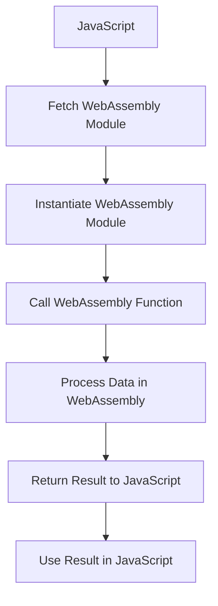

## 36.2 WebAssembly and JavaScript Functions

### Introduction to WebAssembly

WebAssembly, often abbreviated as Wasm, is a binary instruction format designed to be a portable target for the compilation of high-level languages like C, C++, and Rust. It enables high-performance applications to run on the web, providing a way to execute code at near-native speed in a safe, sandboxed environment. WebAssembly is supported by all major browsers, making it a powerful tool for web developers.

#### Why WebAssembly?

WebAssembly is designed to complement JavaScript, not replace it. It is particularly useful for performance-critical tasks that require more computational power than JavaScript can efficiently provide. By compiling code from languages like C++ or Rust into WebAssembly, developers can leverage existing libraries and optimize performance for tasks such as:

- **Computational heavy tasks**: Algorithms that require significant processing power, such as cryptography or scientific computations.
- **Graphics processing**: Real-time rendering and manipulation of graphics, often used in games or simulations.
- **Data processing**: Handling large datasets or performing complex data transformations.

### How JavaScript Functions Interact with WebAssembly

JavaScript and WebAssembly can work together seamlessly. JavaScript functions can call WebAssembly modules, and vice versa, allowing developers to leverage the strengths of both technologies. Let's explore how this interaction works.

#### Calling WebAssembly from JavaScript

To call a WebAssembly function from JavaScript, you first need to load and instantiate the WebAssembly module. This process involves fetching the WebAssembly binary and creating an instance that JavaScript can interact with.

Here's a simple example of how to load a WebAssembly module and call a function from it:

```javascript
// Fetch the WebAssembly binary
fetch('example.wasm')
  .then(response => response.arrayBuffer())
  .then(bytes => WebAssembly.instantiate(bytes))
  .then(results => {
    // Access the exported function from the WebAssembly module
    const { add } = results.instance.exports;

    // Call the WebAssembly function
    console.log(add(5, 3)); // Outputs: 8
  });
```

In this example, we assume that `example.wasm` is a WebAssembly module that exports a function named `add`. The `add` function takes two numbers as arguments and returns their sum.

#### Calling JavaScript from WebAssembly

WebAssembly modules can also call JavaScript functions. This is useful when you want to perform tasks that are better suited to JavaScript, such as manipulating the DOM or handling events.

To call a JavaScript function from WebAssembly, you typically pass the function as an import when instantiating the WebAssembly module. Here's an example:

```javascript
// Define a JavaScript function
function logMessage(message) {
  console.log(message);
}

// Fetch and instantiate the WebAssembly module
fetch('example.wasm')
  .then(response => response.arrayBuffer())
  .then(bytes => WebAssembly.instantiate(bytes, {
    env: {
      logMessage: logMessage // Import the JavaScript function
    }
  }))
  .then(results => {
    // Call a WebAssembly function that uses the imported JavaScript function
    results.instance.exports.useLogMessage();
  });
```

In this example, the WebAssembly module is expected to have a function `useLogMessage` that calls the imported `logMessage` JavaScript function.

### Integrating WebAssembly for Performance-Critical Functions

WebAssembly is particularly beneficial for performance-critical functions. By offloading computationally intensive tasks to WebAssembly, you can achieve significant performance improvements. Let's look at some examples and use cases.

#### Example: Image Processing

Image processing is a common use case for WebAssembly. Operations like filtering, resizing, and transforming images can be computationally expensive. By implementing these operations in WebAssembly, you can achieve faster processing times.

Here's a basic example of using WebAssembly for image processing:

1. **Write the image processing function in C++**:

```cpp
// image_processing.cpp
extern "C" {
  void invertColors(uint8_t* data, int length) {
    for (int i = 0; i < length; i += 4) {
      data[i] = 255 - data[i];     // Invert red
      data[i + 1] = 255 - data[i + 1]; // Invert green
      data[i + 2] = 255 - data[i + 2]; // Invert blue
    }
  }
}
```

2. **Compile the C++ code to WebAssembly**:

Use a tool like Emscripten to compile the C++ code to WebAssembly:

```bash
emcc image_processing.cpp -o image_processing.wasm -s EXPORTED_FUNCTIONS='["_invertColors"]'
```

3. **Use the WebAssembly module in JavaScript**:

```javascript
// Fetch and instantiate the WebAssembly module
fetch('image_processing.wasm')
  .then(response => response.arrayBuffer())
  .then(bytes => WebAssembly.instantiate(bytes))
  .then(results => {
    const { invertColors } = results.instance.exports;

    // Assume imageData is an ImageData object from a canvas
    const data = new Uint8Array(imageData.data.buffer);

    // Call the WebAssembly function to invert colors
    invertColors(data, data.length);

    // Update the canvas with the processed image data
    context.putImageData(imageData, 0, 0);
  });
```

In this example, we use WebAssembly to invert the colors of an image. The image data is passed to the WebAssembly function, which processes it and returns the modified data.

#### Use Cases for WebAssembly

WebAssembly is ideal for tasks that require high performance and are not easily achievable with JavaScript alone. Some common use cases include:

- **Games**: WebAssembly can be used to implement game engines and physics simulations, providing smooth and responsive gameplay.
- **Video and Audio Processing**: Real-time encoding, decoding, and manipulation of media files can benefit from the performance improvements offered by WebAssembly.
- **Scientific Computing**: Complex mathematical computations and simulations can be offloaded to WebAssembly for faster execution.

### Considerations for Data Types and Memory Management

When working with WebAssembly, it's important to understand how data types and memory management differ from JavaScript.

#### Data Types

WebAssembly has a limited set of data types compared to JavaScript. It supports integers and floating-point numbers, but not complex data structures like objects or arrays. This means you need to carefully manage how data is passed between JavaScript and WebAssembly.

For example, if you need to pass an array from JavaScript to WebAssembly, you typically use a `Uint8Array` or `Float32Array` to represent the data in a format that WebAssembly can understand.

#### Memory Management

WebAssembly modules have their own memory, separate from JavaScript. This memory is represented as a linear array of bytes, which you can manipulate using JavaScript's `ArrayBuffer` and `TypedArray` objects.

When passing data between JavaScript and WebAssembly, you often need to allocate memory in the WebAssembly module's memory space and copy the data into it. Here's an example:

```javascript
// Allocate memory in the WebAssembly module
const memory = new WebAssembly.Memory({ initial: 256, maximum: 256 });
const buffer = new Uint8Array(memory.buffer);

// Copy data from JavaScript to WebAssembly memory
buffer.set([1, 2, 3, 4]);

// Pass the memory buffer to a WebAssembly function
results.instance.exports.processData(buffer.byteOffset, buffer.length);
```

In this example, we allocate memory in the WebAssembly module and copy data from a JavaScript array into it. The `processData` function in the WebAssembly module can then access and manipulate the data.

### Visualizing the Interaction Between JavaScript and WebAssembly

To better understand how JavaScript and WebAssembly interact, let's visualize the process using a flowchart:



**Figure 1: Interaction between JavaScript and WebAssembly**

This flowchart illustrates the steps involved in calling a WebAssembly function from JavaScript. The process begins with fetching and instantiating the WebAssembly module, followed by calling a function within the module, processing data, and returning the result to JavaScript.

### Try It Yourself

To deepen your understanding of WebAssembly and JavaScript integration, try modifying the code examples provided. Here are some suggestions:

- **Experiment with different image processing algorithms**: Try implementing other image processing techniques, such as blurring or edge detection, in WebAssembly.
- **Create a WebAssembly module for a different use case**: Consider a task that requires high performance, such as sorting a large array or performing matrix multiplication, and implement it in WebAssembly.
- **Explore memory management**: Practice allocating and managing memory in WebAssembly by passing larger datasets between JavaScript and WebAssembly.

### References and Further Reading

To learn more about WebAssembly and its integration with JavaScript, consider exploring the following resources:

- [MDN Web Docs: WebAssembly](https://developer.mozilla.org/en-US/docs/WebAssembly)
- [WebAssembly.org](https://webassembly.org/)
- [Emscripten Documentation](https://emscripten.org/docs/)

### Knowledge Check

Before moving on, take a moment to test your understanding of the concepts covered in this section. Answer the following questions to reinforce your learning.

## Quiz Time!



### What is WebAssembly primarily used for in web development?

- [x] High-performance computing tasks
- [ ] Styling web pages
- [ ] Managing user sessions
- [ ] Handling form submissions

> **Explanation:** WebAssembly is designed for high-performance computing tasks, allowing developers to run code at near-native speed in web applications.

### How can JavaScript functions call into WebAssembly modules?

- [x] By fetching and instantiating the WebAssembly module
- [ ] By using the `import` keyword
- [ ] By directly executing the `.wasm` file
- [ ] By using the `require` function

> **Explanation:** JavaScript functions call into WebAssembly modules by fetching the WebAssembly binary and instantiating it, allowing access to its exported functions.

### What is a common use case for WebAssembly?

- [x] Graphics processing
- [ ] Form validation
- [ ] CSS animations
- [ ] HTML rendering

> **Explanation:** Graphics processing is a common use case for WebAssembly, as it benefits from the performance improvements offered by WebAssembly.

### What data types does WebAssembly support?

- [x] Integers and floating-point numbers
- [ ] Strings and arrays
- [ ] Objects and functions
- [ ] Booleans and symbols

> **Explanation:** WebAssembly supports integers and floating-point numbers, but not complex data structures like objects or arrays.

### How is memory managed in WebAssembly?

- [x] Using a linear array of bytes
- [ ] Using JavaScript's garbage collector
- [ ] Using the DOM
- [ ] Using CSS

> **Explanation:** WebAssembly manages memory using a linear array of bytes, which can be manipulated using JavaScript's `ArrayBuffer` and `TypedArray` objects.

### What is the role of Emscripten in WebAssembly development?

- [x] Compiling high-level languages to WebAssembly
- [ ] Styling web pages
- [ ] Managing user sessions
- [ ] Handling form submissions

> **Explanation:** Emscripten is a tool that compiles high-level languages like C++ to WebAssembly, enabling developers to create WebAssembly modules.

### Which of the following is a benefit of using WebAssembly?

- [x] Near-native execution speed
- [ ] Simplified HTML structure
- [ ] Enhanced CSS styling
- [ ] Improved form validation

> **Explanation:** WebAssembly provides near-native execution speed, making it ideal for performance-critical tasks in web applications.

### How can WebAssembly modules call JavaScript functions?

- [x] By importing JavaScript functions during instantiation
- [ ] By using the `export` keyword
- [ ] By directly executing JavaScript code
- [ ] By using the `require` function

> **Explanation:** WebAssembly modules can call JavaScript functions by importing them during the instantiation process.

### What is a key consideration when passing data between JavaScript and WebAssembly?

- [x] Data types and memory management
- [ ] CSS styling
- [ ] HTML structure
- [ ] User authentication

> **Explanation:** When passing data between JavaScript and WebAssembly, it's important to consider data types and memory management, as they differ between the two environments.

### True or False: WebAssembly can replace JavaScript for all web development tasks.

- [ ] True
- [x] False

> **Explanation:** False. WebAssembly is designed to complement JavaScript, not replace it. It is used for performance-critical tasks, while JavaScript handles tasks like DOM manipulation and event handling.



### Embrace the Journey

Remember, this is just the beginning of your journey with WebAssembly and JavaScript functions. As you continue to explore and experiment, you'll discover new ways to optimize and enhance your web applications. Keep experimenting, stay curious, and enjoy the journey!
