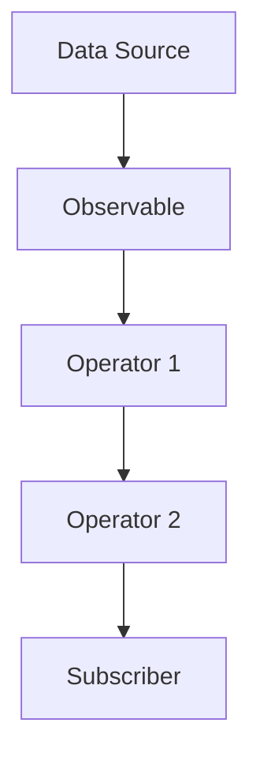

## 36.3 Functional Reactive Programming (FRP)

Functional Reactive Programming (FRP) is a powerful paradigm that combines the principles of functional programming with reactive programming to handle asynchronous data flows in a more declarative and intuitive way. In this section, we will delve into the core concepts of FRP, explore how it can be implemented in JavaScript using libraries like RxJS, and understand its advantages in modern application development.

### Understanding Functional Reactive Programming

#### What is FRP?

Functional Reactive Programming is a programming paradigm that allows you to work with asynchronous data streams and events in a functional manner. It treats data as streams that can be observed and manipulated over time, making it easier to handle complex asynchronous operations such as user interactions, network requests, and real-time data updates.

**Key Principles of FRP:**

1. **Declarative Code**: FRP emphasizes writing code that describes what should happen, rather than how it should happen. This makes code more readable and easier to maintain.

2. **Streams and Observables**: In FRP, data is represented as streams or observables, which can be thought of as sequences of events that occur over time.

3. **Functional Composition**: FRP leverages functional programming techniques such as map, filter, and reduce to transform and combine data streams.

4. **Asynchronous Data Handling**: FRP provides a robust framework for managing asynchronous data flows, allowing you to react to changes and events in real-time.

#### Why Use FRP?

FRP offers several advantages in handling asynchronous events and data:

- **Simplified Asynchronous Code**: By using streams and observables, FRP abstracts away the complexity of managing asynchronous operations, making code easier to understand and maintain.

- **Improved Code Readability**: The declarative nature of FRP allows you to express complex data flows in a concise and readable manner.

- **Enhanced Modularity**: FRP promotes the use of small, reusable functions to transform and combine data streams, leading to more modular and testable code.

- **Real-Time Data Processing**: FRP is well-suited for applications that require real-time data processing, such as live data feeds, user interfaces, and interactive applications.

### Introducing RxJS: A Library for FRP in JavaScript

RxJS (Reactive Extensions for JavaScript) is a popular library that implements the principles of FRP in JavaScript. It provides a rich set of operators and utilities for working with observables and streams, making it a powerful tool for building reactive applications.

#### Getting Started with RxJS

To start using RxJS, you need to install it in your project. You can do this using npm (Node Package Manager):

```bash
npm install rxjs
```

Once installed, you can import RxJS modules and start creating observables and working with streams.

#### Creating Observables

An observable is a core concept in RxJS that represents a stream of data. You can create observables from various sources, such as arrays, events, or even custom data sources.

Here's a simple example of creating an observable from an array:

```javascript
import { from } from 'rxjs';

// Create an observable from an array
const numbers$ = from([1, 2, 3, 4, 5]);

// Subscribe to the observable and log each value
numbers$.subscribe(value => console.log(value));
```

In this example, we use the `from` operator to create an observable from an array of numbers. We then subscribe to the observable to receive and log each value.

#### Working with Operators

RxJS provides a wide range of operators that allow you to transform and manipulate data streams. Some common operators include `map`, `filter`, and `reduce`.

Here's an example of using the `map` and `filter` operators to transform a stream of numbers:

```javascript
import { from } from 'rxjs';
import { map, filter } from 'rxjs/operators';

// Create an observable from an array
const numbers$ = from([1, 2, 3, 4, 5]);

// Use operators to transform the stream
const transformedNumbers$ = numbers$.pipe(
  map(value => value * 2),  // Double each value
  filter(value => value > 5) // Filter values greater than 5
);

// Subscribe to the transformed observable
transformedNumbers$.subscribe(value => console.log(value));
```

In this example, we use the `pipe` method to chain multiple operators together. The `map` operator doubles each value, and the `filter` operator filters out values less than or equal to 5.

### Handling Asynchronous Events with FRP

One of the key strengths of FRP is its ability to handle asynchronous events and data flows. RxJS makes it easy to work with events, such as user interactions or network requests, by converting them into observables.

#### Example: Handling User Click Events

Let's create an observable that listens for click events on a button and logs the coordinates of each click:

```html
<button id="myButton">Click Me!</button>
```

```javascript
import { fromEvent } from 'rxjs';

// Get a reference to the button element
const button = document.getElementById('myButton');

// Create an observable from click events
const clicks$ = fromEvent(button, 'click');

// Subscribe to the observable and log the event coordinates
clicks$.subscribe(event => {
  console.log(`Clicked at: (${event.clientX}, ${event.clientY})`);
});
```

In this example, we use the `fromEvent` operator to create an observable from click events on the button. Each time the button is clicked, the observable emits an event containing the click coordinates.

#### Example: Fetching Data with Observables

RxJS can also be used to handle network requests and asynchronous data fetching. Let's create an observable that fetches data from an API and logs the response:

```javascript
import { from } from 'rxjs';
import { ajax } from 'rxjs/ajax';

// Create an observable from an AJAX request
const data$ = ajax('https://api.example.com/data');

// Subscribe to the observable and log the response
data$.subscribe(
  response => console.log('Data:', response),
  error => console.error('Error:', error)
);
```

In this example, we use the `ajax` operator to create an observable from an AJAX request. The observable emits the response when the request completes, allowing us to handle the data asynchronously.

### Visualizing Data Flows with Diagrams

To better understand how data flows through observables and operators, let's visualize the process using a flowchart.



**Diagram Description:** This flowchart represents the flow of data from a source through an observable, transformed by a series of operators, and finally received by a subscriber.

### Exploring FRP in Modern Application Development

Functional Reactive Programming is increasingly being adopted in modern application development due to its ability to handle complex asynchronous operations and real-time data processing. Here are some areas where FRP can be particularly beneficial:

- **User Interfaces**: FRP can simplify the management of user interactions and dynamic UI updates by treating events as streams.

- **Real-Time Applications**: Applications that require real-time data processing, such as chat applications or live data feeds, can benefit from the reactive nature of FRP.

- **Data Transformation**: FRP provides a powerful framework for transforming and combining data streams, making it ideal for applications that need to process and analyze large volumes of data.

### Try It Yourself

To get hands-on experience with FRP and RxJS, try modifying the examples provided in this section. Here are some suggestions:

- **Modify the Click Event Example**: Add a second button and create a separate observable for its click events. Log the coordinates of clicks on both buttons.

- **Enhance the Data Fetching Example**: Use the `map` operator to transform the API response before logging it. For example, extract and log specific fields from the response data.

- **Create a Custom Observable**: Write a function that creates an observable from a custom data source, such as a WebSocket connection or a timer.

### Knowledge Check

Before we wrap up, let's review some key takeaways from this section:

- **FRP** is a programming paradigm that combines functional programming with reactive programming to handle asynchronous data flows.

- **RxJS** is a library that implements FRP in JavaScript, providing tools for working with observables and streams.

- **Observables** represent data streams that can be observed and manipulated over time.

- **Operators** are used to transform and combine data streams in a functional manner.

- **FRP** is well-suited for applications that require real-time data processing and complex asynchronous operations.

### Further Reading

To deepen your understanding of FRP and RxJS, consider exploring the following resources:

- [RxJS Documentation](https://rxjs.dev/): The official documentation for RxJS, providing comprehensive guides and API references.

- [MDN Web Docs: Observables](https://developer.mozilla.org/en-US/docs/Web/JavaScript/Guide/Using_promises): An introduction to observables and their use in JavaScript.

- [ReactiveX](http://reactivex.io/): A website dedicated to reactive programming, offering resources and tutorials for various languages and platforms.

### Embrace the Journey

Remember, FRP is a powerful paradigm that can transform the way you handle asynchronous data in your applications. As you explore FRP and RxJS, keep experimenting, stay curious, and enjoy the journey of learning and mastering this exciting approach to programming.

## Quiz Time!



### What is Functional Reactive Programming (FRP)?

- [x] A programming paradigm that combines functional programming with reactive programming to handle asynchronous data flows.
- [ ] A method for optimizing JavaScript performance.
- [ ] A library for creating user interfaces.
- [ ] A technique for debugging JavaScript code.

> **Explanation:** FRP is a paradigm that combines functional and reactive programming to manage asynchronous data flows.

### Which library is commonly used for implementing FRP in JavaScript?

- [x] RxJS
- [ ] jQuery
- [ ] Lodash
- [ ] Axios

> **Explanation:** RxJS is a popular library for implementing FRP in JavaScript, providing tools for working with observables and streams.

### What is an observable in RxJS?

- [x] A data stream that can be observed and manipulated over time.
- [ ] A function that returns a promise.
- [ ] A method for creating HTML elements.
- [ ] A variable that holds a single value.

> **Explanation:** An observable represents a data stream that can be observed and transformed using operators.

### Which operator is used to transform data in an observable stream?

- [x] map
- [ ] filter
- [ ] reduce
- [ ] all of the above

> **Explanation:** The `map` operator is used to transform data in an observable stream, but `filter` and `reduce` are also operators that can be used for different transformations.

### What is the purpose of the `fromEvent` operator in RxJS?

- [x] To create an observable from DOM events.
- [ ] To fetch data from an API.
- [ ] To transform data in an observable stream.
- [ ] To handle errors in an observable.

> **Explanation:** The `fromEvent` operator creates an observable from DOM events, allowing you to react to user interactions.

### How does FRP improve code readability?

- [x] By allowing you to express complex data flows in a declarative manner.
- [ ] By reducing the number of lines of code.
- [ ] By using fewer variables.
- [ ] By eliminating the need for comments.

> **Explanation:** FRP improves code readability by allowing you to describe what should happen in a declarative way, making complex data flows easier to understand.

### What is a key advantage of using FRP for real-time applications?

- [x] It provides a robust framework for managing real-time data processing.
- [ ] It reduces the need for server-side code.
- [ ] It eliminates the need for asynchronous operations.
- [ ] It increases the speed of network requests.

> **Explanation:** FRP is well-suited for real-time applications because it provides a framework for managing real-time data processing and asynchronous events.

### Which operator is used to create an observable from an array?

- [x] from
- [ ] of
- [ ] map
- [ ] filter

> **Explanation:** The `from` operator is used to create an observable from an array, emitting each element as a separate event.

### What is the purpose of the `pipe` method in RxJS?

- [x] To chain multiple operators together.
- [ ] To create a new observable.
- [ ] To handle errors in an observable.
- [ ] To subscribe to an observable.

> **Explanation:** The `pipe` method is used to chain multiple operators together, allowing you to transform and manipulate data streams.

### True or False: FRP is only useful for handling user interactions.

- [ ] True
- [x] False

> **Explanation:** False. FRP is useful for handling a wide range of asynchronous data flows, including user interactions, network requests, and real-time data processing.


