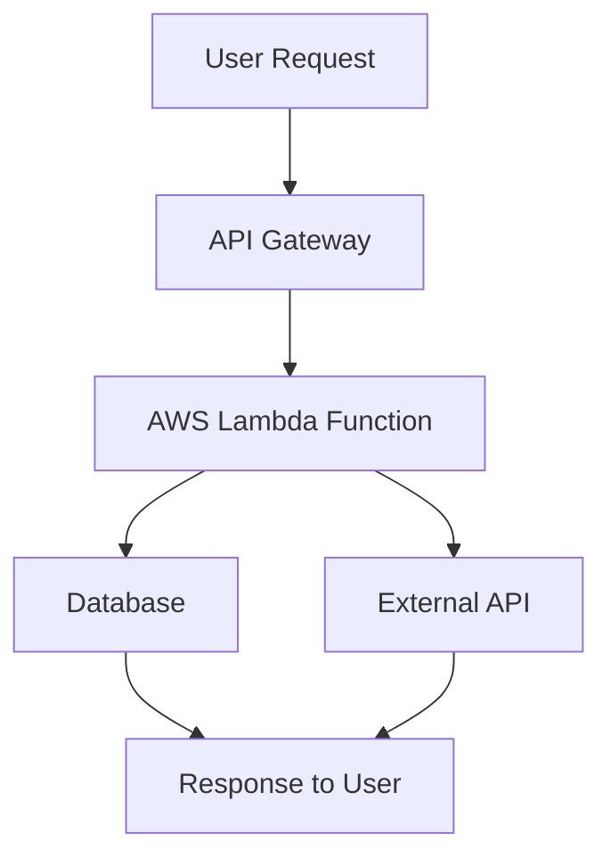

## 36.4 Serverless Functions

As we continue our journey through the world of JavaScript functions, we arrive at an exciting frontier: serverless functions. This concept is transforming how developers build and deploy applications, offering scalability, cost-efficiency, and reduced infrastructure management. In this section, we'll explore serverless computing, delve into Function as a Service (FaaS), and provide practical examples of deploying JavaScript functions in a serverless environment.

### Understanding Serverless Computing

**Serverless computing** is a cloud computing execution model where the cloud provider dynamically manages the allocation of machine resources. Despite the name, servers are still involved, but developers are abstracted from the complexities of server management. Instead, they focus on writing code and defining the events that trigger it.

#### Key Characteristics of Serverless Computing

1. **Event-Driven Execution**: Functions are executed in response to events such as HTTP requests, database changes, or file uploads.
2. **Automatic Scaling**: Serverless platforms automatically scale functions up or down based on demand, ensuring optimal resource utilization.
3. **Pay-as-You-Go Pricing**: Costs are based on the actual execution time and resources consumed, making it cost-effective for applications with variable workloads.
4. **Reduced Operational Overhead**: Developers are relieved from managing servers, allowing them to focus on writing code and delivering features.

### Function as a Service (FaaS)

**Function as a Service (FaaS)** is a category of cloud computing services that provides a platform for deploying and managing serverless functions. It allows developers to write and deploy code without worrying about the underlying infrastructure. Popular FaaS providers include AWS Lambda, Azure Functions, and Google Cloud Functions.

#### How FaaS Works

1. **Write Code**: Developers write functions that perform specific tasks.
2. **Deploy to FaaS Platform**: Functions are deployed to a FaaS platform, which handles execution, scaling, and availability.
3. **Define Triggers**: Functions are associated with triggers, such as HTTP requests or database events, that initiate their execution.
4. **Execute and Scale**: The platform executes functions in response to triggers and scales them based on demand.

### Popular Serverless Platforms

Let's explore some of the leading platforms for deploying serverless functions.

#### AWS Lambda

[AWS Lambda](https://aws.amazon.com/lambda/) is a serverless computing service provided by Amazon Web Services. It allows you to run code in response to events without provisioning or managing servers.

- **Supported Languages**: JavaScript (Node.js), Python, Java, Ruby, and more.
- **Triggers**: HTTP requests via API Gateway, S3 bucket events, DynamoDB streams, and more.
- **Integration**: Seamlessly integrates with other AWS services.

#### Azure Functions

[Azure Functions](https://azure.microsoft.com/en-us/services/functions/) is Microsoft's serverless computing service that enables you to run event-driven code without managing infrastructure.

- **Supported Languages**: JavaScript, C#, Python, Java, and more.
- **Triggers**: HTTP requests, timers, Azure Blob Storage events, and more.
- **Integration**: Integrates with Azure services and third-party APIs.

#### Google Cloud Functions

[Google Cloud Functions](https://cloud.google.com/functions) is a lightweight, event-driven serverless compute platform provided by Google Cloud.

- **Supported Languages**: JavaScript (Node.js), Python, Go, and more.
- **Triggers**: HTTP requests, Cloud Pub/Sub messages, Cloud Storage events, and more.
- **Integration**: Works with Google Cloud services and APIs.

### Deploying JavaScript Functions in a Serverless Environment

Let's walk through the process of deploying a JavaScript function using AWS Lambda, one of the most popular serverless platforms.

#### Step 1: Write the JavaScript Function

First, we'll write a simple JavaScript function that returns a greeting message.

```javascript
// greeting.js
exports.handler = async (event) => {
    const name = event.queryStringParameters.name || 'World';
    const response = {
        statusCode: 200,
        body: JSON.stringify(`Hello, ${name}!`),
    };
    return response;
};
```

- **Explanation**: This function takes a `name` parameter from the query string and returns a greeting message. If no name is provided, it defaults to "World".

#### Step 2: Create an AWS Lambda Function

1. **Log in to AWS Management Console**.
2. **Navigate to AWS Lambda** and click "Create Function".
3. **Select "Author from scratch"** and provide a function name.
4. **Choose Node.js as the runtime**.
5. **Create a new role with basic Lambda permissions**.

#### Step 3: Deploy the Function

1. **Upload the `greeting.js` file** as the function code.
2. **Set the handler to `greeting.handler`**.
3. **Click "Deploy"** to save and deploy the function.

#### Step 4: Test the Function

1. **Create a test event** with a query string parameter, e.g., `{"queryStringParameters": {"name": "Alice"}}`.
2. **Invoke the function** and verify the output: `Hello, Alice!`.

### Benefits of Serverless Functions

Serverless functions offer several advantages that make them an attractive choice for modern application development.

#### Scalability

Serverless platforms automatically scale functions based on demand, ensuring that your application can handle varying workloads without manual intervention.

#### Cost-Efficiency

With a pay-as-you-go pricing model, you only pay for the actual execution time and resources consumed, reducing costs for applications with sporadic usage patterns.

#### Reduced Infrastructure Management

By abstracting server management, serverless functions allow developers to focus on writing code and delivering features, rather than dealing with infrastructure concerns.

### Best Practices for Writing Effective Serverless Functions

To maximize the benefits of serverless functions, follow these best practices:

1. **Keep Functions Small and Focused**: Write functions that perform a single task or a small set of related tasks. This makes them easier to test, maintain, and scale.

2. **Optimize Cold Start Performance**: Minimize dependencies and use lightweight libraries to reduce cold start times, which occur when a function is invoked after being idle.

3. **Use Environment Variables**: Store configuration settings in environment variables instead of hardcoding them in your functions.

4. **Implement Error Handling**: Use try-catch blocks and proper logging to handle errors gracefully and provide meaningful feedback.

5. **Secure Your Functions**: Implement authentication and authorization to protect your functions from unauthorized access.

6. **Monitor and Log**: Use logging and monitoring tools to track function performance and identify issues.

### Visualizing Serverless Architecture

To better understand how serverless functions fit into a broader application architecture, let's visualize a typical serverless workflow.



**Diagram Description**: This flowchart illustrates a serverless architecture where a user request is routed through an API Gateway to an AWS Lambda function. The function interacts with a database and an external API before returning a response to the user.

### Try It Yourself

Now that we've covered the basics of serverless functions, it's time to experiment. Try modifying the `greeting.js` function to include additional query parameters, such as a language code, and return a greeting in different languages. Deploy your modified function and test it using AWS Lambda.

### References and Further Reading

- [AWS Lambda Documentation](https://docs.aws.amazon.com/lambda/latest/dg/welcome.html)
- [Azure Functions Documentation](https://docs.microsoft.com/en-us/azure/azure-functions/)
- [Google Cloud Functions Documentation](https://cloud.google.com/functions/docs)
- [Serverless Framework](https://www.serverless.com/)

### Knowledge Check

To reinforce your understanding of serverless functions, let's review some key takeaways:

- Serverless computing abstracts server management, allowing developers to focus on writing code.
- Function as a Service (FaaS) platforms like AWS Lambda, Azure Functions, and Google Cloud Functions enable serverless deployments.
- Serverless functions offer scalability, cost-efficiency, and reduced operational overhead.
- Best practices include keeping functions small, optimizing cold start performance, and implementing security measures.

Remember, this is just the beginning of your serverless journey. As you continue to explore and experiment, you'll discover new ways to leverage serverless functions for scalable, efficient applications. Keep experimenting, stay curious, and enjoy the journey!

## Quiz Time!



### What is serverless computing?

- [x] A cloud computing model where the cloud provider manages server resources.
- [ ] A model where developers manage their own servers.
- [ ] A model that eliminates the need for servers entirely.
- [ ] A model that requires manual scaling of resources.

> **Explanation:** Serverless computing is a cloud model where the provider manages server resources, abstracting server management from developers.

### Which of the following is a characteristic of serverless computing?

- [x] Event-driven execution
- [ ] Manual scaling
- [ ] Fixed pricing
- [ ] Server management by developers

> **Explanation:** Serverless computing is characterized by event-driven execution, automatic scaling, and pay-as-you-go pricing.

### What is Function as a Service (FaaS)?

- [x] A cloud service for deploying and managing serverless functions.
- [ ] A service for managing virtual machines.
- [ ] A service for deploying containerized applications.
- [ ] A service for managing databases.

> **Explanation:** FaaS is a cloud service that allows developers to deploy and manage serverless functions.

### Which platform is NOT a serverless computing provider?

- [ ] AWS Lambda
- [ ] Azure Functions
- [ ] Google Cloud Functions
- [x] Docker Swarm

> **Explanation:** Docker Swarm is a container orchestration tool, not a serverless computing provider.

### What is a benefit of serverless functions?

- [x] Scalability
- [ ] Increased server management
- [ ] Fixed costs
- [ ] Manual resource allocation

> **Explanation:** Serverless functions offer scalability, cost-efficiency, and reduced server management.

### What is a best practice for writing serverless functions?

- [x] Keep functions small and focused.
- [ ] Hardcode configuration settings.
- [ ] Avoid error handling.
- [ ] Use large libraries to increase functionality.

> **Explanation:** Keeping functions small and focused is a best practice for maintainability and scalability.

### How can you optimize cold start performance in serverless functions?

- [x] Minimize dependencies and use lightweight libraries.
- [ ] Increase the function's memory allocation.
- [ ] Use large, complex libraries.
- [ ] Hardcode all configuration settings.

> **Explanation:** Minimizing dependencies and using lightweight libraries can reduce cold start times.

### What is a common trigger for serverless functions?

- [x] HTTP requests
- [ ] Manual server restart
- [ ] Fixed time intervals
- [ ] Direct database access

> **Explanation:** Serverless functions can be triggered by events like HTTP requests, database changes, and more.

### Which of the following is a serverless platform provided by Google?

- [ ] AWS Lambda
- [ ] Azure Functions
- [x] Google Cloud Functions
- [ ] IBM Cloud Functions

> **Explanation:** Google Cloud Functions is Google's serverless platform.

### True or False: Serverless functions eliminate the need for servers entirely.

- [ ] True
- [x] False

> **Explanation:** Serverless functions abstract server management from developers, but servers are still involved.


