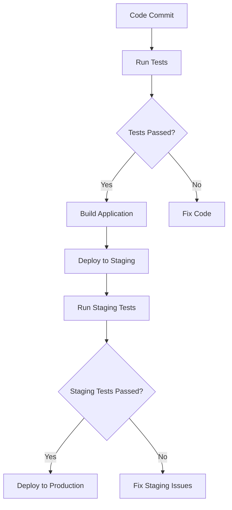

## 36.5 Integrating Functions with DevOps

In the modern software development landscape, DevOps has become an essential practice, bridging the gap between development and operations. One of the key components of DevOps is automation, which helps streamline workflows, reduce human error, and improve efficiency. In this section, we'll explore how JavaScript functions can be integrated into DevOps processes, enhancing continuous integration and deployment (CI/CD) pipelines.

### Understanding DevOps and Its Importance

Before diving into the integration of functions, let's briefly understand what DevOps entails. DevOps is a set of practices that combines software development (Dev) and IT operations (Ops). Its primary goal is to shorten the development lifecycle while delivering features, fixes, and updates frequently in close alignment with business objectives.

**Key Aspects of DevOps:**

- **Automation:** Automating repetitive tasks to increase efficiency.
- **Continuous Integration (CI):** Merging all developers' working copies to a shared mainline several times a day.
- **Continuous Deployment (CD):** Automatically deploying code changes to production after passing through the CI pipeline.
- **Monitoring and Logging:** Keeping track of application performance and logging errors for quick resolution.

### The Role of Functions in DevOps

Functions are reusable blocks of code that perform specific tasks. In the context of DevOps, functions can be used to automate various tasks such as building, testing, deploying, and monitoring applications.

#### Automating Build Processes

In a DevOps workflow, the build process is crucial. It involves compiling source code into executable programs. Functions can be used to automate this process, ensuring consistency and reducing manual intervention.

**Example: Automating Builds with Functions**

```javascript
// Function to automate build process
function buildProject() {
    console.log("Starting build process...");
    // Simulate build steps
    console.log("Compiling source code...");
    console.log("Running tests...");
    console.log("Packaging application...");
    console.log("Build process completed successfully!");
}

// Execute the build function
buildProject();
```

In this example, the `buildProject` function automates the build process by simulating various steps such as compiling, testing, and packaging. This function can be integrated into a larger build script or triggered by a CI/CD tool.

#### Scripting Tasks with Functions for DevOps

Functions can be used to script tasks that are part of the DevOps pipeline. These tasks might include code analysis, testing, deployment, and more.

**Example: Code Analysis with Functions**

```javascript
// Function to perform code analysis
function analyzeCode() {
    console.log("Analyzing code for potential issues...");
    // Simulate code analysis
    console.log("No issues found!");
}

// Execute the code analysis function
analyzeCode();
```

This function simulates a code analysis task, which can be part of a pre-deployment check to ensure code quality.

### Functions in Testing and Code Analysis

Testing is a critical aspect of DevOps, ensuring that code changes do not introduce new bugs. Functions can be used to automate testing processes, making it easier to run tests consistently.

#### Unit Testing with Functions

Unit tests are automated tests written and run by software developers to ensure that a section of an application (known as the "unit") meets its design and behaves as intended.

**Example: Unit Testing with Functions**

```javascript
// Function to test addition
function add(a, b) {
    return a + b;
}

// Unit test for the add function
function testAdd() {
    const result = add(2, 3);
    if (result === 5) {
        console.log("Test passed!");
    } else {
        console.log("Test failed!");
    }
}

// Execute the test
testAdd();
```

In this example, the `testAdd` function tests the `add` function to ensure it returns the correct result. This type of testing can be automated and integrated into a CI/CD pipeline.

#### Code Analysis Tools

Code analysis tools can be used to automatically check code for potential issues. Functions can be written to integrate these tools into the DevOps workflow.

**Example: Integrating a Code Linter**

```javascript
// Function to run a code linter
function runLinter() {
    console.log("Running code linter...");
    // Simulate linter output
    console.log("No linting issues found!");
}

// Execute the linter function
runLinter();
```

This function simulates running a code linter, which checks for stylistic and programming errors.

### Deployment with Functions

Deployment is the process of making an application available for use. Functions can automate deployment tasks, ensuring that code changes are deployed consistently and reliably.

#### Automating Deployment Processes

Functions can be used to automate deployment processes, reducing the risk of human error and speeding up the deployment cycle.

**Example: Automating Deployment with Functions**

```javascript
// Function to deploy application
function deployApplication() {
    console.log("Starting deployment...");
    // Simulate deployment steps
    console.log("Uploading files to server...");
    console.log("Restarting server...");
    console.log("Deployment completed successfully!");
}

// Execute the deployment function
deployApplication();
```

In this example, the `deployApplication` function automates the deployment process by simulating steps such as uploading files and restarting the server.

### Tools for Integrating Functions in DevOps

There are several tools and platforms that can help integrate functions into DevOps workflows. Let's explore some of these tools and how they can be used.

#### Git Hooks

Git hooks are scripts that Git executes before or after events such as commit, push, and receive. They can be used to automate tasks such as running tests or linters before code is committed.

**Example: Using Git Hooks**

```bash
#!/bin/sh
echo "Running tests before commit..."
npm test
```

This pre-commit hook runs tests before allowing a commit to proceed, ensuring that only tested code is committed.

#### npm Scripts

npm scripts are a way to automate tasks using the npm command-line tool. They can be used to run functions that perform tasks such as building, testing, and deploying applications.

**Example: Using npm Scripts**

```json
{
  "scripts": {
    "build": "node buildProject.js",
    "test": "node testAdd.js",
    "deploy": "node deployApplication.js"
  }
}
```

In this example, npm scripts are defined to run the build, test, and deploy functions.

#### CI/CD Platforms

Continuous Integration and Continuous Deployment platforms such as Jenkins, Travis CI, and GitHub Actions can be used to automate the DevOps pipeline. Functions can be integrated into these platforms to perform tasks at various stages of the pipeline.

**Example: Using GitHub Actions**

```yaml
name: CI

on: [push]

jobs:
  build:
    runs-on: ubuntu-latest

    steps:
    - uses: actions/checkout@v2
    - name: Set up Node.js
      uses: actions/setup-node@v2
      with:
        node-version: '14'
    - name: Install dependencies
      run: npm install
    - name: Run build
      run: npm run build
    - name: Run tests
      run: npm test
    - name: Deploy
      run: npm run deploy
```

This GitHub Actions workflow automates the build, test, and deploy processes using npm scripts.

### Importance of Automation in Modern Software Development

Automation is a cornerstone of modern software development, enabling teams to deliver high-quality software faster and more reliably. By integrating functions into DevOps workflows, teams can automate repetitive tasks, reduce errors, and focus on delivering value to users.

**Benefits of Automation:**

- **Consistency:** Automated processes ensure that tasks are performed the same way every time.
- **Efficiency:** Automation reduces the time and effort required to perform repetitive tasks.
- **Reliability:** Automated processes are less prone to human error, increasing the reliability of software delivery.
- **Scalability:** Automation enables teams to scale their processes as the project grows.

### Visualizing the DevOps Pipeline with Functions

To better understand how functions integrate into a DevOps pipeline, let's visualize the process using a flowchart.



**Figure: DevOps Pipeline with Functions**

This flowchart illustrates a typical DevOps pipeline where functions are used to automate testing, building, and deployment processes. Each step in the pipeline can be represented by a function, ensuring consistency and reliability.

### Try It Yourself: Experiment with DevOps Functions

To truly grasp the power of integrating functions with DevOps, try modifying the code examples provided in this section. Experiment with adding new steps to the build or deployment processes, or integrate additional tools such as linters or security scanners.

### References and Further Reading

- [MDN Web Docs: Functions](https://developer.mozilla.org/en-US/docs/Web/JavaScript/Guide/Functions)
- [Git Hooks Documentation](https://git-scm.com/book/en/v2/Customizing-Git-Git-Hooks)
- [npm Scripts Guide](https://docs.npmjs.com/cli/v7/using-npm/scripts)
- [GitHub Actions Documentation](https://docs.github.com/en/actions)

### Knowledge Check

Let's summarize the key takeaways from this section:

- Functions play a crucial role in automating DevOps tasks such as building, testing, and deploying applications.
- Tools like Git hooks, npm scripts, and CI/CD platforms can be used to integrate functions into DevOps workflows.
- Automation enhances consistency, efficiency, reliability, and scalability in software development.

## Quiz Time!



### What is a primary goal of DevOps?

- [x] Shortening the development lifecycle while delivering features frequently
- [ ] Increasing the number of manual processes
- [ ] Eliminating all testing procedures
- [ ] Reducing the number of developers in a team

> **Explanation:** DevOps aims to shorten the development lifecycle and deliver features, fixes, and updates frequently.

### How can functions be used in the build process?

- [x] Automating tasks such as compiling and packaging
- [ ] Replacing all manual testing
- [ ] Eliminating the need for version control
- [ ] Increasing the complexity of deployment

> **Explanation:** Functions can automate tasks like compiling and packaging, ensuring consistency and efficiency in the build process.

### Which tool can be used to run scripts before a Git commit?

- [x] Git hooks
- [ ] npm scripts
- [ ] CI/CD platforms
- [ ] Code linters

> **Explanation:** Git hooks are scripts that Git executes before or after events such as commit, push, and receive.

### What is the benefit of using npm scripts in DevOps?

- [x] Automating tasks such as building, testing, and deploying applications
- [ ] Increasing manual intervention in the deployment process
- [ ] Reducing the need for automated testing
- [ ] Eliminating the use of version control

> **Explanation:** npm scripts automate tasks like building, testing, and deploying, reducing manual intervention.

### Which CI/CD platform is mentioned in the article?

- [x] GitHub Actions
- [ ] Jenkins
- [ ] Travis CI
- [ ] CircleCI

> **Explanation:** GitHub Actions is mentioned as a CI/CD platform that can automate the DevOps pipeline.

### What is a benefit of automation in software development?

- [x] Increased efficiency and reduced human error
- [ ] Increased manual processes
- [ ] Reduced software quality
- [ ] Decreased reliability

> **Explanation:** Automation increases efficiency and reduces human error, leading to more reliable software delivery.

### What does the flowchart in the article represent?

- [x] A typical DevOps pipeline with automated processes
- [ ] A manual deployment process
- [ ] A complex algorithm for sorting data
- [ ] A user interface design

> **Explanation:** The flowchart represents a typical DevOps pipeline where functions automate testing, building, and deployment.

### What is a key aspect of DevOps?

- [x] Automation
- [ ] Manual testing
- [ ] Increased complexity
- [ ] Reduced collaboration

> **Explanation:** Automation is a key aspect of DevOps, helping streamline workflows and reduce human error.

### What is the purpose of a code linter?

- [x] Checking code for stylistic and programming errors
- [ ] Compiling source code into executable programs
- [ ] Deploying applications to production
- [ ] Running unit tests

> **Explanation:** A code linter checks code for stylistic and programming errors, ensuring code quality.

### True or False: Functions can only be used for testing in DevOps.

- [ ] True
- [x] False

> **Explanation:** Functions can be used for various tasks in DevOps, including building, testing, deploying, and monitoring applications.



Remember, integrating functions with DevOps is a powerful way to enhance your software development process. Keep experimenting, stay curious, and enjoy the journey of mastering functions in the context of DevOps!
