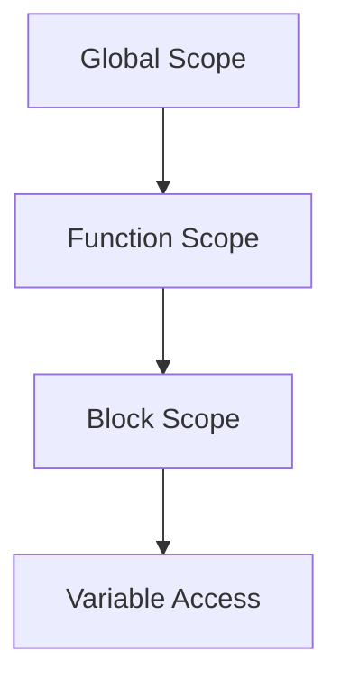
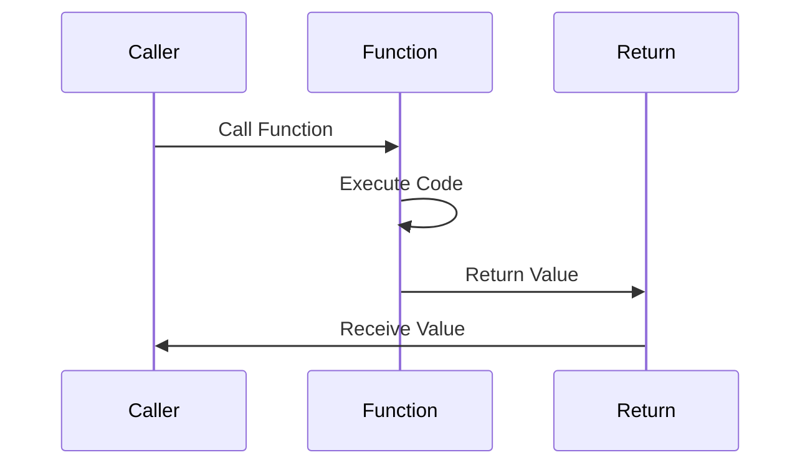

## 37.2 Further Learning Resources

As we conclude our journey through functions and scope in JavaScript, it's essential to remember that learning is a continuous process. The world of JavaScript is vast and ever-evolving, and there are countless resources available to help you deepen your understanding and keep your skills sharp. In this section, we will explore a variety of books, courses, articles, and communities that can support your continued learning.

### Books

Books are a timeless resource for learning, offering in-depth insights and structured knowledge. Here are some highly recommended books that cover JavaScript functions, scope, and more:

1. **"JavaScript: The Good Parts" by Douglas Crockford**
   - This book is a classic in the JavaScript community. It focuses on the language's elegant and useful features, providing a solid foundation for understanding JavaScript's core concepts.

2. **"Eloquent JavaScript" by Marijn Haverbeke**
   - A modern introduction to programming, this book covers JavaScript in detail and includes exercises and projects to practice what you've learned. It's an excellent resource for both beginners and experienced developers.

3. **"You Don’t Know JS" (book series) by Kyle Simpson**
   - This series dives deep into the mechanics of JavaScript, including scope and closures. It's perfect for those who want to understand the language at a fundamental level.

4. **"JavaScript: The Definitive Guide" by David Flanagan**
   - Known as the "JavaScript Bible," this comprehensive guide covers everything from basic syntax to advanced topics like closures and asynchronous programming.

5. **"Functional-Light JavaScript" by Kyle Simpson**
   - For those interested in functional programming concepts in JavaScript, this book provides a gentle introduction to functional programming principles and how they can be applied in JavaScript.

### Online Courses

Online courses offer interactive learning experiences and are a great way to gain hands-on experience. Here are some courses that focus on JavaScript functions and scope:

1. **[JavaScript Basics on Codecademy](https://www.codecademy.com/learn/introduction-to-javascript)**
   - This beginner-friendly course covers the fundamentals of JavaScript, including functions and scope, through interactive lessons and exercises.

2. **[JavaScript: Understanding the Weird Parts on Udemy](https://www.udemy.com/course/understand-javascript/)**
   - Dive deep into the inner workings of JavaScript with this course, which covers advanced topics like closures, prototypes, and scope.

3. **[The Complete JavaScript Course 2023: From Zero to Expert! on Udemy](https://www.udemy.com/course/the-complete-javascript-course/)**
   - This comprehensive course takes you from beginner to advanced, covering everything from basic syntax to complex concepts like asynchronous JavaScript.

4. **[JavaScript30 by Wes Bos](https://javascript30.com/)**
   - A free 30-day challenge that teaches you how to build 30 different projects in vanilla JavaScript. It's a hands-on way to improve your skills and understand JavaScript functions in practice.

5. **[Front-End Web Developer Nanodegree on Udacity](https://www.udacity.com/course/front-end-web-developer-nanodegree--nd0011)**
   - This program covers HTML, CSS, and JavaScript, with a focus on building interactive web applications. It's a great way to gain a comprehensive understanding of front-end development.

### Articles and Tutorials

Articles and tutorials provide quick insights and solutions to specific problems. Here are some valuable resources:

1. **[MDN Web Docs: Functions](https://developer.mozilla.org/en-US/docs/Web/JavaScript/Guide/Functions)**
   - The Mozilla Developer Network offers detailed documentation and examples on JavaScript functions, making it an invaluable resource for developers.

2. **[JavaScript.info: Functions](https://javascript.info/function-basics)**
   - This tutorial provides a thorough introduction to functions in JavaScript, covering everything from basic syntax to advanced topics like closures.

3. **[FreeCodeCamp: JavaScript Functions](https://www.freecodecamp.org/news/javascript-functions-explained/)**
   - FreeCodeCamp offers a comprehensive guide to JavaScript functions, complete with examples and exercises to reinforce learning.

4. **[Scotch.io: Mastering JavaScript Functions](https://scotch.io/tutorials/understanding-javascript-functions)**
   - This article breaks down the different types of functions in JavaScript and provides practical examples to illustrate their use.

5. **[CSS-Tricks: An Introduction to JavaScript Scope](https://css-tricks.com/an-introduction-to-javascript-scope/)**
   - A beginner-friendly article that explains the concept of scope in JavaScript, complete with diagrams and examples.

### Communities and Forums

Joining communities and forums can provide ongoing support and opportunities to connect with other learners and experienced developers. Here are some popular communities:

1. **[Stack Overflow](https://stackoverflow.com/)**
   - A question-and-answer platform where you can ask questions and get answers from experienced developers. It's a great place to find solutions to specific problems.

2. **[Reddit: r/javascript](https://www.reddit.com/r/javascript/)**
   - A subreddit dedicated to JavaScript, where you can find discussions, news, and resources related to the language.

3. **[JavaScript Weekly](https://javascriptweekly.com/)**
   - A weekly newsletter that curates the latest news, articles, and tutorials about JavaScript. It's a great way to stay updated on the latest trends and developments.

4. **[Dev.to: JavaScript](https://dev.to/t/javascript)**
   - A community of developers sharing articles, tutorials, and insights about JavaScript. It's a great place to learn from others and share your own knowledge.

5. **[Hashnode: JavaScript](https://hashnode.com/n/javascript)**
   - A blogging platform for developers, where you can find articles and tutorials on JavaScript and other programming topics.

### Influential Authors and Experts

Learning from experts in the field can provide valuable insights and inspiration. Here are some influential authors and experts in the JavaScript community:

1. **Douglas Crockford**
   - Known for his work on JSON and his book "JavaScript: The Good Parts," Crockford is a respected authority on JavaScript.

2. **Kyle Simpson**
   - The author of the "You Don’t Know JS" book series, Simpson is known for his deep understanding of JavaScript and his ability to explain complex concepts clearly.

3. **Marijn Haverbeke**
   - The author of "Eloquent JavaScript," Haverbeke is a well-known figure in the JavaScript community and a contributor to various open-source projects.

4. **Wes Bos**
   - A full-stack developer and educator, Bos is known for his practical and engaging courses on JavaScript and web development.

5. **Addy Osmani**
   - A Google Chrome engineer and author of "Learning JavaScript Design Patterns," Osmani is an expert in performance optimization and front-end development.

### Staying Curious and Continuing to Learn

As you continue your journey with JavaScript, remember to stay curious and open to new ideas. The language is constantly evolving, and there are always new tools, frameworks, and techniques to explore. Here are some tips for staying engaged and continuing to learn:

- **Set Learning Goals:** Define specific goals for what you want to learn or achieve with JavaScript. This could be mastering a particular concept, building a project, or contributing to an open-source project.

- **Experiment and Build Projects:** Apply what you've learned by building projects. This could be a personal project, a contribution to an open-source project, or even a freelance project.

- **Attend Conferences and Meetups:** Participate in conferences and meetups to connect with other developers, learn from experts, and stay updated on the latest trends.

- **Follow Industry Leaders on Social Media:** Follow influential developers and organizations on social media platforms like Twitter and LinkedIn to stay informed about the latest news and trends.

- **Join Online Courses and Workshops:** Enroll in online courses and workshops to continue learning and expanding your skills.

- **Read Blogs and Articles:** Regularly read blogs and articles to stay informed about new developments and best practices in JavaScript.

- **Participate in Coding Challenges:** Join coding challenges and competitions to test your skills and learn from others.

### Try It Yourself

To reinforce your learning, try modifying the code examples provided in this book. Experiment with different parameters, return values, and variable scopes. Here are some ideas to get you started:

- **Create a Function Library:** Build a library of reusable functions that you can use in your projects. Focus on functions that perform common tasks, such as data manipulation, string formatting, or mathematical calculations.

- **Implement a JavaScript Game:** Use your knowledge of functions and scope to build a simple game in JavaScript. This could be a classic game like Tic-Tac-Toe or a more complex game with multiple levels and features.

- **Build a Web Application:** Use JavaScript functions to build a web application that interacts with the DOM and responds to user input. This could be a simple form validation script or a more complex application with dynamic content and interactivity.

- **Explore Functional Programming:** Experiment with functional programming concepts in JavaScript, such as pure functions, immutability, and higher-order functions. Try implementing common functional programming patterns, such as map, filter, and reduce.

- **Contribute to Open-Source Projects:** Find open-source projects on platforms like GitHub and contribute to them. This is a great way to gain real-world experience and learn from other developers.

### Visualizing JavaScript Concepts

To help you better understand some of the concepts discussed in this book, let's visualize a few key ideas using diagrams. These diagrams will provide a visual representation of how JavaScript functions and scope work.

#### Visualizing the Scope Chain

*Description:* This diagram illustrates the scope chain in JavaScript. Variables are first searched in the current scope, and if not found, the search continues in the outer scope, moving up the chain until the global scope is reached.

#### Visualizing Function Execution Flow

*Description:* This sequence diagram shows the flow of function execution in JavaScript. The caller invokes the function, the function executes its code, and then returns a value to the caller.

### Knowledge Check

Before we wrap up, let's test your understanding of the concepts covered in this book with a few questions and exercises.

#### Questions

1. What is the difference between a function declaration and a function expression?
2. How does JavaScript determine the value of `this` inside a function?
3. What is the purpose of the `return` statement in a function?
4. How can you create a private variable using closures?
5. What are the benefits of using arrow functions in JavaScript?

#### Exercises

1. Write a function that takes an array of numbers and returns the sum of all even numbers.
2. Create a function that accepts a string and returns the number of vowels in the string.
3. Implement a recursive function that calculates the factorial of a given number.
4. Write a function that returns a function, demonstrating the concept of higher-order functions.
5. Build a simple web page that uses JavaScript functions to interact with the DOM.

### Embrace the Journey

Remember, this is just the beginning. As you progress, you'll build more complex and interactive web pages. Keep experimenting, stay curious, and enjoy the journey! The world of JavaScript is full of opportunities to learn and grow, and with the resources and knowledge you've gained, you're well-equipped to continue your exploration.

## Quiz Time!



### What is the primary benefit of using functions in JavaScript?

- [x] Code reusability and organization
- [ ] Faster execution speed
- [ ] Reduced memory usage
- [ ] Improved security

> **Explanation:** Functions allow for code reusability and organization, making it easier to manage and maintain code.

### Which of the following is a feature of arrow functions?

- [x] Lexical scoping of `this`
- [ ] Automatic hoisting
- [ ] Implicit return of `undefined`
- [ ] Support for named parameters

> **Explanation:** Arrow functions lexically bind the `this` value, meaning they inherit `this` from the surrounding code.

### How can you create a private variable in JavaScript?

- [x] Using closures
- [ ] Using the `private` keyword
- [ ] Declaring variables with `var`
- [ ] Using global variables

> **Explanation:** Closures allow you to create private variables by enclosing them within a function scope.

### What is the scope chain?

- [x] The hierarchy of scopes that JavaScript uses to resolve variable names
- [ ] A method for chaining functions
- [ ] A way to link multiple variables together
- [ ] A type of data structure

> **Explanation:** The scope chain is the hierarchy of scopes that JavaScript uses to look up variable names.

### What is the purpose of the `return` statement in a function?

- [x] To specify the value that a function should output
- [ ] To terminate the function immediately
- [ ] To declare a new variable
- [ ] To call another function

> **Explanation:** The `return` statement specifies the value that a function should output when it is called.

### Which method can be used to change the context of `this` in a function?

- [x] `bind`
- [ ] `apply`
- [ ] `call`
- [ ] `setContext`

> **Explanation:** The `bind` method creates a new function with a specified `this` value.

### What is a higher-order function?

- [x] A function that takes another function as an argument or returns a function
- [ ] A function with more than one parameter
- [ ] A function that is executed immediately
- [ ] A function that operates on arrays

> **Explanation:** Higher-order functions are functions that can take other functions as arguments or return them.

### Which of the following is a common use case for closures?

- [x] Data privacy
- [ ] Error handling
- [ ] Loop iteration
- [ ] DOM manipulation

> **Explanation:** Closures are often used for data privacy, allowing variables to be private within a function scope.

### What is the difference between `let` and `var`?

- [x] `let` is block-scoped, while `var` is function-scoped
- [ ] `let` is function-scoped, while `var` is block-scoped
- [ ] `let` can be redeclared, while `var` cannot
- [ ] `let` is hoisted, while `var` is not

> **Explanation:** `let` is block-scoped, meaning it is only accessible within the block it is declared in, while `var` is function-scoped.

### True or False: Functions in JavaScript can be passed as arguments to other functions.

- [x] True
- [ ] False

> **Explanation:** Functions in JavaScript are first-class citizens, meaning they can be passed as arguments to other functions.



