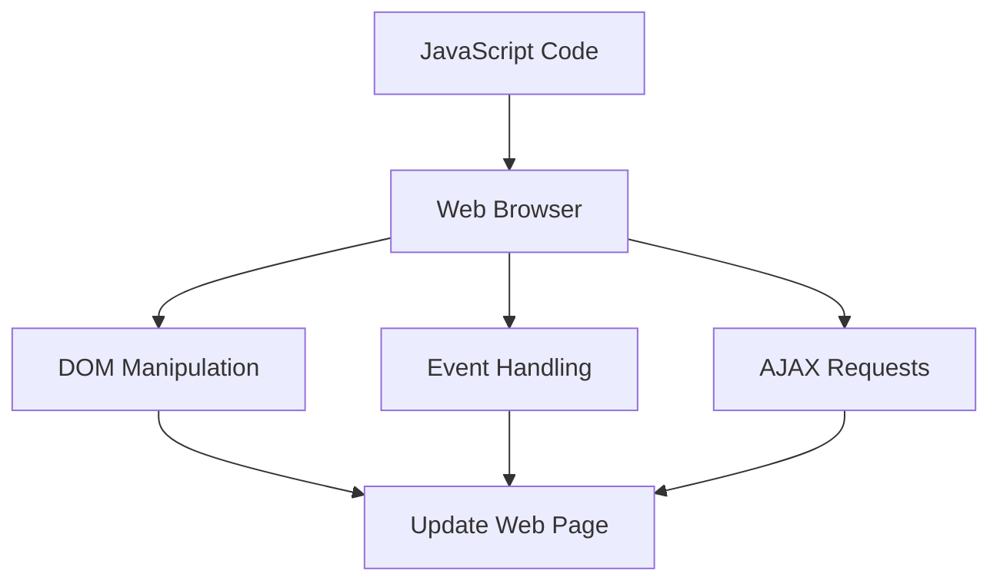

## 37.4 Staying Current with JavaScript

JavaScript is a dynamic and ever-evolving language that plays a crucial role in web development. As an absolute beginner, it can be overwhelming to keep up with the constant changes and advancements in the JavaScript ecosystem. However, staying current is essential to becoming a proficient developer and ensuring your skills remain relevant in the industry. In this section, we will explore various strategies and resources to help you stay updated with JavaScript's rapid evolution.

### Understanding the Rapid Evolution of JavaScript

JavaScript's evolution is driven by the need to address new challenges, improve performance, and enhance developer experience. The language is governed by the ECMAScript specification, which undergoes regular updates to introduce new features and improvements. Additionally, the JavaScript ecosystem includes a vast array of libraries, frameworks, and tools that are continuously being developed and updated.

#### Key Drivers of JavaScript Evolution

1. **Community Contributions**: JavaScript has a vibrant and active community that contributes to its growth. Developers around the world collaborate to propose new features, fix bugs, and enhance existing functionalities.

2. **Technological Advancements**: As web technologies advance, JavaScript evolves to support new capabilities, such as improved performance, better security, and enhanced user experiences.

3. **Industry Demands**: The demand for more interactive and dynamic web applications drives the need for new JavaScript features and tools.

4. **Cross-Platform Development**: JavaScript's role in cross-platform development, including mobile and desktop applications, necessitates continuous updates to meet diverse requirements.

### Strategies for Staying Updated

Staying current with JavaScript involves a combination of following key resources, engaging with the community, and prioritizing continuous learning. Here are some effective strategies to help you stay informed:

#### 1. Follow Blogs and Newsletters

Blogs and newsletters are excellent sources of information about the latest developments in JavaScript. They provide insights, tutorials, and updates on new features and best practices.

- **JavaScript Weekly**: A popular newsletter that curates the latest news, articles, and resources related to JavaScript. [Subscribe here](https://javascriptweekly.com/).

- **CSS-Tricks**: While primarily focused on CSS, this blog often covers JavaScript topics and provides valuable insights. [Visit CSS-Tricks](https://css-tricks.com/).

- **Smashing Magazine**: Offers articles on web development, including JavaScript tutorials and updates. [Explore Smashing Magazine](https://www.smashingmagazine.com/).

#### 2. Engage in Community Events

Participating in community events such as conferences, meetups, and webinars is a great way to learn from experts, network with other developers, and stay updated on the latest trends.

- **Conferences**: Attend JavaScript conferences like JSConf, NodeConf, and React Conf to gain insights from industry leaders and participate in workshops.

- **Meetups**: Join local JavaScript meetups to connect with fellow developers and share knowledge. Platforms like Meetup.com can help you find events in your area.

- **Webinars**: Participate in online webinars and workshops hosted by industry experts to learn about new tools and techniques.

#### 3. Follow Official Updates

Keeping an eye on official updates from the ECMAScript committee and major JavaScript libraries and frameworks is crucial to understanding the direction of the language.

- **TC39**: The technical committee responsible for ECMAScript standardization. Follow their [GitHub repository](https://github.com/tc39) for proposals and updates.

- **Framework Documentation**: Regularly check the official documentation of frameworks like React, Angular, and Vue.js for updates and new features.

#### 4. Continuous Learning and Adaptation

JavaScript is a language that rewards continuous learning and adaptation. Here are some ways to keep learning:

- **Online Courses**: Platforms like Udemy, Coursera, and freeCodeCamp offer courses on JavaScript and related technologies.

- **Books**: Read books like "You Don't Know JS" by Kyle Simpson and "Eloquent JavaScript" by Marijn Haverbeke for in-depth knowledge.

- **Practice Projects**: Build small projects to apply new concepts and reinforce your learning.

#### 5. Filter and Prioritize Information

With the abundance of information available, it's important to filter and prioritize what you consume. Focus on resources that align with your learning goals and current projects.

- **Set Learning Goals**: Define what you want to achieve with JavaScript and focus on resources that help you reach those goals.

- **Use Curation Tools**: Tools like Feedly and Pocket can help you organize and curate content from various sources.

- **Stay Focused**: Avoid getting overwhelmed by focusing on one topic or framework at a time.

### Code Examples and Exercises

To reinforce your understanding of JavaScript, let's explore some code examples and exercises that demonstrate key concepts.

#### Example: Using Modern JavaScript Features

```javascript
// Using let and const for variable declarations
let name = "Alice";
const age = 25;

// Arrow function syntax
const greet = (name) => {
  return `Hello, ${name}!`;
};

// Template literals for string interpolation
console.log(greet(name)); // Output: Hello, Alice!

// Destructuring assignment
const person = { name: "Bob", age: 30 };
const { name: personName, age: personAge } = person;
console.log(personName, personAge); // Output: Bob 30

// Spread operator for arrays
const numbers = [1, 2, 3];
const moreNumbers = [...numbers, 4, 5];
console.log(moreNumbers); // Output: [1, 2, 3, 4, 5]
```

#### Try It Yourself

- Modify the `greet` function to include a personalized message based on the time of day.
- Use destructuring to extract values from a nested object.
- Experiment with the spread operator to merge two arrays.

### Visualizing JavaScript's Interaction with Web Browsers and Web Pages

To better understand how JavaScript interacts with web browsers and web pages, let's visualize the process using a flowchart.



**Diagram Description**: This flowchart illustrates how JavaScript code interacts with the web browser to manipulate the DOM, handle events, and make AJAX requests, ultimately updating the web page.

### References and Links

- [MDN Web Docs](https://developer.mozilla.org/en-US/docs/Web/JavaScript): Comprehensive documentation and tutorials on JavaScript.
- [W3Schools JavaScript Tutorial](https://www.w3schools.com/js/): Beginner-friendly tutorials and examples.
- [JavaScript.info](https://javascript.info/): A modern JavaScript tutorial with in-depth explanations and examples.

### Knowledge Check

Let's test your understanding of the concepts covered in this section with a few questions:

1. What are some key drivers of JavaScript's rapid evolution?
2. Name two popular newsletters that provide updates on JavaScript.
3. How can participating in community events benefit your learning?
4. Why is it important to follow official updates from the ECMAScript committee?
5. What strategies can you use to filter and prioritize new information?

### Embrace the Journey

Remember, staying current with JavaScript is an ongoing journey. As you progress, you'll encounter new challenges and opportunities to learn. Keep experimenting, stay curious, and enjoy the process of mastering JavaScript. The skills you develop will empower you to create dynamic and interactive web applications that make a real impact.

### Formatting and Structure

To make the most of your learning journey, organize your resources with clear headings and subheadings. Use bullet points to break down complex information and highlight important terms or concepts using bold or italic text sparingly.

### Writing Style

As you continue to explore JavaScript, use first-person plural (we, let's) to create a collaborative feel in your learning materials. Avoid gender-specific pronouns and define acronyms and abbreviations upon first use.

## Quiz Time!



### What is one of the key drivers of JavaScript's rapid evolution?

- [x] Community Contributions
- [ ] Lack of developer interest
- [ ] Decreasing web usage
- [ ] Static web pages

> **Explanation:** Community contributions play a significant role in JavaScript's evolution, with developers proposing new features and improvements.

### Which newsletter is known for curating the latest JavaScript news and resources?

- [x] JavaScript Weekly
- [ ] Daily JavaScript
- [ ] Code News
- [ ] Web Dev Digest

> **Explanation:** JavaScript Weekly is a popular newsletter that provides curated news and resources related to JavaScript.

### How can participating in community events benefit your learning?

- [x] Networking with other developers
- [x] Learning from industry experts
- [ ] Avoiding new information
- [ ] Isolating from the community

> **Explanation:** Community events offer opportunities to network with developers and learn from experts, enhancing your knowledge and skills.

### Why is it important to follow official updates from the ECMAScript committee?

- [x] To understand the direction of the language
- [ ] To ignore new features
- [ ] To avoid learning new concepts
- [ ] To focus solely on outdated practices

> **Explanation:** Following ECMAScript updates helps you understand the language's direction and stay informed about new features.

### What is a benefit of using curation tools like Feedly?

- [x] Organizing and curating content
- [ ] Ignoring new information
- [ ] Avoiding learning
- [ ] Deleting old resources

> **Explanation:** Curation tools like Feedly help organize and curate content from various sources, making it easier to stay informed.

### What is one strategy for filtering and prioritizing new information?

- [x] Setting learning goals
- [ ] Ignoring new trends
- [ ] Avoiding new resources
- [ ] Focusing on outdated practices

> **Explanation:** Setting learning goals helps you focus on resources that align with your objectives, making it easier to prioritize information.

### Which platform offers online courses on JavaScript?

- [x] Udemy
- [x] Coursera
- [ ] JavaScript Weekly
- [ ] Meetup.com

> **Explanation:** Udemy and Coursera are platforms that offer online courses on JavaScript and related technologies.

### What is the role of the ECMAScript committee?

- [x] Standardizing JavaScript features
- [ ] Creating web browsers
- [ ] Designing web pages
- [ ] Developing CSS frameworks

> **Explanation:** The ECMAScript committee is responsible for standardizing JavaScript features and updates.

### How can you apply new JavaScript concepts effectively?

- [x] Building small projects
- [ ] Avoiding practice
- [ ] Ignoring new concepts
- [ ] Focusing on outdated methods

> **Explanation:** Building small projects allows you to apply new concepts and reinforce your learning through practical experience.

### Staying current with JavaScript is an ongoing journey.

- [x] True
- [ ] False

> **Explanation:** Staying current with JavaScript is indeed an ongoing journey, as the language and its ecosystem continue to evolve.



By following these strategies and engaging with the JavaScript community, you'll be well-equipped to stay current with the language's rapid evolution. Embrace the journey of continuous learning, and you'll find yourself becoming a more skilled and confident JavaScript developer.
