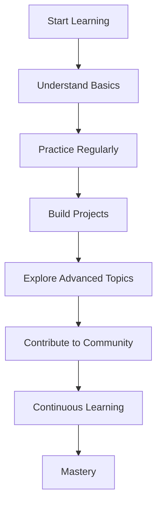

## 37.5 Final Thoughts

As we reach the conclusion of our journey through the intricacies of functions and scope in JavaScript, it's essential to take a moment to reflect on the path we've traveled and the knowledge we've gained. Functions are not just a feature of JavaScript; they are a cornerstone of programming itself. Understanding and mastering them opens up a world of possibilities, allowing you to write more efficient, reusable, and organized code.

### The Power and Versatility of Functions

Functions are the building blocks of any programming language. They allow us to encapsulate logic, perform operations, and return results. By mastering functions, you gain the ability to break down complex problems into manageable parts, making your code more readable and maintainable. Functions empower you to:

- **Organize Code**: By grouping related operations into functions, you create a more structured and understandable codebase.
- **Reuse Logic**: Functions can be reused across different parts of your application, reducing redundancy and potential errors.
- **Abstract Complexity**: Functions allow you to hide complex logic behind simple interfaces, making it easier to work with intricate systems.
- **Facilitate Collaboration**: Well-defined functions make it easier for teams to work together, as each team member can focus on specific parts of the code.

### Encouragement to Experiment and Innovate

Now that you've gained a solid foundation in functions and scope, it's time to put your knowledge into practice. Experimentation is a crucial part of learning. Don't be afraid to try new things, make mistakes, and learn from them. Here are some ways to continue your journey:

- **Build Projects**: Start small by building simple applications and gradually increase complexity as you become more comfortable.
- **Contribute to Open Source**: Join open-source projects to see how others use functions and scope in real-world applications.
- **Explore Advanced Topics**: Dive deeper into advanced topics like asynchronous programming, functional programming, and design patterns.
- **Participate in Coding Challenges**: Engage in coding challenges and hackathons to test your skills and learn from others.

### Expressing Appreciation

Your commitment to learning and growing as a programmer is commendable. By investing time and effort into understanding functions and scope, you've taken a significant step toward becoming a proficient JavaScript developer. Remember, learning is a lifelong journey, and every bit of knowledge you acquire builds a stronger foundation for your future endeavors.

### Inviting Feedback and Discussion

We value your feedback and encourage you to share your thoughts and experiences. Engaging in discussions with fellow learners can provide new insights and perspectives. Join online forums, participate in coding communities, and don't hesitate to ask questions. By fostering a community of learners, we can all grow and improve together.

### Embrace the Journey

As you continue to explore the world of programming, keep in mind that the journey is just as important as the destination. Stay curious, keep experimenting, and enjoy the process of discovery. With each new concept you learn, you'll find yourself more equipped to tackle challenges and create innovative solutions.

Remember, this is just the beginning. As you progress, you'll build more complex and interactive web pages. Keep experimenting, stay curious, and enjoy the journey!

### Visualizing Your Learning Path

To help you visualize your learning journey, let's look at a simple flowchart that represents the process of mastering JavaScript functions:



**Diagram Description**: This flowchart illustrates the learning path from starting with the basics of JavaScript functions to achieving mastery through continuous learning and community engagement.

### Code Example: Building a Simple Function Library

Let's put your skills to the test by creating a simple utility library. This exercise will reinforce your understanding of functions and encourage you to think creatively.

```javascript
// A simple utility library for basic math operations

// Function to add two numbers
function add(a, b) {
    return a + b;
}

// Function to subtract two numbers
function subtract(a, b) {
    return a - b;
}

// Function to multiply two numbers
function multiply(a, b) {
    return a * b;
}

// Function to divide two numbers
function divide(a, b) {
    if (b === 0) {
        throw new Error("Cannot divide by zero");
    }
    return a / b;
}

// Function to calculate the square of a number
function square(num) {
    return num * num;
}

// Function to calculate the square root of a number
function squareRoot(num) {
    return Math.sqrt(num);
}

// Try It Yourself: Add more functions to this library, such as power, modulus, or factorial.
```

### Key Takeaways

- **Functions are Fundamental**: They are essential for organizing and reusing code.
- **Scope Matters**: Understanding scope helps you manage variable accessibility and avoid conflicts.
- **Practice is Key**: Regular practice and experimentation lead to mastery.
- **Community Engagement**: Sharing knowledge and learning from others enriches your understanding.

### Quiz Time!



### What is one of the primary benefits of using functions in programming?

- [x] They help organize code and make it reusable.
- [ ] They make code run faster.
- [ ] They eliminate all bugs.
- [ ] They automatically document code.

> **Explanation:** Functions help organize code into reusable blocks, making it easier to read and maintain.

### What should you do if you want to continue learning after mastering the basics of functions?

- [x] Build projects and explore advanced topics.
- [ ] Stop learning and take a break.
- [ ] Only read books without practicing.
- [ ] Avoid contributing to open-source projects.

> **Explanation:** Building projects and exploring advanced topics help reinforce learning and expand your skills.

### Why is it important to understand scope in JavaScript?

- [x] It determines variable accessibility and prevents conflicts.
- [ ] It makes code run faster.
- [ ] It automatically fixes syntax errors.
- [ ] It is not important at all.

> **Explanation:** Understanding scope is crucial for managing variable accessibility and avoiding conflicts in your code.

### What is a good way to engage with the programming community?

- [x] Participate in online forums and coding communities.
- [ ] Keep your knowledge to yourself.
- [ ] Only read others' code without sharing yours.
- [ ] Avoid asking questions.

> **Explanation:** Engaging in discussions and asking questions in coding communities can provide new insights and perspectives.

### What is the purpose of the `divide` function in the provided code example?

- [x] To divide two numbers and handle division by zero.
- [ ] To multiply two numbers.
- [ ] To add two numbers.
- [ ] To subtract two numbers.

> **Explanation:** The `divide` function divides two numbers and includes error handling for division by zero.

### What is the first step in the flowchart for mastering JavaScript functions?

- [x] Start Learning
- [ ] Build Projects
- [ ] Understand Basics
- [ ] Contribute to Community

> **Explanation:** The first step is to start learning the basics of JavaScript functions.

### How can you contribute to open-source projects?

- [x] By joining projects and seeing how others use functions.
- [ ] By only reading documentation.
- [ ] By avoiding collaboration with others.
- [ ] By keeping your code private.

> **Explanation:** Contributing to open-source projects allows you to learn from others and see real-world applications of functions.

### What should you do if you encounter challenges while learning?

- [x] Experiment and learn from mistakes.
- [ ] Give up and stop trying.
- [ ] Ignore the challenges.
- [ ] Only read more books.

> **Explanation:** Experimenting and learning from mistakes is a crucial part of the learning process.

### What is the benefit of using well-defined functions in a team environment?

- [x] They make it easier for teams to work together.
- [ ] They make code run slower.
- [ ] They increase the number of bugs.
- [ ] They make code harder to read.

> **Explanation:** Well-defined functions facilitate collaboration by allowing team members to focus on specific parts of the code.

### True or False: Functions are only useful for small projects.

- [ ] True
- [x] False

> **Explanation:** Functions are useful for projects of all sizes, as they help organize and manage code effectively.



As you continue your journey, remember that the world of programming is vast and full of opportunities. Embrace the challenges, celebrate your successes, and never stop learning. Happy coding!
