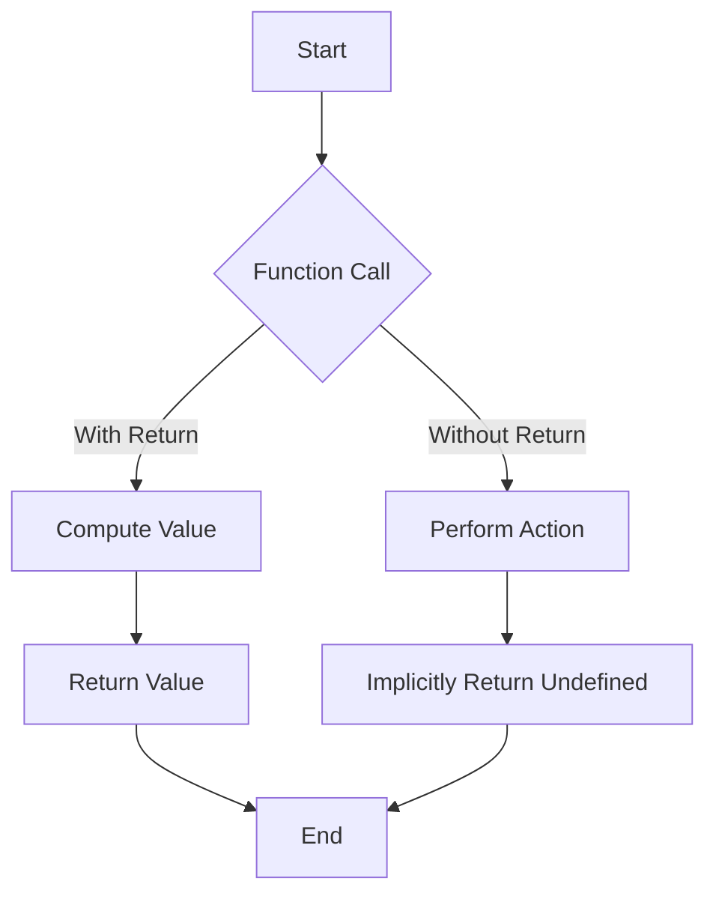

## 4.2 Returning vs. Not Returning

In the world of JavaScript, functions are versatile building blocks that can either return a value or not. Understanding the difference between functions that return values and those that don't is crucial for writing efficient and effective code. In this section, we'll explore the implications of using return statements, when it's appropriate not to return a value, and how to design functions consistently.

### Understanding the `return` Statement

The `return` statement in JavaScript is used to exit a function and optionally pass a value back to the caller. When a function reaches a `return` statement, it stops executing and returns the specified value. If no value is specified, the function returns `undefined`.

#### Example: Basic Return Statement

```javascript
function add(a, b) {
    return a + b; // Returns the sum of a and b
}

let sum = add(5, 3);
console.log(sum); // Outputs: 8
```

In this example, the `add` function takes two parameters, `a` and `b`, adds them together, and returns the result. When we call `add(5, 3)`, the function returns `8`, which is then stored in the variable `sum`.

### Functions Without a Return Statement

If a function does not explicitly use a `return` statement, it implicitly returns `undefined`. This behavior can be useful in scenarios where a function is intended to perform an action rather than compute a value.

#### Example: Function Without Return

```javascript
function greet(name) {
    console.log(`Hello, ${name}!`);
}

greet('Alice'); // Outputs: Hello, Alice!
```

In this example, the `greet` function prints a greeting message to the console but does not return any value. When called, it performs its task and exits, returning `undefined` implicitly.

### When Not Returning a Value is Acceptable

There are several scenarios where not returning a value from a function is perfectly acceptable and even desirable:

1. **Procedural Functions**: Functions that perform actions or side effects, such as logging messages, updating the DOM, or modifying global variables, often do not need to return a value.

2. **Event Handlers**: Functions used as event handlers typically do not return values, as their purpose is to respond to events, such as user interactions.

3. **Utility Functions**: Helper functions that encapsulate repetitive tasks, like setting up configurations or initializing states, may not require a return value.

#### Example: Procedural Function

```javascript
function updateUserProfile(user) {
    user.lastUpdated = new Date();
    console.log('User profile updated.');
}

let user = { name: 'Bob', lastUpdated: null };
updateUserProfile(user);
console.log(user.lastUpdated); // Outputs the current date and time
```

In this example, the `updateUserProfile` function updates the `lastUpdated` property of a user object and logs a message. It doesn't return a value because its purpose is to modify the object and provide feedback through the console.

### Functions as Procedures vs. Functions That Compute

Understanding the distinction between functions as procedures and functions that compute values is essential for designing clear and consistent code.

- **Procedural Functions**: These functions focus on performing actions or side effects. They often interact with external systems or modify external states. Examples include functions that write to a database, send HTTP requests, or manipulate the DOM.

- **Computational Functions**: These functions focus on processing data and returning results. They are often pure functions, meaning they do not cause side effects and their output depends solely on their input. Examples include mathematical calculations, data transformations, and string manipulations.

#### Example: Computational Function

```javascript
function calculateArea(radius) {
    return Math.PI * radius * radius; // Returns the area of a circle
}

let area = calculateArea(5);
console.log(area); // Outputs: 78.53981633974483
```

In this example, the `calculateArea` function computes the area of a circle based on the given radius and returns the result. It is a computational function because it processes input and produces output without side effects.

### Consistent Function Design

Consistency in function design is crucial for maintaining readable and maintainable code. Here are some guidelines to ensure consistency:

1. **Define Clear Purpose**: Each function should have a clear purpose, whether it's performing an action or computing a value. Avoid mixing these responsibilities within a single function.

2. **Use Return Statements Wisely**: Use return statements to provide meaningful results. If a function doesn't need to return a value, ensure its purpose is clear and justified.

3. **Document Function Behavior**: Clearly document whether a function returns a value and what that value represents. This helps other developers understand how to use the function correctly.

4. **Avoid Side Effects in Computational Functions**: Keep computational functions pure by avoiding side effects. This makes them easier to test and reason about.

5. **Be Consistent with Naming**: Use naming conventions that reflect the function's behavior. For example, use verbs for procedural functions (e.g., `updateUser`) and nouns for computational functions (e.g., `calculateArea`).

### Code Examples: Returning vs. Not Returning

Let's explore some code examples to illustrate the differences between functions that return values and those that don't.

#### Example 1: Function with Return

```javascript
function multiply(a, b) {
    return a * b; // Returns the product of a and b
}

let product = multiply(4, 5);
console.log(product); // Outputs: 20
```

In this example, the `multiply` function returns the product of two numbers. The result is stored in the variable `product` and can be used in further calculations.

#### Example 2: Function Without Return

```javascript
function logMessage(message) {
    console.log(message); // Logs the message to the console
}

logMessage('This is a log message.'); // Outputs: This is a log message.
```

Here, the `logMessage` function logs a message to the console. It doesn't return a value because its purpose is to perform an action rather than compute a result.

### Visualizing Function Behavior

To better understand the flow of functions with and without return statements, let's visualize the process using a flowchart.



**Caption**: This flowchart illustrates the two possible paths a function can take: computing a value and returning it, or performing an action and implicitly returning `undefined`.

### Try It Yourself: Experiment with Return Statements

To solidify your understanding, try modifying the following code examples:

1. **Add a Return Statement**: Modify the `logMessage` function to return the length of the message string.

2. **Remove a Return Statement**: Modify the `multiply` function to log the result instead of returning it.

3. **Create a New Function**: Write a function that takes an array of numbers and returns the sum of all even numbers. Then, modify it to log the sum instead of returning it.

### References and Further Reading

- [MDN Web Docs: Functions](https://developer.mozilla.org/en-US/docs/Web/JavaScript/Guide/Functions)
- [W3Schools: JavaScript Functions](https://www.w3schools.com/js/js_functions.asp)

### Knowledge Check

1. **What does a function return if it doesn't have a return statement?**

2. **When is it appropriate for a function not to return a value?**

3. **What is the difference between procedural and computational functions?**

4. **Why is consistent function design important?**

5. **How can you document a function's behavior effectively?**

### Embrace the Journey

Remember, understanding when to use return statements and when not to is a fundamental skill in JavaScript programming. As you continue to learn and practice, you'll become more adept at designing functions that are both effective and efficient. Keep experimenting, stay curious, and enjoy the journey!

## Quiz Time!



### What does a function return if it doesn't have a return statement?

- [x] `undefined`
- [ ] `null`
- [ ] `0`
- [ ] An error

> **Explanation:** If a function does not have a return statement, it returns `undefined` by default.

### Which type of function is more likely to have a return statement?

- [x] Computational function
- [ ] Procedural function
- [ ] Event handler
- [ ] Utility function

> **Explanation:** Computational functions are designed to process data and return a result, making them more likely to have a return statement.

### Why might a procedural function not have a return statement?

- [x] It performs actions or side effects
- [ ] It always returns `null`
- [ ] It cannot compute values
- [ ] It is an error

> **Explanation:** Procedural functions focus on performing actions or side effects, so they may not need to return a value.

### What is a key characteristic of a pure function?

- [x] No side effects
- [ ] Always returns `null`
- [ ] Modifies global variables
- [ ] Depends on external systems

> **Explanation:** Pure functions have no side effects and their output depends solely on their input.

### How can you ensure consistent function design?

- [x] Define a clear purpose for each function
- [ ] Avoid using return statements
- [x] Use naming conventions that reflect behavior
- [ ] Mix procedural and computational tasks

> **Explanation:** Consistent function design involves defining a clear purpose and using naming conventions that reflect the function's behavior.

### What should you document about a function?

- [x] Whether it returns a value
- [ ] Its memory usage
- [ ] Its execution time
- [ ] Its internal variables

> **Explanation:** Documenting whether a function returns a value helps other developers understand how to use it correctly.

### Which function type is more likely to modify external states?

- [x] Procedural function
- [ ] Computational function
- [ ] Pure function
- [ ] Recursive function

> **Explanation:** Procedural functions often interact with external systems or modify external states.

### What is the default return value of a function without a return statement?

- [x] `undefined`
- [ ] `null`
- [ ] `0`
- [ ] An error

> **Explanation:** The default return value of a function without a return statement is `undefined`.

### How can you modify a function to return a value?

- [x] Add a return statement with a value
- [ ] Remove all parameters
- [ ] Use a global variable
- [ ] Change its name

> **Explanation:** Adding a return statement with a value allows a function to return that value.

### True or False: A function can have multiple return statements.

- [x] True
- [ ] False

> **Explanation:** A function can have multiple return statements, often used for conditional returns.


