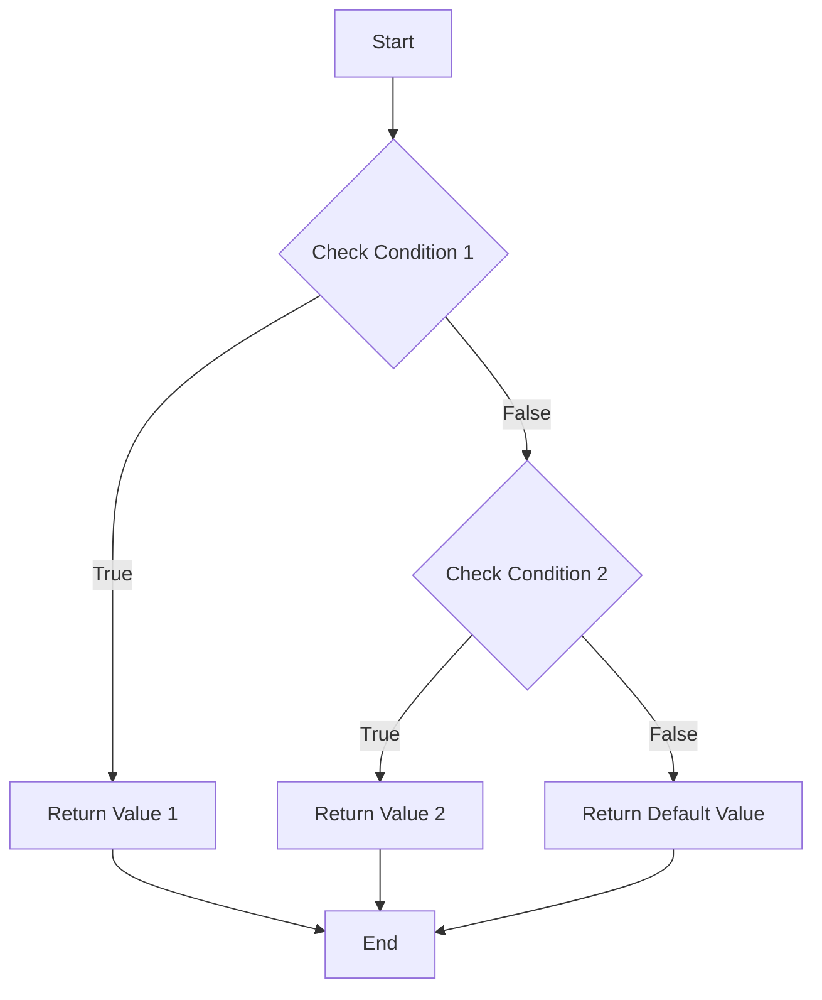

## 4.3 Multiple Return Statements

In the world of programming, functions are the building blocks that allow us to encapsulate logic and perform specific tasks. One powerful feature of functions is their ability to return values. In this section, we'll explore how to use multiple return statements in JavaScript functions to enhance code clarity and efficiency. We'll cover how to conditionally return values, discuss readability and maintainability considerations, and highlight best practices for using multiple returns.

### Understanding Return Statements

Before diving into multiple return statements, let's briefly revisit what a return statement is. In JavaScript, a return statement is used to exit a function and optionally pass a value back to the caller. When a return statement is executed, the function stops executing, and control is returned to the point where the function was called.

Here's a simple example of a function with a single return statement:

```javascript
function add(a, b) {
    return a + b;
}

let sum = add(5, 3);
console.log(sum); // Output: 8
```

In this example, the `add` function takes two parameters, `a` and `b`, and returns their sum.

### Introducing Multiple Return Statements

Multiple return statements allow a function to exit at different points based on certain conditions. This can be particularly useful for simplifying logic and improving code readability. Let's explore how to implement multiple return statements using conditional logic.

### Using `if` Statements for Conditional Returns

One common use case for multiple return statements is to handle different conditions within a function. By using `if` statements, we can return different values based on specific criteria. Here's an example:

```javascript
function checkNumber(num) {
    if (num > 0) {
        return "Positive";
    }
    if (num < 0) {
        return "Negative";
    }
    return "Zero";
}

console.log(checkNumber(10));  // Output: Positive
console.log(checkNumber(-5));  // Output: Negative
console.log(checkNumber(0));   // Output: Zero
```

In the `checkNumber` function, we use multiple `if` statements to check whether the input number is positive, negative, or zero. Each condition has its own return statement, allowing the function to exit as soon as a condition is met.

### Readability and Maintainability Considerations

While multiple return statements can make your code more concise, it's important to consider readability and maintainability. Here are some tips to keep in mind:

1. **Keep It Simple**: Avoid overly complex logic with too many return points. This can make the function difficult to understand and maintain.

2. **Use Comments**: Add comments to explain the purpose of each return statement, especially if the logic is not immediately obvious.

3. **Consistent Style**: Follow a consistent coding style for return statements to make your code easier to read.

4. **Avoid Deep Nesting**: Try to avoid deeply nested `if` statements, as they can make the code harder to follow. Instead, consider using early returns to simplify the logic.

### Early Returns for Simplifying Logic

Early returns are a powerful technique for simplifying complex logic within a function. By returning early, you can avoid unnecessary computations and make your code more efficient. Here's an example:

```javascript
function isValidAge(age) {
    if (age < 0) {
        return false; // Early return for invalid age
    }
    if (age < 18) {
        return false; // Early return for underage
    }
    return true; // Valid age
}

console.log(isValidAge(-5));  // Output: false
console.log(isValidAge(15));  // Output: false
console.log(isValidAge(25));  // Output: true
```

In the `isValidAge` function, we use early returns to handle invalid and underage cases. This allows us to exit the function as soon as we determine that the age is not valid, without executing further logic.

### Best Practices for Using Multiple Returns

To make the most of multiple return statements, consider the following best practices:

- **Clarity Over Brevity**: While it's tempting to use multiple returns to make your code shorter, prioritize clarity. Ensure that each return statement is easy to understand.

- **Avoid Side Effects**: Functions with multiple return statements should avoid side effects, such as modifying global variables. This helps maintain predictable behavior.

- **Consistent Return Types**: Ensure that all return statements in a function return the same type of value. This prevents unexpected behavior and makes the function easier to use.

- **Test Thoroughly**: Test your functions with various inputs to ensure that all return paths are covered and behave as expected.

### Visualizing Multiple Return Statements

To better understand how multiple return statements work, let's visualize the flow of a function with a flowchart. This can help you see how different conditions lead to different return points.



In this flowchart, we start with a function and check the first condition. If it's true, we return the first value and exit the function. If it's false, we check the second condition. If the second condition is true, we return the second value. If neither condition is met, we return a default value.

### Try It Yourself

Now that we've covered the basics of multiple return statements, it's time to experiment with your own code. Try modifying the examples we've discussed or create your own functions with multiple return points. Here are some ideas to get you started:

- Create a function that checks if a number is even or odd and returns a corresponding message.
- Write a function that takes a string and returns different responses based on its length.
- Implement a function that evaluates a student's grade and returns a letter grade (A, B, C, etc.) based on the score.

### Knowledge Check

To reinforce your understanding of multiple return statements, let's go through a few questions and exercises:

1. **What is the purpose of a return statement in a function?**

2. **How can multiple return statements improve code readability?**

3. **What are some best practices for using multiple return statements?**

4. **Write a function that takes a temperature in Celsius and returns "Cold", "Warm", or "Hot" based on the value.**

5. **Explain how early returns can simplify complex logic in a function.**

### Embrace the Journey

As you continue your journey in learning JavaScript, remember that mastering functions and their return statements is a crucial step. Functions are the backbone of any program, and understanding how to use them effectively will empower you to write cleaner, more efficient code. Keep experimenting, stay curious, and enjoy the process of becoming a proficient JavaScript developer!

## Quiz Time!



### What is the main purpose of a return statement in a function?

- [x] To exit the function and optionally return a value to the caller.
- [ ] To declare a variable within the function.
- [ ] To loop through an array.
- [ ] To print a message to the console.

> **Explanation:** A return statement is used to exit a function and optionally pass a value back to the caller.


### How can multiple return statements improve code readability?

- [x] By allowing functions to exit early based on conditions, reducing unnecessary code execution.
- [ ] By making functions longer and more complex.
- [ ] By increasing the number of loops in the function.
- [ ] By adding more variables to the function.

> **Explanation:** Multiple return statements can improve readability by allowing functions to exit early when certain conditions are met, simplifying the logic.


### What is an early return in a function?

- [x] A technique where the function exits as soon as a condition is met, avoiding further execution.
- [ ] A return statement placed at the end of the function.
- [ ] A return statement that returns multiple values.
- [ ] A return statement that is executed only in loops.

> **Explanation:** An early return is when a function exits as soon as a condition is met, which can simplify logic and improve efficiency.


### Which of the following is a best practice for using multiple return statements?

- [x] Ensure all return statements return the same type of value.
- [ ] Use as many return statements as possible for brevity.
- [ ] Always place return statements at the end of the function.
- [ ] Avoid using return statements in conditional logic.

> **Explanation:** It's important to ensure that all return statements in a function return the same type of value to maintain consistency.


### What should you avoid when using multiple return statements?

- [x] Avoid side effects such as modifying global variables.
- [ ] Avoid using any return statements.
- [ ] Avoid using conditional logic.
- [ ] Avoid returning the same type of value.

> **Explanation:** Functions with multiple return statements should avoid side effects to maintain predictable behavior.


### What is the benefit of using comments with multiple return statements?

- [x] They help explain the purpose of each return statement, improving readability.
- [ ] They increase the execution speed of the function.
- [ ] They allow the function to return multiple values.
- [ ] They eliminate the need for return statements.

> **Explanation:** Comments can help explain the purpose of each return statement, making the code easier to understand.


### How can early returns affect the performance of a function?

- [x] They can improve performance by exiting the function early, avoiding unnecessary computations.
- [ ] They decrease performance by adding more return statements.
- [ ] They have no impact on performance.
- [ ] They increase the complexity of the function.

> **Explanation:** Early returns can improve performance by exiting the function early, which avoids unnecessary computations.


### What is a potential downside of using too many return statements?

- [x] It can make the function difficult to understand and maintain.
- [ ] It makes the function run faster.
- [ ] It simplifies the logic of the function.
- [ ] It increases the number of variables in the function.

> **Explanation:** Using too many return statements can make the function difficult to understand and maintain.


### How can you test functions with multiple return statements?

- [x] By testing with various inputs to ensure all return paths are covered and behave as expected.
- [ ] By avoiding testing altogether.
- [ ] By only testing the first return statement.
- [ ] By using a single test case for all return paths.

> **Explanation:** Testing with various inputs ensures that all return paths are covered and behave as expected.


### True or False: All return statements in a function should return the same type of value.

- [x] True
- [ ] False

> **Explanation:** Ensuring that all return statements return the same type of value helps maintain consistency and prevents unexpected behavior.


