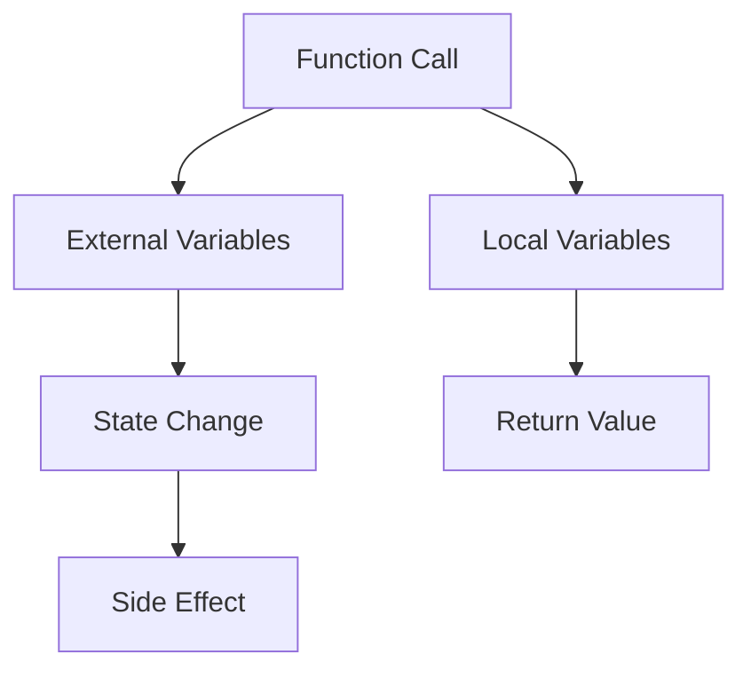

## 4.5 Function Side Effects

In the world of programming, especially in JavaScript, understanding how functions interact with the rest of your code is crucial. One of the key concepts to grasp is the idea of **side effects**. As you build more complex applications, being aware of side effects can help you write cleaner, more predictable, and easier-to-debug code.

### What are Side Effects?

In simple terms, a **side effect** occurs when a function modifies some state outside its local environment. This could involve changing a global variable, modifying an object passed by reference, or even performing operations like logging to the console or writing to a file. Side effects can make functions less predictable and harder to test because their output is not solely determined by their input parameters.

#### Key Characteristics of Side Effects

- **Modification of External State**: Changing variables or data structures that exist outside the function's scope.
- **Interaction with External Systems**: Making network requests, writing to a database, or interacting with the file system.
- **Non-deterministic Behavior**: Functions with side effects may produce different results when called with the same arguments, depending on the external state.

### Pure vs. Impure Functions

To understand side effects better, we need to differentiate between **pure** and **impure** functions.

#### Pure Functions

A **pure function** is a function where the output is determined only by its input values, without observable side effects. Pure functions have several benefits:

- **Predictability**: Given the same inputs, a pure function will always return the same output.
- **Easier Testing**: Since pure functions don't rely on external state, they are easier to test.
- **Referential Transparency**: Pure functions can be replaced with their output value without changing the program's behavior.

Here's an example of a pure function:

```javascript
// A pure function that adds two numbers
function add(a, b) {
  return a + b;
}

console.log(add(2, 3)); // Output: 5
```

#### Impure Functions

An **impure function** is one that has side effects or relies on external state. These functions can be more challenging to work with because they can produce different results even with the same inputs.

Here's an example of an impure function:

```javascript
let count = 0;

// An impure function that modifies an external variable
function increment() {
  count += 1;
  return count;
}

console.log(increment()); // Output: 1
console.log(increment()); // Output: 2
```

In this example, the `increment` function modifies the `count` variable, which is outside its local scope. This modification is a side effect.

### Examples of Side Effects

Let's explore some common scenarios where side effects occur in JavaScript functions.

#### Modifying Global Variables

Global variables are accessible from anywhere in your code, which makes them prone to being modified by functions, leading to side effects.

```javascript
let message = "Hello";

// An impure function that modifies a global variable
function changeMessage(newMessage) {
  message = newMessage;
}

changeMessage("Hi");
console.log(message); // Output: Hi
```

In this example, the `changeMessage` function changes the value of the global variable `message`, which is a side effect.

#### Modifying Objects or Arrays

When you pass objects or arrays to functions, they are passed by reference. This means that if a function modifies an object or array, it affects the original data structure outside the function.

```javascript
let user = {
  name: "Alice",
  age: 25
};

// An impure function that modifies an object
function updateAge(user, newAge) {
  user.age = newAge;
}

updateAge(user, 30);
console.log(user.age); // Output: 30
```

Here, the `updateAge` function changes the `age` property of the `user` object, which is a side effect.

#### Performing I/O Operations

Functions that perform input/output operations, such as reading from or writing to a file, making network requests, or logging to the console, inherently have side effects.

```javascript
// An impure function that logs to the console
function logMessage(message) {
  console.log(message);
}

logMessage("This is a side effect"); // Output: This is a side effect
```

### Implications for Debugging and Testing

Functions with side effects can complicate debugging and testing. Here are some implications to consider:

#### Debugging Challenges

- **Unpredictable Behavior**: Since impure functions rely on external state, they can behave unpredictably, making it harder to trace bugs.
- **Hidden Dependencies**: Side effects can create hidden dependencies between functions, leading to unexpected interactions.

#### Testing Challenges

- **State Management**: Testing functions with side effects often requires setting up and tearing down specific states, which can be cumbersome.
- **Mocking and Stubbing**: You may need to use techniques like mocking or stubbing to isolate functions from their side effects during testing.

### Best Practices for Managing Side Effects

While side effects are sometimes unavoidable, there are strategies to manage them effectively:

#### Minimize Side Effects

- **Limit Scope**: Keep variables local to functions whenever possible to reduce the risk of unintended modifications.
- **Use Pure Functions**: Favor pure functions for logic that doesn't require interaction with external systems.

#### Isolate Side Effects

- **Encapsulate Side Effects**: Group side effects in specific functions or modules to isolate them from the rest of your code.
- **Use Middleware**: In frameworks like Redux, middleware can handle side effects separately from the main application logic.

#### Document Side Effects

- **Comments and Documentation**: Clearly document any side effects in your functions to make them easier to understand and maintain.

### Visualizing Side Effects

To further understand side effects, let's visualize how a function interacts with external variables and state.



**Figure 1**: This diagram illustrates how a function call can interact with both local and external variables, leading to state changes and side effects.

### Try It Yourself

Experiment with the following code to see side effects in action. Try modifying the code to understand how changes affect the output.

```javascript
let counter = 0;

function incrementCounter() {
  counter += 1;
  return counter;
}

console.log(incrementCounter()); // Output: 1
console.log(incrementCounter()); // Output: 2

// Try changing the initial value of counter or the increment logic
```

### Further Reading and Resources

For more information on side effects and related topics, consider exploring the following resources:

- [MDN Web Docs on Functions](https://developer.mozilla.org/en-US/docs/Web/JavaScript/Guide/Functions)
- [JavaScript Info on Side Effects](https://javascript.info/function-basics#side-effects)
- [W3Schools JavaScript Functions](https://www.w3schools.com/js/js_functions.asp)

### Key Takeaways

- **Side effects** occur when a function modifies external state or interacts with external systems.
- **Pure functions** are predictable and easier to test because they don't have side effects.
- **Impure functions** can be more challenging to debug and test due to their reliance on external state.
- **Managing side effects** involves minimizing, isolating, and documenting them to improve code maintainability.

Remember, understanding side effects is a crucial step in mastering JavaScript functions. As you continue your journey, keep experimenting and refining your skills!

## Quiz Time!



### What is a side effect in the context of functions?

- [x] Modifying external state or interacting with external systems
- [ ] Returning a value from a function
- [ ] Using local variables within a function
- [ ] Declaring a function inside another function

> **Explanation:** A side effect occurs when a function modifies external state or interacts with external systems, affecting the program's behavior outside the function.

### Which of the following is a characteristic of a pure function?

- [x] It always returns the same output for the same inputs
- [ ] It modifies global variables
- [ ] It logs messages to the console
- [ ] It performs network requests

> **Explanation:** A pure function always returns the same output for the same inputs and does not have side effects.

### What makes a function impure?

- [x] It has side effects
- [ ] It uses local variables
- [ ] It returns a value
- [ ] It is defined inside another function

> **Explanation:** An impure function has side effects, meaning it modifies external state or interacts with external systems.

### Which of the following is an example of a side effect?

- [x] Modifying a global variable
- [ ] Declaring a local variable
- [ ] Returning a sum of two numbers
- [ ] Using a loop inside a function

> **Explanation:** Modifying a global variable is a side effect because it changes the program's state outside the function.

### How can side effects complicate debugging?

- [x] They can lead to unpredictable behavior
- [ ] They make functions run faster
- [ ] They simplify the code
- [ ] They eliminate the need for testing

> **Explanation:** Side effects can lead to unpredictable behavior, making it harder to trace and fix bugs.

### What is a benefit of using pure functions?

- [x] Easier testing
- [ ] Increased side effects
- [ ] More complex code
- [ ] Slower execution

> **Explanation:** Pure functions are easier to test because they don't rely on external state and always produce the same output for the same inputs.

### Which strategy can help manage side effects?

- [x] Isolating side effects in specific functions
- [ ] Increasing the number of global variables
- [ ] Avoiding the use of functions
- [ ] Writing longer functions

> **Explanation:** Isolating side effects in specific functions helps manage them and improves code maintainability.

### What does it mean for a function to have referential transparency?

- [x] It can be replaced with its output value without changing the program's behavior
- [ ] It modifies external state
- [ ] It performs I/O operations
- [ ] It uses global variables

> **Explanation:** A function with referential transparency can be replaced with its output value without changing the program's behavior, a characteristic of pure functions.

### Why might you need to use mocking or stubbing in testing?

- [x] To isolate functions from their side effects
- [ ] To increase the complexity of tests
- [ ] To make tests run slower
- [ ] To avoid using functions

> **Explanation:** Mocking or stubbing is used to isolate functions from their side effects, making it easier to test them.

### True or False: All functions with side effects are impure functions.

- [x] True
- [ ] False

> **Explanation:** True. Functions with side effects are considered impure because they modify external state or interact with external systems.




