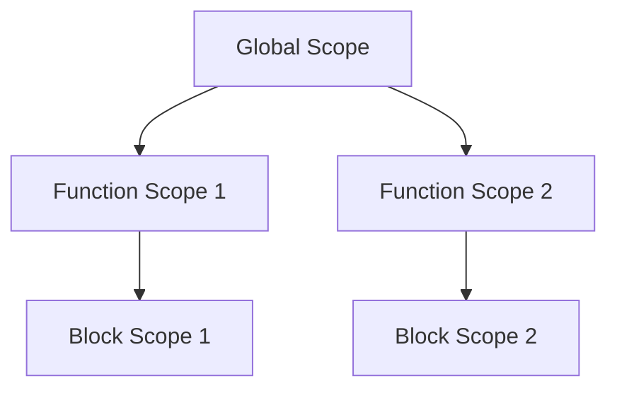

## 5.1 What is Scope?

In the world of programming, understanding the concept of scope is crucial. Scope determines the accessibility and lifetime of variables within your code. In JavaScript, scope plays a significant role in how functions operate and how variables are accessed. Let's delve into the world of scope, exploring its intricacies and how it affects your code.

### Understanding Scope in Programming

Scope in programming refers to the context in which variables and functions are accessible. It defines the area of your code where a variable is visible and can be used. Think of scope as a boundary or a container that holds variables. When you declare a variable, its scope determines where in your code you can access it.

#### Why is Scope Important?

Scope is essential for several reasons:

1. **Variable Access Control**: Scope controls which parts of your code can access specific variables. This prevents variables from being accessed or modified unexpectedly, reducing bugs and errors.

2. **Memory Management**: By limiting the lifetime of variables, scope helps in efficient memory usage. Variables are only kept in memory as long as they are needed.

3. **Code Organization**: Scope allows you to organize your code into manageable sections, making it easier to read and maintain.

### Types of Scope in JavaScript

JavaScript primarily has two types of scope: **global scope** and **local scope**. Let's explore each in detail.

#### Global Scope

Variables declared in the global scope are accessible from anywhere in your code. They are defined outside of any function or block. Global variables are available throughout the entire program, which means they can be accessed and modified by any part of your code.

**Example of Global Scope:**

```javascript
// Global variable
let globalVar = "I am global";

function showGlobalVar() {
    console.log(globalVar); // Accessible here
}

showGlobalVar(); // Output: I am global

console.log(globalVar); // Accessible here too
```

In this example, `globalVar` is declared outside any function, making it a global variable. It can be accessed both inside the `showGlobalVar` function and outside it.

#### Local Scope

Local scope refers to variables that are accessible only within a specific function or block. Variables declared within a function are local to that function and cannot be accessed from outside.

**Example of Local Scope:**

```javascript
function showLocalVar() {
    // Local variable
    let localVar = "I am local";
    console.log(localVar); // Accessible here
}

showLocalVar(); // Output: I am local

console.log(localVar); // Error: localVar is not defined
```

Here, `localVar` is declared inside the `showLocalVar` function, making it a local variable. It is only accessible within the function, and trying to access it outside results in an error.

### Visualizing Scope

To better understand scope, let's visualize it using a diagram. This diagram illustrates how global and local scopes interact in a JavaScript program.



**Diagram Explanation:**

- **Global Scope**: The top-level scope that contains all the functions and variables declared outside any function or block.
- **Function Scope 1 and 2**: Each function has its own local scope, containing variables declared within the function.
- **Block Scope 1 and 2**: Introduced with `let` and `const`, block scope limits the visibility of variables to the block they are declared in, such as within an `if` statement or a loop.

### Block Scope in JavaScript

JavaScript introduced block scope with the `let` and `const` keywords. Unlike `var`, which is function-scoped, `let` and `const` are block-scoped, meaning they are only accessible within the block they are defined in.

**Example of Block Scope:**

```javascript
if (true) {
    let blockVar = "I am block scoped";
    console.log(blockVar); // Accessible here
}

console.log(blockVar); // Error: blockVar is not defined
```

In this example, `blockVar` is declared inside an `if` block using `let`. It is only accessible within the block, and trying to access it outside results in an error.

### Scope Chain

When accessing a variable, JavaScript follows a scope chain to resolve it. The scope chain is a list of all the scopes in which a variable can be found. JavaScript starts from the innermost scope and moves outward until it finds the variable or reaches the global scope.

**Example of Scope Chain:**

```javascript
let outerVar = "I am outer";

function outerFunction() {
    let innerVar = "I am inner";

    function innerFunction() {
        console.log(innerVar); // Accessible here
        console.log(outerVar); // Accessible here
    }

    innerFunction();
}

outerFunction();
```

In this example, `innerFunction` can access both `innerVar` and `outerVar` due to the scope chain. It first looks for `innerVar` in its local scope, then moves to the `outerFunction` scope to find `outerVar`.

### Try It Yourself

Let's experiment with scope by modifying the examples. Try changing the variable declarations from `let` to `var` and observe how the scope changes. Additionally, try nesting functions and see how the scope chain affects variable accessibility.

### References and Links

For further reading on JavaScript scope, check out these resources:

- [MDN Web Docs: JavaScript Scope](https://developer.mozilla.org/en-US/docs/Glossary/Scope)
- [W3Schools: JavaScript Scope](https://www.w3schools.com/js/js_scope.asp)

### Knowledge Check

- What is scope in programming?
- How does scope control variable visibility and lifetime?
- Differentiate between global and local scope.
- How does block scope differ from function scope?

### Embrace the Journey

Remember, understanding scope is a fundamental step in mastering JavaScript. As you continue your journey, you'll encounter more complex scenarios involving scope, such as closures and hoisting. Keep experimenting, stay curious, and enjoy the process of learning!

## Quiz Time!



### What is the main purpose of scope in programming?

- [x] To control variable accessibility and lifetime
- [ ] To increase the speed of the program
- [ ] To make code more colorful
- [ ] To reduce the number of functions

> **Explanation:** Scope determines where variables can be accessed and how long they exist in memory, which is crucial for managing variable accessibility and lifetime.

### Which of the following is true about global scope?

- [x] Variables in global scope are accessible from anywhere in the code
- [ ] Variables in global scope are only accessible within functions
- [ ] Global scope variables are deleted after a function runs
- [ ] Global scope variables are only accessible within loops

> **Explanation:** Global scope variables are accessible throughout the entire program, regardless of where they are declared.

### What is the difference between `let` and `var` in terms of scope?

- [x] `let` is block-scoped, while `var` is function-scoped
- [ ] `let` is function-scoped, while `var` is block-scoped
- [ ] Both `let` and `var` are block-scoped
- [ ] Both `let` and `var` are function-scoped

> **Explanation:** `let` is block-scoped, meaning it is only accessible within the block it is declared in, while `var` is function-scoped.

### What happens when a variable is not found in the local scope?

- [x] JavaScript looks for the variable in the outer scope
- [ ] JavaScript throws an error immediately
- [ ] The program stops executing
- [ ] The variable is automatically created in the local scope

> **Explanation:** JavaScript follows the scope chain, moving outward to find the variable in the outer scopes until it reaches the global scope.

### Which keyword introduces block scope in JavaScript?

- [x] `let`
- [ ] `var`
- [x] `const`
- [ ] `function`

> **Explanation:** Both `let` and `const` introduce block scope, limiting the visibility of variables to the block they are declared in.

### How does scope help in memory management?

- [x] By limiting the lifetime of variables
- [ ] By increasing the number of variables
- [ ] By making functions run faster
- [ ] By reducing the size of the code

> **Explanation:** Scope helps in memory management by ensuring variables are only kept in memory as long as they are needed, thus limiting their lifetime.

### What is a scope chain?

- [x] A list of all scopes in which a variable can be found
- [ ] A chain of functions in a program
- [ ] A sequence of loops in a program
- [ ] A method to increase program speed

> **Explanation:** The scope chain is a list of all the scopes in which a variable can be found, starting from the innermost scope and moving outward.

### Can a local variable be accessed outside its function?

- [ ] Yes, always
- [x] No, it cannot
- [ ] Yes, if declared with `var`
- [ ] Yes, if declared with `let`

> **Explanation:** A local variable cannot be accessed outside its function, regardless of how it is declared.

### What is the result of trying to access a block-scoped variable outside its block?

- [x] An error is thrown
- [ ] The variable is accessible
- [ ] The variable is automatically created
- [ ] The program runs without any issues

> **Explanation:** Trying to access a block-scoped variable outside its block results in an error because the variable is not defined in that scope.

### Scope is only relevant in JavaScript.

- [ ] True
- [x] False

> **Explanation:** Scope is a fundamental concept in programming and is relevant in many programming languages, not just JavaScript.


