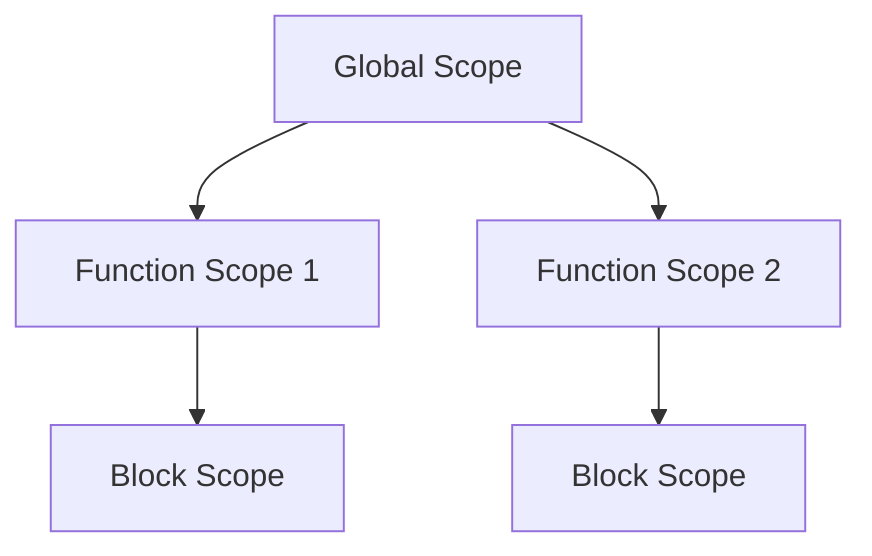

## 5.2 Global Scope

In the world of JavaScript, understanding scope is crucial to writing efficient and error-free code. Scope determines the accessibility of variables and functions at various parts of your code. In this section, we'll focus on the **global scope**, a fundamental concept that every JavaScript developer needs to grasp.

### What is Global Scope?

**Global scope** refers to the outermost scope in a JavaScript program. Variables declared in the global scope are accessible from anywhere in the code. This means that once a variable is declared globally, it can be used inside functions, loops, and any other blocks of code. 

#### Key Characteristics of Global Scope:

- **Accessibility**: Global variables are accessible from any part of the code, including inside functions and other blocks.
- **Longevity**: These variables exist for the entire duration of the program.
- **Namespace Pollution**: Overusing global variables can lead to conflicts and bugs, as different parts of the program might inadvertently modify them.

### Declaring Global Variables

Variables become global when they are declared outside of any function or block. Let's look at a simple example:

```javascript
// Declaring a global variable
var globalVariable = "I am global";

function displayGlobalVariable() {
  console.log(globalVariable); // Accessible here
}

displayGlobalVariable(); // Output: I am global
```

In the above example, `globalVariable` is declared outside any function, making it global. It can be accessed and modified from anywhere in the code.

#### Global Variables in the Browser

In a browser environment, global variables are properties of the `window` object. This means you can access them using `window.variableName`. Here's how it works:

```javascript
var myGlobal = "Hello, World!";
console.log(window.myGlobal); // Output: Hello, World!
```

### Risks of Using Global Variables

While global variables are convenient, they come with several risks:

1. **Namespace Pollution**: If multiple scripts declare global variables with the same name, they can overwrite each other, leading to unexpected behavior.

2. **Difficulty in Debugging**: Since global variables can be modified from anywhere, tracking down where a variable was changed can be challenging.

3. **Memory Leaks**: Global variables persist throughout the program's execution, potentially leading to memory leaks if not managed properly.

4. **Reduced Code Reusability**: Functions that rely on global variables are less portable and harder to reuse in different contexts.

### Best Practices to Minimize Global Variables

To avoid the pitfalls of global variables, consider these best practices:

1. **Use Local Variables**: Declare variables inside functions or blocks whenever possible to limit their scope.

2. **Encapsulation**: Use functions or immediately invoked function expressions (IIFEs) to encapsulate variables and prevent them from becoming global.

3. **Modular Code**: Organize your code into modules, which naturally limit scope and reduce reliance on global variables.

4. **Naming Conventions**: Use unique and descriptive names for global variables to minimize the risk of conflicts.

5. **Strict Mode**: Use JavaScript's strict mode (`'use strict';`) to catch common mistakes, such as accidental global variable declarations.

### Examples of Accidental Globals

Accidental globals occur when variables are declared without the `var`, `let`, or `const` keywords. In non-strict mode, this results in the creation of a global variable. Here's an example:

```javascript
function createAccidentalGlobal() {
  accidentalGlobal = "Oops! I'm global"; // No var, let, or const
}

createAccidentalGlobal();
console.log(accidentalGlobal); // Output: Oops! I'm global
```

To avoid accidental globals, always declare variables with `var`, `let`, or `const`.

### Avoiding Accidental Globals

1. **Always Declare Variables**: Use `var`, `let`, or `const` to declare variables explicitly.

2. **Use Strict Mode**: Enable strict mode to catch undeclared variables.

3. **Linting Tools**: Use tools like ESLint to catch potential issues in your code.

### Visualizing Global Scope

To better understand how global scope works, let's visualize it using a scope chain diagram. This diagram shows how JavaScript resolves variables by looking through different scopes.



**Diagram Explanation**: 

- **Global Scope**: The top-level scope accessible to all functions and blocks.
- **Function Scope 1 & 2**: Functions have their own scope, but can access variables from the global scope.
- **Block Scope**: Introduced with `let` and `const`, block scope limits variable accessibility to the block in which they are declared.

### Try It Yourself

To reinforce your understanding of global scope, try modifying the following code:

```javascript
// Global variable
var greeting = "Hello";

// Function that uses the global variable
function sayHello() {
  console.log(greeting);
}

// Modify the global variable
greeting = "Hi";
sayHello(); // What will this output?
```

**Challenge**: Change the `greeting` variable inside the `sayHello` function and observe how it affects the output. Try declaring a local variable with the same name and see what happens.

### References and Further Reading

- [MDN Web Docs on JavaScript Scope](https://developer.mozilla.org/en-US/docs/Web/JavaScript/Guide/Functions#function_scope)
- [W3Schools JavaScript Scope](https://www.w3schools.com/js/js_scope.asp)

### Knowledge Check

- What is global scope, and how does it differ from local scope?
- Why should we minimize the use of global variables?
- How can we avoid creating accidental global variables?

### Embrace the Journey

Remember, understanding scope is a foundational skill in JavaScript. As you continue to learn, you'll find that managing scope effectively leads to cleaner, more efficient code. Keep experimenting, stay curious, and enjoy the journey!

## Quiz Time!



### What is a characteristic of global variables?

- [x] They are accessible from anywhere in the code.
- [ ] They are only accessible within the function they are declared in.
- [ ] They are automatically deleted after the function execution.
- [ ] They are only accessible within the block they are declared in.

> **Explanation:** Global variables are accessible from anywhere in the code, making them available throughout the entire program.

### How can you declare a global variable in JavaScript?

- [x] By declaring it outside of any function or block.
- [ ] By using the `let` keyword inside a function.
- [ ] By declaring it inside a block with `const`.
- [ ] By using the `var` keyword inside a loop.

> **Explanation:** A global variable is declared outside of any function or block, making it accessible throughout the program.

### What is a risk associated with global variables?

- [x] Namespace pollution.
- [ ] They are difficult to declare.
- [ ] They cannot be modified.
- [ ] They are automatically garbage collected.

> **Explanation:** Global variables can lead to namespace pollution, where different parts of the program might inadvertently modify them.

### How can you avoid creating accidental global variables?

- [x] Use `var`, `let`, or `const` to declare variables.
- [ ] Declare variables inside loops.
- [ ] Use global variables for all data.
- [ ] Avoid using functions.

> **Explanation:** Always use `var`, `let`, or `const` to declare variables explicitly to avoid accidental globals.

### What happens if you declare a variable without `var`, `let`, or `const` in non-strict mode?

- [x] It becomes a global variable.
- [ ] It becomes a local variable.
- [ ] It throws an error.
- [ ] It is automatically deleted.

> **Explanation:** In non-strict mode, declaring a variable without `var`, `let`, or `const` results in a global variable.

### What is a best practice to minimize global variables?

- [x] Use encapsulation to limit scope.
- [ ] Declare all variables globally.
- [ ] Avoid using functions.
- [ ] Use global variables for all configurations.

> **Explanation:** Encapsulation helps limit scope and reduce reliance on global variables.

### What is the `window` object in a browser environment?

- [x] It is the global object that holds global variables.
- [ ] It is a function that creates global variables.
- [ ] It is a method to declare variables.
- [ ] It is a keyword to access local variables.

> **Explanation:** In a browser environment, the `window` object is the global object that holds global variables.

### What is a common issue with global variables?

- [x] They can be modified from anywhere, making debugging difficult.
- [ ] They are easy to declare.
- [ ] They are automatically optimized.
- [ ] They are only accessible within functions.

> **Explanation:** Global variables can be modified from anywhere, making it challenging to track changes and debug.

### How does strict mode help with global variables?

- [x] It catches undeclared variables, preventing accidental globals.
- [ ] It automatically declares all variables globally.
- [ ] It deletes global variables after use.
- [ ] It makes global variables read-only.

> **Explanation:** Strict mode catches undeclared variables, preventing accidental creation of global variables.

### True or False: Global variables are always the best choice for storing data.

- [ ] True
- [x] False

> **Explanation:** False. While global variables are accessible everywhere, they come with risks like namespace pollution and difficulty in debugging, making them not always the best choice.




