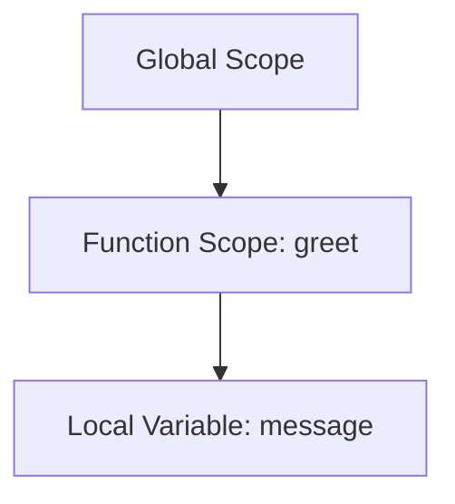

## 5.3 Function Scope

In the fascinating world of JavaScript, understanding how variables are scoped within functions is crucial for writing efficient and bug-free code. Function scope is a fundamental concept that determines the accessibility and lifetime of variables within a function. In this section, we will delve into the intricacies of function scope, explore how it promotes encapsulation, and learn how to avoid common pitfalls associated with variable scope.

### What is Function Scope?

**Function scope** refers to the visibility and accessibility of variables within a function. In JavaScript, variables declared inside a function are local to that function. This means they can only be accessed and modified within the function where they are declared. Once the function execution is complete, these variables are no longer accessible and are typically garbage collected by the JavaScript engine.

#### Example of Function Scope

Let's take a look at a simple example to understand function scope:

```javascript
function greet() {
    var message = "Hello, World!";
    console.log(message); // Output: Hello, World!
}

greet();
console.log(message); // Error: message is not defined
```

In this example, the variable `message` is declared inside the `greet` function using the `var` keyword. It is accessible within the function, but trying to access it outside the function results in an error because `message` is not defined in the global scope.

### Encapsulation through Function Scope

Function scope is a powerful tool for encapsulation, a programming principle that involves bundling data and methods that operate on that data within a single unit. Encapsulation helps in hiding the internal state of a function and exposing only the necessary parts to the outside world. This promotes modularity and reduces the risk of unintended interference with the function's internal variables.

#### Example of Encapsulation

Consider the following example that demonstrates encapsulation using function scope:

```javascript
function counter() {
    var count = 0;

    return function() {
        count++;
        return count;
    };
}

var increment = counter();

console.log(increment()); // Output: 1
console.log(increment()); // Output: 2
console.log(increment()); // Output: 3
```

In this example, the `counter` function encapsulates the `count` variable. The inner function returned by `counter` has access to `count` due to closure, but `count` is not accessible from outside the `counter` function. This encapsulation ensures that the `count` variable is protected from external modifications.

### Variable Declaration Keywords: `var`, `let`, and `const`

JavaScript provides three keywords for variable declaration: `var`, `let`, and `const`. Understanding their differences is essential for mastering function scope.

#### `var` Keyword

- Variables declared with `var` are function-scoped.
- They are hoisted to the top of their containing function or global scope.
- `var` allows re-declaration of variables within the same scope.

#### Example of `var` Scope

```javascript
function exampleVar() {
    var x = 10;
    if (true) {
        var x = 20; // Same variable as above
        console.log(x); // Output: 20
    }
    console.log(x); // Output: 20
}

exampleVar();
```

In this example, the `var` keyword does not create a new scope within the `if` block, so the `x` variable is the same throughout the function.

#### `let` and `const` Keywords

- Both `let` and `const` are block-scoped, meaning they are only accessible within the block they are declared.
- `let` allows reassignment, while `const` does not.
- They prevent re-declaration within the same scope.

#### Example of `let` and `const` Scope

```javascript
function exampleLetConst() {
    let y = 10;
    const z = 30;
    if (true) {
        let y = 20; // Different variable
        const z = 40; // Different variable
        console.log(y); // Output: 20
        console.log(z); // Output: 40
    }
    console.log(y); // Output: 10
    console.log(z); // Output: 30
}

exampleLetConst();
```

In this example, `let` and `const` create a new scope within the `if` block, so the variables `y` and `z` inside the block are different from those outside.

### Common Mistakes Related to Function Scope

Understanding function scope is essential to avoid common mistakes that can lead to bugs and unexpected behavior in your code. Here are some pitfalls to watch out for:

#### 1. Forgetting to Declare Variables

If you forget to declare a variable using `var`, `let`, or `const`, it becomes a global variable, which can lead to unintended side effects.

```javascript
function exampleMistake() {
    undeclaredVariable = 100; // Becomes a global variable
}

exampleMistake();
console.log(undeclaredVariable); // Output: 100
```

#### 2. Misusing `var` in Loops

Using `var` in loops can lead to unexpected behavior due to its function scope.

```javascript
function exampleLoop() {
    for (var i = 0; i < 3; i++) {
        setTimeout(function() {
            console.log(i); // Output: 3, 3, 3
        }, 1000);
    }
}

exampleLoop();
```

In this example, the `var` keyword causes the `i` variable to be shared across all iterations of the loop. Using `let` instead would create a new scope for each iteration.

#### 3. Overwriting Global Variables

Accidentally overwriting global variables can cause conflicts and bugs.

```javascript
var globalVar = "I'm global";

function exampleOverwrite() {
    var globalVar = "I'm local";
    console.log(globalVar); // Output: I'm local
}

exampleOverwrite();
console.log(globalVar); // Output: I'm global
```

In this example, the local `globalVar` inside the function does not affect the global `globalVar`.

### Visualizing Function Scope

To better understand function scope, let's visualize it using a scope chain diagram. This diagram illustrates how JavaScript resolves variable access within nested functions.



**Caption**: This diagram shows the scope chain for the `greet` function example. The `message` variable is local to the `greet` function and is not accessible from the global scope.

### Try It Yourself

Now that we've covered the basics of function scope, it's time to experiment! Try modifying the code examples to see how changes affect variable accessibility. Here are some suggestions:

- Change the `var` keyword to `let` or `const` in the examples and observe the differences.
- Create a nested function within a function and see how scope affects variable access.
- Experiment with declaring variables without keywords and observe the impact on scope.

### References and Further Reading

For more information on JavaScript function scope, consider exploring the following resources:

- [MDN Web Docs: Functions](https://developer.mozilla.org/en-US/docs/Web/JavaScript/Guide/Functions)
- [W3Schools: JavaScript Functions](https://www.w3schools.com/js/js_functions.asp)
- [JavaScript.info: Function Expressions and Scopes](https://javascript.info/function-expressions)

### Knowledge Check

Let's reinforce what we've learned with some questions and exercises:

1. What is function scope, and why is it important?
2. How does the `var` keyword differ from `let` and `const` in terms of scope?
3. What is encapsulation, and how does function scope promote it?
4. What happens if you forget to declare a variable inside a function?
5. Try creating a function with a nested function and observe how scope affects variable access.

### Embrace the Journey

Remember, understanding function scope is just the beginning of your JavaScript journey. As you continue to learn and practice, you'll gain more confidence in writing efficient and organized code. Keep experimenting, stay curious, and enjoy the process of mastering JavaScript functions!

---

## Quiz Time!



### What is function scope in JavaScript?

- [x] The visibility and accessibility of variables within a function.
- [ ] The visibility and accessibility of variables within a block.
- [ ] The visibility and accessibility of variables within a loop.
- [ ] The visibility and accessibility of variables within an object.

> **Explanation:** Function scope refers to the visibility and accessibility of variables declared within a function. These variables are local to the function and cannot be accessed outside of it.

### Which keyword is function-scoped in JavaScript?

- [x] var
- [ ] let
- [ ] const
- [ ] function

> **Explanation:** The `var` keyword is function-scoped, meaning variables declared with `var` are accessible throughout the entire function in which they are declared.

### What is encapsulation in programming?

- [x] Bundling data and methods that operate on that data within a single unit.
- [ ] Separating data and methods into different units.
- [ ] Making all variables global.
- [ ] Declaring variables without keywords.

> **Explanation:** Encapsulation is a programming principle that involves bundling data and methods that operate on that data within a single unit, promoting modularity and reducing interference.

### What happens if you declare a variable without a keyword inside a function?

- [x] It becomes a global variable.
- [ ] It becomes a local variable.
- [ ] It causes an error.
- [ ] It is ignored by the JavaScript engine.

> **Explanation:** Declaring a variable without a keyword inside a function makes it a global variable, which can lead to unintended side effects.

### How does the `let` keyword differ from `var` in terms of scope?

- [x] `let` is block-scoped, while `var` is function-scoped.
- [ ] `let` is function-scoped, while `var` is block-scoped.
- [ ] Both `let` and `var` are block-scoped.
- [ ] Both `let` and `var` are function-scoped.

> **Explanation:** The `let` keyword is block-scoped, meaning it is only accessible within the block it is declared, while `var` is function-scoped.

### What is a common mistake related to function scope?

- [x] Forgetting to declare variables with keywords.
- [ ] Using `const` for all variables.
- [ ] Declaring variables outside of functions.
- [ ] Using `let` for all variables.

> **Explanation:** A common mistake is forgetting to declare variables with keywords, which can lead to them becoming global variables unintentionally.

### How can you avoid overwriting global variables accidentally?

- [x] Use different variable names in functions.
- [ ] Declare all variables globally.
- [ ] Use `var` for all variables.
- [ ] Avoid using functions.

> **Explanation:** To avoid overwriting global variables, use different variable names within functions to ensure they do not conflict with global variables.

### What is the output of the following code?

```javascript
function test() {
    var a = 5;
    if (true) {
        var a = 10;
        console.log(a);
    }
    console.log(a);
}
test();
```

- [x] 10, 10
- [ ] 5, 5
- [ ] 10, 5
- [ ] 5, 10

> **Explanation:** The `var` keyword is function-scoped, so the `a` variable inside the `if` block is the same as the one outside, resulting in the output `10, 10`.

### What is the purpose of encapsulation in functions?

- [x] To hide the internal state and expose only necessary parts.
- [ ] To make all variables global.
- [ ] To declare variables without keywords.
- [ ] To increase the number of global variables.

> **Explanation:** Encapsulation hides the internal state of a function and exposes only the necessary parts, promoting modularity and reducing interference.

### True or False: Variables declared with `const` are block-scoped.

- [x] True
- [ ] False

> **Explanation:** Variables declared with `const` are block-scoped, meaning they are only accessible within the block they are declared in.




