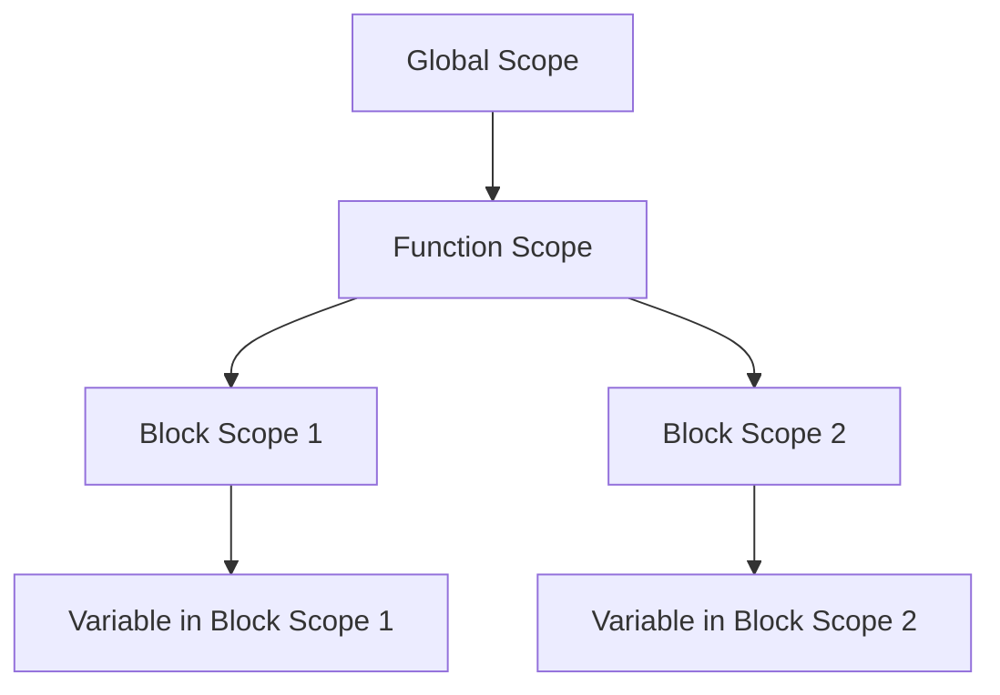

## 5.4 Block Scope with `let` and `const`

In JavaScript, understanding how variables are scoped is crucial for writing clean, efficient, and bug-free code. In this section, we will delve into the concept of block scope, introduced with the `let` and `const` keywords. We will explore how block scope differs from function scope, particularly in comparison to the traditional `var` keyword. By the end of this section, you will have a solid understanding of how to use `let` and `const` effectively in your JavaScript programs.

### Introduction to Block Scope

Block scope is a concept that defines the accessibility of variables within a specific block of code, usually enclosed by curly braces `{}`. This is different from function scope, where variables are accessible throughout the entire function in which they are declared. Block scope was introduced in JavaScript with the ES6 (ECMAScript 2015) specification, bringing a more predictable and intuitive way to handle variable declarations.

#### What is a Block?

A block in JavaScript is a section of code enclosed in curly braces `{}`. Blocks are commonly used in control structures such as `if` statements, loops, and functions. Here's a simple example of a block:

```javascript
{
  // This is a block
  let message = "Hello, block scope!";
  console.log(message); // Outputs: Hello, block scope!
}
// console.log(message); // Error: message is not defined
```

In the example above, the variable `message` is declared inside a block. It is accessible only within that block and not outside of it.

### `let` and `const`: Block-Scoped Variables

The `let` and `const` keywords allow you to declare variables that are block-scoped. This means that the variables are only accessible within the block in which they are defined, and not outside of it. This behavior is different from the `var` keyword, which declares variables with function scope or global scope.

#### The `let` Keyword

The `let` keyword is used to declare variables that can be reassigned later. It provides a way to create variables that are limited to the scope of a block, statement, or expression.

```javascript
if (true) {
  let blockScopedVariable = "I'm block scoped!";
  console.log(blockScopedVariable); // Outputs: I'm block scoped!
}
// console.log(blockScopedVariable); // Error: blockScopedVariable is not defined
```

In this example, `blockScopedVariable` is only accessible within the `if` block. Trying to access it outside the block results in an error.

#### The `const` Keyword

The `const` keyword is used to declare variables that are block-scoped and cannot be reassigned. However, it is important to note that `const` does not make the variable immutable. If the variable is an object or an array, its properties or elements can still be modified.

```javascript
if (true) {
  const blockScopedConstant = "I'm a constant!";
  console.log(blockScopedConstant); // Outputs: I'm a constant!
  // blockScopedConstant = "New value"; // Error: Assignment to constant variable
}
// console.log(blockScopedConstant); // Error: blockScopedConstant is not defined
```

In this example, `blockScopedConstant` is a constant that cannot be reassigned. Attempting to change its value results in an error.

### Block Scope vs. Function Scope

Before the introduction of `let` and `const`, JavaScript only had function scope, which was managed using the `var` keyword. Variables declared with `var` are either globally scoped or function-scoped, meaning they are accessible throughout the function in which they are declared.

#### Example of Function Scope with `var`

```javascript
function exampleFunction() {
  if (true) {
    var functionScopedVariable = "I'm function scoped!";
  }
  console.log(functionScopedVariable); // Outputs: I'm function scoped!
}

exampleFunction();
// console.log(functionScopedVariable); // Error: functionScopedVariable is not defined
```

In this example, `functionScopedVariable` is accessible throughout the entire `exampleFunction`, even though it was declared inside an `if` block. This can lead to unexpected behavior, especially in larger functions.

#### Comparing `var`, `let`, and `const`

Let's compare how `var`, `let`, and `const` behave in a loop:

```javascript
for (var i = 0; i < 3; i++) {
  setTimeout(() => console.log(i), 1000); // Outputs: 3, 3, 3
}

for (let j = 0; j < 3; j++) {
  setTimeout(() => console.log(j), 1000); // Outputs: 0, 1, 2
}
```

In the first loop, `var` is used to declare `i`. Since `var` is function-scoped, the same `i` is used in each iteration, resulting in the output `3, 3, 3`. In the second loop, `let` is used to declare `j`. Since `let` is block-scoped, a new `j` is created for each iteration, resulting in the output `0, 1, 2`.

### Best Practices for Variable Declaration

When writing JavaScript code, it is important to use the appropriate keyword for variable declaration. Here are some best practices to follow:

1. **Use `let` for Variables That Change**: If a variable's value needs to change, use `let`. This makes it clear that the variable is intended to be reassigned.

2. **Use `const` for Constants**: Use `const` for variables that should not be reassigned. This helps prevent accidental changes to variables that are meant to remain constant.

3. **Avoid Using `var`**: With the introduction of `let` and `const`, there is little reason to use `var`. Using `let` and `const` helps prevent issues related to function scope and hoisting.

4. **Declare Variables in the Narrowest Scope Possible**: Declare variables in the smallest scope necessary to limit their accessibility and reduce potential side effects.

5. **Use Descriptive Variable Names**: Choose variable names that clearly describe their purpose. This makes your code more readable and easier to maintain.

### Code Examples with Loops and Conditional Statements

Let's explore some examples using loops and conditional statements to demonstrate block scope with `let` and `const`.

#### Example 1: Using `let` in a Loop

```javascript
for (let i = 0; i < 5; i++) {
  console.log(`Iteration ${i}`);
}
// console.log(i); // Error: i is not defined
```

In this example, `i` is declared with `let` inside the loop. It is only accessible within the loop block, and trying to access it outside the loop results in an error.

#### Example 2: Using `const` in a Conditional Statement

```javascript
if (true) {
  const greeting = "Hello, world!";
  console.log(greeting); // Outputs: Hello, world!
}
// console.log(greeting); // Error: greeting is not defined
```

Here, `greeting` is declared with `const` inside the `if` block. It is only accessible within that block, and attempting to access it outside results in an error.

### Visualizing Block Scope

To better understand how block scope works, let's visualize it using a scope chain diagram. This will help illustrate how JavaScript resolves variable references within different blocks.



In this diagram, we have a global scope, a function scope, and two block scopes within the function. Each block scope can have its own variables that are not accessible from other blocks or the global scope.

### Try It Yourself

Now that we've covered the basics of block scope with `let` and `const`, it's time to experiment with these concepts. Try modifying the code examples provided to see how changes affect variable accessibility. For instance, try moving variable declarations outside of their current blocks and observe the results.

### Knowledge Check

1. What is block scope, and how does it differ from function scope?
2. How do `let` and `const` create block-scoped variables?
3. What are the benefits of using `let` and `const` over `var`?
4. How does block scope affect variables declared inside loops and conditional statements?
5. What are some best practices for variable declaration in JavaScript?

### Summary

In this section, we've explored the concept of block scope in JavaScript, introduced with the `let` and `const` keywords. We've seen how block scope differs from function scope and how it provides a more predictable way to manage variable accessibility. By using `let` and `const`, we can write cleaner, more maintainable code that minimizes the risk of variable-related bugs. As you continue your journey in JavaScript, remember to apply these best practices and experiment with block scope in your projects.

## Quiz Time!



### What is block scope in JavaScript?

- [x] A scope that limits variable accessibility to the nearest block `{}`.
- [ ] A scope that limits variable accessibility to the entire function.
- [ ] A scope that limits variable accessibility to the global context.
- [ ] A scope that limits variable accessibility to the nearest loop.

> **Explanation:** Block scope limits variable accessibility to the nearest block `{}`, such as those created by loops or conditional statements.

### Which keyword is used to declare a block-scoped variable that can be reassigned?

- [ ] const
- [x] let
- [ ] var
- [ ] function

> **Explanation:** The `let` keyword is used to declare a block-scoped variable that can be reassigned.

### Which keyword is used to declare a block-scoped constant in JavaScript?

- [x] const
- [ ] let
- [ ] var
- [ ] function

> **Explanation:** The `const` keyword is used to declare a block-scoped constant that cannot be reassigned.

### What happens when you try to access a block-scoped variable outside its block?

- [x] An error occurs because the variable is not defined outside the block.
- [ ] The variable is accessible and retains its value.
- [ ] The variable is accessible but has an undefined value.
- [ ] The variable is accessible and has a default value.

> **Explanation:** An error occurs because block-scoped variables are not accessible outside the block in which they are declared.

### How does the `let` keyword differ from the `var` keyword?

- [x] `let` is block-scoped, while `var` is function-scoped.
- [ ] `let` is function-scoped, while `var` is block-scoped.
- [ ] `let` is globally scoped, while `var` is block-scoped.
- [ ] `let` is block-scoped, while `var` is globally scoped.

> **Explanation:** The `let` keyword is block-scoped, meaning it limits variable accessibility to the nearest block, while `var` is function-scoped.

### Which of the following is a best practice for variable declaration in JavaScript?

- [x] Use `let` for variables that change and `const` for constants.
- [ ] Use `var` for all variable declarations.
- [ ] Use `const` for variables that change and `let` for constants.
- [ ] Use `var` for constants and `let` for variables that change.

> **Explanation:** It is a best practice to use `let` for variables that change and `const` for constants to prevent accidental reassignment.

### What is the output of the following code?

```javascript
if (true) {
  let x = 10;
}
console.log(x);
```

- [ ] 10
- [ ] undefined
- [x] An error occurs
- [ ] null

> **Explanation:** An error occurs because `x` is declared with `let` inside a block and is not accessible outside the block.

### In a loop, how does `let` behave differently from `var`?

- [x] `let` creates a new variable for each iteration, while `var` uses the same variable.
- [ ] `let` uses the same variable for each iteration, while `var` creates a new variable.
- [ ] Both `let` and `var` create new variables for each iteration.
- [ ] Both `let` and `var` use the same variable for each iteration.

> **Explanation:** `let` creates a new variable for each iteration, while `var` uses the same variable, leading to different behaviors in loops.

### Can `const` be used to declare an object whose properties can be changed?

- [x] True
- [ ] False

> **Explanation:** True. `const` can be used to declare an object whose properties can be changed, but the reference to the object cannot be reassigned.

### What is the main advantage of using block scope in JavaScript?

- [x] It provides a more predictable and intuitive way to manage variable accessibility.
- [ ] It allows variables to be accessed globally.
- [ ] It makes variables accessible in all functions.
- [ ] It prevents any variable from being reassigned.

> **Explanation:** Block scope provides a more predictable and intuitive way to manage variable accessibility, reducing the risk of variable-related bugs.


