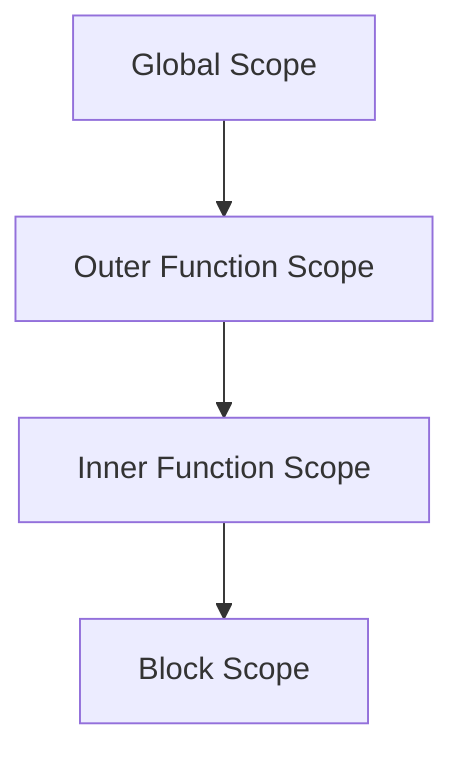

## 5.5 Scope Chain

In JavaScript, understanding how the language resolves variables is crucial for writing effective and bug-free code. The concept of the **scope chain** is central to this understanding. In this section, we will explore what the scope chain is, how it works, and why it is important for your JavaScript programming journey.

### What is the Scope Chain?

The scope chain is a mechanism that JavaScript uses to look up variables. When a variable is referenced in a function, JavaScript starts searching for the variable in the current scope. If it doesn't find the variable there, it moves up to the next outer scope, continuing this process until it either finds the variable or reaches the global scope.

### How the Scope Chain Works

The scope chain is essentially a list of objects that represent the current execution context's scope and all the outer scopes. When JavaScript needs to resolve a variable, it checks each object in the scope chain in order, starting from the innermost scope and moving outward.

#### Visualizing the Scope Chain

Let's visualize the scope chain with a simple diagram:



In this diagram, each node represents a scope, and the arrows indicate the direction in which JavaScript searches for variables.

### Example of the Scope Chain in Action

To understand the scope chain better, let's look at a code example:

```javascript
// Global scope
let globalVar = "I am global";

function outerFunction() {
    // Outer function scope
    let outerVar = "I am outer";

    function innerFunction() {
        // Inner function scope
        let innerVar = "I am inner";

        console.log(globalVar); // Accesses the global scope
        console.log(outerVar);  // Accesses the outer function scope
        console.log(innerVar);  // Accesses the inner function scope
    }

    innerFunction();
}

outerFunction();
```

**Explanation:**

- **`globalVar`** is defined in the global scope and is accessible from anywhere in the code.
- **`outerVar`** is defined in the scope of `outerFunction` and is accessible within `outerFunction` and `innerFunction`.
- **`innerVar`** is defined in the scope of `innerFunction` and is only accessible within `innerFunction`.

When `innerFunction` is called, JavaScript looks for `globalVar`, `outerVar`, and `innerVar` in the following order:
1. **Inner Function Scope**: It finds `innerVar` here.
2. **Outer Function Scope**: It finds `outerVar` here.
3. **Global Scope**: It finds `globalVar` here.

### Nested Functions and the Scope Chain

Nested functions are functions defined within other functions. They have access to variables in their own scope, as well as variables in all outer scopes, up to the global scope. This is due to the scope chain.

#### Example with Nested Functions

```javascript
function outer() {
    let outerVar = "Outer";

    function middle() {
        let middleVar = "Middle";

        function inner() {
            let innerVar = "Inner";
            console.log(outerVar);  // Accesses outer function scope
            console.log(middleVar); // Accesses middle function scope
            console.log(innerVar);  // Accesses inner function scope
        }

        inner();
    }

    middle();
}

outer();
```

In this example, `inner` can access `innerVar`, `middleVar`, and `outerVar` due to the scope chain.

### Closures and the Scope Chain

Closures are functions that retain access to their lexical scope, even when the function is executed outside that scope. This is possible because of the scope chain.

#### Example of Closures

```javascript
function makeCounter() {
    let count = 0;

    return function() {
        count += 1;
        return count;
    };
}

const counter = makeCounter();
console.log(counter()); // 1
console.log(counter()); // 2
```

**Explanation:**

- The `makeCounter` function returns an anonymous function that increments and returns `count`.
- The returned function is a closure that retains access to the `count` variable, even after `makeCounter` has finished executing.

### Implications of the Scope Chain

Understanding the scope chain is essential for several reasons:

1. **Debugging**: Knowing how JavaScript resolves variables helps in debugging issues related to variable access and scope.
2. **Memory Management**: Variables in outer scopes remain in memory as long as they are accessible through closures, which can impact memory usage.
3. **Code Organization**: Properly structuring code with functions and scopes can lead to more maintainable and understandable code.

### Debugging with the Scope Chain

When debugging JavaScript code, understanding the scope chain can help identify why certain variables are not accessible or why unexpected values are being used.

#### Example of a Common Debugging Scenario

```javascript
let message = "Hello, World!";

function greet() {
    let message = "Hello, JavaScript!";
    console.log(message);
}

greet(); // Logs "Hello, JavaScript!"
console.log(message); // Logs "Hello, World!"
```

**Explanation:**

- Inside `greet`, the `message` variable in the local scope shadows the `message` variable in the global scope.
- Understanding the scope chain helps us realize why `greet` logs "Hello, JavaScript!" instead of "Hello, World!".

### Try It Yourself

Experiment with the following code to deepen your understanding of the scope chain:

```javascript
function experiment() {
    let a = 1;

    function firstLevel() {
        let b = 2;

        function secondLevel() {
            let c = 3;
            console.log(a, b, c); // Try changing the values of a, b, c
        }

        secondLevel();
    }

    firstLevel();
}

experiment();
```

**Suggestions:**

- Try adding a new variable `d` in the global scope and access it from `secondLevel`.
- Modify the values of `a`, `b`, and `c` to see how they affect the output.
- Add another nested function and observe how the scope chain changes.

### Key Takeaways

- The scope chain is a fundamental concept in JavaScript that determines how variables are resolved.
- JavaScript searches for variables from the innermost scope to the outermost scope.
- Understanding the scope chain is crucial for debugging, memory management, and code organization.
- Closures leverage the scope chain to retain access to variables in their lexical scope.

### Further Reading

For more information on JavaScript scope and the scope chain, consider exploring these resources:

- [MDN Web Docs: JavaScript Scoping](https://developer.mozilla.org/en-US/docs/Web/JavaScript/Guide/Functions#scoping)
- [W3Schools: JavaScript Scope](https://www.w3schools.com/js/js_scope.asp)

Remember, mastering the scope chain is a stepping stone to becoming proficient in JavaScript. Keep experimenting and exploring to deepen your understanding!

## Quiz Time!



### What is the scope chain in JavaScript?

- [x] A mechanism that JavaScript uses to look up variables from the innermost to the outermost scope.
- [ ] A method for organizing functions in JavaScript.
- [ ] A way to create closures in JavaScript.
- [ ] A tool for debugging JavaScript code.

> **Explanation:** The scope chain is the mechanism by which JavaScript resolves variables, starting from the innermost scope and moving outward until it finds the variable or reaches the global scope.

### In which order does JavaScript search for variables using the scope chain?

- [x] From the innermost scope to the outermost scope.
- [ ] From the outermost scope to the innermost scope.
- [ ] Randomly among all available scopes.
- [ ] Only within the global scope.

> **Explanation:** JavaScript searches for variables starting from the innermost scope and moves outward, checking each scope in the chain until it finds the variable or reaches the global scope.

### What happens if a variable is not found in any scope in the scope chain?

- [x] JavaScript throws a ReferenceError.
- [ ] JavaScript assigns a default value to the variable.
- [ ] JavaScript creates the variable in the global scope.
- [ ] JavaScript ignores the variable.

> **Explanation:** If a variable is not found in any scope in the scope chain, JavaScript throws a ReferenceError indicating that the variable is not defined.

### How does the scope chain relate to closures?

- [x] Closures retain access to variables in their lexical scope through the scope chain.
- [ ] Closures are independent of the scope chain.
- [ ] Closures create new scope chains.
- [ ] Closures prevent access to the scope chain.

> **Explanation:** Closures retain access to variables in their lexical scope through the scope chain, allowing them to access variables even after the outer function has finished executing.

### Which of the following is true about nested functions and the scope chain?

- [x] Nested functions have access to variables in their own scope and all outer scopes.
- [ ] Nested functions can only access variables in the global scope.
- [ ] Nested functions do not have access to any variables.
- [ ] Nested functions create a new global scope.

> **Explanation:** Nested functions have access to variables in their own scope and all outer scopes due to the scope chain.

### What is a common debugging issue related to the scope chain?

- [x] Variables being shadowed by variables in inner scopes.
- [ ] Functions not being defined.
- [ ] Arrays not being initialized.
- [ ] Objects not being created.

> **Explanation:** A common debugging issue related to the scope chain is variables being shadowed by variables in inner scopes, leading to unexpected values being used.

### How can understanding the scope chain aid in debugging?

- [x] By helping identify why certain variables are not accessible or why unexpected values are being used.
- [ ] By automatically fixing errors in the code.
- [ ] By creating new variables in the global scope.
- [ ] By preventing functions from executing.

> **Explanation:** Understanding the scope chain aids in debugging by helping identify why certain variables are not accessible or why unexpected values are being used.

### What is the impact of closures on memory usage?

- [x] Variables in outer scopes remain in memory as long as they are accessible through closures.
- [ ] Closures automatically free up memory.
- [ ] Closures do not affect memory usage.
- [ ] Variables in closures are always stored in the global scope.

> **Explanation:** Variables in outer scopes remain in memory as long as they are accessible through closures, which can impact memory usage.

### How does the scope chain affect code organization?

- [x] Properly structuring code with functions and scopes can lead to more maintainable and understandable code.
- [ ] The scope chain has no effect on code organization.
- [ ] The scope chain makes code organization more difficult.
- [ ] The scope chain prevents code from being organized.

> **Explanation:** Properly structuring code with functions and scopes, understanding the scope chain, can lead to more maintainable and understandable code.

### True or False: The scope chain is only important for advanced JavaScript developers.

- [ ] True
- [x] False

> **Explanation:** False. Understanding the scope chain is important for all JavaScript developers, regardless of their level, as it is fundamental to how variables are resolved in the language.


