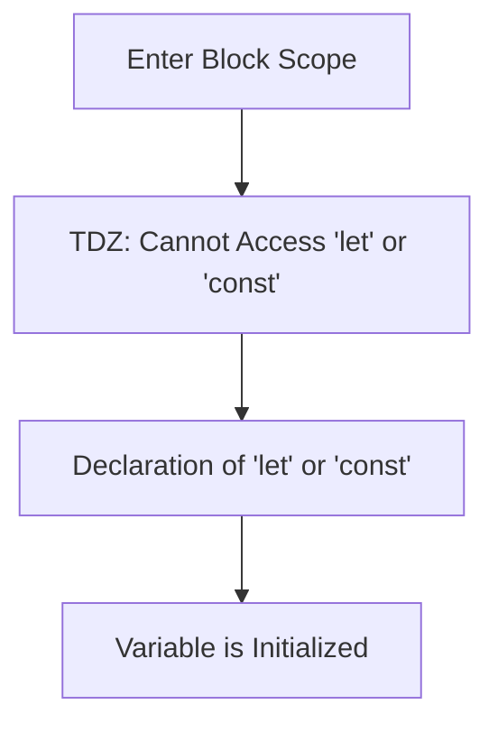

## 6.1 Variable Hoisting

Welcome to the fascinating world of JavaScript, where understanding the concept of variable hoisting is crucial for writing effective and bug-free code. In this section, we will delve into what hoisting is, how it affects variables declared with `var`, and how `let` and `const` differ in this regard. By the end of this chapter, you'll have a solid understanding of hoisting and strategies to avoid common pitfalls associated with it.

### What is Hoisting?

Hoisting is a JavaScript mechanism where variables and function declarations are moved to the top of their containing scope during the compile phase. This means that you can use variables and functions before they are declared in the code. However, it's important to note that only the declarations are hoisted, not the initializations.

#### Understanding the Mechanism

To better understand hoisting, let's consider the following example:

```javascript
console.log(greeting); // Output: undefined
var greeting = "Hello, world!";
console.log(greeting); // Output: Hello, world!
```

In the above code, you might expect the first `console.log` to throw an error since `greeting` is used before it's declared. However, due to hoisting, the declaration `var greeting;` is moved to the top of the scope, making the code equivalent to:

```javascript
var greeting;
console.log(greeting); // Output: undefined
greeting = "Hello, world!";
console.log(greeting); // Output: Hello, world!
```

As you can see, the declaration is hoisted, but the assignment `greeting = "Hello, world!";` is not. This results in the first `console.log` outputting `undefined`.

### Variable Hoisting with `var`

The `var` keyword is the traditional way to declare variables in JavaScript. Variables declared with `var` are hoisted to the top of their function or global scope. This can lead to unexpected behaviors, especially for beginners.

#### Example of `var` Hoisting

Consider the following example:

```javascript
function sayHello() {
    console.log(message); // Output: undefined
    var message = "Hi!";
    console.log(message); // Output: Hi!
}

sayHello();
```

In this example, the `var message;` declaration is hoisted to the top of the `sayHello` function, making the code equivalent to:

```javascript
function sayHello() {
    var message;
    console.log(message); // Output: undefined
    message = "Hi!";
    console.log(message); // Output: Hi!
}

sayHello();
```

### Hoisting with `let` and `const`

With the introduction of ES6, JavaScript introduced two new ways to declare variables: `let` and `const`. Unlike `var`, variables declared with `let` and `const` are hoisted to the top of their block scope, but they are not initialized. This means that accessing them before their declaration results in a `ReferenceError`.

#### Example of `let` and `const` Hoisting

Let's look at an example using `let`:

```javascript
function greet() {
    console.log(name); // ReferenceError: Cannot access 'name' before initialization
    let name = "John";
    console.log(name); // Output: John
}

greet();
```

In this case, the `let name;` declaration is hoisted to the top of the block, but it is not initialized, leading to a `ReferenceError` when accessed before the declaration.

Similarly, `const` behaves the same way:

```javascript
function greet() {
    console.log(name); // ReferenceError: Cannot access 'name' before initialization
    const name = "John";
    console.log(name); // Output: John
}

greet();
```

### The Temporal Dead Zone

The period between entering the block scope and the actual declaration of `let` or `const` is known as the Temporal Dead Zone (TDZ). During this time, the variables are in an uninitialized state and cannot be accessed.

#### Visualizing the Temporal Dead Zone



In the diagram above, the TDZ is the period between entering the block scope and the declaration of the variable. During this time, any attempt to access the variable will result in a `ReferenceError`.

### Strategies to Avoid Hoisting Pitfalls

Understanding hoisting is crucial for writing predictable and bug-free JavaScript code. Here are some strategies to avoid common pitfalls associated with hoisting:

1. **Declare Variables at the Top**: Always declare your variables at the top of their scope. This makes the hoisting behavior explicit and improves code readability.

2. **Use `let` and `const`**: Prefer `let` and `const` over `var` to avoid issues related to hoisting. They provide block-level scope and prevent accidental re-declarations.

3. **Initialize Variables Immediately**: Whenever possible, initialize your variables at the time of declaration to avoid undefined values.

4. **Avoid Using Variables Before Declaration**: Make sure to declare and initialize variables before using them in your code.

5. **Understand the Temporal Dead Zone**: Be aware of the TDZ when using `let` and `const` and avoid accessing variables before their declaration.

### Try It Yourself

Experiment with the following code snippets to deepen your understanding of hoisting:

1. Modify the `sayHello` function to use `let` instead of `var` and observe the difference in behavior.

2. Create a function that declares multiple variables using `var`, `let`, and `const`, and try accessing them before their declaration.

3. Write a small program that demonstrates the Temporal Dead Zone with `let` and `const`.

### Conclusion

Hoisting is a fundamental concept in JavaScript that can lead to unexpected behaviors if not understood properly. By understanding how hoisting works with `var`, `let`, and `const`, and by following best practices, you can write more predictable and maintainable code. Remember, this is just the beginning. As you progress, you'll build more complex and interactive web pages. Keep experimenting, stay curious, and enjoy the journey!

### Further Reading

- [MDN Web Docs: Hoisting](https://developer.mozilla.org/en-US/docs/Glossary/Hoisting)
- [JavaScript.info: Hoisting](https://javascript.info/var)
- [W3Schools: JavaScript Hoisting](https://www.w3schools.com/js/js_hoisting.asp)

## Quiz Time!



### What is hoisting in JavaScript?

- [x] A mechanism where variable and function declarations are moved to the top of their containing scope.
- [ ] A method to optimize JavaScript code execution.
- [ ] A way to declare variables globally.
- [ ] A technique to improve function performance.

> **Explanation:** Hoisting is the process by which JavaScript moves variable and function declarations to the top of their containing scope during the compile phase.

### Which keyword is associated with traditional variable hoisting in JavaScript?

- [x] var
- [ ] let
- [ ] const
- [ ] function

> **Explanation:** The `var` keyword is traditionally associated with variable hoisting in JavaScript, where declarations are moved to the top of their scope.

### What happens when you access a `let` variable before its declaration?

- [ ] It returns `undefined`.
- [x] It throws a `ReferenceError`.
- [ ] It returns `null`.
- [ ] It behaves like a `var` variable.

> **Explanation:** Accessing a `let` variable before its declaration results in a `ReferenceError` due to the Temporal Dead Zone.

### Which of the following is NOT a strategy to avoid hoisting pitfalls?

- [ ] Declare variables at the top of their scope.
- [ ] Use `let` and `const` instead of `var`.
- [ ] Initialize variables immediately.
- [x] Use global variables extensively.

> **Explanation:** Using global variables extensively is not a recommended strategy to avoid hoisting pitfalls. Instead, declaring variables at the top, using `let` and `const`, and initializing variables immediately are effective strategies.

### What is the Temporal Dead Zone (TDZ)?

- [x] The period between entering the block scope and the actual declaration of `let` or `const`.
- [ ] A zone where variables are globally accessible.
- [ ] A method to optimize variable declarations.
- [ ] A JavaScript feature to enhance performance.

> **Explanation:** The Temporal Dead Zone (TDZ) is the period between entering the block scope and the actual declaration of `let` or `const`, during which the variables cannot be accessed.

### Which keyword provides block-level scope in JavaScript?

- [ ] var
- [x] let
- [x] const
- [ ] function

> **Explanation:** Both `let` and `const` provide block-level scope in JavaScript, unlike `var`, which provides function or global scope.

### What is the output of the following code?

```javascript
console.log(a);
var a = 10;
```

- [x] undefined
- [ ] 10
- [ ] ReferenceError
- [ ] null

> **Explanation:** The output is `undefined` because the declaration `var a;` is hoisted to the top, but the assignment `a = 10;` is not.

### How does `const` differ from `let` in terms of hoisting?

- [ ] `const` is not hoisted.
- [ ] `let` is not hoisted.
- [x] Both are hoisted, but `const` must be initialized at the time of declaration.
- [ ] `const` provides function scope.

> **Explanation:** Both `let` and `const` are hoisted, but `const` must be initialized at the time of declaration, while `let` can be declared without initialization.

### Which of the following is a benefit of using `let` and `const` over `var`?

- [x] They prevent accidental re-declarations.
- [ ] They allow for global variable declarations.
- [ ] They improve code execution speed.
- [ ] They enable dynamic typing.

> **Explanation:** `let` and `const` prevent accidental re-declarations and provide block-level scope, which helps avoid common pitfalls associated with `var`.

### True or False: Hoisting only applies to variable declarations, not initializations.

- [x] True
- [ ] False

> **Explanation:** True. Hoisting only applies to variable declarations, not initializations. The initializations remain in place in the code.


