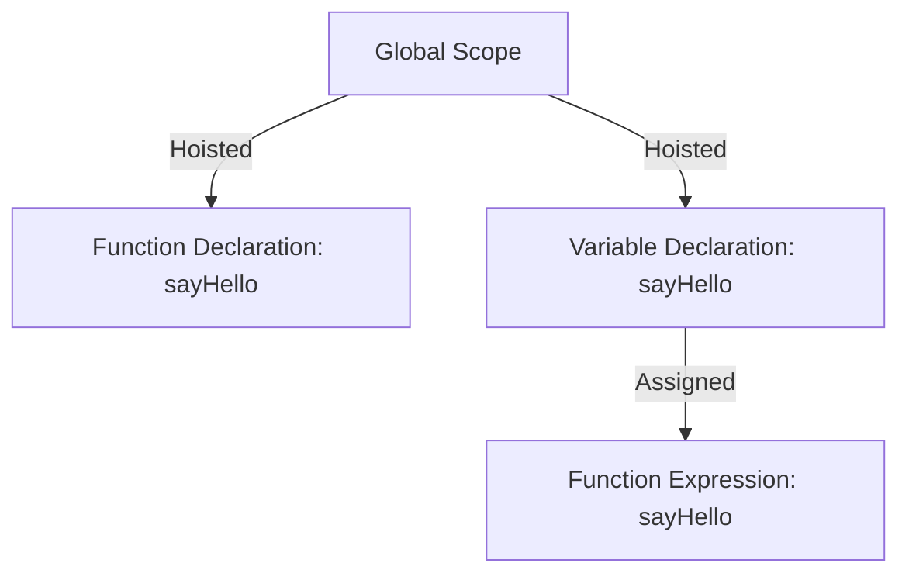

## 6.2 Function Hoisting

In JavaScript, understanding how hoisting works is crucial for writing predictable and bug-free code. Hoisting is a JavaScript mechanism where variables and function declarations are moved to the top of their containing scope during the compile phase. This section will focus on function hoisting, explaining how it differs from variable hoisting, and how it affects function availability in your code. We will also explore best practices to leverage hoisting safely.

### What is Function Hoisting?

Function hoisting is the process by which function declarations are moved to the top of their containing scope. This means that you can call a function before you have declared it in your code, and it will still work. This is because the JavaScript engine processes the function declaration before executing the code.

#### Function Declarations vs. Function Expressions

Before diving deeper into function hoisting, it's essential to understand the difference between function declarations and function expressions, as they behave differently in the context of hoisting.

- **Function Declarations**: These are hoisted with their entire definition. This means that the function is available throughout its scope, even before the line where it is defined in the code.

  ```javascript
  // Function Declaration
  function greet() {
      console.log("Hello, world!");
  }
  ```

- **Function Expressions**: These are not hoisted in the same way. Only the variable declaration is hoisted, not the function assignment. This means that the function is not available until the line of code where the expression is evaluated.

  ```javascript
  // Function Expression
  const greet = function() {
      console.log("Hello, world!");
  };
  ```

### Demonstrating Function Hoisting

Let's look at some examples to illustrate how function hoisting works in practice.

#### Example 1: Function Declaration Hoisting

In the following example, we call the function `sayHello` before it is declared. Thanks to hoisting, this works without any issues.

```javascript
sayHello(); // Output: "Hello there!"

function sayHello() {
    console.log("Hello there!");
}
```

In this case, the entire function declaration is hoisted to the top of its scope, making it available before its actual line of declaration.

#### Example 2: Function Expression Hoisting

Now, let's see what happens with a function expression:

```javascript
try {
    sayHello(); // Throws TypeError: sayHello is not a function
} catch (error) {
    console.error(error);
}

var sayHello = function() {
    console.log("Hello there!");
};
```

In this example, `sayHello` is hoisted as a variable with an initial value of `undefined`. Therefore, trying to call it before the assignment results in a `TypeError`.

### Visualizing Function Hoisting

To better understand how function hoisting works, let's visualize the process using a scope chain diagram.



**Diagram Explanation**: The diagram shows that function declarations are fully hoisted to the top of their scope, whereas function expressions are only hoisted as variable declarations, with their assignments occurring in the order they appear in the code.

### How Hoisting Affects Function Availability

Understanding function hoisting is crucial for predicting when a function is available for use in your code. Here are some key points to remember:

- **Function Declarations**: These are available throughout their entire scope, even before they are defined in the code. This can be useful for organizing your code in a top-down manner, where you define helper functions at the bottom of your script.

- **Function Expressions**: These are only available after the point in the code where they are assigned. This means you need to be mindful of the order in which you write your code.

### Best Practices for Leveraging Hoisting Safely

While hoisting can be a powerful feature, it can also lead to confusion if not used carefully. Here are some best practices to help you leverage hoisting safely:

1. **Declare Functions at the Top**: To avoid confusion, declare your functions at the top of their scope. This makes it clear that they are available throughout the scope.

2. **Use Function Expressions for Dynamic Behavior**: If you need to define functions conditionally or dynamically, use function expressions. This ensures that the function is only available when the conditions are met.

3. **Be Mindful of Variable Hoisting**: Remember that variable hoisting can lead to unexpected behavior if you try to use a variable before it is assigned. Always initialize variables at the top of their scope to avoid this issue.

4. **Avoid Relying on Hoisting**: While hoisting can be convenient, it's often better to write your code in a way that doesn't rely on it. This makes your code more predictable and easier to understand.

5. **Use `let` and `const` for Block Scope**: In modern JavaScript, prefer `let` and `const` over `var` to avoid issues with variable hoisting. These keywords provide block-level scope, which can help prevent accidental variable overwrites.

### Try It Yourself

Let's experiment with function hoisting by modifying the following code examples:

1. **Modify Example 1**: Try moving the function declaration to different parts of the code and observe how it affects the output.

2. **Modify Example 2**: Change the `var` keyword to `let` or `const` and see how it impacts the behavior of the function expression.

### References and Further Reading

For more information on function hoisting and related topics, check out these resources:

- [MDN Web Docs: Hoisting](https://developer.mozilla.org/en-US/docs/Glossary/Hoisting)
- [W3Schools: JavaScript Hoisting](https://www.w3schools.com/js/js_hoisting.asp)

### Knowledge Check

Let's reinforce what we've learned with some questions and exercises.

#### Questions

1. What is the main difference between function declarations and function expressions in terms of hoisting?
2. How does hoisting affect the availability of a function in your code?
3. Why is it recommended to declare functions at the top of their scope?
4. What are some best practices for using hoisting safely in your code?

#### Exercises

1. Write a function using a function declaration and call it before its definition. Verify that it works as expected.
2. Write a function using a function expression and try calling it before its assignment. Observe the error and explain why it occurs.

### Embrace the Journey

Remember, understanding hoisting is just one step in mastering JavaScript. As you continue your journey, you'll encounter more complex concepts and patterns. Keep experimenting, stay curious, and enjoy the process of learning and growing as a developer!

## Quiz Time!



### What is function hoisting?

- [x] The process by which function declarations are moved to the top of their containing scope.
- [ ] The process by which function expressions are moved to the top of their containing scope.
- [ ] A method to optimize function execution.
- [ ] A technique to improve code readability.

> **Explanation:** Function hoisting refers to the movement of function declarations to the top of their containing scope, making them available throughout the scope.

### How do function declarations differ from function expressions in terms of hoisting?

- [x] Function declarations are hoisted with their entire definition, while function expressions are not.
- [ ] Function expressions are hoisted with their entire definition, while function declarations are not.
- [ ] Both are hoisted with their entire definition.
- [ ] Neither is hoisted.

> **Explanation:** Function declarations are hoisted with their entire definition, meaning they can be called before they appear in the code. Function expressions are only hoisted as variable declarations.

### What happens if you call a function expression before its assignment?

- [ ] It works as expected.
- [ ] It results in a syntax error.
- [x] It results in a TypeError.
- [ ] It results in a ReferenceError.

> **Explanation:** Calling a function expression before its assignment results in a TypeError because the variable is hoisted as undefined.

### Why is it recommended to declare functions at the top of their scope?

- [x] To make it clear that they are available throughout the scope.
- [ ] To improve performance.
- [ ] To reduce memory usage.
- [ ] To avoid syntax errors.

> **Explanation:** Declaring functions at the top of their scope makes it clear that they are available throughout the scope, reducing confusion.

### Which keyword should you use to avoid issues with variable hoisting?

- [ ] var
- [x] let
- [x] const
- [ ] function

> **Explanation:** Using `let` and `const` helps avoid issues with variable hoisting by providing block-level scope.

### What is a best practice for using function expressions?

- [ ] Always use them at the top of the file.
- [x] Use them for dynamic or conditional behavior.
- [ ] Avoid using them altogether.
- [ ] Use them only with `var`.

> **Explanation:** Function expressions are useful for dynamic or conditional behavior, ensuring the function is only available when needed.

### What is the result of calling a function declared with `var` before its assignment?

- [ ] It works as expected.
- [ ] It results in a syntax error.
- [x] It results in a TypeError.
- [ ] It results in a ReferenceError.

> **Explanation:** Calling a function declared with `var` before its assignment results in a TypeError because the variable is hoisted as undefined.

### How can you visualize function hoisting?

- [x] By using a scope chain diagram.
- [ ] By using a flowchart.
- [ ] By using a sequence diagram.
- [ ] By using a DOM tree.

> **Explanation:** A scope chain diagram can help visualize how function declarations and expressions are hoisted within their scope.

### What is the main advantage of function hoisting?

- [x] It allows functions to be called before they are defined in the code.
- [ ] It improves code readability.
- [ ] It reduces memory usage.
- [ ] It enhances performance.

> **Explanation:** The main advantage of function hoisting is that it allows functions to be called before they are defined in the code, providing flexibility in code organization.

### True or False: Function expressions are hoisted with their entire definition.

- [ ] True
- [x] False

> **Explanation:** False. Function expressions are not hoisted with their entire definition; only the variable declaration is hoisted.


