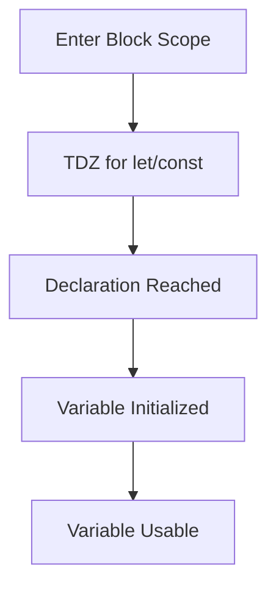

## 6.3 Hoisting with `let` and `const`

In JavaScript, understanding how variables are hoisted is crucial for writing clean and bug-free code. While many developers are familiar with the concept of hoisting as it applies to `var`, the behavior of `let` and `const` introduces a new dimension with the Temporal Dead Zone (TDZ). This section will delve into the nuances of hoisting with `let` and `const`, providing you with the knowledge to avoid common pitfalls and write more robust code.

### What is Hoisting?

Before we dive into `let` and `const`, let's briefly recap what hoisting is. Hoisting is a JavaScript mechanism where variable and function declarations are moved to the top of their containing scope during the compile phase. This means that you can use variables and functions before they are declared in the code.

```javascript
console.log(myVar); // Output: undefined
var myVar = 5;
```

In the example above, `myVar` is hoisted to the top of its scope, which is why it doesn't throw an error when accessed before its declaration. However, it is initialized with `undefined` until the assignment `myVar = 5` is executed.

### Hoisting with `let` and `const`

With the introduction of ES6, JavaScript brought in `let` and `const` to provide block-scoped variables. Unlike `var`, which is function-scoped, `let` and `const` are block-scoped, meaning they are only accessible within the nearest enclosing block, such as a function, loop, or conditional statement.

#### The Temporal Dead Zone (TDZ)

The Temporal Dead Zone refers to the period between entering a scope and the point where a variable is declared. During this time, any attempt to access the variable will result in a `ReferenceError`. This is because, although `let` and `const` are hoisted, they are not initialized until their declaration is evaluated.

```javascript
console.log(myLet); // ReferenceError: Cannot access 'myLet' before initialization
let myLet = 10;
```

In the example above, `myLet` is hoisted to the top of its scope, but it remains uninitialized until the line `let myLet = 10;` is reached, creating a Temporal Dead Zone.

#### Hoisting Behavior of `let` and `const`

Both `let` and `const` are hoisted to the top of their block scope, but unlike `var`, they are not initialized with `undefined`. Instead, they remain in the TDZ until the execution reaches their declaration.

```javascript
{
    console.log(myConst); // ReferenceError: Cannot access 'myConst' before initialization
    const myConst = 20;
}
```

In this block, `myConst` is hoisted but not initialized, leading to a ReferenceError when accessed before its declaration.

### Importance of Declaring Variables Before Use

To avoid errors related to the TDZ, it's important to declare variables before using them. This practice not only prevents runtime errors but also enhances code readability and maintainability.

```javascript
let myVariable = 30;
console.log(myVariable); // Output: 30
```

By declaring `myVariable` before using it, we ensure that the code runs without errors and is easy to understand.

### Tips to Avoid TDZ-Related Bugs

1. **Declare Variables at the Top**: Always declare your variables at the top of their scope to avoid accidentally accessing them in the TDZ.

2. **Use `let` and `const` Wisely**: Choose `let` for variables that will change and `const` for constants. This not only improves code clarity but also helps avoid unintentional reassignments.

3. **Initialize Variables Immediately**: If possible, initialize your variables at the time of declaration to avoid the TDZ.

4. **Be Mindful of Block Scopes**: Remember that `let` and `const` are block-scoped. Ensure that you are accessing them within the correct block.

5. **Use Linting Tools**: Tools like ESLint can help catch potential TDZ issues by flagging variables that are used before they are declared.

### Code Examples

Let's explore some examples to solidify our understanding of hoisting with `let` and `const`.

#### Example 1: Hoisting with `let`

```javascript
function exampleLet() {
    console.log(a); // ReferenceError: Cannot access 'a' before initialization
    let a = 5;
    console.log(a); // Output: 5
}

exampleLet();
```

In this function, `a` is hoisted but not initialized, leading to a ReferenceError when accessed before its declaration.

#### Example 2: Hoisting with `const`

```javascript
function exampleConst() {
    console.log(b); // ReferenceError: Cannot access 'b' before initialization
    const b = 10;
    console.log(b); // Output: 10
}

exampleConst();
```

Similarly, `b` is hoisted but remains in the TDZ until its declaration, causing a ReferenceError when accessed prematurely.

#### Example 3: Avoiding TDZ with Proper Declaration

```javascript
function noTDZ() {
    let c = 15;
    console.log(c); // Output: 15
}

noTDZ();
```

By declaring `c` before using it, we avoid the TDZ and ensure smooth execution.

### Visualizing the Temporal Dead Zone

To better understand the concept of the Temporal Dead Zone, let's visualize it using a flowchart.



**Caption**: This flowchart illustrates the lifecycle of a `let` or `const` variable, highlighting the Temporal Dead Zone until the variable is declared and initialized.

### Try It Yourself

Experiment with the following code snippets to see how `let` and `const` behave in different scenarios. Try modifying the code to observe how the TDZ affects variable access.

```javascript
// Try declaring the variable after the console.log
{
    console.log(myVar); // What happens here?
    let myVar = 'Hello, World!';
}

// Try using const in a similar way
{
    console.log(myConstVar); // What happens here?
    const myConstVar = 42;
}
```

### External Resources

For further reading on hoisting and the Temporal Dead Zone, check out these resources:

- [MDN Web Docs on `let`](https://developer.mozilla.org/en-US/docs/Web/JavaScript/Reference/Statements/let)
- [MDN Web Docs on `const`](https://developer.mozilla.org/en-US/docs/Web/JavaScript/Reference/Statements/const)
- [JavaScript Hoisting Explained](https://www.w3schools.com/js/js_hoisting.asp)

### Knowledge Check

Let's test your understanding of hoisting with `let` and `const`. Answer the following questions to reinforce your learning.

## Quiz Time!



### What is the Temporal Dead Zone (TDZ)?

- [x] The period between entering a scope and the variable declaration
- [ ] The time when variables are initialized
- [ ] The time when variables are accessible
- [ ] The time when variables are hoisted

> **Explanation:** The Temporal Dead Zone is the period between entering a scope and the point where a variable is declared.

### How are `let` and `const` hoisted compared to `var`?

- [x] They are hoisted but not initialized
- [ ] They are not hoisted at all
- [ ] They are hoisted and initialized with `undefined`
- [ ] They are initialized before hoisting

> **Explanation:** `let` and `const` are hoisted but not initialized, unlike `var`, which is initialized with `undefined`.

### What error occurs when accessing a `let` variable in the TDZ?

- [x] ReferenceError
- [ ] TypeError
- [ ] SyntaxError
- [ ] RangeError

> **Explanation:** Accessing a `let` or `const` variable in the TDZ results in a ReferenceError.

### Why is it important to declare variables before use?

- [x] To avoid errors related to the TDZ
- [ ] To make the code run faster
- [ ] To prevent syntax errors
- [ ] To ensure variables are hoisted

> **Explanation:** Declaring variables before use prevents errors related to the Temporal Dead Zone.

### What is a good practice to avoid TDZ-related bugs?

- [x] Declare variables at the top of their scope
- [ ] Use only `var` for variable declarations
- [ ] Avoid using `let` and `const`
- [ ] Declare variables at the bottom of their scope

> **Explanation:** Declaring variables at the top of their scope helps avoid TDZ-related bugs.

### What happens if you try to access a `const` variable before it's declared?

- [x] ReferenceError
- [ ] It returns `undefined`
- [ ] It throws a SyntaxError
- [ ] It returns `null`

> **Explanation:** Accessing a `const` variable before it's declared results in a ReferenceError.

### How can you prevent TDZ issues in loops?

- [x] Declare loop variables with `let` at the start of the loop
- [ ] Use `var` for loop variables
- [ ] Declare loop variables with `const`
- [ ] Avoid using loops

> **Explanation:** Declaring loop variables with `let` at the start of the loop prevents TDZ issues.

### What is the main advantage of using `let` and `const` over `var`?

- [x] Block scope and avoiding hoisting issues
- [ ] Faster execution
- [ ] Easier syntax
- [ ] Compatibility with older browsers

> **Explanation:** `let` and `const` provide block scope and help avoid hoisting issues.

### Can `let` and `const` be used interchangeably?

- [ ] Yes, they are the same
- [x] No, `const` is for constants and `let` for variables that change
- [ ] Yes, but only in functions
- [ ] No, `let` is for constants and `const` for variables that change

> **Explanation:** `const` is used for constants, while `let` is used for variables that may change.

### True or False: `let` and `const` are not hoisted.

- [ ] True
- [x] False

> **Explanation:** `let` and `const` are hoisted, but they are not initialized, which is why they can lead to a ReferenceError if accessed before declaration.



Remember, this is just the beginning. As you progress, you'll build more complex and interactive web pages. Keep experimenting, stay curious, and enjoy the journey!
