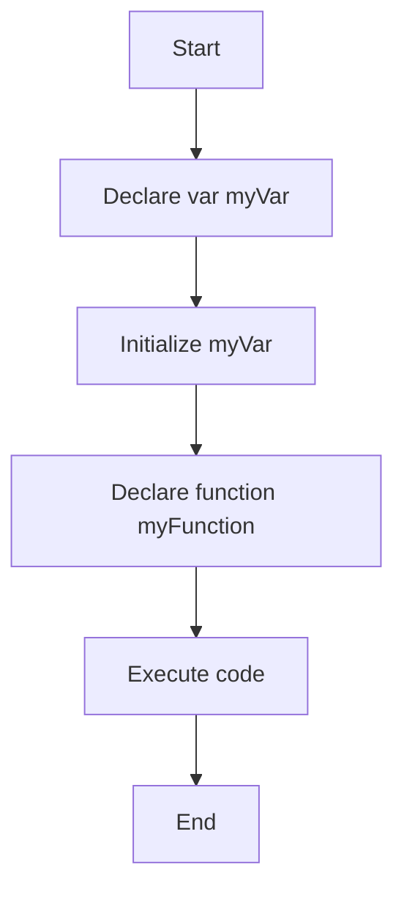

## 6.4 Avoiding Hoisting Pitfalls

Hoisting is a JavaScript mechanism where variable and function declarations are moved to the top of their containing scope during the compile phase. While this behavior can be convenient, it often leads to unexpected results and bugs, especially for beginners. In this section, we'll explore common pitfalls associated with hoisting and provide strategies to avoid them.

### Understanding Hoisting

Before we dive into avoiding pitfalls, let's briefly recap what hoisting is. In JavaScript, hoisting allows you to use functions and variables before they are declared. However, it's important to note that only the declarations are hoisted, not the initializations. This can lead to scenarios where variables are accessed before they have been assigned a value.

#### Example of Hoisting

```javascript
console.log(myVar); // Output: undefined
var myVar = 5;
console.log(myVar); // Output: 5
```

In the example above, the declaration `var myVar;` is hoisted to the top, but the assignment `myVar = 5;` is not. This results in `undefined` being logged initially.

### Common Problems Caused by Hoisting

1. **Unexpected `undefined` Values**: Accessing variables before they are initialized can lead to unexpected `undefined` values.
2. **Function Overwrites**: If multiple functions with the same name are declared, hoisting can cause one function to overwrite another.
3. **Confusing Code**: Hoisting can make code harder to read and understand, especially for those new to JavaScript.

### Best Practices to Avoid Hoisting Pitfalls

To avoid the common issues caused by hoisting, follow these best practices:

#### 1. Use `let` and `const` Instead of `var`

The `let` and `const` keywords, introduced in ES6, provide block-level scope, which helps prevent hoisting-related issues. Unlike `var`, variables declared with `let` and `const` are not hoisted to the top of their block. This means you cannot access them before they are declared.

```javascript
console.log(myLetVar); // ReferenceError: Cannot access 'myLetVar' before initialization
let myLetVar = 10;
```

#### 2. Declare Variables at the Top of Their Scope

To minimize confusion, always declare your variables at the top of their scope. This practice makes it clear which variables are available in a particular scope and helps prevent accidental hoisting.

```javascript
function exampleFunction() {
    let myVar;
    // Use myVar here
    myVar = 20;
}
```

#### 3. Use Function Expressions Over Function Declarations

Function expressions are not hoisted in the same way as function declarations. By using function expressions, you can avoid the pitfalls of function overwrites due to hoisting.

```javascript
// Function declaration
console.log(myFunction()); // Output: "Hello"
function myFunction() {
    return "Hello";
}

// Function expression
const myFunctionExpr = function() {
    return "Hello";
};
console.log(myFunctionExpr()); // Output: "Hello"
```

#### 4. Avoid Using the `var` Keyword

The `var` keyword is function-scoped and can lead to hoisting issues. By using `let` and `const`, you can avoid these pitfalls and write more predictable code.

```javascript
function testVar() {
    if (true) {
        var myVar = "I'm a var";
    }
    console.log(myVar); // Output: "I'm a var"
}

function testLet() {
    if (true) {
        let myLet = "I'm a let";
    }
    console.log(myLet); // ReferenceError: myLet is not defined
}
```

#### 5. Organize Your Code

Organizing your code logically and consistently can help minimize hoisting confusion. Group related declarations and functions together, and use comments to explain the purpose of each section.

```javascript
// Declare variables
let userName;
let userAge;

// Initialize variables
userName = "Alice";
userAge = 30;

// Function to display user info
function displayUserInfo() {
    console.log(`Name: ${userName}, Age: ${userAge}`);
}
```

### Code Examples: Correcting Hoisting Issues

Let's look at some examples of common hoisting issues and how to correct them.

#### Example 1: Variable Hoisting

**Problematic Code:**

```javascript
function greet() {
    console.log(greeting); // Output: undefined
    var greeting = "Hello, World!";
    console.log(greeting); // Output: "Hello, World!"
}
```

**Corrected Code:**

```javascript
function greet() {
    let greeting = "Hello, World!";
    console.log(greeting); // Output: "Hello, World!"
}
```

#### Example 2: Function Overwrites

**Problematic Code:**

```javascript
function sayHello() {
    return "Hello!";
}

function sayHello() {
    return "Hi!";
}

console.log(sayHello()); // Output: "Hi!"
```

**Corrected Code:**

```javascript
const sayHello = function() {
    return "Hello!";
};

console.log(sayHello()); // Output: "Hello!"
```

### Visualizing Hoisting

To better understand how hoisting works, let's visualize the process using a flowchart.



**Caption**: This flowchart illustrates the hoisting process in JavaScript, where variable and function declarations are moved to the top of their scope before code execution.

### Try It Yourself

Now it's your turn to experiment with hoisting. Try modifying the following code examples to see how hoisting affects variable and function behavior:

```javascript
// Example 1: Variable Hoisting
console.log(myVar); // What will this output?
var myVar = 10;

// Example 2: Function Hoisting
console.log(myFunc()); // What will this output?
function myFunc() {
    return "Hello!";
}
```

### References and Further Reading

For more information on hoisting and best practices in JavaScript, check out these resources:

- [MDN Web Docs: Hoisting](https://developer.mozilla.org/en-US/docs/Glossary/Hoisting)
- [W3Schools: JavaScript Hoisting](https://www.w3schools.com/js/js_hoisting.asp)

### Knowledge Check

Let's review what we've learned about avoiding hoisting pitfalls:

- Hoisting moves declarations to the top of their scope.
- Use `let` and `const` to prevent hoisting-related issues.
- Declare variables at the top of their scope for clarity.
- Use function expressions to avoid function overwrites.
- Avoid using the `var` keyword to minimize hoisting confusion.

### Embrace the Journey

Remember, mastering JavaScript takes time and practice. By understanding and avoiding hoisting pitfalls, you'll write more predictable and maintainable code. Keep experimenting, stay curious, and enjoy the journey!

## Quiz Time!



### What is hoisting in JavaScript?

- [x] The process of moving declarations to the top of their scope.
- [ ] The process of moving initializations to the top of their scope.
- [ ] The process of moving both declarations and initializations to the top of their scope.
- [ ] The process of moving code execution to the top of the file.

> **Explanation:** Hoisting in JavaScript refers to the process where variable and function declarations are moved to the top of their containing scope during the compile phase.

### Which keyword should you use to avoid hoisting issues?

- [x] `let`
- [x] `const`
- [ ] `var`
- [ ] `function`

> **Explanation:** Using `let` and `const` helps avoid hoisting issues because they provide block-level scope, unlike `var`, which is function-scoped.

### What happens when you access a `let` variable before it is declared?

- [ ] It returns `undefined`.
- [x] It throws a `ReferenceError`.
- [ ] It returns `null`.
- [ ] It returns an empty string.

> **Explanation:** Accessing a `let` variable before it is declared results in a `ReferenceError` because `let` does not hoist the variable to the top of its block.

### Why should you declare variables at the top of their scope?

- [x] To make the code more readable and predictable.
- [ ] To improve performance.
- [ ] To enable hoisting.
- [ ] To prevent errors.

> **Explanation:** Declaring variables at the top of their scope makes the code more readable and predictable, helping to prevent confusion related to hoisting.

### What is the difference between function declarations and function expressions in terms of hoisting?

- [x] Function declarations are hoisted, while function expressions are not.
- [ ] Function expressions are hoisted, while function declarations are not.
- [ ] Both are hoisted.
- [ ] Neither are hoisted.

> **Explanation:** Function declarations are hoisted to the top of their scope, whereas function expressions are not hoisted in the same way.

### What is a common problem caused by hoisting?

- [x] Unexpected `undefined` values.
- [ ] Syntax errors.
- [ ] Improved performance.
- [ ] Increased readability.

> **Explanation:** A common problem caused by hoisting is accessing variables before they are initialized, leading to unexpected `undefined` values.

### How can you avoid function overwrites due to hoisting?

- [x] Use function expressions instead of function declarations.
- [ ] Use `var` for function declarations.
- [ ] Declare functions at the bottom of the file.
- [ ] Use `let` for function declarations.

> **Explanation:** Using function expressions instead of function declarations can help avoid function overwrites due to hoisting.

### What is the output of the following code?

```javascript
console.log(myVar);
var myVar = 5;
```

- [x] `undefined`
- [ ] `5`
- [ ] `ReferenceError`
- [ ] `null`

> **Explanation:** The output is `undefined` because the declaration `var myVar;` is hoisted to the top, but the initialization `myVar = 5;` is not.

### What is the benefit of using `const` over `let`?

- [x] `const` ensures that the variable cannot be reassigned.
- [ ] `const` allows hoisting of variables.
- [ ] `const` improves performance.
- [ ] `const` allows for function overwrites.

> **Explanation:** The benefit of using `const` is that it ensures the variable cannot be reassigned, providing additional safety in your code.

### True or False: Hoisting moves both variable declarations and initializations to the top of their scope.

- [ ] True
- [x] False

> **Explanation:** False. Hoisting moves only the declarations to the top of their scope, not the initializations.


