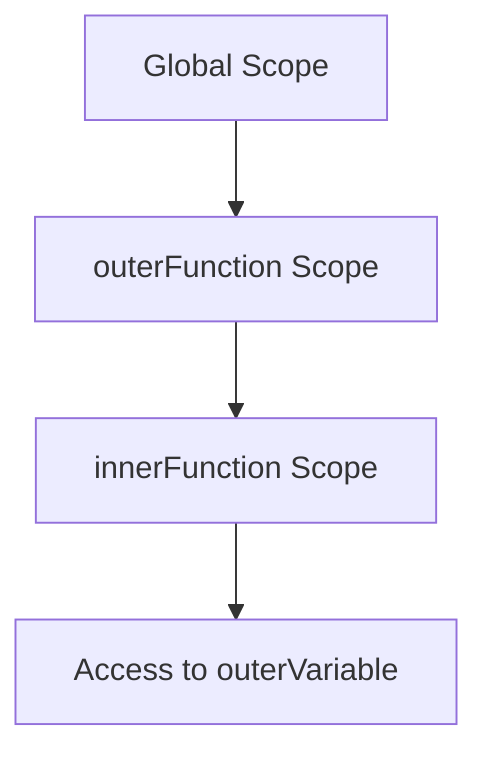

## 7.1 Introduction to Closures

In the world of JavaScript, closures are a fundamental concept that can initially seem elusive but are incredibly powerful once understood. Closures allow functions to retain access to their lexical scope, even when the function is executed outside that scope. In this section, we'll delve into what closures are, how they work, and why they are such a powerful feature in JavaScript programming.

### What is a Closure?

A **closure** is a feature in JavaScript where an inner function has access to the outer (enclosing) function's variables. This includes access to the outer function's scope chain. A closure is created when a function is defined inside another function and accesses variables from its parent function.

To put it simply, a closure gives you access to an outer function's scope from an inner function. In JavaScript, closures are created every time a function is created, at function creation time.

### Understanding Lexical Scoping

Before we dive deeper into closures, it's essential to understand the concept of **lexical scoping**. Lexical scoping means that the accessibility of variables is determined by the physical structure of the code. In other words, the scope of a variable is defined by its location within the source code, and nested functions have access to variables declared in their outer scope.

Consider this analogy: Imagine a series of nested boxes, each representing a function. The outermost box contains all the other boxes, and each box can access the contents of the boxes it is nested within. This is similar to how lexical scoping works in JavaScript.

### Simple Example of a Closure

Let's look at a simple example to illustrate closures:

```javascript
function outerFunction() {
    let outerVariable = 'I am outside!';

    function innerFunction() {
        console.log(outerVariable);
    }

    return innerFunction;
}

const myClosure = outerFunction();
myClosure(); // Output: I am outside!
```

In this example, `outerFunction` defines a variable `outerVariable` and an `innerFunction` that logs `outerVariable` to the console. The `innerFunction` is returned from `outerFunction`, and when `myClosure` is called, it still has access to `outerVariable`, even though `outerFunction` has finished executing. This is the essence of a closure.

### Why Are Closures Powerful?

Closures are powerful for several reasons:

1. **Data Encapsulation**: Closures allow you to encapsulate data, creating private variables that cannot be accessed from outside the function. This is useful for creating data privacy.

2. **Stateful Functions**: Closures can maintain state between function calls. This means you can create functions that remember the state of variables even after the function has been executed.

3. **Functional Programming**: Closures are a cornerstone of functional programming, enabling higher-order functions and functional patterns.

4. **Callbacks and Event Handlers**: Closures are commonly used in callbacks and event handlers, where functions need to maintain access to variables in their scope.

### Exploring Closures with Analogies

To better understand closures, let's use an analogy. Imagine a backpack that you carry with you everywhere. This backpack contains all the things you need for your day. Now, imagine that you can reach into this backpack and access its contents at any time, no matter where you are. In this analogy, the backpack represents the closure, and the contents are the variables and functions within the closure's scope.

### More Examples of Closures

Let's explore more examples to solidify our understanding of closures.

#### Example 1: Counter Function

```javascript
function createCounter() {
    let count = 0;

    return function() {
        count += 1;
        return count;
    };
}

const counter = createCounter();
console.log(counter()); // Output: 1
console.log(counter()); // Output: 2
console.log(counter()); // Output: 3
```

In this example, `createCounter` returns an inner function that increments and returns the `count` variable. The `count` variable is private to the `createCounter` function, but the inner function maintains access to it, demonstrating a closure.

#### Example 2: Private Variables

```javascript
function secretKeeper(secret) {
    return function() {
        console.log(secret);
    };
}

const revealSecret = secretKeeper('JavaScript is awesome!');
revealSecret(); // Output: JavaScript is awesome!
```

Here, `secretKeeper` takes a `secret` parameter and returns a function that logs the secret. The `secret` variable is encapsulated within the closure, providing data privacy.

### Visualizing Closures

To visualize how closures work, let's use a diagram to represent the scope chain and how variables are accessed:



**Diagram Explanation**: This diagram represents the scope chain when `innerFunction` is executed. The `innerFunction` has access to its own scope, the scope of `outerFunction`, and the global scope, allowing it to access `outerVariable`.

### Try It Yourself

Experiment with closures by modifying the examples above. Try creating a closure that maintains a list of items, or a closure that acts as a simple calculator. The key is to understand how the inner function retains access to the outer function's variables.

### References and Further Reading

- [MDN Web Docs: Closures](https://developer.mozilla.org/en-US/docs/Web/JavaScript/Closures)
- [W3Schools: JavaScript Closures](https://www.w3schools.com/js/js_function_closures.asp)

### Knowledge Check

To reinforce your understanding of closures, consider these questions:

1. What is a closure in JavaScript?
2. How does lexical scoping relate to closures?
3. Why are closures considered powerful in JavaScript?
4. Can you create a closure that maintains a counter state?
5. How do closures provide data encapsulation?

### Embrace the Journey

Remember, understanding closures is a significant step in mastering JavaScript. Closures are a powerful tool that can enhance your programming skills. As you continue your journey, keep experimenting, stay curious, and enjoy the process of learning and discovery!

## Quiz Time!



### What is a closure in JavaScript?

- [x] A function that retains access to its lexical scope
- [ ] A function that executes immediately
- [ ] A function that is declared inside another function
- [ ] A function without parameters

> **Explanation:** A closure is a function that retains access to its lexical scope, even when executed outside that scope.

### How does lexical scoping relate to closures?

- [x] It determines the accessibility of variables based on their physical location in the code
- [ ] It allows functions to be executed immediately
- [ ] It prevents functions from accessing outer variables
- [ ] It is unrelated to closures

> **Explanation:** Lexical scoping determines variable accessibility based on their location in the code, which is crucial for understanding closures.

### Why are closures considered powerful in JavaScript?

- [x] They allow data encapsulation and maintain state between function calls
- [ ] They make functions execute faster
- [ ] They prevent functions from accessing outer variables
- [ ] They simplify syntax

> **Explanation:** Closures are powerful because they allow data encapsulation and maintain state, enabling more complex programming patterns.

### Can closures be used to create private variables?

- [x] Yes
- [ ] No

> **Explanation:** Closures can create private variables by encapsulating them within a function's scope.

### What is the output of the following code?
```javascript
function secretKeeper(secret) {
    return function() {
        console.log(secret);
    };
}

const revealSecret = secretKeeper('JavaScript is awesome!');
revealSecret();
```

- [x] JavaScript is awesome!
- [ ] undefined
- [ ] Error
- [ ] Nothing

> **Explanation:** The closure retains access to the `secret` variable, allowing it to be logged to the console.

### How can closures help in functional programming?

- [x] By enabling higher-order functions and functional patterns
- [ ] By making functions execute immediately
- [ ] By preventing functions from accessing outer variables
- [ ] By simplifying syntax

> **Explanation:** Closures enable higher-order functions and functional patterns, which are key aspects of functional programming.

### What is the purpose of the `innerFunction` in a closure?

- [x] To access and manipulate variables from its outer function
- [ ] To execute immediately
- [ ] To prevent access to outer variables
- [ ] To simplify syntax

> **Explanation:** The `innerFunction` in a closure accesses and manipulates variables from its outer function, demonstrating the closure's power.

### Can closures maintain state between function calls?

- [x] Yes
- [ ] No

> **Explanation:** Closures can maintain state between function calls by retaining access to variables in their scope.

### What is an example of a closure in JavaScript?

- [x] A function that returns another function with access to its outer variables
- [ ] A function that executes immediately
- [ ] A function without parameters
- [ ] A function declared inside another function

> **Explanation:** A closure is a function that returns another function with access to its outer variables, demonstrating its ability to retain scope.

### Are closures created every time a function is defined?

- [x] True
- [ ] False

> **Explanation:** Closures are created every time a function is defined, as they inherently retain access to their lexical scope.




