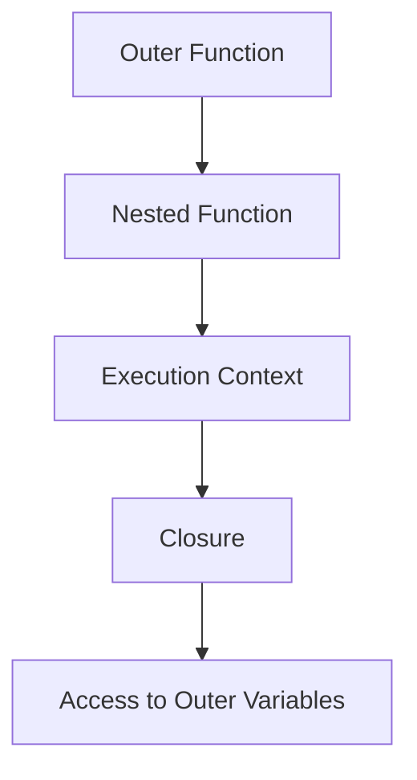

## 7.2 Creating Closures

Closures are a fundamental concept in JavaScript that allow functions to retain access to their lexical scope even after the outer function has finished executing. This powerful feature enables a variety of programming patterns and can be used to create private variables, function factories, and more. In this section, we will explore how closures are formed, provide practical examples, and offer exercises to help you master this concept.

### Understanding Closures

Before diving into creating closures, let's first define what a closure is. A closure is a function that "remembers" the environment in which it was created. This environment consists of any local variables that were in-scope at the time the closure was created.

#### Step-by-Step: How Closures Are Formed

1. **Function Definition**: A closure begins with a function definition. When a function is defined inside another function, it has access to the variables of the outer function.
   
2. **Execution Context**: When the outer function is called, an execution context is created. This context contains the variables and parameters of the outer function.
   
3. **Nested Function**: The nested function, defined within the outer function, captures the execution context of the outer function.
   
4. **Return of Nested Function**: When the outer function returns the nested function, the execution context of the outer function is preserved, allowing the nested function to access it even after the outer function has completed execution.

### Example: Nested Functions Accessing Outer Variables

Let's look at a simple example to illustrate how closures work:

```javascript
function outerFunction(outerVariable) {
    return function innerFunction(innerVariable) {
        console.log('Outer Variable:', outerVariable);
        console.log('Inner Variable:', innerVariable);
    };
}

const closure = outerFunction('outside');
closure('inside');
```

**Explanation**:
- The `outerFunction` takes an `outerVariable` and returns the `innerFunction`.
- The `innerFunction` has access to both `outerVariable` and `innerVariable`.
- When `closure` is called, it logs both variables, demonstrating that `innerFunction` retains access to `outerVariable` even after `outerFunction` has finished executing.

### Practical Examples of Closures

Closures can be used in various programming patterns. Let's explore some common use cases:

#### Function Factories

Function factories are functions that create and return other functions. Closures enable these factories to maintain state across multiple invocations.

```javascript
function multiplier(factor) {
    return function(number) {
        return number * factor;
    };
}

const double = multiplier(2);
const triple = multiplier(3);

console.log(double(5)); // Output: 10
console.log(triple(5)); // Output: 15
```

**Explanation**:
- The `multiplier` function returns a new function that multiplies a given number by `factor`.
- Each call to `multiplier` creates a new closure with its own `factor` value, allowing `double` and `triple` to operate independently.

#### Private Variables

Closures can be used to create private variables, which are variables that cannot be accessed directly from outside the function.

```javascript
function createCounter() {
    let count = 0;
    return {
        increment: function() {
            count++;
            return count;
        },
        decrement: function() {
            count--;
            return count;
        }
    };
}

const counter = createCounter();
console.log(counter.increment()); // Output: 1
console.log(counter.decrement()); // Output: 0
```

**Explanation**:
- The `createCounter` function returns an object with `increment` and `decrement` methods.
- The `count` variable is private and can only be modified through these methods, demonstrating encapsulation using closures.

### Variable Persistence in Closures

One of the key features of closures is their ability to preserve the state of variables. This persistence allows functions to maintain data between calls, making closures ideal for scenarios where state management is required.

#### Example: Persistent State

```javascript
function makeAdder(x) {
    return function(y) {
        return x + y;
    };
}

const add5 = makeAdder(5);
console.log(add5(2)); // Output: 7
console.log(add5(3)); // Output: 8
```

**Explanation**:
- The `makeAdder` function creates a closure with the variable `x`.
- The returned function adds `y` to `x`, demonstrating how `x` persists across multiple invocations of the closure.

### Exercises: Practice Creating Closures

To reinforce your understanding of closures, try the following exercises:

1. **Exercise 1**: Create a function `createGreeting` that takes a greeting message as an argument and returns a function that takes a name and logs the greeting message with the name.

2. **Exercise 2**: Implement a function `createBankAccount` that returns an object with methods `deposit`, `withdraw`, and `getBalance`. Use closures to keep the balance private.

3. **Exercise 3**: Write a function `createMultiplier` that takes a number as an argument and returns a function that multiplies its argument by the number. Test it with different numbers.

### Visualizing Closures

To better understand how closures work, let's visualize the process with a diagram:



**Diagram Explanation**:
- The outer function defines a nested function.
- The nested function captures the execution context of the outer function.
- The closure is formed, allowing the nested function to access the outer variables even after the outer function has completed.

### References and Further Reading

For more information on closures, consider exploring these resources:
- [MDN Web Docs: Closures](https://developer.mozilla.org/en-US/docs/Web/JavaScript/Closures)
- [W3Schools: JavaScript Closures](https://www.w3schools.com/js/js_function_closures.asp)

### Knowledge Check

To ensure you've grasped the concept of closures, consider the following questions:

1. What is a closure, and how is it formed?
2. How can closures be used to create private variables?
3. What is the significance of variable persistence in closures?

### Embrace the Journey

Remember, mastering closures is a journey. As you continue to practice and experiment with closures, you'll discover new ways to leverage their power in your JavaScript programming. Keep exploring, stay curious, and enjoy the process of learning!

## Quiz Time!



### What is a closure in JavaScript?

- [x] A function that retains access to its lexical scope
- [ ] A function that returns another function
- [ ] A function that is immediately invoked
- [ ] A function that has no parameters

> **Explanation:** A closure is a function that retains access to its lexical scope, even after the outer function has finished executing.

### How can closures be used to create private variables?

- [x] By defining variables in the outer function and accessing them in the nested function
- [ ] By using global variables
- [ ] By using the `this` keyword
- [ ] By using arrow functions

> **Explanation:** Closures allow variables defined in an outer function to be accessed by a nested function, creating private variables.

### What is a function factory?

- [x] A function that creates and returns other functions
- [ ] A function that is called immediately
- [ ] A function that has no return value
- [ ] A function that uses the `this` keyword

> **Explanation:** A function factory is a function that creates and returns other functions, often using closures to maintain state.

### What is variable persistence in closures?

- [x] The ability of a closure to retain the state of variables
- [ ] The ability of a closure to modify global variables
- [ ] The ability of a closure to execute immediately
- [ ] The ability of a closure to have no parameters

> **Explanation:** Variable persistence in closures refers to the ability of a closure to retain the state of variables across multiple invocations.

### Which of the following is an example of a closure?

- [x] A nested function accessing a variable from its outer function
- [ ] A function that calls itself recursively
- [x] A function that returns another function
- [ ] A function that uses the `this` keyword

> **Explanation:** Closures are formed when a nested function accesses a variable from its outer function, and when a function returns another function.

### How can closures help in managing state?

- [x] By preserving the state of variables in the closure
- [ ] By using global variables
- [ ] By using the `this` keyword
- [ ] By using arrow functions

> **Explanation:** Closures preserve the state of variables, allowing functions to manage state across multiple invocations.

### What is the purpose of the `return` statement in a closure?

- [x] To return the nested function and form a closure
- [ ] To execute the function immediately
- [x] To return a value from the nested function
- [ ] To modify global variables

> **Explanation:** The `return` statement in a closure returns the nested function, forming a closure, and can also return a value from the nested function.

### What is a common use case for closures?

- [x] Creating private variables
- [ ] Modifying global variables
- [ ] Using the `this` keyword
- [ ] Executing functions immediately

> **Explanation:** A common use case for closures is creating private variables, which are not accessible from outside the function.

### How do closures relate to scope?

- [x] Closures retain access to their lexical scope
- [ ] Closures modify the global scope
- [ ] Closures have no scope
- [ ] Closures use the `this` keyword

> **Explanation:** Closures retain access to their lexical scope, allowing them to access variables from their outer function.

### True or False: Closures can only be created with named functions.

- [ ] True
- [x] False

> **Explanation:** Closures can be created with both named and anonymous functions, as long as they capture the lexical scope.




