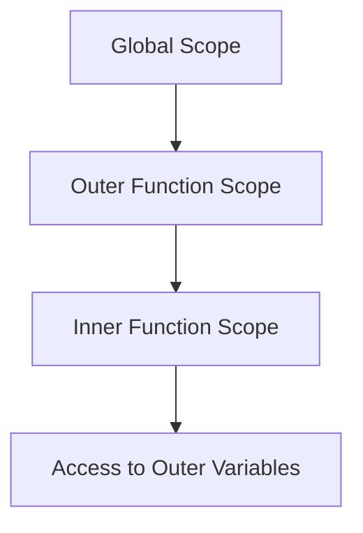

## 7.3 Practical Uses of Closures

Closures are a powerful feature in JavaScript that allow functions to access variables from an outer function's scope even after the outer function has finished executing. This unique capability enables a wide range of practical applications, from data privacy and encapsulation to maintaining state across function calls. In this section, we will explore some common and practical uses of closures, providing you with the tools to leverage this concept effectively in your JavaScript programming.

### Understanding Closures

Before diving into practical uses, let's briefly revisit what closures are. A closure is created when a function is defined within another function, allowing the inner function to access the outer function's variables. This is possible because of JavaScript's lexical scoping and the way it handles function execution contexts.

Here's a simple example to illustrate closures:

```javascript
function outerFunction(outerVariable) {
    return function innerFunction(innerVariable) {
        console.log('Outer Variable:', outerVariable);
        console.log('Inner Variable:', innerVariable);
    };
}

const closureExample = outerFunction('outside');
closureExample('inside');
```

In this example, `innerFunction` forms a closure, capturing the `outerVariable` from `outerFunction`'s scope, even after `outerFunction` has completed execution.

### Data Privacy and Encapsulation

One of the most compelling uses of closures is data privacy. In JavaScript, closures allow you to create private variables that cannot be accessed directly from outside the function. This is particularly useful in scenarios where you want to hide implementation details and expose only necessary parts of your code.

#### Example: Creating Private Variables

Consider a scenario where you want to create a counter that can be incremented or decremented, but you don't want the counter value to be directly accessible or modifiable from outside the function:

```javascript
function createCounter() {
    let count = 0; // Private variable

    return {
        increment: function() {
            count++;
            return count;
        },
        decrement: function() {
            count--;
            return count;
        }
    };
}

const counter = createCounter();
console.log(counter.increment()); // Output: 1
console.log(counter.increment()); // Output: 2
console.log(counter.decrement()); // Output: 1
```

In this example, `count` is a private variable, accessible only through the `increment` and `decrement` methods. This encapsulation ensures that the counter's value is protected from external manipulation.

### Module Pattern

Closures are also instrumental in implementing the module pattern, a design pattern that helps organize and structure code by encapsulating related functionality into a single unit. This pattern is particularly useful for maintaining clean and modular codebases.

#### Example: Using the Module Pattern

Let's create a simple module for managing a collection of items:

```javascript
const itemManager = (function() {
    let items = []; // Private array

    return {
        addItem: function(item) {
            items.push(item);
            console.log(`Item added: ${item}`);
        },
        getItems: function() {
            return [...items]; // Return a copy of the array
        }
    };
})();

itemManager.addItem('Apple');
itemManager.addItem('Banana');
console.log(itemManager.getItems()); // Output: ['Apple', 'Banana']
```

In this example, `items` is a private array, and the module exposes methods to add items and retrieve a copy of the items. The module pattern, facilitated by closures, helps keep the internal state private while providing a clean interface for interaction.

### Event Handlers and Callbacks

Closures are frequently used in event handlers and callbacks, where they allow functions to retain access to variables from their enclosing scope. This capability is essential for managing state and context in asynchronous operations.

#### Example: Using Closures in Event Handlers

Consider a scenario where you need to attach event listeners to multiple buttons and maintain a reference to each button's index:

```html
<!DOCTYPE html>
<html lang="en">
<head>
    <meta charset="UTF-8">
    <title>Button Click Example</title>
</head>
<body>
    <button>Button 1</button>
    <button>Button 2</button>
    <button>Button 3</button>

    <script>
        const buttons = document.querySelectorAll('button');

        buttons.forEach((button, index) => {
            button.addEventListener('click', function() {
                console.log(`Button ${index + 1} clicked`);
            });
        });
    </script>
</body>
</html>
```

In this example, each button's click event handler forms a closure, capturing the `index` variable from the `forEach` loop. This allows the correct index to be logged when a button is clicked.

### Maintaining State

Closures are ideal for maintaining state across multiple function calls. This is particularly useful in scenarios where you need to track changes or accumulate data over time.

#### Example: Accumulating Values

Let's create a function that accumulates values passed to it:

```javascript
function createAccumulator() {
    let total = 0; // Private variable

    return function(value) {
        total += value;
        return total;
    };
}

const accumulator = createAccumulator();
console.log(accumulator(5)); // Output: 5
console.log(accumulator(10)); // Output: 15
console.log(accumulator(3)); // Output: 18
```

In this example, the `total` variable is maintained across multiple calls to the returned function, allowing values to be accumulated over time.

### Real-World Scenarios

Closures are not just theoretical concepts; they have practical applications in real-world scenarios. Let's explore some common use cases where closures prove to be invaluable.

#### 1. Timer Functions

Closures are often used in timer functions to maintain state or context over time. For example, you can use closures to create a countdown timer that updates a display every second:

```javascript
function createCountdown(seconds) {
    let remaining = seconds;

    const intervalId = setInterval(function() {
        if (remaining > 0) {
            console.log(`Time left: ${remaining} seconds`);
            remaining--;
        } else {
            console.log('Countdown complete!');
            clearInterval(intervalId);
        }
    }, 1000);
}

createCountdown(5);
```

In this example, the `remaining` variable is captured by the closure, allowing it to be decremented each second until the countdown is complete.

#### 2. API Request Management

Closures can be used to manage API requests, ensuring that each request maintains its own state and context. This is particularly useful when dealing with asynchronous operations like fetching data from a server.

```javascript
function fetchData(url) {
    let isLoading = true;

    fetch(url)
        .then(response => response.json())
        .then(data => {
            isLoading = false;
            console.log('Data received:', data);
        })
        .catch(error => {
            isLoading = false;
            console.error('Error fetching data:', error);
        });

    return function() {
        return isLoading;
    };
}

const checkLoading = fetchData('https://api.example.com/data');
console.log(checkLoading()); // Output: true (initially)
```

In this example, the `isLoading` variable is captured by the closure, allowing you to check the loading state of the API request.

### Try It Yourself

Closures are best understood through practice. Try modifying the examples above to see how closures behave in different scenarios. For instance, you can:

- Modify the `createCounter` function to add a reset method that sets the counter back to zero.
- Extend the `itemManager` module to include a method for removing items.
- Experiment with the `createAccumulator` function by adding a method to reset the total.

### Visualizing Closures

To better understand how closures work, let's visualize the concept using a scope chain diagram. This will help illustrate how variables are resolved in a closure.



In this diagram, the inner function scope has access to variables in the outer function scope, which in turn has access to variables in the global scope. This chain of access is what makes closures possible.

### References and Further Reading

For more information on closures and their applications, consider exploring the following resources:

- [MDN Web Docs: Closures](https://developer.mozilla.org/en-US/docs/Web/JavaScript/Closures)
- [W3Schools: JavaScript Closures](https://www.w3schools.com/js/js_function_closures.asp)
- [JavaScript.info: Closures](https://javascript.info/closure)

### Knowledge Check

To reinforce your understanding of closures, consider the following questions:

- What is a closure, and how is it created in JavaScript?
- How can closures be used to create private variables?
- What is the module pattern, and how do closures facilitate its implementation?
- How do closures help maintain state in asynchronous operations?
- Can you think of a real-world scenario where closures would be beneficial?

### Embrace the Journey

Closures are a fundamental concept in JavaScript that unlock a wide range of possibilities. As you continue to explore and experiment with closures, remember that practice is key to mastering this concept. Keep experimenting, stay curious, and enjoy the journey of becoming a proficient JavaScript developer!

## Quiz Time!



### What is a closure in JavaScript?

- [x] A function that retains access to its lexical scope, even after the outer function has finished executing.
- [ ] A function that can only be called once.
- [ ] A function that does not return any value.
- [ ] A function that is executed immediately after it is defined.

> **Explanation:** A closure is a function that retains access to its lexical scope, allowing it to access variables from an outer function even after that function has completed execution.

### How can closures be used to create private variables?

- [x] By defining variables within a function and returning an inner function that accesses those variables.
- [ ] By using the `private` keyword.
- [ ] By declaring variables with `var` instead of `let` or `const`.
- [ ] By using global variables.

> **Explanation:** Closures allow you to create private variables by defining them within a function and returning an inner function that can access those variables, keeping them hidden from the outside world.

### What is the module pattern?

- [x] A design pattern that uses closures to encapsulate related functionality into a single unit.
- [ ] A pattern for creating classes in JavaScript.
- [ ] A method for organizing CSS styles.
- [ ] A way to handle asynchronous operations.

> **Explanation:** The module pattern is a design pattern that uses closures to encapsulate related functionality, providing a clean and organized way to structure code.

### How do closures help maintain state in asynchronous operations?

- [x] By capturing variables from the outer scope, allowing them to be accessed and modified over time.
- [ ] By using the `await` keyword.
- [ ] By creating new variables for each asynchronous operation.
- [ ] By using global variables.

> **Explanation:** Closures capture variables from the outer scope, allowing them to be accessed and modified over time, which is particularly useful in asynchronous operations.

### Which of the following is a real-world scenario where closures are beneficial?

- [x] Creating a countdown timer that updates every second.
- [ ] Styling a webpage with CSS.
- [ ] Writing HTML content.
- [ ] Using SQL queries to retrieve data.

> **Explanation:** Closures are beneficial in scenarios like creating a countdown timer, where maintaining state over time is crucial.

### What is the main advantage of using closures for data privacy?

- [x] They allow variables to be hidden from the global scope, preventing unintended access or modification.
- [ ] They make code execution faster.
- [ ] They simplify the syntax of functions.
- [ ] They allow functions to run in parallel.

> **Explanation:** Closures allow variables to be hidden from the global scope, providing a way to encapsulate and protect data from unintended access or modification.

### In the context of closures, what does lexical scoping refer to?

- [x] The ability of a function to access variables from its outer scope.
- [ ] The order in which functions are executed.
- [ ] The use of `let` and `const` for variable declarations.
- [ ] The process of compiling JavaScript code.

> **Explanation:** Lexical scoping refers to the ability of a function to access variables from its outer scope, which is a key aspect of how closures work.

### How can closures be used in event handlers?

- [x] By capturing variables from the outer scope, allowing event handlers to access and use those variables.
- [ ] By using the `this` keyword.
- [ ] By declaring variables globally.
- [ ] By using the `setTimeout` function.

> **Explanation:** Closures capture variables from the outer scope, allowing event handlers to access and use those variables, which is essential for managing state and context.

### What is the purpose of the `setInterval` function in the countdown timer example?

- [x] To repeatedly execute a function at specified intervals, allowing the countdown to update every second.
- [ ] To execute a function once after a delay.
- [ ] To stop the execution of a function.
- [ ] To create a new variable scope.

> **Explanation:** The `setInterval` function is used to repeatedly execute a function at specified intervals, allowing the countdown to update every second.

### True or False: Closures can only be used with functions that return other functions.

- [ ] True
- [x] False

> **Explanation:** False. Closures can be used with any function that accesses variables from its outer scope, not just those that return other functions.


