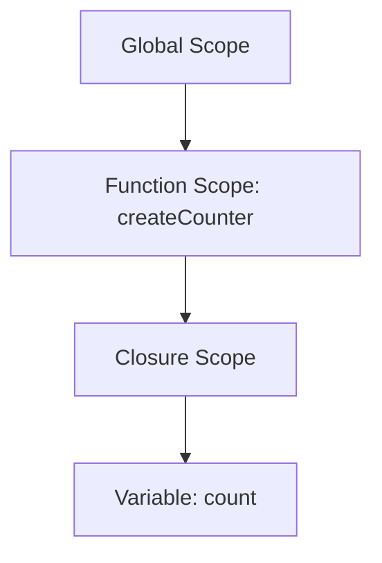

## 7.4 Memory Considerations

In this section, we'll delve into the intricacies of memory considerations when working with closures in JavaScript. Closures are a powerful feature that allows functions to retain access to their lexical scope even after the parent function has finished executing. However, this capability can also lead to increased memory consumption and potential memory leaks if not managed properly. Let's explore these concepts in detail and learn how to handle closures efficiently.

### Understanding Closures and Memory Usage

Closures occur when a function is able to remember and access its lexical scope, even when that function is executed outside its original scope. This is a fundamental aspect of JavaScript's function execution model and is crucial for creating private variables and function factories.

#### How Closures Increase Memory Consumption

When a closure is created, it retains references to the variables in its lexical scope. This means that as long as the closure exists, the memory allocated for these variables cannot be reclaimed by the garbage collector. This can lead to increased memory usage, especially if the closure is long-lived or if it captures a large number of variables.

**Example:**

```javascript
function createCounter() {
    let count = 0; // This variable is captured by the closure

    return function() {
        count++;
        console.log(count);
    };
}

const counter = createCounter();
counter(); // Outputs: 1
counter(); // Outputs: 2
```

In this example, the `count` variable is captured by the closure returned by `createCounter`. As long as the `counter` function exists, `count` will remain in memory.

### Potential Memory Leaks Due to Unintended References

A memory leak occurs when memory that is no longer needed is not released. Closures can inadvertently cause memory leaks if they hold references to variables or objects that are no longer necessary.

#### Example of a Memory Leak

Consider a scenario where a closure captures a large object that is no longer needed:

```javascript
function createLogger() {
    const largeObject = new Array(1000000).fill('data'); // Large object

    return function log() {
        console.log('Logging data');
    };
}

const logger = createLogger();
// The largeObject is still in memory because log() holds a reference to it
```

In this example, the `largeObject` remains in memory because the `log` function retains a reference to it, even though `log` does not use `largeObject`.

### Tips for Managing Closures Efficiently

To prevent memory issues when working with closures, consider the following strategies:

1. **Limit Scope Capture:** Only capture variables that are necessary for the closure's functionality. Avoid capturing large objects or unnecessary data.

2. **Release Unused Closures:** If a closure is no longer needed, ensure that all references to it are removed so that the garbage collector can reclaim the memory.

3. **Use Weak References:** In some cases, using weak references can help manage memory by allowing objects to be garbage-collected even if they are still referenced by a closure.

4. **Avoid Long-Lived Closures:** Be cautious with closures that are kept alive for a long time, such as those attached to global objects or event listeners. Consider removing or replacing them when they are no longer needed.

### Tools and Techniques for Monitoring Memory Usage

Monitoring memory usage can help identify potential issues with closures and other aspects of your JavaScript code. Here are some tools and techniques you can use:

- **Browser Developer Tools:** Most modern browsers come with built-in developer tools that include memory profiling and analysis features. Use these tools to monitor memory usage and identify leaks.

- **Heap Snapshots:** Take heap snapshots to analyze memory allocation and identify objects that are not being garbage-collected.

- **Performance Profiling:** Use performance profiling tools to understand how your code is executing and where memory is being consumed.

### Visualizing Memory Usage with Closures

To better understand how closures interact with memory, let's visualize a simple scenario using a scope chain diagram.



**Diagram Description:** This diagram illustrates the scope chain when a closure is created. The `count` variable is captured in the closure scope, which is retained in memory as long as the closure exists.

### Managing Long-Lived Closures

Long-lived closures can be particularly challenging to manage because they persist for extended periods, potentially holding onto significant amounts of memory. Here are some strategies to handle them effectively:

- **Detach Event Listeners:** If a closure is used as an event listener, ensure that it is detached when no longer needed.

- **Use Closures Sparingly:** Only use closures when necessary. Consider alternative patterns, such as module patterns or classes, which may offer better memory management.

- **Regularly Review Code:** Periodically review your code to identify closures that may be holding onto memory unnecessarily.

### Try It Yourself

Experiment with the following code to see how closures interact with memory:

```javascript
function createMemoryIntensiveClosure() {
    const largeArray = new Array(1000000).fill('data');

    return function() {
        console.log('Closure with large array');
    };
}

const memoryClosure = createMemoryIntensiveClosure();
memoryClosure();

// Try commenting out the line below and observe memory usage
// memoryClosure = null;
```

**Challenge:** Modify the code to release the memory used by `largeArray` when it is no longer needed.

### Summary

In this section, we've explored how closures can impact memory usage in JavaScript. By understanding how closures work and implementing strategies to manage them efficiently, you can prevent memory leaks and optimize your code's performance. Remember, closures are a powerful tool, but with great power comes great responsibility. Keep experimenting, stay curious, and enjoy the journey!

## Quiz Time!



### What is a closure in JavaScript?

- [x] A function that retains access to its lexical scope even when executed outside its original scope.
- [ ] A function that can only be executed within its original scope.
- [ ] A function that does not retain any references to its lexical scope.
- [ ] A function that is automatically garbage-collected when it goes out of scope.

> **Explanation:** A closure is a function that retains access to its lexical scope, allowing it to access variables from its parent scope even when executed outside of it.

### How can closures increase memory consumption?

- [x] By retaining references to variables in their lexical scope.
- [ ] By automatically releasing all captured variables.
- [ ] By preventing the creation of new variables.
- [ ] By executing code more slowly.

> **Explanation:** Closures retain references to variables in their lexical scope, which can prevent these variables from being garbage-collected, leading to increased memory consumption.

### What is a memory leak?

- [x] Memory that is no longer needed but not released.
- [ ] Memory that is automatically released when no longer needed.
- [ ] Memory that is used efficiently by the program.
- [ ] Memory that is allocated but never used.

> **Explanation:** A memory leak occurs when memory that is no longer needed is not released, often due to lingering references.

### Which of the following is a strategy to manage closures efficiently?

- [x] Limit scope capture to necessary variables.
- [ ] Capture as many variables as possible.
- [ ] Avoid using closures altogether.
- [ ] Use closures for all functions.

> **Explanation:** Limiting scope capture to only necessary variables helps manage memory efficiently by reducing the number of retained references.

### What tool can be used to monitor memory usage in JavaScript?

- [x] Browser Developer Tools
- [ ] Text Editor
- [ ] Command Line Interface
- [ ] Spreadsheet Software

> **Explanation:** Browser Developer Tools provide memory profiling and analysis features that help monitor memory usage in JavaScript applications.

### What is a potential issue with long-lived closures?

- [x] They can hold onto significant amounts of memory.
- [ ] They automatically release all captured variables.
- [ ] They execute more quickly than short-lived closures.
- [ ] They do not retain any references to their lexical scope.

> **Explanation:** Long-lived closures can hold onto significant amounts of memory if they retain references to large objects or data structures.

### How can you release memory used by a closure?

- [x] Remove all references to the closure.
- [ ] Increase the size of captured variables.
- [ ] Use closures for all functions.
- [ ] Capture as many variables as possible.

> **Explanation:** Removing all references to a closure allows the garbage collector to reclaim the memory used by the closure and its captured variables.

### What is a weak reference?

- [x] A reference that allows objects to be garbage-collected even if they are still referenced.
- [ ] A reference that prevents objects from being garbage-collected.
- [ ] A reference that increases memory consumption.
- [ ] A reference that is automatically removed after a certain period.

> **Explanation:** A weak reference allows objects to be garbage-collected even if they are still referenced, helping manage memory more efficiently.

### Why is it important to detach event listeners when they are no longer needed?

- [x] To prevent memory leaks caused by lingering references.
- [ ] To ensure the event listener executes more quickly.
- [ ] To increase the number of captured variables.
- [ ] To automatically release all captured variables.

> **Explanation:** Detaching event listeners when they are no longer needed helps prevent memory leaks by removing lingering references to closures.

### True or False: Closures should always be used in JavaScript applications.

- [ ] True
- [x] False

> **Explanation:** While closures are a powerful tool, they should be used judiciously to avoid unnecessary memory consumption and potential memory leaks.


