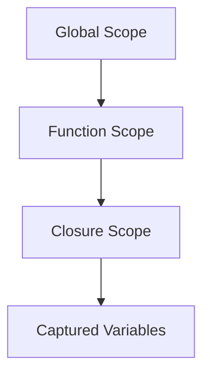

## 7.5 Avoiding Common Mistakes with Closures

Closures are a powerful feature in JavaScript, allowing functions to retain access to their lexical scope even after the outer function has finished executing. However, with great power comes the potential for confusion and errors. In this section, we'll explore common mistakes developers make when working with closures, provide strategies to prevent these issues, and discuss the importance of understanding variable scope. By the end, you'll be equipped with the knowledge to use closures effectively and avoid common pitfalls.

### Understanding Closures

Before diving into the mistakes, let's briefly recap what closures are. A closure is a function that captures variables from its surrounding scope. This allows the function to access those variables even after the outer function has completed.

```javascript
function outerFunction(outerVariable) {
    return function innerFunction(innerVariable) {
        console.log('Outer Variable:', outerVariable);
        console.log('Inner Variable:', innerVariable);
    };
}

const closureExample = outerFunction('outside');
closureExample('inside'); // Outer Variable: outside, Inner Variable: inside
```

In this example, `innerFunction` is a closure that captures `outerVariable` from `outerFunction`.

### Common Mistakes with Closures

#### 1. Incorrect Variable Capturing

One of the most frequent mistakes is assuming that closures capture the value of a variable at the time the closure is created. In reality, closures capture the reference to the variable, not the value. This can lead to unexpected behavior, especially in loops.

**Example:**

```javascript
function createCounters() {
    let counters = [];
    for (let i = 0; i < 3; i++) {
        counters[i] = function() {
            console.log(i);
        };
    }
    return counters;
}

const counters = createCounters();
counters[0](); // 3
counters[1](); // 3
counters[2](); // 3
```

**Explanation:**

In this example, each function in the `counters` array captures the same `i` variable, which ends up being `3` after the loop finishes. To fix this, use an IIFE (Immediately Invoked Function Expression) or `let` to create a new scope for each iteration.

**Solution:**

```javascript
function createCounters() {
    let counters = [];
    for (let i = 0; i < 3; i++) {
        counters[i] = (function(index) {
            return function() {
                console.log(index);
            };
        })(i);
    }
    return counters;
}

const counters = createCounters();
counters[0](); // 0
counters[1](); // 1
counters[2](); // 2
```

#### 2. Memory Leaks

Closures can inadvertently cause memory leaks if they capture large objects or DOM elements that are no longer needed. This happens because the closure keeps a reference to the variables, preventing garbage collection.

**Example:**

```javascript
function createHandler() {
    const largeObject = new Array(1000000).fill('data');
    return function() {
        console.log(largeObject.length);
    };
}

const handler = createHandler();
// The largeObject is still in memory because of the closure
```

**Solution:**

To prevent memory leaks, ensure that closures only capture variables that are necessary for their operation. If a variable is no longer needed, set it to `null` to break the reference.

```javascript
function createHandler() {
    let largeObject = new Array(1000000).fill('data');
    return function() {
        console.log(largeObject.length);
        largeObject = null; // Break the reference
    };
}

const handler = createHandler();
```

#### 3. Unintended Global Variables

Closures can accidentally create global variables if variables are not properly declared. This happens when a variable is used without the `var`, `let`, or `const` keyword, leading to potential conflicts and bugs.

**Example:**

```javascript
function createClosure() {
    closureVariable = 'I am global'; // Missing declaration keyword
    return function() {
        console.log(closureVariable);
    };
}

const closure = createClosure();
closure(); // I am global
console.log(window.closureVariable); // I am global
```

**Solution:**

Always declare variables with `let`, `const`, or `var` to avoid polluting the global scope.

```javascript
function createClosure() {
    let closureVariable = 'I am local';
    return function() {
        console.log(closureVariable);
    };
}

const closure = createClosure();
closure(); // I am local
```

#### 4. Overusing Closures

While closures are useful, overusing them can lead to complex and hard-to-maintain code. It's important to use closures judiciously and only when they provide a clear benefit.

**Example:**

```javascript
function createAdder(x) {
    return function(y) {
        return function(z) {
            return x + y + z;
        };
    };
}

const add = createAdder(1)(2)(3);
console.log(add); // 6
```

**Solution:**

Simplify your code by using closures only when necessary. In the above example, a single function with multiple parameters would be more straightforward.

```javascript
function add(x, y, z) {
    return x + y + z;
}

console.log(add(1, 2, 3)); // 6
```

### Strategies to Prevent Closure-Related Issues

#### 1. Understand Variable Scope

Understanding how variable scope works in JavaScript is crucial for using closures effectively. Variables declared with `var` are function-scoped, while `let` and `const` are block-scoped. This distinction can affect how closures capture variables.

#### 2. Use `let` and `const` for Block Scoping

Prefer `let` and `const` over `var` to take advantage of block scoping, which can help prevent issues with variable capturing in loops.

#### 3. Minimize Captured Variables

Capture only the variables you need within a closure. This reduces memory usage and potential side effects.

#### 4. Avoid Capturing DOM Elements

If a closure captures DOM elements, it can prevent them from being garbage collected. Consider using weak references or ensuring the closure is no longer needed when the DOM element is removed.

#### 5. Debugging Closures

Use debugging tools to inspect closures and understand what variables they capture. Tools like Chrome DevTools can help visualize closures and their captured variables.

### Visualizing Scope and Closures

To better understand how closures work, let's visualize the scope chain and how variables are captured.



**Diagram Explanation:**

- **Global Scope:** The outermost scope where global variables reside.
- **Function Scope:** The scope created by a function, where local variables are defined.
- **Closure Scope:** The scope created by a closure, capturing variables from its surrounding scope.
- **Captured Variables:** The variables that are retained by the closure.

### Try It Yourself

Experiment with closures by modifying the code examples provided. Try creating closures that capture different types of variables and observe how they behave. Consider the following challenges:

1. Modify the `createCounters` function to capture a different variable.
2. Create a closure that captures a DOM element and observe its behavior when the element is removed.
3. Implement a closure that captures a large object and optimize it to prevent memory leaks.

### References and Further Reading

- [MDN Web Docs: Closures](https://developer.mozilla.org/en-US/docs/Web/JavaScript/Closures)
- [W3Schools: JavaScript Closures](https://www.w3schools.com/js/js_function_closures.asp)
- [JavaScript.info: Closures](https://javascript.info/closure)

### Knowledge Check

To reinforce your understanding of closures, consider the following questions:

1. What is a closure, and how does it work?
2. How can you prevent memory leaks when using closures?
3. What is the difference between `var`, `let`, and `const` in terms of scope?
4. Why is it important to declare variables with `let`, `const`, or `var`?
5. How can you debug closures to understand what variables they capture?

### Embrace the Journey

Remember, mastering closures takes practice and patience. As you continue to work with JavaScript, you'll become more comfortable with closures and their nuances. Keep experimenting, stay curious, and enjoy the journey of learning JavaScript!

## Quiz Time!



### What is a common mistake when using closures in loops?

- [x] Capturing the loop variable incorrectly
- [ ] Using `let` instead of `var`
- [ ] Not using closures at all
- [ ] Declaring variables globally

> **Explanation:** A common mistake is capturing the loop variable incorrectly, leading to unexpected behavior. Using `let` can help create a new scope for each iteration.

### How can you prevent memory leaks with closures?

- [x] Minimize captured variables
- [ ] Use `var` for all variables
- [ ] Avoid using closures altogether
- [ ] Capture large objects

> **Explanation:** Minimizing captured variables helps prevent memory leaks by reducing unnecessary references.

### What keyword should you use to prevent unintended global variables?

- [x] `let` or `const`
- [ ] `var`
- [ ] `global`
- [ ] `function`

> **Explanation:** Using `let` or `const` ensures variables are block-scoped and prevents them from becoming global.

### Why is understanding variable scope important for closures?

- [x] It helps prevent errors and unexpected behavior
- [ ] It makes code run faster
- [ ] It is only important for advanced developers
- [ ] It is not relevant to closures

> **Explanation:** Understanding variable scope is crucial for preventing errors and ensuring closures work as expected.

### How can you debug closures effectively?

- [x] Use debugging tools to inspect captured variables
- [ ] Avoid using closures
- [ ] Use only `var` for variables
- [ ] Write closures without parameters

> **Explanation:** Debugging tools can help visualize closures and understand what variables they capture.

### What is the benefit of using `let` and `const` over `var`?

- [x] They provide block scoping
- [ ] They are faster
- [ ] They are more modern
- [ ] They prevent all errors

> **Explanation:** `let` and `const` provide block scoping, which helps prevent issues with variable capturing in loops.

### What should you do if a closure captures a DOM element?

- [x] Ensure the closure is no longer needed when the element is removed
- [ ] Capture more elements
- [ ] Use `var` to declare the element
- [ ] Avoid using closures

> **Explanation:** Ensuring the closure is no longer needed when the element is removed helps prevent memory leaks.

### What is a closure?

- [x] A function that captures variables from its surrounding scope
- [ ] A global variable
- [ ] A type of loop
- [ ] A method of debugging

> **Explanation:** A closure is a function that captures variables from its surrounding scope, allowing it to access those variables even after the outer function has completed.

### How can you simplify code that overuses closures?

- [x] Use simpler functions with multiple parameters
- [ ] Add more closures
- [ ] Use only global variables
- [ ] Avoid using functions

> **Explanation:** Simplifying code by using simpler functions with multiple parameters can make it more readable and maintainable.

### True or False: Closures always capture the value of a variable at the time they are created.

- [ ] True
- [x] False

> **Explanation:** False. Closures capture the reference to a variable, not the value, which can lead to unexpected behavior if not understood correctly.


