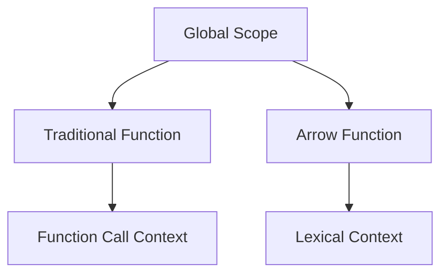

## 8.2 Arrow Functions vs. Traditional Functions

In the world of JavaScript, functions are fundamental building blocks. They allow us to encapsulate code logic and reuse it throughout our applications. With the introduction of ES6 (ECMAScript 2015), JavaScript developers gained a new syntax for writing functions: arrow functions. In this section, we will delve into the differences between arrow functions and traditional functions, explore their advantages and limitations, and understand when to use each type effectively.

### Understanding Traditional Functions

Before we dive into arrow functions, let's revisit traditional functions. Traditional functions in JavaScript are defined using the `function` keyword. Here's a simple example:

```javascript
function greet(name) {
  return `Hello, ${name}!`;
}

console.log(greet('Alice')); // Output: Hello, Alice!
```

In this example, `greet` is a traditional function that takes a single parameter `name` and returns a greeting message.

### Introducing Arrow Functions

Arrow functions provide a more concise syntax for writing functions. They are particularly useful for writing short functions. Here's how you can write the same `greet` function using an arrow function:

```javascript
const greet = (name) => `Hello, ${name}!`;

console.log(greet('Alice')); // Output: Hello, Alice!
```

Notice how the arrow function syntax reduces the boilerplate code. Let's break down the syntax:

- **Parentheses**: Used to enclose parameters. If there is only one parameter, you can omit the parentheses.
- **Arrow (`=>`)**: Separates the parameter(s) from the function body.
- **Function Body**: If the function body contains a single expression, you can omit the curly braces `{}` and the `return` keyword. This is known as an implicit return.

### Key Differences Between Arrow Functions and Traditional Functions

#### 1. **Syntax and Conciseness**

Arrow functions offer a more concise syntax compared to traditional functions. This can make your code cleaner and easier to read, especially when dealing with small functions. However, for more complex functions, traditional syntax might be clearer.

#### 2. **`this` Binding**

One of the most significant differences between arrow functions and traditional functions is how they handle the `this` keyword.

- **Traditional Functions**: The value of `this` is determined by how the function is called. It can change based on the context of the call.

```javascript
const person = {
  name: 'Alice',
  greet: function() {
    console.log(`Hello, my name is ${this.name}`);
  }
};

person.greet(); // Output: Hello, my name is Alice
```

- **Arrow Functions**: Arrow functions do not have their own `this` context. Instead, they inherit `this` from the enclosing lexical context. This makes them particularly useful in scenarios where you want to preserve the value of `this`.

```javascript
const person = {
  name: 'Alice',
  greet: () => {
    console.log(`Hello, my name is ${this.name}`);
  }
};

person.greet(); // Output: Hello, my name is undefined
```

In this example, `this.name` is `undefined` because the arrow function inherits `this` from the global scope, where `name` is not defined.

#### 3. **Arguments Object**

Traditional functions have access to the `arguments` object, which is an array-like object containing all the arguments passed to the function.

```javascript
function sum() {
  let total = 0;
  for (let i = 0; i < arguments.length; i++) {
    total += arguments[i];
  }
  return total;
}

console.log(sum(1, 2, 3)); // Output: 6
```

Arrow functions do not have their own `arguments` object. If you need to access arguments in an arrow function, you can use rest parameters.

```javascript
const sum = (...args) => {
  return args.reduce((total, num) => total + num, 0);
};

console.log(sum(1, 2, 3)); // Output: 6
```

#### 4. **Constructors**

Traditional functions can be used as constructors, meaning you can use them with the `new` keyword to create instances of objects.

```javascript
function Person(name) {
  this.name = name;
}

const alice = new Person('Alice');
console.log(alice.name); // Output: Alice
```

Arrow functions cannot be used as constructors and will throw an error if you try to use them with `new`.

```javascript
const Person = (name) => {
  this.name = name;
};

// const alice = new Person('Alice'); // TypeError: Person is not a constructor
```

#### 5. **Method Definitions in Objects**

When defining methods within objects, traditional functions are usually preferred because they provide access to the `this` keyword, which refers to the object itself.

```javascript
const person = {
  name: 'Alice',
  greet() {
    console.log(`Hello, my name is ${this.name}`);
  }
};

person.greet(); // Output: Hello, my name is Alice
```

Using arrow functions for methods can lead to unexpected behavior because `this` will not refer to the object.

```javascript
const person = {
  name: 'Alice',
  greet: () => {
    console.log(`Hello, my name is ${this.name}`);
  }
};

person.greet(); // Output: Hello, my name is undefined
```

### When to Use Arrow Functions

Arrow functions are particularly advantageous in the following scenarios:

- **Short, Concise Functions**: When you need to write small, simple functions, arrow functions can make your code more readable.
- **Preserving `this` Context**: In situations where you want to maintain the `this` context from the surrounding lexical scope, arrow functions are ideal. This is common in callbacks, such as those used in event listeners or array methods like `map`, `filter`, and `reduce`.

```javascript
const numbers = [1, 2, 3];
const doubled = numbers.map(num => num * 2);

console.log(doubled); // Output: [2, 4, 6]
```

- **Avoiding `arguments` Object**: If you don't need the `arguments` object, arrow functions provide a cleaner syntax.

### Limitations of Arrow Functions

While arrow functions are powerful, they have some limitations:

- **Lack of `this` Context**: Arrow functions cannot be used as methods in objects if you need access to the object's properties using `this`.
- **No `arguments` Object**: If you rely on the `arguments` object, you'll need to use traditional functions or rest parameters with arrow functions.
- **Cannot be Used as Constructors**: Arrow functions cannot be used with the `new` keyword to create instances of objects.

### Code Examples: Arrow Functions vs. Traditional Functions

Let's explore some examples to illustrate the differences between arrow functions and traditional functions.

#### Example 1: Using `this` in Event Handlers

Traditional Function:

```javascript
const button = document.querySelector('button');

button.addEventListener('click', function() {
  console.log(this); // Output: <button> element
});
```

Arrow Function:

```javascript
const button = document.querySelector('button');

button.addEventListener('click', () => {
  console.log(this); // Output: Window object
});
```

In the traditional function example, `this` refers to the button element because the function is called as an event handler. In the arrow function example, `this` refers to the global `Window` object because arrow functions do not have their own `this`.

#### Example 2: Using Arrow Functions for Array Methods

Arrow functions are often used with array methods for cleaner syntax:

```javascript
const numbers = [1, 2, 3, 4, 5];

// Traditional function
const squaresTraditional = numbers.map(function(num) {
  return num * num;
});

// Arrow function
const squaresArrow = numbers.map(num => num * num);

console.log(squaresTraditional); // Output: [1, 4, 9, 16, 25]
console.log(squaresArrow); // Output: [1, 4, 9, 16, 25]
```

#### Example 3: Using Arrow Functions for Lexical `this`

Arrow functions are useful when you want to preserve the `this` value from the surrounding context:

```javascript
function Timer() {
  this.seconds = 0;

  setInterval(() => {
    this.seconds++;
    console.log(this.seconds);
  }, 1000);
}

const timer = new Timer();
```

In this example, the arrow function inside `setInterval` retains the `this` value from the `Timer` function, allowing it to access `this.seconds`.

### Visualizing `this` Binding

To better understand how `this` binding works in traditional and arrow functions, let's visualize it using a diagram.



**Diagram Description**: This diagram illustrates how traditional functions and arrow functions bind `this`. Traditional functions bind `this` based on the function call context, while arrow functions bind `this` lexically, inheriting it from the surrounding scope.

### Try It Yourself

To solidify your understanding of arrow functions and traditional functions, try modifying the examples provided:

1. **Modify the Event Handler**: Change the event handler in the button example to use a traditional function and observe the difference in `this` binding.
2. **Experiment with Array Methods**: Use arrow functions with other array methods like `filter` and `reduce` to see how they simplify the syntax.
3. **Create a Timer**: Implement a countdown timer using both traditional and arrow functions to see how `this` is handled differently.

### References and Further Reading

- [MDN Web Docs: Functions](https://developer.mozilla.org/en-US/docs/Web/JavaScript/Reference/Functions)
- [MDN Web Docs: Arrow Functions](https://developer.mozilla.org/en-US/docs/Web/JavaScript/Reference/Functions/Arrow_functions)
- [W3Schools: JavaScript Functions](https://www.w3schools.com/js/js_functions.asp)

### Knowledge Check

To reinforce your learning, consider these questions:

- What are the key differences between arrow functions and traditional functions?
- When should you use arrow functions over traditional functions?
- What are the limitations of arrow functions?

### Embrace the Journey

Remember, mastering JavaScript functions is a journey. As you practice and experiment with both arrow functions and traditional functions, you'll gain a deeper understanding of their nuances and how to use them effectively in your projects. Keep exploring, stay curious, and enjoy the process of becoming a proficient JavaScript developer!

## Quiz Time!



### What is a key difference between arrow functions and traditional functions in terms of `this` binding?

- [x] Arrow functions inherit `this` from the surrounding lexical context.
- [ ] Arrow functions have their own `this` context.
- [ ] Traditional functions inherit `this` from the surrounding lexical context.
- [ ] Traditional functions do not have a `this` context.

> **Explanation:** Arrow functions do not have their own `this` context; they inherit `this` from the surrounding lexical context.

### Can arrow functions be used as constructors?

- [ ] Yes, arrow functions can be used with the `new` keyword.
- [x] No, arrow functions cannot be used as constructors.
- [ ] Yes, but only in strict mode.
- [ ] No, unless they are defined inside a class.

> **Explanation:** Arrow functions cannot be used as constructors and will throw an error if used with the `new` keyword.

### How do arrow functions handle the `arguments` object?

- [ ] Arrow functions have their own `arguments` object.
- [ ] Arrow functions inherit the `arguments` object from the global scope.
- [x] Arrow functions do not have their own `arguments` object.
- [ ] Arrow functions create a new `arguments` object for each call.

> **Explanation:** Arrow functions do not have their own `arguments` object. You can use rest parameters to access arguments in arrow functions.

### When is it advantageous to use arrow functions?

- [x] When you need to preserve the `this` context from the surrounding scope.
- [ ] When you need to use the `arguments` object.
- [ ] When you need to use the `new` keyword.
- [ ] When you need to define methods in an object.

> **Explanation:** Arrow functions are advantageous when you want to preserve the `this` context from the surrounding lexical scope.

### Which of the following is true about arrow functions?

- [x] They provide a more concise syntax for short functions.
- [ ] They can be used as methods in objects with access to `this`.
- [x] They are useful for callbacks in array methods.
- [ ] They can be used as constructors.

> **Explanation:** Arrow functions provide a concise syntax and are useful for callbacks, but they cannot be used as methods with access to `this` or as constructors.

### What happens if you use `this` inside an arrow function defined in the global scope?

- [ ] `this` refers to the object that called the function.
- [ ] `this` refers to the `document` object.
- [x] `this` refers to the global `Window` object.
- [ ] `this` is undefined.

> **Explanation:** In an arrow function defined in the global scope, `this` refers to the global `Window` object.

### How can you access function arguments in an arrow function?

- [ ] Using the `arguments` object.
- [x] Using rest parameters.
- [ ] Using the `args` object.
- [ ] Using the `params` object.

> **Explanation:** Arrow functions do not have their own `arguments` object, so you can use rest parameters to access function arguments.

### Why might you prefer traditional functions over arrow functions for object methods?

- [x] Traditional functions provide access to the `this` keyword.
- [ ] Traditional functions are always faster.
- [ ] Traditional functions use less memory.
- [ ] Traditional functions are more concise.

> **Explanation:** Traditional functions provide access to the `this` keyword, which is important for object methods.

### Which syntax is correct for an arrow function with a single parameter?

- [ ] `const greet = name => { return `Hello, ${name}!`; }`
- [x] `const greet = name => `Hello, ${name}!`;`
- [ ] `const greet = (name) => { return `Hello, ${name}!`; }`
- [ ] `const greet = (name) => `Hello, ${name}!`;`

> **Explanation:** For a single parameter, parentheses can be omitted, and if the function body is a single expression, curly braces and the `return` keyword can also be omitted.

### True or False: Arrow functions can be used as methods in objects with access to `this`.

- [ ] True
- [x] False

> **Explanation:** Arrow functions do not have their own `this` context and therefore cannot be used as methods in objects if you need access to the object's properties using `this`.


