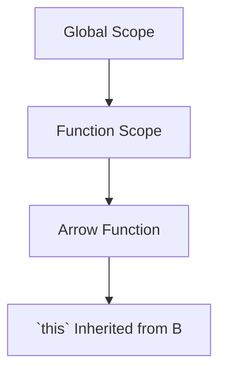

## 8.3 `this` Binding in Arrow Functions

In the world of JavaScript, understanding how the `this` keyword works is crucial for writing effective and bug-free code. Arrow functions, introduced in ECMAScript 6 (ES6), brought a new way to handle functions, and with them, a unique approach to `this` binding. In this section, we will delve into how arrow functions manage `this`, how they differ from traditional functions, and the practical implications of these differences.

### Arrow Functions and `this` Binding

#### What Makes Arrow Functions Unique?

Arrow functions are a more concise way to write functions in JavaScript. They have a simplified syntax and do not have their own `this`, arguments, super, or new.target bindings. Instead, arrow functions inherit `this` from the surrounding lexical context, meaning the value of `this` inside an arrow function is the same as the value of `this` outside the function.

#### Inheriting `this` from the Enclosing Scope

The key feature of arrow functions is that they do not have their own `this` context. Instead, they lexically bind `this` based on the scope in which they are defined. This behavior is particularly useful in scenarios where we want to preserve the context of `this` from the surrounding code.

**Example:**

```javascript
function Person() {
  this.age = 0;

  setInterval(() => {
    this.age++; // `this` refers to the Person instance
  }, 1000);
}

const person = new Person();
```

In the example above, the arrow function inside `setInterval` inherits `this` from the `Person` function. As a result, `this.age` correctly refers to the `age` property of the `Person` instance.

### Comparing Arrow Functions with Traditional Functions

Traditional functions, unlike arrow functions, have their own `this` context. This context is determined by how the function is called. In many cases, this can lead to confusion and bugs, especially when dealing with callbacks or event handlers.

#### Traditional Function Example

```javascript
function Person() {
  this.age = 0;

  setInterval(function() {
    this.age++; // `this` is undefined or refers to the global object
  }, 1000);
}

const person = new Person();
```

In this traditional function example, `this` inside the `setInterval` callback does not refer to the `Person` instance. Instead, it refers to the global object (or is `undefined` in strict mode), which is not the desired behavior.

#### Practical Implications

The behavior of `this` in arrow functions is particularly beneficial when dealing with event handlers and methods that require access to the instance they belong to.

**Example with Event Handlers:**

```javascript
class Button {
  constructor() {
    this.count = 0;
    this.button = document.createElement('button');
    this.button.innerText = 'Click me';
    this.button.addEventListener('click', () => {
      this.count++;
      console.log(this.count); // `this` refers to the Button instance
    });
    document.body.appendChild(this.button);
  }
}

const myButton = new Button();
```

In this example, the arrow function used in the event listener ensures that `this` refers to the `Button` instance, allowing us to correctly update and log the `count` property.

### Visualizing `this` Binding

To better understand how `this` binding works in arrow functions, let's visualize it with a diagram.



**Diagram Description:** This diagram illustrates how `this` in an arrow function (C) is inherited from its enclosing function scope (B), which is ultimately within the global scope (A).

### Practical Use Cases

#### Event Handlers

Arrow functions are ideal for event handlers where maintaining the context of `this` is crucial. They eliminate the need for workarounds like `bind`, `call`, or `apply`.

#### Methods in Classes

When defining methods in classes, arrow functions can be used to ensure that `this` refers to the class instance, avoiding common pitfalls with traditional function expressions.

**Example:**

```javascript
class Counter {
  constructor() {
    this.count = 0;
  }

  increment = () => {
    this.count++;
    console.log(this.count);
  };
}

const myCounter = new Counter();
myCounter.increment(); // Logs: 1
```

In this example, the `increment` method is defined as an arrow function, ensuring that `this` always refers to the `Counter` instance.

### Try It Yourself

To solidify your understanding, try modifying the examples provided:

1. **Modify the `Person` Example:**
   - Change the arrow function in `setInterval` to a traditional function and observe how `this` changes.
   - Use `bind` to correct the `this` context in the traditional function.

2. **Create an Event Handler:**
   - Write a simple HTML page with a button.
   - Use both arrow functions and traditional functions as event handlers to see the difference in `this` behavior.

### Key Takeaways

- Arrow functions do not have their own `this` context; they inherit `this` from the enclosing lexical scope.
- This behavior makes arrow functions particularly useful for maintaining context in event handlers and methods.
- Unlike traditional functions, arrow functions eliminate the need for `bind`, `call`, or `apply` to manage `this`.
- Understanding `this` in arrow functions can help prevent common bugs and improve code readability.

### Further Reading

For more information on arrow functions and `this` binding, consider exploring the following resources:

- [MDN Web Docs: Arrow Functions](https://developer.mozilla.org/en-US/docs/Web/JavaScript/Reference/Functions/Arrow_functions)
- [JavaScript.info: Arrow Functions](https://javascript.info/arrow-functions)
- [W3Schools: JavaScript Arrow Function](https://www.w3schools.com/js/js_arrow_function.asp)

Remember, mastering `this` in JavaScript is a journey. Keep experimenting, stay curious, and enjoy the process!

## Quiz Time!



### What is the key feature of arrow functions regarding `this`?

- [x] Arrow functions inherit `this` from the enclosing scope.
- [ ] Arrow functions have their own `this` context.
- [ ] Arrow functions always bind `this` to the global object.
- [ ] Arrow functions do not use `this`.

> **Explanation:** Arrow functions do not have their own `this` context; they inherit `this` from the surrounding lexical scope.

### How does `this` behave in a traditional function inside a method?

- [ ] It always refers to the global object.
- [x] It depends on how the function is called.
- [ ] It always refers to the method's object.
- [ ] It is always undefined.

> **Explanation:** In traditional functions, `this` is determined by how the function is called, which can lead to unexpected behavior in methods.

### What is a common use case for arrow functions?

- [x] Event handlers where `this` needs to refer to the object instance.
- [ ] Functions that require their own `this` context.
- [ ] Functions that need to manipulate `this` with `bind`.
- [ ] Functions that should not use `this`.

> **Explanation:** Arrow functions are ideal for event handlers because they maintain the context of `this` as the object instance.

### How can you ensure `this` refers to the correct object in a traditional function?

- [ ] Use an arrow function.
- [ ] Use the `call` method.
- [ ] Use the `apply` method.
- [x] Use the `bind` method.

> **Explanation:** The `bind` method can be used to explicitly set the value of `this` in traditional functions.

### What happens if you use an arrow function as a method in a class?

- [x] `this` will refer to the class instance.
- [ ] `this` will refer to the global object.
- [ ] `this` will be undefined.
- [ ] `this` will refer to the method itself.

> **Explanation:** Arrow functions used as methods in classes will have `this` bound to the class instance, preserving context.

### Why might you choose a traditional function over an arrow function?

- [ ] To ensure `this` is inherited from the enclosing scope.
- [x] To have a function with its own `this` context.
- [ ] To avoid using `this` altogether.
- [ ] To simplify syntax.

> **Explanation:** Traditional functions have their own `this` context, which can be necessary in certain scenarios.

### What is the result of using `this` in an arrow function within a global scope?

- [ ] `this` refers to the function itself.
- [x] `this` refers to the global object.
- [ ] `this` is undefined.
- [ ] `this` is null.

> **Explanation:** In the global scope, `this` in an arrow function refers to the global object.

### How do arrow functions affect the use of `bind`, `call`, and `apply`?

- [x] They eliminate the need for these methods to manage `this`.
- [ ] They require these methods to set `this`.
- [ ] They change the behavior of these methods.
- [ ] They do not interact with these methods.

> **Explanation:** Arrow functions inherently bind `this` to the lexical scope, removing the need for `bind`, `call`, or `apply`.

### Can arrow functions be used as constructors?

- [ ] Yes, they can be used like traditional constructors.
- [x] No, they cannot be used as constructors.
- [ ] Yes, but only with the `new` keyword.
- [ ] No, but they can mimic constructors.

> **Explanation:** Arrow functions cannot be used as constructors because they do not have their own `this` context.

### True or False: Arrow functions always bind `this` to the global object.

- [ ] True
- [x] False

> **Explanation:** Arrow functions inherit `this` from the enclosing scope, not the global object.


