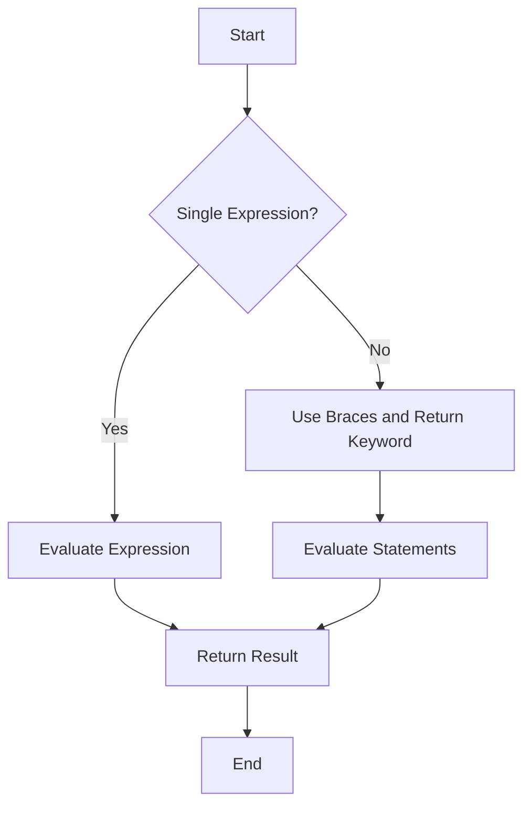

## 8.4 Implicit Return

In this section, we will delve into the concept of implicit return in JavaScript, specifically within the context of arrow functions. Arrow functions, introduced in ECMAScript 6 (ES6), offer a more concise syntax for writing functions. One of their unique features is the ability to return values implicitly, without the need for the `return` keyword. This can lead to cleaner and more readable code, especially for simple operations. Let's explore how this works and when it's appropriate to use implicit returns.

### Understanding Implicit Return

Implicit return in JavaScript refers to the ability of arrow functions to return a value without explicitly using the `return` keyword. This is possible when the function body consists of a single expression. The value of this expression is automatically returned.

#### Single-Expression Arrow Functions

In a single-expression arrow function, the expression is evaluated, and its result is returned. This is achieved by omitting the curly braces `{}` and the `return` keyword.

**Example 1: Implicit Return with a Single Expression**

```javascript
// A simple arrow function that adds two numbers
const add = (a, b) => a + b;

// Using the function
console.log(add(2, 3)); // Output: 5
```

In this example, the arrow function `add` takes two parameters, `a` and `b`, and returns their sum. The expression `a + b` is evaluated, and its result is returned implicitly.

#### When to Use Braces `{}`

While implicit return is convenient, there are situations where you need to use curly braces `{}`. When you include braces, you must explicitly use the `return` keyword to return a value. This is necessary when the function body contains more than one statement.

**Example 2: Explicit Return with Multiple Statements**

```javascript
// An arrow function with multiple statements
const multiplyAndLog = (a, b) => {
    const result = a * b;
    console.log(`The result is: ${result}`);
    return result;
};

// Using the function
console.log(multiplyAndLog(4, 5)); // Output: The result is: 20
                                   //         20
```

In this example, the arrow function `multiplyAndLog` performs two actions: it calculates the product of `a` and `b`, logs the result, and then returns it. Because the function body contains multiple statements, we use braces and the `return` keyword.

### Readability Concerns

While implicit return can make code more concise, it can also impact readability, especially for those new to JavaScript or unfamiliar with arrow functions. It's important to balance brevity with clarity.

**Example 3: Readability Consideration**

```javascript
// A more complex implicit return
const getUserName = user => user && user.name ? user.name : 'Anonymous';

// Using the function
console.log(getUserName({ name: 'Alice' })); // Output: Alice
console.log(getUserName(null));              // Output: Anonymous
```

In this example, the arrow function `getUserName` uses a conditional (ternary) operator to return a user's name or 'Anonymous' if the user object is null. While concise, the logic might not be immediately clear to all readers.

### Best Practices for Using Implicit Returns

To effectively use implicit returns, consider the following best practices:

1. **Keep It Simple**: Use implicit returns for simple expressions. If the logic is complex, consider using explicit returns for clarity.
   
2. **Consistency**: Be consistent in your use of implicit returns across your codebase to avoid confusion.

3. **Commenting**: When necessary, add comments to explain the logic of your implicit returns, especially if they involve complex expressions.

4. **Readability Over Brevity**: Prioritize readability over brevity. If an implicit return makes the code difficult to understand, opt for an explicit return.

5. **Team Conventions**: Follow any team or project conventions regarding the use of implicit returns to maintain consistency.

### Try It Yourself

To get hands-on experience with implicit returns, try modifying the following code examples:

1. **Experiment with Different Expressions**: Change the expression in the `add` function to perform a different operation, such as subtraction or division.

2. **Add More Logic**: Modify the `multiplyAndLog` function to include additional logic, such as checking if the inputs are numbers before multiplying.

3. **Simplify Complex Logic**: Take a complex function with multiple statements and see if you can simplify it using implicit returns.

### Visualizing Implicit Return

To better understand how implicit returns work, let's visualize the flow of a single-expression arrow function:



**Diagram Explanation**: This flowchart illustrates the decision-making process in an arrow function. If the function body is a single expression, it is evaluated and returned implicitly. If not, braces and the `return` keyword are used to handle multiple statements.

### References and Links

For further reading on arrow functions and implicit returns, check out these resources:

- [MDN Web Docs: Arrow Functions](https://developer.mozilla.org/en-US/docs/Web/JavaScript/Reference/Functions/Arrow_functions)
- [W3Schools: JavaScript Arrow Function](https://www.w3schools.com/js/js_arrow_function.asp)

### Knowledge Check

Before moving on, let's reinforce what we've learned:

- What is an implicit return, and how does it differ from an explicit return?
- When should you use braces `{}` in an arrow function?
- How can implicit returns impact code readability?
- What are some best practices for using implicit returns?

### Embrace the Journey

Remember, mastering JavaScript functions, including arrow functions and implicit returns, is a journey. As you continue to practice and experiment, you'll gain confidence and develop your own style. Keep exploring, stay curious, and enjoy the process of learning and growing as a developer!

## Quiz Time!



### What is an implicit return in JavaScript?

- [x] A return that occurs without using the `return` keyword.
- [ ] A return that uses the `return` keyword.
- [ ] A return that occurs only in traditional functions.
- [ ] A return that requires braces `{}`.

> **Explanation:** An implicit return occurs in arrow functions when the function body is a single expression, allowing the value to be returned without the `return` keyword.

### When can you use an implicit return in an arrow function?

- [x] When the function body is a single expression.
- [ ] When the function body contains multiple statements.
- [ ] Only when using traditional functions.
- [ ] When the function body is empty.

> **Explanation:** Implicit returns are used in arrow functions when the body consists of a single expression, allowing the expression's result to be returned automatically.

### What should you do if an arrow function contains multiple statements?

- [ ] Use an implicit return.
- [x] Use braces `{}` and the `return` keyword.
- [ ] Use only the `return` keyword.
- [ ] Avoid using arrow functions.

> **Explanation:** When an arrow function contains multiple statements, you must use braces `{}` and the `return` keyword to explicitly return a value.

### How can implicit returns impact code readability?

- [x] They can make code less readable if the logic is complex.
- [ ] They always improve readability.
- [ ] They have no impact on readability.
- [ ] They make code unreadable.

> **Explanation:** Implicit returns can make code less readable if the logic is complex, as the lack of a `return` keyword might obscure the function's purpose.

### What is a best practice for using implicit returns?

- [x] Use them for simple expressions.
- [ ] Use them for complex logic.
- [ ] Avoid using them entirely.
- [ ] Use them only in traditional functions.

> **Explanation:** It's best to use implicit returns for simple expressions to maintain code clarity and readability.

### What is the primary benefit of using implicit returns?

- [x] They make code more concise.
- [ ] They make code more complex.
- [ ] They require more lines of code.
- [ ] They are only used in traditional functions.

> **Explanation:** Implicit returns make code more concise by eliminating the need for the `return` keyword in single-expression arrow functions.

### How can you ensure readability when using implicit returns?

- [x] Add comments to explain complex logic.
- [ ] Avoid using implicit returns.
- [ ] Use implicit returns for every function.
- [ ] Only use implicit returns in traditional functions.

> **Explanation:** Adding comments to explain complex logic can help maintain readability when using implicit returns.

### Which of the following is an example of an implicit return?

- [x] `const square = x => x * x;`
- [ ] `const square = x => { return x * x; };`
- [ ] `const square = function(x) { return x * x; };`
- [ ] `const square = x => { x * x; };`

> **Explanation:** The first option is an example of an implicit return, where the expression `x * x` is returned without the `return` keyword.

### Can implicit returns be used with traditional functions?

- [ ] True
- [x] False

> **Explanation:** Implicit returns are a feature of arrow functions and cannot be used with traditional functions, which require the `return` keyword.

### What is the purpose of the flowchart in the article?

- [x] To illustrate the decision-making process in an arrow function.
- [ ] To show how traditional functions work.
- [ ] To demonstrate variable hoisting.
- [ ] To explain the use of the `this` keyword.

> **Explanation:** The flowchart illustrates the decision-making process in an arrow function, showing when implicit returns can be used.




