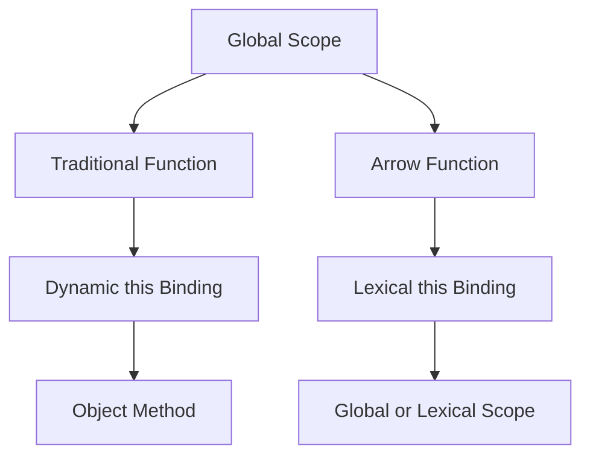

## 8.5 When Not to Use Arrow Functions

Arrow functions, introduced in ECMAScript 6 (ES6), have become a popular feature in JavaScript due to their concise syntax and lexical `this` binding. However, they are not always the best choice for every situation. In this section, we'll explore scenarios where traditional functions are preferable over arrow functions, discuss their limitations, and provide guidance on choosing the right function type based on context.

### Understanding Arrow Functions

Before diving into scenarios where arrow functions are not suitable, let's briefly review what arrow functions are and how they differ from traditional functions.

Arrow functions provide a more concise syntax for writing functions. They do not have their own `this`, `arguments`, `super`, or `new.target` bindings. Instead, they inherit these from the enclosing lexical context. This makes them particularly useful in certain situations, such as when working with callbacks or methods that require a consistent `this` value.

Here's a simple example of an arrow function:

```javascript
// Traditional function
function add(a, b) {
  return a + b;
}

// Arrow function
const addArrow = (a, b) => a + b;

console.log(add(2, 3)); // Output: 5
console.log(addArrow(2, 3)); // Output: 5
```

### Limitations of Arrow Functions

Despite their advantages, arrow functions come with limitations that can make them unsuitable for certain use cases. Let's explore these limitations in detail.

#### 1. Lack of `this` Binding

Arrow functions do not have their own `this` context. Instead, they inherit `this` from the surrounding lexical scope. This behavior can be beneficial in some cases but problematic in others, especially when defining methods in objects or classes.

**Example: Arrow Functions as Methods**

Consider the following example where an arrow function is used as a method in an object:

```javascript
const person = {
  name: 'Alice',
  greet: () => {
    console.log(`Hello, my name is ${this.name}`);
  }
};

person.greet(); // Output: Hello, my name is undefined
```

In this case, `this` does not refer to the `person` object as one might expect. Instead, it refers to the global object (or `undefined` in strict mode), leading to unexpected behavior.

**Solution: Use Traditional Functions for Methods**

To ensure that `this` refers to the object itself, use a traditional function:

```javascript
const person = {
  name: 'Alice',
  greet: function() {
    console.log(`Hello, my name is ${this.name}`);
  }
};

person.greet(); // Output: Hello, my name is Alice
```

#### 2. Lack of `arguments` Object

Arrow functions do not have their own `arguments` object. If you need to access the arguments passed to a function, you must use a traditional function.

**Example: Accessing Arguments**

Consider a scenario where you want to access all arguments passed to a function:

```javascript
const sum = () => {
  console.log(arguments);
};

sum(1, 2, 3); // Output: ReferenceError: arguments is not defined
```

In this example, using `arguments` in an arrow function results in a `ReferenceError` because arrow functions do not have their own `arguments` object.

**Solution: Use Traditional Functions for Accessing Arguments**

To access the `arguments` object, use a traditional function:

```javascript
function sum() {
  console.log(arguments);
}

sum(1, 2, 3); // Output: [Arguments] { '0': 1, '1': 2, '2': 3 }
```

#### 3. Lack of `new.target`

Arrow functions cannot be used as constructors and do not have a `new.target` property. If you need to create instances of a function using the `new` keyword, you must use a traditional function.

**Example: Using Arrow Functions as Constructors**

Attempting to use an arrow function as a constructor will result in an error:

```javascript
const Person = (name) => {
  this.name = name;
};

// This will throw an error
const alice = new Person('Alice'); // Output: TypeError: Person is not a constructor
```

**Solution: Use Traditional Functions for Constructors**

To create instances using the `new` keyword, use a traditional function:

```javascript
function Person(name) {
  this.name = name;
}

const alice = new Person('Alice');
console.log(alice.name); // Output: Alice
```

#### 4. No `super` Keyword

Arrow functions do not have their own `super` binding. If you need to use the `super` keyword to call methods from a parent class, you must use a traditional function.

**Example: Using `super` in Arrow Functions**

Using `super` in an arrow function will not work as expected:

```javascript
class Parent {
  greet() {
    console.log('Hello from Parent');
  }
}

class Child extends Parent {
  greet = () => {
    super.greet(); // This will throw an error
  }
}

const child = new Child();
child.greet(); // Output: TypeError: Cannot read property 'greet' of undefined
```

**Solution: Use Traditional Functions for `super`**

To use `super`, define the method as a traditional function:

```javascript
class Parent {
  greet() {
    console.log('Hello from Parent');
  }
}

class Child extends Parent {
  greet() {
    super.greet();
  }
}

const child = new Child();
child.greet(); // Output: Hello from Parent
```

#### 5. Dynamic Context Requirements

In some cases, you may need a function to dynamically determine its `this` context based on how it is called. Arrow functions are not suitable for such scenarios because they have a fixed `this` binding.

**Example: Dynamic `this` Context**

Consider a function that needs to behave differently based on its `this` context:

```javascript
const dynamicThis = () => {
  console.log(this);
};

const obj1 = { dynamicThis };
const obj2 = { dynamicThis };

obj1.dynamicThis(); // Output: Window or global object
obj2.dynamicThis(); // Output: Window or global object
```

In this example, `this` is always bound to the global object, regardless of how the function is called.

**Solution: Use Traditional Functions for Dynamic Context**

To allow dynamic `this` binding, use a traditional function:

```javascript
function dynamicThis() {
  console.log(this);
}

const obj1 = { dynamicThis };
const obj2 = { dynamicThis };

obj1.dynamicThis(); // Output: obj1
obj2.dynamicThis(); // Output: obj2
```

### Choosing the Right Function Type

When deciding between arrow functions and traditional functions, consider the following guidelines:

- **Use Arrow Functions When:**
  - You need a concise syntax for simple operations.
  - You want to maintain the `this` context from the surrounding lexical scope.
  - You do not need access to `arguments`, `new.target`, or `super`.

- **Use Traditional Functions When:**
  - You need a function to act as a method in an object or class.
  - You require access to the `arguments` object.
  - You need to use the `new` keyword to create instances.
  - You need to use the `super` keyword in class methods.
  - You require dynamic `this` context based on how the function is called.

### Try It Yourself

Experiment with the following code examples to deepen your understanding of when to use arrow functions and when to opt for traditional functions. Try modifying the examples to see how changes affect the behavior of `this`, `arguments`, and other properties.

### Visualizing Function Context

To better understand how `this` context works in different scenarios, let's visualize the interaction between functions and their `this` binding using a diagram.



**Diagram Description:** This diagram illustrates the different `this` bindings for traditional and arrow functions. Traditional functions can have dynamic `this` binding, making them suitable for object methods. In contrast, arrow functions have lexical `this` binding, inheriting `this` from the surrounding scope.

### References and Links

For further reading on arrow functions and their limitations, consider exploring the following resources:

- [MDN Web Docs: Arrow Functions](https://developer.mozilla.org/en-US/docs/Web/JavaScript/Reference/Functions/Arrow_functions)
- [W3Schools: JavaScript Arrow Function](https://www.w3schools.com/js/js_arrow_function.asp)

### Knowledge Check

Let's reinforce what we've learned with some questions and exercises. Consider the following scenarios and decide whether an arrow function or a traditional function is more appropriate.

1. You need to define a method in a class that uses `super`. Which function type should you use?
2. You want to create a function that can be used as a constructor. Which function type is suitable?
3. You need a concise function to use as a callback that maintains the `this` context from the surrounding scope. Which function type is ideal?

### Embrace the Journey

Remember, mastering JavaScript functions is a journey. As you continue to learn and practice, you'll become more adept at choosing the right function type for each situation. Keep experimenting, stay curious, and enjoy the process of becoming a JavaScript expert!

### Summary

In this section, we've explored scenarios where arrow functions are not suitable and discussed their limitations. By understanding these limitations and knowing when to use traditional functions, you can write more effective and reliable JavaScript code. Remember to consider the context and requirements of your functions when deciding which type to use.

## Quiz Time!



### Which of the following is a limitation of arrow functions?

- [x] Lack of `this` binding
- [ ] Lack of concise syntax
- [ ] Inability to handle callbacks
- [ ] Inability to be used in loops

> **Explanation:** Arrow functions do not have their own `this` binding; they inherit it from the surrounding lexical context.

### When should you use a traditional function over an arrow function?

- [x] When you need access to the `arguments` object
- [ ] When you want a concise syntax
- [ ] When you want to maintain the `this` context
- [ ] When you are using callbacks

> **Explanation:** Traditional functions have their own `arguments` object, which is not available in arrow functions.

### Can arrow functions be used as constructors?

- [ ] Yes
- [x] No

> **Explanation:** Arrow functions cannot be used as constructors because they do not have a `new.target` property.

### What happens when you use `this` in an arrow function?

- [ ] It creates a new `this` context
- [x] It inherits `this` from the surrounding scope
- [ ] It throws an error
- [ ] It binds `this` to the global object

> **Explanation:** Arrow functions inherit `this` from the surrounding lexical scope, rather than creating their own `this` context.

### Which function type should you use for object methods?

- [x] Traditional functions
- [ ] Arrow functions

> **Explanation:** Traditional functions are suitable for object methods because they allow dynamic `this` binding.

### Why might you choose an arrow function for a callback?

- [x] To maintain the `this` context from the surrounding scope
- [ ] To access the `arguments` object
- [ ] To use the `new` keyword
- [ ] To use the `super` keyword

> **Explanation:** Arrow functions are useful for callbacks because they maintain the `this` context from the surrounding scope.

### Can arrow functions use the `super` keyword?

- [ ] Yes
- [x] No

> **Explanation:** Arrow functions do not have their own `super` binding, so they cannot use the `super` keyword.

### What is a common use case for arrow functions?

- [x] Concise syntax for simple operations
- [ ] Creating instances with `new`
- [ ] Accessing the `arguments` object
- [ ] Using `super` in class methods

> **Explanation:** Arrow functions are often used for their concise syntax in simple operations.

### How do arrow functions handle the `arguments` object?

- [ ] They create their own `arguments` object
- [x] They do not have an `arguments` object
- [ ] They throw an error when accessing `arguments`
- [ ] They bind `arguments` to the global object

> **Explanation:** Arrow functions do not have their own `arguments` object; they rely on the surrounding context.

### True or False: Arrow functions are always the best choice for defining functions.

- [ ] True
- [x] False

> **Explanation:** Arrow functions are not always the best choice; traditional functions are preferable in certain scenarios, such as when using `this`, `arguments`, or `super`.


