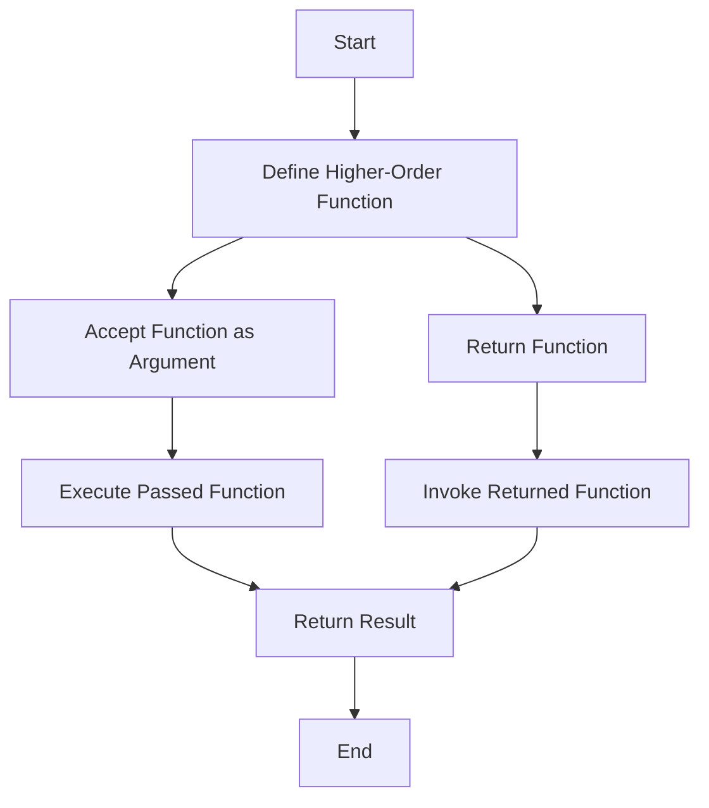

## 9.1 What are Higher-Order Functions?

In the world of JavaScript, functions are more than just blocks of code that execute tasks. They are powerful entities that can be manipulated, passed around, and even returned from other functions. This flexibility is due to the fact that functions in JavaScript are **first-class citizens**. In this section, we will delve into the concept of **higher-order functions**—a fundamental aspect of functional programming that leverages the power of first-class functions.

### What Makes Functions First-Class Citizens?

Before we dive into higher-order functions, let's first understand what it means for functions to be first-class citizens. In JavaScript, functions can be:

- **Assigned to variables**: Just like any other data type, functions can be stored in variables.
- **Passed as arguments**: Functions can be passed as arguments to other functions.
- **Returned from other functions**: Functions can return other functions as their result.
- **Stored in data structures**: Functions can be stored in arrays, objects, and other data structures.

This flexibility allows us to write more abstract and reusable code, which is where higher-order functions come into play.

### Defining Higher-Order Functions

A **higher-order function** is a function that does at least one of the following:

1. **Takes one or more functions as arguments**.
2. **Returns a function as its result**.

Higher-order functions allow us to abstract over actions, not just values. This abstraction is a powerful tool for creating more modular and reusable code.

### Accepting Functions as Arguments

One of the most common uses of higher-order functions is to accept other functions as arguments. This allows us to create functions that can operate on different types of data or perform different actions based on the function passed to them.

#### Example: Array's `map` Method

Let's consider the `map` method, a built-in higher-order function in JavaScript. The `map` method takes a function as an argument and applies it to each element in an array, returning a new array with the results.

```javascript
// Define a function that doubles a number
function double(num) {
    return num * 2;
}

// Use the map method to apply the double function to each element in the array
const numbers = [1, 2, 3, 4];
const doubledNumbers = numbers.map(double);

console.log(doubledNumbers); // Output: [2, 4, 6, 8]
```

In this example, the `map` method is a higher-order function because it takes the `double` function as an argument and applies it to each element in the `numbers` array.

#### Example: Custom Higher-Order Function

Let's create a custom higher-order function that accepts a function as an argument. This function will filter an array based on a condition defined by the passed function.

```javascript
// Define a higher-order function that filters an array based on a condition
function filterArray(arr, conditionFn) {
    const result = [];
    for (let item of arr) {
        if (conditionFn(item)) {
            result.push(item);
        }
    }
    return result;
}

// Define a condition function that checks if a number is even
function isEven(num) {
    return num % 2 === 0;
}

// Use the filterArray function to filter even numbers
const numbers = [1, 2, 3, 4, 5, 6];
const evenNumbers = filterArray(numbers, isEven);

console.log(evenNumbers); // Output: [2, 4, 6]
```

Here, `filterArray` is a higher-order function because it takes `conditionFn` as an argument, which is used to determine which elements to include in the result.

### Returning Functions from Functions

Another powerful feature of higher-order functions is their ability to return functions. This capability allows us to create functions that generate other functions based on certain parameters or conditions.

#### Example: Function Factory

Let's create a function that returns a new function. This is often referred to as a function factory.

```javascript
// Define a function that creates a greeting function for a specific name
function createGreeting(name) {
    return function(greeting) {
        return `${greeting}, ${name}!`;
    };
}

// Create a greeting function for "Alice"
const greetAlice = createGreeting('Alice');

// Use the generated function to greet Alice
console.log(greetAlice('Hello')); // Output: "Hello, Alice!"
console.log(greetAlice('Good morning')); // Output: "Good morning, Alice!"
```

In this example, `createGreeting` is a higher-order function because it returns a new function that can be used to greet a specific person with different greetings.

### Visualizing Higher-Order Functions

To better understand how higher-order functions work, let's visualize the process of passing functions as arguments and returning functions using a flowchart.



**Caption**: This flowchart illustrates the process of a higher-order function accepting a function as an argument or returning a function, and how these functions are executed.

### Practical Applications of Higher-Order Functions

Higher-order functions are not just theoretical concepts; they have practical applications in everyday JavaScript programming. Here are some common use cases:

1. **Event Handling**: In web development, higher-order functions are often used to handle events. For example, you can pass a function as a callback to an event listener.

2. **Asynchronous Programming**: Higher-order functions are used in asynchronous programming to handle tasks like fetching data from a server. Functions like `setTimeout` and `setInterval` take functions as arguments to execute after a delay.

3. **Functional Utilities**: Libraries like Lodash and Underscore provide a variety of higher-order functions for tasks like data manipulation and transformation.

4. **Middleware in Frameworks**: In frameworks like Express.js, higher-order functions are used to create middleware functions that process HTTP requests.

### Try It Yourself

Experiment with higher-order functions by modifying the examples above. Here are some ideas:

- **Modify the `filterArray` function** to accept a different condition function, such as checking for odd numbers or numbers greater than a certain value.
- **Create a new function factory** that generates functions for different mathematical operations, such as addition or multiplication.
- **Use the `map` method** to transform an array of strings to uppercase.

### References and Further Reading

For more information on higher-order functions and functional programming in JavaScript, check out these resources:

- [MDN Web Docs: Functions](https://developer.mozilla.org/en-US/docs/Web/JavaScript/Guide/Functions)
- [JavaScript.info: Higher-Order Functions](https://javascript.info/function-expressions#higher-order-functions)
- [Eloquent JavaScript: Functions](https://eloquentjavascript.net/05_higher_order.html)

### Knowledge Check

Let's reinforce what we've learned with a few questions:

- What is a higher-order function?
- How can higher-order functions improve code reusability?
- Can you give an example of a built-in higher-order function in JavaScript?
- How do higher-order functions relate to first-class functions?

### Embrace the Journey

Remember, understanding higher-order functions is a significant step in mastering JavaScript. As you continue to explore and experiment, you'll discover new ways to leverage these powerful tools to write more efficient and elegant code. Keep practicing, stay curious, and enjoy the journey!

## Quiz Time!



### What is a higher-order function?

- [x] A function that takes one or more functions as arguments or returns a function as its result.
- [ ] A function that only takes numbers as arguments.
- [ ] A function that can only be used in arrays.
- [ ] A function that returns a string.

> **Explanation:** A higher-order function is defined as a function that takes one or more functions as arguments or returns a function as its result.

### Why are functions considered first-class citizens in JavaScript?

- [x] Because they can be assigned to variables, passed as arguments, and returned from other functions.
- [ ] Because they can only be used in loops.
- [ ] Because they are faster than other data types.
- [ ] Because they are the only way to create objects.

> **Explanation:** Functions are first-class citizens in JavaScript because they can be assigned to variables, passed as arguments, and returned from other functions, just like any other data type.

### Which of the following is an example of a built-in higher-order function in JavaScript?

- [x] Array's `map` method
- [ ] `console.log`
- [ ] `Math.random`
- [ ] `parseInt`

> **Explanation:** The `map` method is a built-in higher-order function because it takes a function as an argument and applies it to each element of an array.

### What does the following code return?
```javascript
function createMultiplier(multiplier) {
    return function(num) {
        return num * multiplier;
    };
}
const double = createMultiplier(2);
console.log(double(5));
```

- [x] 10
- [ ] 5
- [ ] 2
- [ ] 25

> **Explanation:** The `createMultiplier` function returns a new function that multiplies its argument by the `multiplier`. In this case, `double` is a function that multiplies by 2, so `double(5)` returns 10.

### How can higher-order functions improve code reusability?

- [x] By allowing functions to be passed as arguments and returned, enabling more abstract and reusable code.
- [ ] By making code run faster.
- [ ] By reducing the number of variables needed.
- [ ] By making code harder to understand.

> **Explanation:** Higher-order functions improve code reusability by allowing functions to be passed as arguments and returned, enabling more abstract and reusable code.

### What is the output of the following code?
```javascript
function filterArray(arr, conditionFn) {
    const result = [];
    for (let item of arr) {
        if (conditionFn(item)) {
            result.push(item);
        }
    }
    return result;
}
const isOdd = (num) => num % 2 !== 0;
const numbers = [1, 2, 3, 4, 5];
console.log(filterArray(numbers, isOdd));
```

- [x] [1, 3, 5]
- [ ] [2, 4]
- [ ] [1, 2, 3, 4, 5]
- [ ] []

> **Explanation:** The `filterArray` function filters the array based on the `isOdd` condition function, which checks if a number is odd. The result is an array of odd numbers: [1, 3, 5].

### What is the purpose of the `map` method in arrays?

- [x] To create a new array with the results of calling a provided function on every element in the calling array.
- [ ] To find the maximum value in an array.
- [ ] To sort the array in ascending order.
- [ ] To remove duplicates from an array.

> **Explanation:** The `map` method creates a new array with the results of calling a provided function on every element in the calling array.

### Which of the following statements is true about higher-order functions?

- [x] They can take functions as arguments and return functions as results.
- [ ] They can only be used with numbers.
- [ ] They are slower than regular functions.
- [ ] They cannot be used in loops.

> **Explanation:** Higher-order functions can take functions as arguments and return functions as results, making them versatile tools in JavaScript.

### What is the result of the following code?
```javascript
function greet(name) {
    return function(greeting) {
        return `${greeting}, ${name}!`;
    };
}
const greetJohn = greet('John');
console.log(greetJohn('Hi'));
```

- [x] "Hi, John!"
- [ ] "Hello, John!"
- [ ] "Hi, Jane!"
- [ ] "Hello, Jane!"

> **Explanation:** The `greet` function returns a new function that takes a `greeting` and returns a greeting message for the given `name`. In this case, it returns "Hi, John!".

### True or False: Higher-order functions can only be used with arrays.

- [ ] True
- [x] False

> **Explanation:** False. Higher-order functions can be used with any data type, not just arrays. They are versatile tools that can be applied in various contexts.




