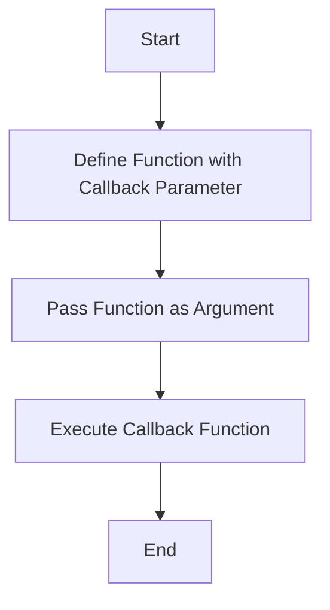

## 9.2 Passing Functions as Arguments

In JavaScript, functions are first-class citizens, meaning they can be treated like any other variable. This powerful feature allows us to pass functions as arguments to other functions, enabling a higher level of abstraction and code reuse. In this section, we will explore how to pass functions into other functions, understand the benefits of this approach, and see practical examples using callbacks in event handlers, timers, and array methods like `forEach`, `map`, and `filter`.

### Understanding Function Parameters and Arguments

Before diving into passing functions as arguments, let's briefly revisit the concept of parameters and arguments. When we define a function, we can specify parameters, which are placeholders for the values that will be passed to the function. When we call the function, we provide arguments, which are the actual values passed to the function.

```javascript
// Function definition with parameters
function greet(name, message) {
    console.log(`${message}, ${name}!`);
}

// Function call with arguments
greet('Alice', 'Hello'); // Output: Hello, Alice!
```

In the example above, `name` and `message` are parameters, while `'Alice'` and `'Hello'` are arguments.

### Passing Functions as Arguments

Now, let's explore how we can pass functions as arguments. This concept is central to functional programming and is widely used in JavaScript. When a function is passed as an argument, it is often referred to as a callback function.

#### What is a Callback Function?

A callback function is a function that is passed into another function as an argument and is executed after some operation has been completed. Callback functions are a fundamental part of asynchronous programming in JavaScript, allowing us to perform operations after a certain task is completed, such as fetching data from a server or waiting for a user event.

#### Example: Passing a Function to Another Function

Let's start with a simple example to illustrate how to pass a function as an argument.

```javascript
// Define a function that takes another function as an argument
function performOperation(operation, num1, num2) {
    return operation(num1, num2);
}

// Define a function to be passed as a callback
function add(a, b) {
    return a + b;
}

// Call performOperation with the add function as an argument
const result = performOperation(add, 5, 3);
console.log(result); // Output: 8
```

In this example, `performOperation` is a higher-order function that takes another function `operation` as a parameter. We pass the `add` function as an argument to `performOperation`, allowing it to perform the addition operation.

### Practical Examples of Passing Functions as Arguments

Passing functions as arguments is a common pattern in JavaScript, especially when dealing with asynchronous operations or iterating over collections. Let's explore some practical examples.

#### Using Callbacks in Event Handlers

Event handlers are a perfect example of using callback functions. When an event occurs, such as a button click, a specified function (callback) is executed.

```html
<!DOCTYPE html>
<html lang="en">
<head>
    <meta charset="UTF-8">
    <title>Event Handler Example</title>
</head>
<body>
    <button id="myButton">Click Me!</button>

    <script>
        // Define the callback function
        function handleClick() {
            alert('Button was clicked!');
        }

        // Get the button element
        const button = document.getElementById('myButton');

        // Add an event listener with the callback function
        button.addEventListener('click', handleClick);
    </script>
</body>
</html>
```

In this example, the `handleClick` function is passed as an argument to the `addEventListener` method. When the button is clicked, `handleClick` is executed, displaying an alert message.

#### Using Callbacks with Timers

JavaScript provides built-in functions like `setTimeout` and `setInterval` that accept callback functions to execute code after a delay or at regular intervals.

```javascript
// Define a callback function
function sayHello() {
    console.log('Hello, World!');
}

// Use setTimeout to execute the callback after 2 seconds
setTimeout(sayHello, 2000);

// Use setInterval to execute the callback every 3 seconds
setInterval(sayHello, 3000);
```

In this example, `sayHello` is passed as a callback to `setTimeout` and `setInterval`. The `setTimeout` function calls `sayHello` after 2 seconds, while `setInterval` calls it every 3 seconds.

### Benefits of Passing Functions as Arguments

Passing functions as arguments offers several benefits, including:

- **Code Reusability**: Callback functions can be reused across different parts of an application, reducing code duplication.
- **Abstraction**: By passing functions as arguments, we can create more abstract and flexible code that can handle different operations dynamically.
- **Asynchronous Programming**: Callbacks are essential for handling asynchronous operations, allowing us to execute code after a task is completed.

### Array Methods and Callback Functions

JavaScript provides several array methods that accept callback functions, making them powerful tools for working with collections. Let's explore some common array methods: `forEach`, `map`, and `filter`.

#### Using `forEach`

The `forEach` method executes a provided function once for each array element.

```javascript
// Define an array
const numbers = [1, 2, 3, 4, 5];

// Use forEach with a callback function
numbers.forEach(function(number) {
    console.log(number);
});
```

In this example, the anonymous function passed to `forEach` is executed for each element in the `numbers` array, logging each number to the console.

#### Using `map`

The `map` method creates a new array with the results of calling a provided function on every element in the calling array.

```javascript
// Define an array
const numbers = [1, 2, 3, 4, 5];

// Use map with a callback function to create a new array
const squaredNumbers = numbers.map(function(number) {
    return number * number;
});

console.log(squaredNumbers); // Output: [1, 4, 9, 16, 25]
```

In this example, the callback function passed to `map` squares each number in the `numbers` array, resulting in a new array `squaredNumbers`.

#### Using `filter`

The `filter` method creates a new array with all elements that pass the test implemented by the provided function.

```javascript
// Define an array
const numbers = [1, 2, 3, 4, 5];

// Use filter with a callback function to create a new array
const evenNumbers = numbers.filter(function(number) {
    return number % 2 === 0;
});

console.log(evenNumbers); // Output: [2, 4]
```

In this example, the callback function passed to `filter` checks if each number is even, resulting in a new array `evenNumbers` containing only the even numbers.

### Visualizing Function Passing with Diagrams

To better understand how functions are passed as arguments, let's visualize the process using a flowchart.



**Figure 1: Flowchart of Passing Functions as Arguments**

In this flowchart, we start by defining a function that accepts a callback parameter. We then pass a function as an argument and execute the callback function, completing the process.

### Try It Yourself: Experiment with Function Passing

To solidify your understanding, try modifying the code examples provided:

1. **Modify the `performOperation` Function**: Add a new operation, such as subtraction or multiplication, and pass it as an argument to `performOperation`.

2. **Create a New Event Handler**: Add another button to the HTML example and create a new event handler function for it.

3. **Experiment with Array Methods**: Use `forEach`, `map`, and `filter` with different arrays and callback functions to see how they work.

### References and Further Reading

For more information on passing functions as arguments and related topics, check out the following resources:

- [MDN Web Docs: Functions](https://developer.mozilla.org/en-US/docs/Web/JavaScript/Guide/Functions)
- [JavaScript.info: Function Expressions and Arrows](https://javascript.info/function-expressions-arrows)
- [W3Schools: JavaScript Functions](https://www.w3schools.com/js/js_functions.asp)

### Knowledge Check

Let's reinforce what we've learned with some questions and exercises:

- **What is a callback function, and why is it useful?**
- **How do you pass a function as an argument to another function?**
- **What are some benefits of passing functions as arguments?**
- **Try creating a new array method using `reduce` with a callback function.**

### Embrace the Journey

Remember, this is just the beginning. As you progress, you'll build more complex and interactive web pages. Keep experimenting, stay curious, and enjoy the journey!

## Quiz Time!



### What is a callback function?

- [x] A function passed as an argument to another function
- [ ] A function that returns another function
- [ ] A function that is executed immediately
- [ ] A function that is used for error handling

> **Explanation:** A callback function is a function passed as an argument to another function and is executed after some operation has been completed.

### Which array method executes a provided function once for each array element?

- [x] `forEach`
- [ ] `map`
- [ ] `filter`
- [ ] `reduce`

> **Explanation:** The `forEach` method executes a provided function once for each array element.

### What does the `filter` method do?

- [x] Creates a new array with elements that pass a test
- [ ] Creates a new array with modified elements
- [ ] Executes a function for each element
- [ ] Combines all elements into a single value

> **Explanation:** The `filter` method creates a new array with all elements that pass the test implemented by the provided function.

### How can you pass a function as an argument?

- [x] By using the function name without parentheses
- [ ] By using the `call` method
- [ ] By using the `apply` method
- [ ] By using the `bind` method

> **Explanation:** You can pass a function as an argument by using the function name without parentheses.

### What is the benefit of passing functions as arguments?

- [x] Code reusability
- [x] Abstraction
- [ ] Increased complexity
- [ ] Reduced performance

> **Explanation:** Passing functions as arguments allows for code reusability and abstraction, making the code more flexible and maintainable.

### Which method is used to execute a function after a delay?

- [x] `setTimeout`
- [ ] `setInterval`
- [ ] `forEach`
- [ ] `map`

> **Explanation:** The `setTimeout` method is used to execute a function after a specified delay.

### What is a higher-order function?

- [x] A function that takes another function as an argument
- [x] A function that returns another function
- [ ] A function that is executed immediately
- [ ] A function that is used for error handling

> **Explanation:** A higher-order function is a function that takes another function as an argument or returns a function.

### What does the `map` method do?

- [x] Creates a new array with the results of calling a function on every element
- [ ] Creates a new array with elements that pass a test
- [ ] Executes a function for each element
- [ ] Combines all elements into a single value

> **Explanation:** The `map` method creates a new array with the results of calling a provided function on every element in the calling array.

### How do you define a function that accepts another function as a parameter?

- [x] By specifying a parameter in the function definition
- [ ] By using the `call` method
- [ ] By using the `apply` method
- [ ] By using the `bind` method

> **Explanation:** You define a function that accepts another function as a parameter by specifying a parameter in the function definition.

### True or False: Passing functions as arguments is only useful for asynchronous programming.

- [ ] True
- [x] False

> **Explanation:** Passing functions as arguments is useful for both synchronous and asynchronous programming, allowing for code reusability and abstraction.


